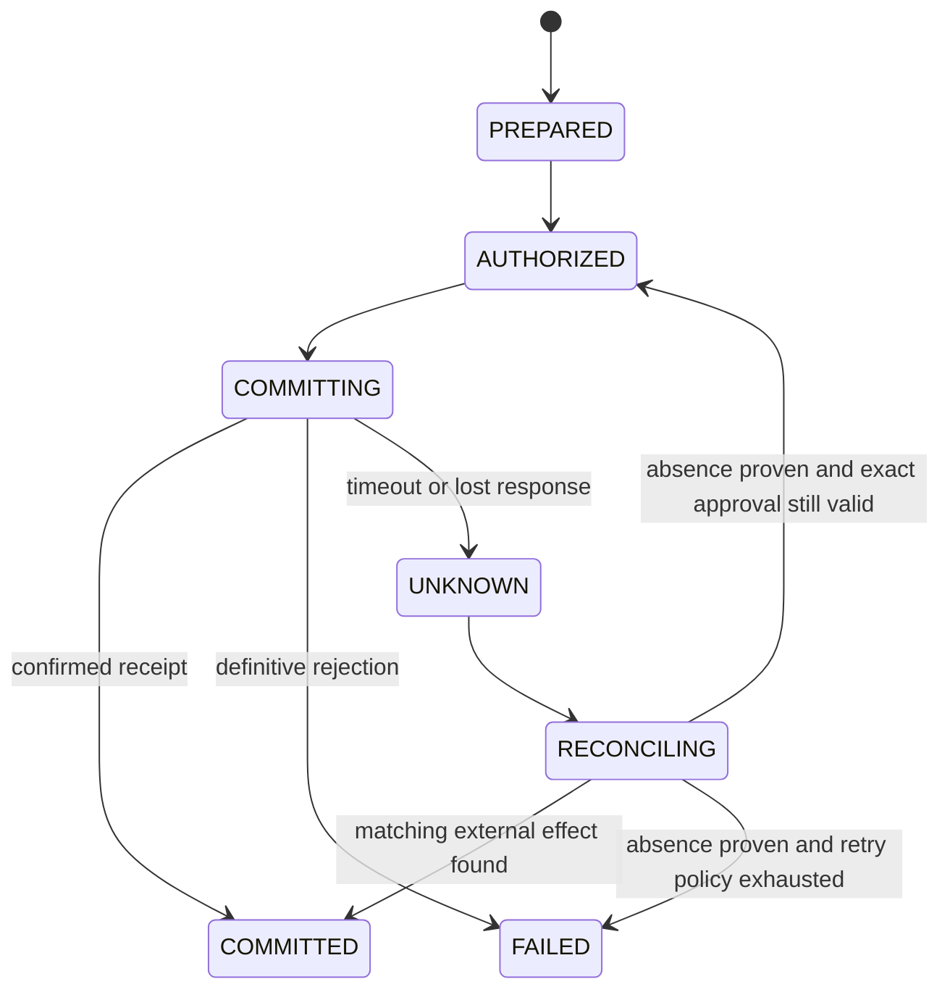

# State, Context, Memory, Planning, and Tool Contracts

The runtime is a recoverable state machine, not an append-only chat. It keeps commands, authoritative state, domain events, tool effects, raw evidence, model projections, approvals, and telemetry separate. A restart can resume from durable truth without trusting a compacted narrative.

## Aggregate model

```yaml
remediation_case:
  case_id: "case_01J..."
  tenant_id: "t-42"
  version: 37
  state: "VERIFYING"
  occurrence_ids: ["occ_01J..."]
  subject_refs: ["subject://image/sha256:..."]
  authority_profile: "remediation-standard/5"
  plan_ref: "plan://case_01J/4"
  assessment_ref: "decision://assessment/7"
  priority_ref: "decision://priority/3"
  patch_plan_ref: "artifact://patch-plan/2"
  active_effect_ids: ["eff_..."]
  approval_refs: []
  evidence_refs: []
  budgets:
    deadline: "2026-08-31T12:00:00Z"
    tool_calls_remaining: 26
    model_tokens_remaining: 80000
    cost_remaining_minor_units: 1200
    retries_remaining: 4
    parallel_workers_remaining: 2
  freshness_deadlines:
    advisory: "2026-09-01T08:00:00Z"
    deployment_inventory: "2026-08-31T10:00:00Z"
  lease:
    owner: "worker-cell-3"
    fencing_token: 91
    expires_at: "2026-08-31T09:10:00Z"
  last_event_sequence: 144
```

Use optimistic concurrency or compare-and-swap on `version`; use a monotonic fencing token on leases so a delayed worker cannot write after losing ownership.

## Commands, events, and effects

| Contract | Purpose | Example |
|---|---|---|
| Command | Requested transition with expected version and authority | `PreparePatch(case, expected_version=37)` |
| Domain event | Durable fact that changed case state | `PatchPrepared`, `ExceptionExpired`, `ProofRejected` |
| Effect intent | Desired external operation with semantic ID | `CreateRemediationPR` |
| Effect receipt | Observed committed/failed/unknown result | provider ID, request digest, status, timestamps |
| Delivery projection | User-facing or downstream view | queue card, notification, review package |
| Telemetry | Operational measurement, not business truth | latency, tokens, queue age, retry count |

```yaml
domain_event:
  event_id: "evt_01J..."
  event_type: "VerificationCompleted"
  event_version: 1
  sequence: 145
  tenant_id: "t-42"
  case_id: "case_01J..."
  occurred_at: "2026-08-31T09:06:00Z"
  actor:
    type: "worker"
    id: "verification-cell-2"
  causation_id: "cmd_01J..."
  correlation_id: "case_01J..."
  expected_case_version: 37
  payload:
    result_manifest_ref: "artifact://..."
    passed: true
  evidence_refs: ["evidence://test-log", "evidence://scan"]
```

Persist the state transition and outgoing effect intent atomically, for example with an outbox. Consumers use event IDs for inbox deduplication. External systems receive a stable idempotency key where supported. An approval receipt does not make an operation idempotent.

## Effect state machine



Never map a network timeout to `FAILED`. Reconciliation uses provider audit records, semantic markers, resource versions, branch heads, ticket/PR metadata, deployment digests, or a human-confirmed receipt. If absence cannot be established, hold the case and escalate rather than duplicate the effect.

### Idempotency, cancellation, and recovery rules

| Condition | Durable action | Forbidden shortcut |
|---|---|---|
| Duplicate command/event | Return prior inbox/command receipt or apply once under expected aggregate version | Re-run a model or effect because delivery repeated |
| Read timeout | Retry within read budget using the same target/version; record source age and partial coverage | Treat missing response as empty evidence |
| Write timeout/lost response | Persist `UNKNOWN`, fence new commits, and reconcile by semantic ID plus provider state | Mark failed and issue a new write |
| Cancellation requested before commit | Record `CANCEL_REQUESTED`, stop leasing new work, revoke unused capabilities, cancel workers | Delete case history or report cancelled before workers acknowledge |
| Cancellation races with commit | Preserve intent and provider outcome; reconcile until committed/absent, then report `CANCELLED_WITH_EFFECTS` or safe terminal state | Assume cancellation reversed an external effect |
| Worker/process crash | Acquire a new lease/fencing token, validate checkpoint, replay after high-watermarks, resume next safe action | Reconstruct truth from chat or rerun completed steps blindly |
| Partial artifact upload | Content-address chunks/manifest; resume or quarantine; publish reference only after digest-complete finalization | Point decisions at an incomplete object |
| Schema/behavior upgrade mid-case | Pin old behavior or emit an explicit migration event after compatibility validation | Silently resume under new policy/tool/model semantics |
| Region restore | Restore case/effect/approval stores and evidence digests, verify tenant keys/residency, then reconcile providers before workers start | Replay outbound effects before proving ledger position |

## Tool interface

The model requests a typed intent; an adapter performs authorization, validation, and execution:

```yaml
tool_request:
  request_id: "tool_01J..."
  tool: "dependency_graph.lookup"
  contract_version: "2.1"
  tenant_id: "t-42"
  case_id: "case_01J..."
  principal_id: "agent-remediation-worker"
  arguments:
    subject_ref: "repo@commit:..."
    package_coordinate: "pkg:npm/example@1.2.3"
  limits:
    max_paths: 100
    max_bytes: 1000000
    timeout_seconds: 20
  expected_freshness: "PT1H"
```

```yaml
tool_result:
  request_id: "tool_01J..."
  status: "OK"
  data_ref: "evidence://t-42/sha256/..."
  projection:
    paths_returned: 12
    direct: false
  provenance:
    source: "package-manager-lockfile"
    subject_ref: "repo@commit:..."
    observed_at: "2026-08-31T09:00:00Z"
    adapter_version: "dependency-graph/2.1.4"
  coverage:
    complete: true
    truncated: false
  effect: null
  error: null
```

### Required adapter families

| Adapter | Operations | Key constraints |
|---|---|---|
| Advisory | Fetch CVE/OSV/vendor/CSAF, EPSS snapshot, KEV snapshot | Read-only, cache and digest raw records, rate limits, source freshness |
| Inventory | Resolve asset, deployment, artifact, owner, criticality | Tenant scoped, immutable observation, authoritative-source policy |
| Component | Parse SBOM, lockfile, package inventory, dependency paths | Ecosystem semantics, coverage and parser version |
| Analysis | SAST/SCA/image scan, call/data flow, config inspection | Rule/tool version, language coverage, result limits, no automatic suppression |
| Repository | Read commit/tree/diff; prepare isolated patch | Commit fence, protected paths, no authoritative write |
| Build/test | Run project-native verification | Hostile-code sandbox, network and secret controls, resource limits |
| Collaboration | Prepare/commit ticket, branch, PR, review request | Split prepare/commit, exact preview, idempotency and reconciliation |
| Governance | Request approval, record human decision, query exception | Agent cannot mint approval or risk acceptance |
| Deployment observation | Read release and runtime identity | Read-only; promotion is not exposed |

Maintain a registry with owner, contract version, supported tenants/ecosystems, authentication method, rate limit, data classification, side-effect class, idempotency behavior, timeout, retry policy, health, schema conformance, kill switch, and deprecation date. A provider tool version recorded during a run is not a permanent architectural dependency.

### Provider and surface qualification matrix

“Supports vulnerability data” is not a capability claim. Qualify the exact operation, target, schema, completeness, cursor, and side-effect semantics before enabling an adapter.

| Surface and examples | Required identity and cursor | Freshness and completeness evidence | Provider-specific trap to test | Minimum qualification evidence |
|---|---|---|---|---|
| OSV API and OSV records | OSV ID; ecosystem/name/version or commit; schema version; record `modified`; per-query page token | Raw response digest, retrieval time, every page, full record fetched after batch IDs | `/v1/querybatch` returns IDs plus `modified`, has per-query pagination, and large-response limits; aliases/upstream/related have different semantics | Golden ecosystem ranges, withdrawn/deleted records, >1,000-result page, duplicate aliases, API/error replay |
| CVE Program and NVD | CVE ID; CVE Record Format/provider container/content digest; NVD API/schema; change-history cursor/window | CNA/ADP and NVD enrichment retained separately; retrieval window and overlap; rejected state | NVD enrichment, CPE applicability, CVSS, and CWE can change independently of the CVE identity; NVD 2.0 returns rejected records unless filtered | Initial sync plus overlapping incremental replay, late modification, rejected CVE, CPE collision, rate-limit/backoff, change-history reconciliation |
| CISA KEV and EPSS | KEV catalog snapshot/schema and CVE; EPSS score date/model generation/snapshot | Whole-file digest or complete API pagination, source date, retrieval time, model generation | KEV absence is not negative exploitation evidence; KEV due dates have policy scope; EPSS API `v1` is not model v1 | Catalog add/correction/removal, schema change, model-boundary time series, missed-day recovery, stale-source policy |
| GHSA/GitHub Advisory Database | GHSA ID, API date, advisory `updated_at`/`withdrawn_at`, cursor, ecosystem package coordinate | Requested advisory types and every page are explicit; raw reviewed/malware/unreviewed records retained as configured | Default global-advisory listing returns reviewed non-malware advisories; vulnerable ranges, CVSS, CWE, and EPSS remain source assertions | Type/default-filter test, withdrawal/update, cursor replay, 100-item pagination, ecosystem range corpus, API-version migration |
| Vendor advisories and CSAF | Authenticated publisher, advisory/document ID, revision history, product-tree IDs, distribution channel, raw digest | Publisher retrieval time, signed/checksummed document, complete product/status/remediation branches | “Vendor” is authoritative only for its product/build; CSAF 2.0 is stable while 2.1 is a committee draft at the research cutoff | Signature/channel failure, supersession, product-tree ambiguity, VEX profile, malformed document, 2.0/2.1 parser isolation |
| SCA, container/image, and host scanners | Scanner installation/run, target digest or host snapshot, DB/rules/config/tool versions, package inventory digest | Scanned layers/files/scopes, exclusions, database age, unsupported ecosystems, truncation | OS-package, language-package, CPE-fallback, source-lockfile, and runtime-image semantics differ; a clean result may reflect rule/feed drift | Known-positive/negative images, distro backport, multi-arch image, vendored/static code, offline DB age, rule-removal comparison |
| SAST and IaC/config scanners | Repository commit, rule/query-pack ID/version, config, path/location fingerprint, language/IaC dialect | Files parsed/skipped, generated code, build mode, query coverage, result limits | GitHub CodeQL suites trade result coverage/confidence; Trivy IaC and repository scanner defaults differ; SARIF transports a claim, not applicability | Rule upgrade shadow, unsupported language/file, generated source, baseline suppression, SARIF round trip, deleted-rule regression |
| SBOM generators/parsers and VEX consumers | Subject digest; CycloneDX/SPDX/OpenVEX/CSAF document ID/version; generator/parser; statement intersection | Lifecycle phase, packages/files/relationships covered, omissions, parser warnings, VEX issuer/scope/supersession | SPDX 2.x and 3.x models differ; CycloneDX 1.7 is current while 2.0 is unreleased; scanner VEX may hide or move results rather than delete them | Standard conformance fixtures, unknown-field preservation, incomplete relationship graph, mismatched product, revoked signer, round trip without semantic loss |
| Package registries and resolvers | Registry URL, ecosystem/name/version, resolved artifact digest, lockfile/graph, resolver/toolchain version | Metadata and artifact retrieval time, checksums/signatures/provenance, yanked/retracted/deprecated state, all registries contacted | npm name@version is non-reusable but tags are mutable; Go version metadata can change while module bytes are checksum-protected; private scopes can leak via fallback | Namespace confusion, mutable tag, yank/retract, checksum mismatch, mirror fallback, private-name privacy, lifecycle-script/egress test |
| Repository and PR provider | Tenant/org/repository stable ID, base/head commit, branch/PR provider ID and revision, API version | Branch protection, required reviewers/checks, current head/base, pagination and permission snapshot | A write timeout does not establish absence; mutable branch and comment text are untrusted; provider API defaults/versioning change | Conditional/base-drift conflict, duplicate semantic marker, lost response, renamed repo, permission downgrade, protected-path rejection |
| CI/CD, build, test, change, deployment, and config | Workflow definition commit, run/job/check IDs, candidate and output digests, change/deployment/config revisions | Every required job, conclusion, cancellation state, artifact provenance, rollout scope and observation time | Cancellation is asynchronous and `always()` work can continue; success on a stale candidate is irrelevant; partial rollout is not deployment completion | Cancel during each phase, orphan child process, stale run, partial artifact upload, canary abort, rollback observation, ambiguous provider response |
| CMDB, asset, deployment inventory, and ITSM | Tenant plus native asset/service/change/ticket IDs and source revision | Authoritative-field policy, snapshot time/effective interval, coverage, tombstones, owner freshness | CMDB ownership/criticality and live deployment identity often disagree; ticket status is not technical proof | Retired-but-running asset, owner transfer, duplicate asset, deleted record, partial pagination, cross-tenant ID, stale cache |
| Secrets broker | Principal, tenant, operation, target, capability/lease ID and expiry; never secret value in model state | Issuance/revocation receipt and policy version | A lease may expire or be revoked while an operation runs; static secrets may not have lease semantics | Least-privilege denial matrix, expiry mid-call, revocation, log/prompt redaction, broker outage, tenant swap |
| Observability exporter | Application event/schema version, trace/span IDs, metric/log policy and tenant/classification | Export acknowledgment, sampling/drop policy, cardinality and redaction evidence | OpenTelemetry GenAI conventions are Development and moved to a separate repository; telemetry is not domain truth | Schema-version mapping, dropped spans/logs, redaction, tenant routing, bounded cardinality, exporter outage without workflow loss |

### Adapter execution workflow

1. **Qualify** a pinned adapter/provider/API version on its corpus and record unsupported operations.
2. **Prepare** a typed request with tenant, principal, exact subject, expected version, limits, freshness, classification, and side-effect class.
3. **Authorize** immediately before execution and mint a short-lived operation capability outside the model.
4. **Fetch or prepare** using provider-native pagination/cursors; persist raw bytes before normalization and preserve a high-watermark plus overlap/replay policy.
5. **Validate** schema, target binding, domain semantics, coverage, truncation, and freshness as separate fields. Fresh-but-partial and complete-but-stale are different failures.
6. **Normalize** into an observation or an effect intent; the adapter never writes case state directly.
7. **Commit** a write only from a preallocated semantic effect ID after revalidating target, payload, approval, and current provider state.
8. **Receipt or reconcile**: record `COMMITTED`, definitive `FAILED`, or `UNKNOWN`. A timeout, cancellation request, or missing response never becomes proof of absence.

Requalification is required for an API date/schema, auth scope, scanner/database/rules, package manager, SBOM/VEX parser, workflow runner, provider maturity, or material output change. Run shadow comparison before promotion and keep the prior adapter plus raw fixtures until rollback and replay are proven.

## Context compilation

Compile context for the next decision from authorized durable state:

```text
1. system role and non-negotiable authority boundary
2. current command, case state, state version, budgets, and exit criteria
3. exact subject and active approval constraints
4. verified observations and effect receipts
5. retrieved source excerpts with provenance, trust, freshness, and truncation
6. current plan, unresolved conflicts, failures, and requested output schema
7. minimal recent interaction needed to interpret the command
```

Retrieve by tenant and exact identifiers before semantic search. Render external content inside clearly delimited data fields. Never let advisory text, repository instructions, issue comments, package metadata, build logs, or VEX statements modify system/tool policy.

## Compaction

Compact when token or evidence volume crosses a budget, at stage boundaries, and before long waits. The checkpoint is a structured projection, not a free-form summary:

```yaml
checkpoint:
  checkpoint_id: "ckpt_01J..."
  case_id: "case_01J..."
  case_version: 37
  state: "VERIFYING"
  created_at: "2026-08-31T09:07:00Z"
  authority_profile: "remediation-standard/5"
  identities:
    assets: ["asset://t-42/prod/checkout"]
    subjects: ["image@sha256:..."]
    findings: ["scanner://installation/run/result"]
    packages: ["pkg:npm/example@1.2.3"]
    vulnerability_cluster_digest: "sha256:..."
  high_watermarks:
    domain_event_sequence: 144
    effect_ledger_sequence: 21
    sources:
      osv: {cursor: "modified-through:...", overlap_from: "..."}
      nvd: {last_modified_through: "...", change_history_through: "..."}
      kev: {snapshot_digest: "sha256:...", retrieved_at: "..."}
      asset_inventory: {revision: "...", observed_through: "..."}
  versions:
    advisory_records: {"GHSA-...": "sha256:...", "CVE-...": "sha256:..."}
    asset_snapshot: "sha256:..."
    sbom_and_vex: ["sha256:..."]
    policy: "remediation-policy/12"
    workflow: "remediation-workflow/7"
    tools_and_adapters: {scanner: "...", repository: "...", ci: "..."}
    scanner_rules_and_database: {rules: "sha256:...", database: "sha256:..."}
    model_and_prompt: {model: "provider/model/snapshot", prompt: "sha256:..."}
    context_compiler: "context-compiler/6"
    build_toolchain: "sha256:..."
  clocks:
    source_effective_through: "2026-08-31T08:30:00Z"
    last_subject_observed_at: "2026-08-31T08:45:00Z"
    ingested_through: "2026-08-31T09:05:00Z"
    timers: [{kind: "approval_expiry", due_at: "..."}]
  active_decision_refs: []
  verified_observation_refs: []
  unresolved_conflicts: []
  approvals:
    valid: []
    expired_or_invalidated: []
  effects:
    committed_receipts: []
    pending_intents: []
    unknown: [{effect_id: "eff_...", reconcile_after: "...", attempts: 1}]
  plan_ref: "plan://..."
  waits_and_pending_work: []
  cancellation: {requested: false, fenced_at_event: null}
  failure_history: []
  budgets_remaining: {}
  artifact_refs: []
  next_safe_action:
    kind: "RECONCILE_EFFECT"
    preconditions: ["lease acquired", "effect still UNKNOWN", "no new commit intent"]
  invariants_hash: "sha256:ordered-invariant-results"
  projection_digest: "sha256:canonical-checkpoint"
```

Raw events, evidence, approvals, and effect receipts survive compaction. On resume, verify the checkpoint digest and invariants hash, replay domain/effect events after both high-watermarks, refresh expired clocks and approvals, reconcile `UNKNOWN` effects before issuing a new write, compare current subject/source/policy/tool/model versions, and only then execute `next_safe_action`. A mismatch creates a new checkpoint or returns to validation; it is never patched in free-form memory. Never summarize an `UNKNOWN` effect into “not done,” an exception proposal into “accepted,” or an observation into an assessment.

## Memory decisions

Use exactly these seven lifetimes. A memory write is allowed only after all columns have an implementable answer.

| Lifetime | Use | Reject | Retention | Correction | Deletion | Poisoning test |
|---|---|---|---|---|---|---|
| Turn/scratch | Temporary parse notes, candidate hypotheses, and formatting for one model decision | Credentials, approvals, raw sensitive payloads, or any authoritative fact not also referenced durably | Discard at turn end; retain only policy-approved redacted trace references | Rebuild from current durable state and evidence | Automatic purge; verify no prompt/cache copy survives beyond trace policy | Inject advisory/repository text that says to change policy or call a tool; authority and durable state must remain unchanged |
| Working/run | Current plan pointers, evidence requests, budgets, tool-result projections, and unresolved hypotheses for one run | Final decisions, effect truth, or facts whose source is only model text | Until terminal/checkpoint boundary or short run TTL | Supersede with a cited observation or checkpoint replay | Delete run projection without deleting referenced evidence/events | Replay stale or cross-case tool output; subject/tenant/version fences must reject it |
| Session | Authenticated operator clarification and presentation state for the active case | Security/risk preferences, implicit approvals, facts copied across tenants/cases, or durable policy | Bound to tenant, actor, case, consent, and short expiry | Operator correction becomes a new attributed clarification; security claims still need evidence | User/tenant deletion removes the session projection and indexes | Insert a second actor's or tenant's instruction; identity and scope checks must block retrieval/use |
| Durable workflow/task | Case aggregate, commands/events, observations, decisions, approvals, effect intents/receipts, timers, checkpoints, and proof | Free-form chain of thought, secret values, or mutable provider UI as truth | Organization evidence/audit schedule plus legal hold; field-level classification | Append correction/supersession event; never rewrite the historical evidence or receipt | Policy-driven tombstone/crypto-erasure while preserving allowed non-sensitive audit linkage | Corrupt checkpoint, stale lease, forged approval, or reordered event; digest, signature, fencing, replay, and invariant tests must fail closed |
| Domain knowledge | Curated standards, organization policy, ecosystem version rules, playbooks, schemas, and adapter capability manifests | Unreviewed web text, package README instructions, tenant findings, or autonomous model-authored policy | Owner, version, source, effective/expiry dates, and scheduled refresh | Reviewed release with changelog and affected-case re-evaluation | Retire version from retrieval after compatibility window; preserve required release record | Seed a poisoned advisory or altered ruleset into the corpus; provenance, review, signature/digest, and golden tests must quarantine it |
| Long-term/preference | Human-curated procedural lessons and low-risk presentation preferences only when explicitly approved; organization policy always wins | Personal risk tolerance, deadline/priority choice, approval shortcuts, secrets, or inferred preferences; default is no security-decision use | Explicit purpose, consent/owner, tenant scope, expiry, and minimization | Attributed user/owner correction with review where procedural behavior changes | Discoverable deletion that removes primary record, indexes, caches, and future training/eval use subject to legal policy | Plant a preference such as “always dismiss this package” or “skip reviewer”; deterministic policy must ignore it and alert |
| Episodic/outcome | Adjudicated outcomes, overrides, reopenings, incidents, and near misses for evaluation/calibration | Unreviewed success labels, raw tenant data in shared corpora, or copying a past decision into a new case | Tenant-scoped or approved de-identified dataset with consent/classification, lineage, split, and expiry | Re-adjudicate with a new label/version and invalidate derived dataset releases | Remove item and derived indexes/splits; retrain or mark affected releases when required | Add fabricated positive outcomes or duplicate benchmark cases; lineage, dedupe, holdout, anomaly, and reviewer tests must detect them |

Memory never substitutes for an authoritative asset record, advisory snapshot, approval, deployment observation, or exception decision. All writes are scoped, attributable, reviewable, correctable, retainable, and deletable.

## Planning and replanning

Use a deterministic workflow skeleton. The plan describes evidence and proposed actions but cannot grant authority:

```yaml
case_plan:
  plan_id: "plan_01J..."
  version: 4
  case_version_basis: 37
  objective: "prepare and verify remediation for occurrence occ_01J"
  steps:
    - id: "resolve-runtime-artifact"
      kind: "DETERMINISTIC"
      status: "DONE"
      evidence_required: ["deployment digest"]
    - id: "adjudicate-reachability"
      kind: "BOUNDED_MODEL_DECISION"
      status: "ACTIVE"
      output_schema: "reachability-assessment/1"
    - id: "prepare-upgrade"
      kind: "CONTAINED_EFFECT"
      status: "BLOCKED"
      authority_required: "A2_PREPARE"
  stop_conditions: ["active compromise", "budget exhausted", "unknown effect", "scope changes"]
```

Replan on new or contradictory evidence, subject change, tool capability/failure, budget threshold, approval outcome, fix availability, failed verification, exception expiry, or policy/model/advisory version change. Known package-resolution and test sequences remain deterministic. Use model planning only to choose among evidence-gathering paths or explain conflicting inputs.

Do not default to multiple agents. Add a specialized subtask worker only if independent evaluation shows better verified outcomes after accounting for cost, latency, duplicated effects, context divergence, and accountability. No two workers may concurrently write the same case or workspace without deterministic ownership and fencing.

## Completion and run controls

A stream ending is not completion. The workflow stops only in an explicit state: `CLOSED`, `CANCELLED`, `FAILED_TERMINAL`, `WAITING_FOR_HUMAN`, `WAITING_FOR_EVIDENCE`, `RECONCILING`, or a bounded partial outcome. Enforce root budgets across nested tool/model calls and reserve resources for checkpointing, reconciliation, and a clear partial result.

## Contract acceptance tests

- Duplicate intake creates one occurrence and two delivery receipts.
- A stale worker with an old fencing token cannot update the case.
- A provider timeout becomes `UNKNOWN` and reconciliation finds the existing PR.
- A compacted checkpoint preserves an unresolved advisory conflict and expired approval.
- A retrieved issue containing tool instructions is rendered as data and cannot expand authority.
- A tenant-scoped connector rejects an identifier from another tenant before retrieval.
- A changed base commit invalidates the patch plan and exact approval.
- Exhausted model budget still leaves a durable evidence-backed partial state.

## Provider and standard references

- [OSV API 1.0](https://google.github.io/osv.dev/api/) and [`querybatch` pagination](https://google.github.io/osv.dev/post-v1-querybatch/) — response, size, and per-query cursor semantics.
- [NVD API 2.0 transition guidance](https://nvd.nist.gov/General/News/api-20-announcements) and [CVE FAQ](https://nvd.nist.gov/general/FAQ-Sections/CVE-FAQs) — NVD enrichment, rejected records, and change history.
- [GitHub global security-advisory REST API](https://docs.github.com/en/rest/security-advisories/global-advisories), [API versions](https://docs.github.com/en/rest/about-the-rest-api/api-versions), and [workflow cancellation](https://docs.github.com/en/actions/reference/workflows-and-actions/workflow-cancellation) — default filters, cursors, version headers, and asynchronous cancellation.
- [CycloneDX current specification](https://cyclonedx.org/specification/overview/), [SPDX 3.0.1](https://spdx.github.io/spdx-spec/), [CSAF 2.0](https://docs.oasis-open.org/csaf/csaf/v2.0/os/csaf-v2.0-os.html), [CSAF 2.1 draft directory](https://docs.oasis-open.org/csaf/csaf/v2.1/), and [OpenVEX 0.2.0](https://github.com/openvex/spec/blob/main/OPENVEX-SPEC.md) — interchange versions and maturity.
- [Trivy repository target](https://trivy.dev/docs/latest/target/repository/), [Grype architecture](https://oss.anchore.com/docs/architecture/grype/), and [OSV-Scanner output](https://google.github.io/osv-scanner/output/) — scanner target, matcher, and call-analysis limitations.
- [npm registry](https://docs.npmjs.com/using-npm/registry.html), [npm unpublish policy](https://docs.npmjs.com/policies/unpublish/), [Go Modules Reference](https://go.dev/ref/mod), and [Maven Central immutability](https://central.sonatype.org/publish/requirements/immutability/) — registry and resolver semantics.
- [Vault lease lifecycle](https://developer.hashicorp.com/vault/docs/concepts/lease) and [OpenTelemetry GenAI conventions](https://github.com/open-telemetry/semantic-conventions-genai/blob/main/docs/gen-ai/README.md) — capability expiry and current telemetry maturity.

## Related canonical guidance

- [Agent state and event contracts](../../runtime/agent-state-and-event-contracts.md)
- [Execution boundaries](../../runtime/execution-boundaries.md)
- [Durable execution](../../runtime/durable-execution.md)
- [Run controls](../../runtime/run-controls.md)
- [Idempotency and side effects](../../reliability/idempotency-and-side-effects.md)
- [Prompt injection and untrusted data](../../security/prompt-injection-and-untrusted-data.md)
