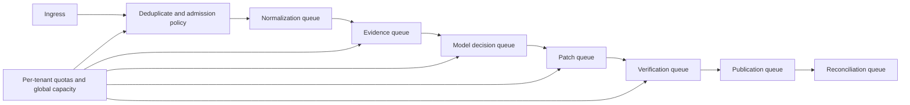

# Security, Reliability, Observability, and Operations

This service processes adversarial text, vulnerable code, package-manager scripts, exploit details, proprietary repositories, asset inventories, and high-value credentials. Its production design must assume prompt injection, malicious dependencies, poisoned advisories, compromised tools, cross-tenant confusion, and ambiguous effects.

## Threat model

| Threat | Likely path | Required controls |
|---|---|---|
| Prompt injection | Advisory, README, issue, code comment, package metadata, scanner message | Treat as untrusted data; structured context; no policy/tool instructions from evidence; output validation |
| Malicious repository/package | Build or install script exfiltrates secrets or consumes resources | Disposable isolation, no ambient credentials, default-deny egress, CPU/memory/process/time limits, read-only base |
| Poisoned vulnerability intelligence | Forged advisory/VEX, alias or range manipulation | Authenticated sources, raw record digests, source comparison, quarantine, trust policy |
| Privilege escalation | Model requests broader repository, ticket, or deployment operation | External authorization, exact scoped capability, commit-time revalidation, no deployment tool |
| Cross-tenant disclosure | Retrieval, shared cache, logs, artifacts, eval datasets | Tenant routing before retrieval, scoped keys/credentials/queues, encryption context, access-tested telemetry |
| Approval laundering | Stale approval reused for changed diff/scope | Approval content digest, base/subject fence, expiry, approver authority, segregation of duties |
| Duplicate/ambiguous effects | Retry opens multiple PRs or tickets | Semantic effect IDs, downstream idempotency, effect ledger, reconciliation |
| Evidence tampering | Results overwritten after a decision | Immutable content-addressed evidence, signed/digested manifests, append-only audit |
| Sensitive exploit leakage | Prompt, logs, notification, evaluation corpus | Classification, redaction, least audience, encryption, retention/deletion, no raw payload in telemetry |
| Compromised adapter/model | Malicious output or schema drift | Version pinning, conformance tests, shadow/canary, kill switch, constrained authority |

## Identity, secrets, and isolation

- Use workload identity for control-plane services and short-lived delegated credentials for one connector operation.
- Keep secret values out of prompts, evidence projections, tool results, logs, traces, and model training/evaluation exports.
- Separate control, reasoning, evidence, and execution networks. Model workers cannot reach credential stores directly.
- Use worker pools by trust profile: read-only metadata, repository analysis, untrusted build, controlled security test, and publication.
- Destroy workspaces after evidence export; retain only policy-approved artifacts.
- Deny outbound network by default. Allow only authenticated advisory/package endpoints required by the specific step.
- Validate destination repository, organization, tenant, audience, branch, and artifact before every external write.
- Apply data minimization and region/retention policy before raw evidence is stored or sent to a model.

### Sensitive finding and evidence classes

| Class | Examples | Model/telemetry rule | Storage and sharing rule |
|---|---|---|---|
| Public intelligence | Public CVE/GHSA/OSV/KEV records and public fix commits | Cite bounded excerpts; advisory instructions remain untrusted | Public corpus may be shared only by digest/version, never joined with tenant applicability by default |
| Tenant security metadata | Asset IDs, owners, exposure, finding states, exceptions | Minimum fields for the current decision; pseudonymous IDs in metrics | Tenant-keyed encryption, row/object/index/queue isolation, authorized support access, deletion policy |
| Proprietary code and build evidence | Source, diffs, SBOMs, lockfiles, test/build logs | Prefer retrieved excerpts and artifact references; no full prompt/log copy | Restricted object store, repository ACL projection, region/retention controls, no general training/eval reuse |
| Exploit-sensitive material | Proof-of-concept, crash inputs, bypass details, indicators, vulnerable endpoints | Default deny; isolated authorized test context only; never routine notification/trace content | Separately encrypted, need-to-know audience, short retention unless incident/legal hold, access audit |
| Secret/auth material | Tokens, keys, cookies, credentials, signing material | Never enter prompts, memory, artifacts, logs, traces, or evaluation data | Brokered just-in-time capability/lease; value not persisted by the remediation service; revoke and alert on exposure |

Treat repository instructions, advisory prose, package metadata, SBOM/VEX properties, scanner help text, ticket comments, test output, and exploit descriptions as attacker-controllable. Strip active content, bound size/decompression/nesting, retain raw bytes in quarantine when needed, and pass only typed data fields to reasoning.

## Multi-tenancy

Tenant isolation is an invariant across identity, database row keys, object prefixes, encryption keys, queue partitions, caches, vector/index namespaces, worker credentials, traces, exports, approvals, and deletion. Authorization is checked before retrieval, not after a broad search. A global vulnerability record may be shared only as a separately governed public corpus; tenant applicability and asset evidence never enter that shared record.

For high-assurance tenants, use dedicated worker cells and model endpoints. For shared infrastructure, admission control and fair scheduling prevent a mass advisory or one tenant's scan burst from exhausting all capacity.

## Queueing and backpressure

Use separate queues for:

- intake and deterministic normalization;
- enrichment and evidence retrieval;
- model-assisted adjudication;
- isolated patch preparation;
- build/security verification;
- external publication effects;
- reconciliation and scheduled revalidation.

Admission policy considers tenant quota, case priority, KEV or verified active-exploitation signal, deadline, asset criticality, cost budget, and worker capability. Do not simply prioritize highest CVSS. Reserve capacity for reconciliation, exception expiry, and urgent high-confidence cases so bulk rescans cannot starve safety work.



Overload modes should be explicit:

1. keep ingest/dedup durable;
2. continue deterministic KEV/advisory matching and exception-expiry processing;
3. defer model enrichment and low-priority patch preparation;
4. reduce expensive reachability analysis to policy-selected cases;
5. present queue age and evidence freshness honestly;
6. never drop accepted effects or silently downgrade cases.

### Capacity and recovery envelope

Model each worker pool separately because normalization, source retrieval, patching, builds, and reconciliation have different service times and trust profiles. For pool `i`, measure admitted peak arrival rate `λᵢ`, successful service rate per worker `μᵢ`, retry/replay amplification `aᵢ`, and target utilization `uᵢ` below saturation. The starting capacity bound is:

```text
workers_i >= ceil((lambda_i * a_i) / (mu_i * u_i)) + reserved_recovery_workers_i
```

Derive these values from load tests with real SBOM/image/build sizes and provider throttling. Do not use the formula as an SLO proof; validate queue-age distributions and worst slices under bursts.

Reserve capacity and provider quota for effect reconciliation, approval/exception timers, KEV/verified exploitation intake, restore verification, and incident forensics. Recovery planning must include the backlog accumulated during outage **plus** replay, source refresh, expired approvals, thundering timers, ambiguous effects, and normal new arrivals. If recovery load exceeds safe capacity, preserve ingest/dedup and reconciliation first, publish a capacity forecast, and shed optional model/patch work rather than silently using stale evidence.

## Reliability controls

- Transactionally record state plus outbox events.
- Deduplicate inbox deliveries and normalize semantic operations.
- Lease cases and workspaces with fencing tokens.
- Bound every retry and distinguish transient, permanent, policy, data, and ambiguous failures.
- Use circuit breakers and stale-data policy per connector rather than a global retry storm.
- Reconcile side effects before retry; repair projections from authoritative events.
- Checkpoint before long waits, approvals, cancellation, or worker eviction.
- Version all schemas and provide forward/backward compatibility windows.
- Back up case/effect/approval state and test restore; evidence-store recovery must preserve digests and tenant boundaries.
- Define regional failover and data-residency behavior explicitly; do not move restricted evidence during an incident without policy.

## Observability model

Keep signal purpose and authority separate:

| Signal | Answers | Content and cardinality rule | Authority/retention rule |
|---|---|---|---|
| Metrics | Is demand, latency, saturation, error, freshness, safety, and cost within target? | Aggregated counters/histograms with bounded tenant/service/policy dimensions; no finding IDs, source, prompts, or payloads | Operational indicator only; cannot close or authorize a case |
| Traces | Where did one distributed run spend time or fail? | Case/run/effect pseudonymous references, stage spans, adapter latency, retry/cancellation links; payloads by access-controlled reference | Sampled diagnostic lineage, not domain event history |
| Logs/events | What bounded diagnostic or state-adjacent occurrence happened? | Structured schema, classification, redaction, size limits, no secret/exploit/source bodies; dynamic IDs as fields, not event names | Operational retention; loss must not lose case/effect truth |
| Evaluation transcript | Was reasoning and tool use correct under a manifest? | Authorized evidence projections, typed inputs/outputs, graders, slices, failure taxonomy; separate restricted corpus | Evaluation artifact only; cannot become policy or episodic memory without review |
| Audit/effect ledger | Who requested/authorized what and what actually happened? | Append-only principal, tenant, exact scope/payload digest, policy, approval, provider receipt, reconciliation and correction | Authoritative for authorization/effects; longer controlled retention and independent access review |
| SLO and error-budget view | Are user-visible reliability and safety commitments being met? | Derived windows over defined eligible events and denominators; separate safety, freshness, latency, and outcome objectives | Governs rollout/incident decisions; never hides a safety breach behind aggregate availability |

Use an application-owned, versioned event schema and export through OpenTelemetry. OpenTelemetry generative-AI semantic conventions had moved to a dedicated repository and were still marked Development in research on 2026-08-31, so isolate version/vendor mappings and do not make them the business schema.

### Minimum metrics

- intake accepted, deduplicated, quarantined, and schema-failed counts;
- occurrence backlog and age by tenant, policy queue, and case state;
- evidence freshness, incomplete coverage, and conflicting-source rates;
- affected/not-affected/unknown decisions and human-overturn rates;
- time to first validated assessment, review-ready remediation, deployed observation, and proof;
- patch verification pass/fail/flaky rates and introduced-finding count;
- approval wait, exception age/expiry, and ownerless case count;
- effect commit/unknown/reconciliation age and duplicate-prevention count;
- model/tool latency, token/cost, context truncation, cache use, and budget exhaustion;
- worker saturation, queue delay, rate limits, circuit state, and tenant fairness;
- unauthorized attempt, cross-tenant denial, secret-redaction, and policy-denial counts.

Do not log source code, exploit payloads, advisory bodies, package tokens, credentials, personal data, or full prompts by default. Use references and classified previews.

## SLO design

Set organization-specific targets for:

- durable intake and deduplication availability;
- time from receipt to first validated assessment by priority;
- freshness of asset, advisory, exploitation, and control evidence;
- time an external effect may remain `UNKNOWN`;
- exception-expiry processing delay;
- proof completeness and exact-subject binding;
- safety: unauthorized writes, risk acceptance, deployment, secret disclosure, and cross-tenant access;
- verified remediation throughput and cost per verified outcome.

Safety SLOs are non-compensating. Fast remediation does not offset one unauthorized production change or false closure. Measure service-level objectives on verified outcomes, not PR counts or model task-completion claims.

## Incident runbooks

### Poisoned advisory or VEX

1. Disable or quarantine the connector/version.
2. Preserve raw artifacts and affected decisions.
3. Identify all cases using the source digest.
4. Re-evaluate against authenticated alternatives.
5. Reopen false dispositions and notify owners.
6. Rotate credentials if publisher or transport compromise is suspected.
7. Add the case to source-integrity evaluation data.

### Scanner or parser drift

1. Freeze promotion of decisions from the new version.
2. Compare a pinned golden corpus and shadow results.
3. Determine schema, rule, database, or coverage change.
4. Reprocess affected cases from raw evidence.
5. Update capability manifest and decision policy only after acceptance gates pass.

### Ambiguous external write

1. Stop automated retry.
2. Mark effect and case `RECONCILING`.
3. Query provider with semantic identifiers and expected state.
4. Attach matching receipt or prove absence.
5. Retry only with valid approval and same semantic operation.
6. Escalate at the unknown-effect SLO.

### Bad patch or regression

1. Disable further publication of the plan/model/tool manifest.
2. Notify code, security, quality, and release owners.
3. Keep deployment action with the release/incident system; do not roll back autonomously.
4. Bind observed failure to patch and deployed artifact.
5. Reopen cases and inspect other remediations from the same pattern.
6. Add regression and failure trajectory to evaluations.

### KEV or advisory surge

1. Deduplicate and match assets deterministically.
2. Reserve urgent capacity; shed optional enrichment.
3. Group evidence acquisition by public advisory, never group tenant decisions or approvals.
4. Expose queue age, incomplete coverage, and capacity forecast.
5. Route ownerless and deadline-risk cases to program leadership.

### Suspected cross-tenant exposure

1. Stop affected retrieval, caches, and export paths.
2. Preserve audit evidence without expanding access.
3. Notify privacy/security incident owners.
4. Identify exact tenants, artifacts, prompts, logs, and model endpoints involved.
5. Follow incident and regulatory processes; remediation agent does not lead containment.

## Deployment and rollback

Version a behavior manifest containing workflow, policy, prompts, model snapshot, context compiler, tool contracts/adapters, scanner/rule databases, advisory-source versions, schemas, evaluation suites, and operational defaults. Run offline tests, adapter conformance, migration tests, security review, shadow traffic, bounded canary, and then gradual tenant rollout.

Roll back behavior manifests and worker/adaptor versions, not authoritative case history. Long-running cases either pin their manifest to completion or migrate through an explicit compatibility event. Keep kill switches for model decisions, patch preparation, publication effects, individual connectors, VEX suppression, and tenant access.

## Cost controls

- Perform aliasing, range evaluation, deduplication, policy checks, and bulk asset matching deterministically.
- Retrieve only evidence needed for the current decision; store large artifacts by reference.
- Batch public advisory enrichment and reuse immutable public snapshots without sharing tenant data.
- Route ambiguous or high-impact cases to stronger models; use no model for resolved deterministic cases.
- Cap call-graph, build, test, and exploit-analysis resources by policy and priority.
- Cache only when tenant, source version, subject digest, policy, and freshness permit.
- Track cost per validated occurrence, review-ready remediation, and verified deployed remediation—not cost per model call alone.

## Operational readiness checklist

- [ ] Threat model covers model, source, repository, package, connector, worker, approval, and tenant paths.
- [ ] Secrets and production credentials cannot enter untrusted execution or prompts.
- [ ] Queues have quotas, priority policy, retry budgets, dead-letter ownership, and overload modes.
- [ ] Reconciliation, exception expiry, and urgent intake retain reserved capacity.
- [ ] Metrics and traces reference classified artifacts instead of copying them.
- [ ] Backup/restore, region failure, adapter outage, and source-poisoning exercises pass.
- [ ] Behavior manifests, schema migrations, canaries, kill switches, and rollback are tested.
- [ ] SLOs measure verified security outcomes and non-compensating safety failures.

## Related canonical guidance

- [OpenTelemetry GenAI semantic conventions](https://github.com/open-telemetry/semantic-conventions-genai/blob/main/docs/gen-ai/README.md) — Development status and dedicated repository.
- [HashiCorp Vault lease lifecycle](https://developer.hashicorp.com/vault/docs/concepts/lease) — short-lived credential expiry, renewal, and revocation semantics.
- [GitHub workflow cancellation](https://docs.github.com/en/actions/reference/workflows-and-actions/workflow-cancellation) — why cancellation requires quiescence/reconciliation rather than assumption.
- [Agent threat model](../../security/agent-threat-model.md)
- [Permissions, sandboxing, and secrets](../../security/permissions-sandboxing-and-secrets.md)
- [Queues, scheduling, and backpressure](../../operations/queues-scheduling-and-backpressure.md)
- [Scaling, capacity, and SLOs](../../operations/scaling-capacity-and-slos.md)
- [Deployment, release, and incident response](../../operations/deployment-release-and-incident-response.md)
- [Observability and tracing](../../evaluation/observability-and-tracing.md)
