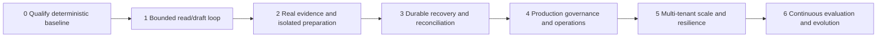
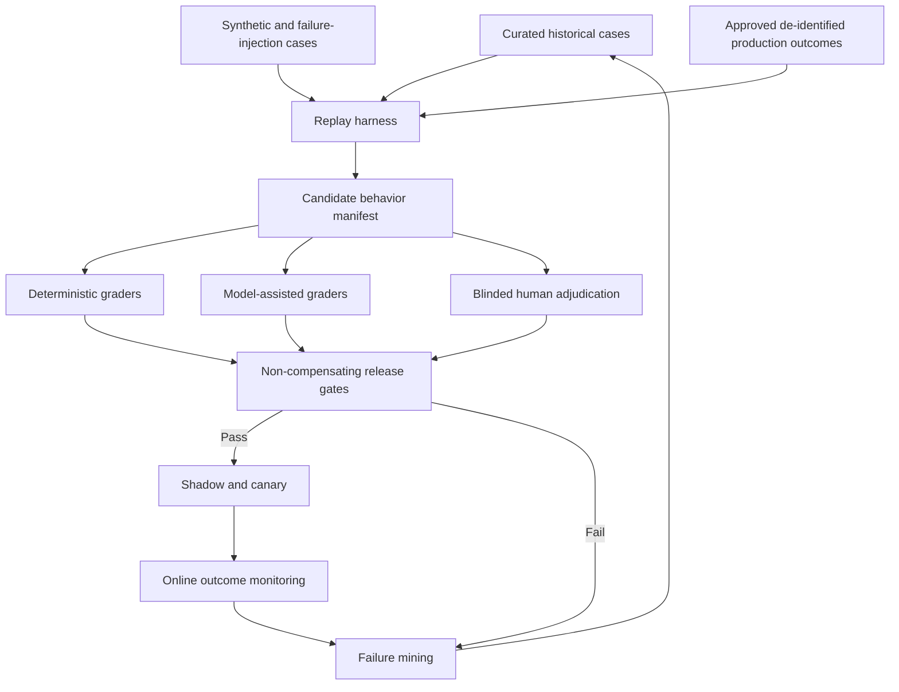

# Staged Delivery, Evaluation, and Continuous Evolution

Build the smallest bounded loop first and earn each increase in authority, durability, integrations, scale, and autonomy. A stage is complete only when its architecture, authority, inputs/outputs, state/event/effect contracts, failure handling, evaluations, and exit gate are all explicit and verified.

## Stage map

Advancing stages is not a requirement. A deterministic scanner, dependency bot, or human workflow may remain safer and cheaper. Promotion requires better verified outcomes than that baseline.

## Stage 0 — qualify the workload and deterministic baseline

### Stage 0 architecture and authority

Use existing scanners, advisory feeds, asset inventory, dependency review, ticketing, and human remediation. The candidate agent runs offline with no external credentials or writes. Create an adjudicated dataset and a deterministic rules baseline.

### Stage 0 inputs and outputs

Inputs are historical scanner/advisory records, immutable asset/repository/artifact snapshots, human dispositions, patches, tests, release observations, and exceptions. Outputs are a category boundary, workload taxonomy, evidence schema, baseline metrics, risk assessment, and go/no-go decision.

### Stage 0 state, events, and effects

State may be an offline case fixture, but it must already separate claims, subjects, occurrences, observations, decisions, and proof. Events are replayable fixture steps. No external effects are allowed.

### Stage 0 failure handling

Detect missing ground truth, selection bias, leaked future information, duplicate cases, inconsistent labels, sensitive-data exposure, and adjacent-category scope creep. Quarantine unusable records; do not manufacture labels.

### Stage 0 evaluation

Measure deterministic package/range matching, asset identity, deduplication, priority policy, and proof checks. Establish human agreement and adjudication rules. Quantify current remediation latency, false positives, reopen rate, and evidence gaps without treating old closure labels as automatically correct.

Compare against named baselines on the same leakage-controlled cases:

| Baseline | Included capability | What the candidate must justify |
|---|---|---|
| No automation / expert human | Current analyst, engineer, release, and risk process with available tools | Lower time/cost or better evidence consistency without reducing safety or accountability |
| Scanner output | Native findings, severity, fix suggestion, and suppressions | Better occurrence identity, conflict preservation, applicability, and false-positive handling |
| Deterministic rules/workflow | Ecosystem version matching, organization priority tree, tickets, timers, and proof checklist | Measurable gain only on ambiguity, synthesis, or patch preparation; no loss on deterministic cases |
| Dependency/remediation bot | Provider-native update proposal and CI | Better transitive handling, compatibility evidence, change scope, and deployed proof |
| Human with model-free search/templates | Analyst using curated sources and standard handoff forms | Whether model reasoning adds value beyond improved process and retrieval |

Report quality, safety, time, cost, coverage, abstention/unknown rate, and reviewer effort for every baseline. Do not promote on model-only benchmark scores or on a dataset that excludes hard no-fix, vendor-backport, partial-inventory, and failed-change cases.

### Stage 0 exit gate

- [ ] The owned and excluded work is signed off by security, engineering, operations, and risk stakeholders.
- [ ] A representative, leakage-controlled evaluation set exists with source and date provenance.
- [ ] Deterministic and human baselines are measured.
- [ ] The agent shows a plausible advantage on ambiguity, evidence assembly, or patch preparation.
- [ ] No live authority is required to demonstrate value.

## Stage 1 — smallest bounded read/draft loop

### Stage 1 architecture and authority

Run one process or service with typed read-only advisory/repository/inventory tools and an internal artifact store. The model can draft a validation, priority rationale, evidence request, or remediation plan. It cannot edit repositories or create tickets/PRs. Apply hard root budgets for time, turns, tools, tokens, cost, retries, and parallelism.

### Stage 1 inputs and outputs

Input is one occurrence bound to one immutable subject with curated evidence. Output is a schema-valid assessment proposal, missing-evidence list, priority recommendation, and next-step plan with citations and confidence.

### Stage 1 state, events, and effects

Use an in-process explicit state machine with terminal results `COMPLETE_DRAFT`, `NEEDS_EVIDENCE`, `WAITING_FOR_HUMAN`, `PARTIAL_BUDGET`, and `FAILED_TERMINAL`. Tool calls are read-only observations. Persist a run manifest and trace; no external effect exists.

### Stage 1 failure handling

Stop on prompt injection attempts, unsupported version semantics, missing immutable identity, stale evidence, schema errors, budget exhaustion, or contradictory sources that cannot be resolved. Return a useful partial record rather than guessing.

### Stage 1 evaluation

Grade citation/evidence entailment, version-range correctness, applicability, uncertainty calibration, priority factor completeness, scope boundary compliance, instruction-injection resistance, and cost/latency. Use deterministic graders plus blinded security reviewers.

### Stage 1 exit gate

- [ ] Typed tool and output contracts reject malformed or authority-expanding requests.
- [ ] The agent beats the deterministic baseline on adjudicated ambiguous cases without worsening false not-affected decisions.
- [ ] Every conclusion cites exact evidence and exposes uncertainty.
- [ ] Hard budgets and explicit terminal states work under injected failures.
- [ ] Zero external writes, risk acceptance, deployment, or incident-response actions occur.

## Stage 2 — real evidence, context, approvals, and isolated preparation

### Stage 2 architecture and authority

Connect real read-only advisory, inventory, repository, SBOM, scanner, and build systems through versioned adapters. Add a context compiler, object evidence store, isolated patch/build workers, and policy engine. Permit `A2_PREPARE` in disposable workspaces; a policy or exact approval may permit `A3_PUBLISH_REVERSIBLE` for a branch, ticket, or PR. Merge, production changes, and exceptions remain unavailable.

### Stage 2 inputs and outputs

Inputs are live tenant-scoped source artifacts, repository commits, deployment identities, project commands, organizational policy, and optional exact approval. Outputs are validated assessments, prepared patch/dependency deltas, verification results, control/exception proposals, and review packages.

### Stage 2 state, events, and effects

Persist case snapshots, evidence references, decisions, plans, and run manifests. Define prepare/commit effects for publication with semantic IDs and provider receipts. Because full durable recovery is not yet proven, restrict each case to a bounded synchronous window and stop safely if ownership is lost.

### Stage 2 failure handling

Contain malicious build/install behavior, adapter/schema drift, rate limits, tool timeouts, unexpected dependency deltas, protected-path changes, stale approvals, and target-revision drift. A commit timeout becomes `UNKNOWN` and requires manual reconciliation at this stage.

### Stage 2 evaluation

Run shadow cases and isolated patch trials. Measure real-source identity, adapter conformance, evidence freshness, patch minimality, build/security regression, supply-chain anomalies, approval exactness, prompt injection, secret/egress containment, and human acceptance. Failure-inject stale inventory, poisoned VEX, malicious package scripts, base drift, and provider timeout.

### Stage 2 exit gate

- [ ] At least one bounded ecosystem works end to end from occurrence to human-reviewed patch evidence.
- [ ] Raw evidence, context projection, decision, effect receipt, and telemetry remain separate.
- [ ] Untrusted execution cannot reach tenant/control-plane secrets or unauthorized network destinations.
- [ ] Exact approvals invalidate on changed subject, diff, scope, policy, or expiry.
- [ ] Reviewers can reproduce the evidence and verification results.
- [ ] No production promotion or risk acceptance tool exists.

## Stage 3 — durable execution, compaction, idempotency, and recovery

### Stage 3 architecture and authority

Introduce a durable workflow, transactional case store, outbox/inbox, effect ledger, reconciler, scheduled timers, leases/fencing, versioned checkpoints, and cancellation. Authority remains Stage 2: durable operation does not broaden what the agent may do.

### Stage 3 inputs and outputs

Accept long-running cases waiting for new advisories, approvals, builds, deployments, or exception review. Output recoverable cases, reconciled effects, freshness-driven re-evaluations, and complete lineage across restarts/upgrades.

### Stage 3 state, events, and effects

Implement the full contracts in [runtime contracts](07-state-context-memory-planning-and-tool-contracts.md). Commands include expected versions; state transitions and outbox records are atomic; consumers deduplicate events; effects use stable semantic IDs and `UNKNOWN`/`RECONCILING`; checkpoints retain decisions, authority, evidence, budgets, and lineage.

### Stage 3 failure handling

Recover from worker crash, duplicate/redelivered events, database failover, stale leases, partial artifact upload, lost provider response, approval wait, cancellation race, poison message, connector outage, and rolling upgrade. Never reconstruct authoritative state from chat text.

### Stage 3 evaluation

Run crash/replay tests at every transition and before/after external commits. Verify one semantic effect under repeated delivery, stale-worker fencing, checkpoint equivalence, timer correctness, cancellation fences, reconciliation, and schema compatibility. Restore from backups into an isolated environment and compare state/evidence digests.

### Stage 3 exit gate

- [ ] Every non-read effect is idempotent or safely reconcilable.
- [ ] Worker/process/region interruption cannot duplicate publication or lose an approval/exception transition.
- [ ] Compaction preserves all authoritative facts and unknown effects.
- [ ] Cancellation blocks new effects and reports already committed ones.
- [ ] Long waits resume under the pinned or explicitly migrated behavior manifest.
- [ ] Disaster recovery meets tested recovery objectives defined by the organization.

## Stage 4 — production security, governance, deployment, and operations

### Stage 4 architecture and authority

Deploy separate control, reasoning, evidence, and isolated execution planes with workload identity, tenant policy, secrets broker, egress control, audit ledger, telemetry, SLOs, on-call ownership, backup/restore, release pipeline, canaries, and kill switches. Integrate human approval and risk systems. Production mitigation, merge/release, and exception acceptance remain human-owned and occur in adjacent systems.

### Stage 4 inputs and outputs

Inputs include production inventories, data classifications, policy/approval records, ownership, release observations, and service health. Outputs are governed review packages, production-readiness evidence, incident signals, SLO reports, cost attribution, and remediation proof.

### Stage 4 state, events, and effects

Add tenant/region/classification to every contract. Approval and exception decisions have authentic human receipts. Behavior manifests version model, prompt, policy, context, tools, scanner/advisory versions, schemas, evaluations, and operational settings. Release observation is read-only evidence, never authority.

### Stage 4 failure handling

Operate runbooks for poisoned advisories, scanner drift, compromised adapters, prompt injection, secret exposure, cross-tenant signals, ambiguous effects, bad patches, backlog surges, model/provider outage, and proof mismatch. Security or privacy incidents transfer to incident command.

### Stage 4 evaluation

Run threat-model tests, authorization matrices, tenant-isolation tests, red-team injection cases, secret scanners, sandbox escape/egress checks, approval bypass attempts, audit reconstruction, canary analysis, on-call game days, and cost/load tests. Track human overrides and production reopen events.

### Stage 4 exit gate

- [ ] Security, privacy, data residency, retention/deletion, and threat-model reviews pass.
- [ ] Authorization denies every merge, deploy, containment, and risk-acceptance attempt.
- [ ] Tenant isolation is tested across retrieval, cache, storage, queues, workers, logs, traces, and evaluations.
- [ ] SLOs, alerts, dashboards, runbooks, on-call, backup/restore, kill switches, and rollback are operational.
- [ ] Canary and behavior-manifest rollback preserve case/effect truth.
- [ ] Remediation proof binds the reviewed candidate to observed deployment.

## Stage 5 — multi-tenant scale, backpressure, and resilience

### Stage 5 architecture and authority

Add admission control, per-tenant quotas, priority queues, worker cells by trust/capability, fair scheduling, autoscaling, regional placement, disaster-recovery capacity, artifact lifecycle management, and degraded modes. Scale does not expand authority; it makes existing boundaries enforceable under load.

### Stage 5 inputs and outputs

Inputs include bursty scanner events, daily feed changes, mass advisories, tenant service tiers, deadlines, worker capability, cost and regional constraints. Outputs include predictable queueing, capacity forecasts, fairness reports, degraded-service signals, and durable processing without silent loss.

### Stage 5 state, events, and effects

Partition by tenant and case while preserving globally unique IDs and public-advisory snapshot reuse. Queue messages carry tenant, priority rationale, capability, deadline, cost budget, case version, and dedupe ID. Migration between cells/regions is an explicit fenced event; effects remain owned by one reconciler.

### Stage 5 failure handling

Test hot tenants, KEV waves, provider throttling, regional outage, object-store latency, database partition, worker starvation, poison jobs, thundering rechecks, artifact retention pressure, and cost-budget exhaustion. Degraded mode preserves ingest, dedupe, urgent policy signals, reconciliation, and expiry processing before optional model enrichment.

### Stage 5 evaluation

Measure end-to-end queue age by priority/tenant, throughput, worker utilization, fairness, deadline risk, recovery time, duplicate effect rate, evidence freshness, verified outcome rate, and cost. Load tests must include real artifact sizes and hostile build behavior, not only empty tasks.

### Stage 5 exit gate

- [ ] Capacity model and autoscaling behavior meet measured demand with reserved safety capacity.
- [ ] One tenant cannot starve or access another, including during failure and failover.
- [ ] Overload modes are explicit, observable, and do not silently downgrade or lose cases.
- [ ] Region failure and restore preserve evidence/effect integrity and data-residency policy.
- [ ] Cost per verified remediation stays within organization-defined budgets.
- [ ] Queue and freshness SLOs hold for priority classes under tested surges.

## Stage 6 — continuous evaluation, upgrades, and evolution

### Stage 6 architecture and authority

Operate an evaluation pipeline with offline golden cases, repeated trials, shadow production traffic, sampled human adjudication, failure mining, drift monitors, behavior-manifest registry, staged releases, and rollback. A controlled feedback pipeline proposes dataset, policy, prompt, model, adapter, and workflow changes; humans approve releases and policy/risk changes.

### Stage 6 inputs and outputs

Inputs are adjudicated production outcomes, reopened cases, human overrides, incidents, near misses, new advisories/standards, scanner/tool releases, model changes, cost/latency, and source schema drift. Outputs are versioned evaluation sets, failure clusters, change proposals, promotion reports, deprecations, and refresh notices.

### Stage 6 state, events, and effects

Record lineage from each evaluation item to source consent/classification, adjudication, split, and version. A release event identifies the entire behavior manifest. Long-running cases pin or migrate explicitly. Feedback never writes directly to policy or memory; it creates a reviewable proposal.

### Stage 6 failure handling

Detect benchmark leakage, evaluation overfitting, judge drift, missing hard cases, silent source/model changes, EPSS generation discontinuity, API preview/experimental feature changes, schema deprecation, feedback poisoning, and aggregate metrics hiding tenant harm. Roll back the manifest and re-evaluate affected cases when correctness or safety regresses.

### Stage 6 evaluation

Use deterministic, model-assisted, and human graders with non-compensating release gates. Compare repeated trials and worst-case safety, not only mean score. Segment by ecosystem, vulnerability class, direct/transitive dependency, asset type, language, evidence completeness, tenant policy, and impact. Monitor offline-to-online correlation.

### Stage 6 exit gate

- [ ] Every release is reproducible from a behavior manifest and evaluation report.
- [ ] Safety gates block false closure, false not-affected, unauthorized effects, cross-tenant access, secret leakage, and approval bypass regardless of aggregate quality.
- [ ] Shadow/canary and rollback are routine for models, prompts, tools, policies, scanners, sources, and schemas.
- [ ] Production failures become adjudicated tests without leaking restricted tenant data.
- [ ] Volatile-source refresh triggers are owned and executed.
- [ ] Deprecated adapters and case manifests have a tested migration/retirement path.

## Evaluation architecture

## Metric suite

| Layer | Metrics |
|---|---|
| Identity | subject/package/version accuracy, alias/dedupe precision and recall |
| Applicability | affected/not-affected accuracy, reachability state, unknown calibration, evidence completeness/freshness |
| Priority | policy agreement, rank/queue agreement, deadline-risk recall, explanation factor completeness |
| Remediation | patch applicability, minimality, security-test pass, regression pass, dependency/supply-chain delta, reviewer acceptance |
| Proof | candidate-to-deployment binding, post-change validation, residual-risk completeness, false closure/reopen rate |
| Trajectory | unnecessary calls, evidence provenance, contradiction handling, replans, retries, budget adherence, effect reconciliation |
| Safety | unauthorized write/deploy/acceptance, approval reuse, cross-tenant access, secret leakage, injection success, unsafe exploit execution |
| Operations | latency, queue age, availability, unknown-effect age, fairness, cost per verified outcome |

Report exact-match and graded metrics with denominators, confidence intervals where meaningful, repeated-trial behavior, and slice performance. A high `pass@k` can hide unreliable first-run operation; include strict `pass^k` or repeated-success measures for workflows that must work consistently.

## Failure-injection matrix

| Injection | Expected invariant |
|---|---|
| Advisory changes affected range mid-case | Decision invalidates, evidence refreshes, patch/approval versions are rechecked |
| EPSS model generation changes | Time series is segmented; priority recomputes under explicit policy |
| VEX says not affected but artifact contains reachable code | Conflict remains visible; no suppression; human/security escalation |
| Call analyzer misses reflective path | Negative result stays `NO_OBSERVED_PATH`; high-risk not-affected gate fails |
| Package manager executes malicious script | Sandbox denies secret/unauthorized egress and terminates run |
| Build succeeds with unreviewed dependency explosion | Dependency-delta gate fails |
| PR provider commits but response is lost | One PR after reconciliation; no blind retry |
| Approval expires during commit | Commit denied and approval re-requested |
| Worker dies after effect intent | Recovery reads ledger/outbox and reconciles |
| Deployment uses a different digest | Case stays pending/reopens; proof gate fails |
| Scanner rule disappears after upgrade | Pinned comparison detects drift; disappearance is not remediation |
| Tenant ID is swapped in a queued job | Authorization denies before retrieval/execution and raises incident signal |
| Exception expires during outage | Durable timer processes on recovery and escalates; acceptance is not silently extended |

## Production walkthroughs

### Zero-day with no CVE or fixed release

1. An authenticated vendor advisory and internal crash report describe a remotely reachable defect, but no CVE, EPSS score, KEV entry, or patch exists. Intake creates a publisher-scoped advisory identity and an internal logical-vulnerability ID; it does not invent a CVE or substitute a CWE.
2. The exact production image digest, feature flag, exposed endpoint, and safe reproduction establish `AFFECTED`. Public-score fields remain absent rather than zero.
3. Verified exploitation or compromise indicators trigger a sealed incident handoff. Otherwise deterministic organization policy prioritizes exposure, consequence, and confidence without waiting for public identifiers.
4. The agent proposes a narrowly scoped configuration/network control with bypass tests, expiry, residual paths, and an exception proposal if policy requires one. Production activation remains human/change-system owned.
5. New advisory revisions, CVE assignment, exploit intelligence, patch availability, configuration drift, or control failure reopens/reprioritizes the same occurrence through versioned evidence. Closure waits for an exact deployed fix or the organization's explicit non-remediation state.

**Failure caught:** treating absent CVE/EPSS/KEV as low risk, or letting an emergency mitigation masquerade as remediation.

### Transitive dependency constrained by a parent

1. A GHSA/OSV claim matches `library-b@2.4.0`; the artifact SBOM and lockfile show `app → framework-a@5 → library-b@2.4.0`. The occurrence binds the artifact digest, package coordinate, and dependency path—not only the CVE.
2. The minimum fixed `library-b` violates `framework-a`'s supported range. A forced override fails the compatibility gate even if a resolver can produce a lockfile.
3. Candidate A upgrades the nearest controlling direct dependency; candidate B backports the fix; candidate C is a temporary control. Release notes, runtime support, full transitive delta, registry/digest provenance, and security/regression tests decide among them.
4. The selected candidate gets a new diff/artifact digest, review receipts, deployment observation, and rescan/security proof. Newly introduced dependencies remain separate findings.

**Failure caught:** “fixed version exists” does not mean the transitive graph can safely consume it.

### Scanner false positive on a distribution backport

1. An image scanner uses upstream CPE/version matching and flags an OS package whose distribution retained the old-looking version while backporting the fix.
2. Intake preserves the scanner run, database/rules, CPE match, image digest, distro package metadata, and original finding. A distribution advisory and package changelog/build evidence positively bind the backport to that exact distro release.
3. The decision becomes bounded `NOT_AFFECTED` only for the observed image/package build, with source conflict, coverage, reviewer, and revalidation triggers. An internal or issuer VEX statement may communicate the result but cannot delete the occurrence.
4. Scanner/database, distro advisory, package build, image, or deployment changes cause re-evaluation. Metrics count the scanner false positive and the evidence-backed disposition separately.

**Failure caught:** suppressing by package version string, global CVE alias, or model interpretation without positive exclusion evidence.

### Patch passes CI but fails canary

1. A minimal patch passes pinned security and functional tests and is human-reviewed. The release system deploys its exact artifact digest to a small canary cohort.
2. Canary telemetry shows a severe latency/regression signal. The case records candidate verification as passed but deployment validation as failed; it does not rewrite either fact or recommend closure.
3. The release owner stops/rolls back through the deployment system. The remediation workflow observes the rollback change and restored artifact digest; a rollback request alone is not proof.
4. The case returns to `PREPARING` with failure evidence, invalidates approvals/results tied to a revised patch, checks whether any cohort remains exposed, and retains or proposes a compensating control. If deployment/rollback responses are lost, the effect stays `UNKNOWN` until reconciled.
5. The trajectory becomes an episodic evaluation item only after adjudication and tenant-data handling approval.

**Failure caught:** CI success, canary start, or rollback request is not deployed remediation proof.

## Exercises and stage exit evidence

| Stage | Required exercise | Exit evidence retained |
|---|---|---|
| 0 | Re-adjudicate representative affected, not-affected, no-fix, transitive, zero-day, and failed-change cases against all baselines | Dataset lineage/splits, adjudication guide, baseline report, category/authority decision, residual data gaps |
| 1 | Inject unsupported versions, contradictory sources, missing identity, prompt injection, and budget exhaustion | Typed run manifests, abstention/unknown results, reviewer scorecards, safety/cost/latency comparison |
| 2 | Run one real ecosystem through source/asset/scanner/SBOM/repository/package/CI adapters in a secret-free sandbox | Adapter qualification matrix, raw/normalized evidence pairs, sandbox/egress proof, exact approval tests, reproducible patch package |
| 3 | Crash before/after every transition and external commit; cancel mid-build; restore from backup and reconcile providers | Replay-equivalence hashes, one-effect assertions, checkpoint receipts, cancellation report, restore/reconciliation timing and data-loss evidence |
| 4 | Red-team source/repository/package injection, authorization/tenant escape, secret leakage, bad patch, poisoned source, and on-call response | Threat-model sign-off, denial/audit receipts, canary/rollback evidence, incident/game-day report, SLO dashboards and ownership |
| 5 | Run KEV/scan bursts plus provider throttling, regional loss, restore backlog, thundering timers, and hostile builds at realistic sizes | Capacity model, queue/fairness/freshness distributions, recovery-load forecast, DR/residency proof, cost per verified outcome |
| 6 | Shadow and canary a model/prompt/policy/scanner/adapter/schema change that includes an intentional regression | Full behavior manifest, slice/repeated-trial report, non-compensating gate result, rollback/reprocessing proof, deprecation/migration plan |

Exit evidence is an immutable review package with owner, date, environment, manifest versions, raw result references, failures, approved limitations, and expiration/refresh trigger. A checked list without reproducible receipts does not advance a stage.

## Refresh checklist

Review at least quarterly and before a relevant upgrade:

- FIRST CVSS specification/corrections and EPSS model generation/API status;
- CISA KEV catalog schema, directive scope, SSVC guidance, and VEX guidance;
- CVE, OSV, CSAF, CycloneDX, SPDX, SARIF, SLSA, in-toto, and TUF versions;
- scanner and dependency-bot capability, schema, language/ecosystem coverage, and maturity labels;
- model/provider behavior, data retention, region, tool use, and deprecation;
- package-manager security, registry behavior, lifecycle scripts, and lockfile semantics;
- organization asset, change, exception, SLO, privacy, and evidence-retention policy.

The [research packet](../../research/packets/vulnerability-remediation-agent-blueprint.md) records current maturity calls and source dates so a future refresh can distinguish a real capability change from a documentation rewrite.
