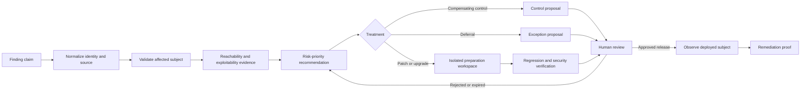

# Vulnerability Remediation and Security Engineering Agent

This blueprint defines an evidence-first agent that turns vulnerability claims into reviewable remediation work. It owns finding validation, asset and dependency applicability evidence, risk-prioritization recommendations, compensating-control proposals, secure patch or dependency-upgrade preparation, regression and security verification, exception tracking, and remediation proof.

It is not a SOC responder, a general-purpose coding agent, a release controller, or a risk-acceptance authority. Live containment and compromise investigation remain with [security investigation](../security-investigation-agent/README.md); unrelated product work remains with the [coding agent](../coding-agent/README.md); independent quality judgment remains with the [test and quality engineering agent](../test-quality-engineering-agent/README.md); production promotion remains with the [deployment agent](../devops-deployment-agent/README.md). High-impact patches, production mitigations, and exception acceptance are human-owned decisions.

## The product contract

The agent accepts a vulnerability claim plus a concrete subject and produces one of four reviewable outcomes:

1. an evidence-backed affected assessment and a prepared remediation;
2. an evidence-backed not-affected assessment with bounded scope and revalidation triggers;
3. a compensating-control proposal when a safe patch is not currently available; or
4. an exception proposal for an accountable human risk owner to accept, reject, or revise.

The agent never equates a scanner alert with an affected asset, a package name with a deployed component, a negative call graph with proof of non-reachability, a fixed version with a safe upgrade, or a passing source scan with verified production remediation.



## Hard ownership boundaries

| Capability | Agent may own | Human or adjacent system owns |
|---|---|---|
| Finding intake | Normalize, deduplicate, validate, preserve contradictory source records | Scanner and advisory source administration |
| Applicability | Collect asset, version, dependency, configuration, path, and reachability evidence | Asset-owner confirmation when evidence is incomplete |
| Prioritization | Recommend treatment priority from threat, exposure, impact, controls, and confidence | Organizational risk tolerance and final scheduling commitments |
| Remediation | Prepare a minimal patch, dependency delta, migration notes, and rollback proposal in isolation | High-impact patch authorization, merge, release promotion, production changes |
| Compensating controls | Propose bounded, testable controls and residual-risk evidence | Production enablement and operational ownership |
| Verification | Run authorized tests and assemble proof; recommend closure | Independent release gates and system-of-record closure policy |
| Exceptions | Draft, track, expire, and re-evaluate an exception | Risk acceptance by an accountable human with appropriate authority |
| Active compromise | Hand off evidence without modifying it | SOC containment, eradication, forensics, and incident command |

## Guide map

| Guide | Primary question |
|---|---|
| [01. Mission boundaries and architecture](01-mission-boundaries-and-reference-architecture.md) | What is the system, where are its trust boundaries, and why is this architecture appropriate? |
| [02. Finding identity and validation](02-finding-intake-identity-and-validation.md) | How does the agent turn noisy claims into stable, auditable occurrences? |
| [03. Reachability and exploitability](03-asset-dependency-reachability-and-exploitability.md) | How is applicability established without overclaiming? |
| [04. Prioritization, controls, and exceptions](04-risk-prioritization-controls-and-exceptions.md) | How are CVSS, EPSS, KEV, exposure, business impact, controls, and human risk decisions combined? |
| [05. Secure patching and upgrades](05-secure-patching-and-dependency-upgrades.md) | How are minimal remediations prepared without gaining deployment authority? |
| [06. Verification and proof](06-verification-remediation-proof-and-handoff.md) | What evidence is sufficient to hand off or close a remediation case? |
| [07. Runtime contracts](07-state-context-memory-planning-and-tool-contracts.md) | How do state, events, effects, context, memory, planning, and tools remain recoverable? |
| [08. Production operations](08-security-reliability-observability-and-operations.md) | How is the service secured, scaled, observed, and operated? |
| [09. Staged delivery and evaluation](09-staged-delivery-evaluation-and-evolution.md) | What must be true at stages 0–6, and how do releases prove improvement? |

The evidence base, maturity corrections, source decisions, and refresh triggers are recorded in the [research packet](../../research/packets/vulnerability-remediation-agent-blueprint.md).

## Canonical contracts reused here

This workload specializes, rather than replaces, the repository's canonical guidance:

- [State and event contracts](../../runtime/agent-state-and-event-contracts.md): commands, durable state, domain events, effect receipts, delivery projections, and telemetry stay separate.
- [Execution boundaries](../../runtime/execution-boundaries.md): model reasoning cannot directly exercise authority.
- [Run controls](../../runtime/run-controls.md): every run has bounded turns, tools, time, tokens, cost, retries, and parallelism.
- [Idempotency and side effects](../../reliability/idempotency-and-side-effects.md): an ambiguous write becomes `UNKNOWN`, then reconciles; it is not blindly retried.
- [Permissions, sandboxing, and secrets](../../security/permissions-sandboxing-and-secrets.md): scanners and package managers run in contained, least-privilege environments.
- [Prompt injection and untrusted data](../../security/prompt-injection-and-untrusted-data.md): advisories, repository text, package metadata, and tickets are data, never instructions.
- [Trajectory and reliability evaluation](../../evaluation/trajectory-and-reliability-evaluation.md): evaluation grades evidence and decisions, not persuasive prose.

## A minimum useful case

A first implementation should support one repository ecosystem end to end:

```text
advisory or scanner claim
  -> normalized occurrence against an immutable repository revision
  -> version and dependency-path validation
  -> evidence-backed applicability and priority recommendation
  -> minimal prepared upgrade or patch in an isolated branch
  -> project-native tests plus security regression
  -> human-reviewed pull request
  -> post-deployment digest/version observation and rescan
  -> immutable remediation-proof bundle
```

Do not begin with autonomous multi-agent remediation, broad write access, a universal risk score, or production deployment. Those additions increase authority and failure surface before the evidence contract is proven.

## Completion definition

A case is not complete merely because a pull request exists or CI passes. Completion requires all policy-required evidence to reference the exact deployed subject, including the assessment decision and its inputs, patch or control provenance, review and approval receipts, verification results, observed deployment identity, post-change validation, residual findings, and any active exception. If the external effect or deployed identity cannot be confirmed, the case remains `RECONCILING` or `REMEDIATED_PENDING_DEPLOYMENT`, not `CLOSED`.

## Deployment-specific limitations

This is a provider-neutral blueprint, not evidence that a live integration is safe. No scanner installation, vulnerability database mirror, repository/branch policy, package registry/proxy, CI runner, build sandbox, CMDB, ITSM/change system, secrets broker, deployment controller, or tenant-isolation implementation has been qualified merely by adopting these contracts. Each deployed adapter needs version-pinned conformance, completeness/freshness, auth, pagination/cursor, timeout/cancellation, idempotency/reconciliation, schema-drift, and cross-tenant tests on the organization's real configuration.

The blueprint also cannot supply organizational risk facts. Asset criticality, data/safety impact, legal and contractual obligations, KEV/BOD applicability, priority windows, high-impact change classes, required reviewers, exception authority, evidence retention/deletion, SLOs, cost limits, recovery objectives, and acceptable residual risk must come from accountable organizational policy. Until those inputs and live controls are verified, keep the system in offline, read-only, or isolated preparation stages and report affected/unknown evidence rather than claiming production readiness.

## Research date and refresh cadence

Research was performed through **2026-08-31**. Recheck volatile sources at least quarterly and before adopting or upgrading an integration. In particular, refresh EPSS model-generation assumptions, CISA KEV schema and policy scope, vulnerability-advisory schemas, scanner reachability support, VEX maturity, GitHub API status, and package-manager execution behavior.
