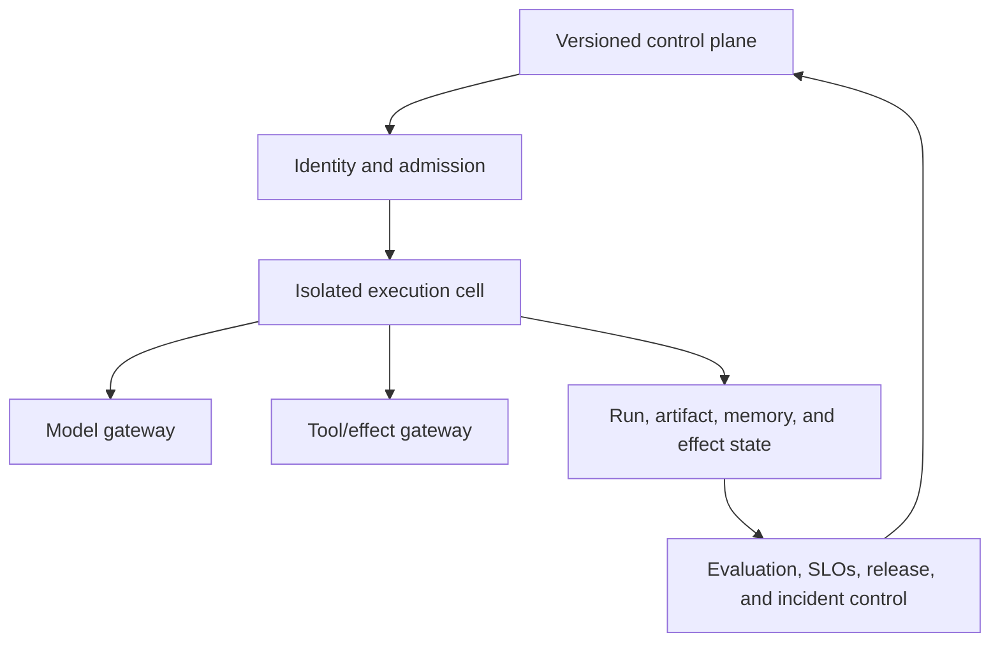

# Production Agent Architectures

> **Status:** Research-backed platform core available; workload-specific architectures remain queued.  
> **Research baseline:** 2026-08-30  
> **Evidence:** [Production operations and architectures packet](../research/packets/production-operations-and-architectures.md)

Reference architectures connect the repository's runtime, security, reliability, evaluation, orchestration, protocol, and operations guidance. They describe logical ownership and trust boundaries rather than prescribing a vendor or a microservice count.

## Available reference architectures

| Guide | Use it for |
|---|---|
| [Production agent control plane](production-agent-control-plane.md) | Identity, admission, durable control, execution cells, model/tool gateways, state ownership, effects, approvals, evaluation, and tenant isolation |
| [Interactive and long-running reference architectures](interactive-and-long-running-reference-architectures.md) | Live agents, asynchronous jobs, resumable events, durable waits, checkpoints, and atomic interactive-to-job handoff |

## Architecture position

- A durable run is independent of a connection, worker process, and provider request.
- The model receives a bounded view; authoritative state, policy, approvals, and effects live outside the transcript.
- The control plane versions behavior and contains failure; tenant execution runs in bounded cells.
- Interactive and background paths share contracts but have separate queues, capacity, deadlines, and SLOs.
- External effects require scoped authority, idempotency, durable state, and postcondition verification.

## Planned workload families

- Grounded assistant with citations and privacy controls.
- Customer-support agent with transactional tools and approval.
- Research agent with evidence synthesis and bounded parallel retrieval.
- Coding agent with workspace isolation, tests, review, and artifact handoff.
- Browser/computer-use agent with visual-state uncertainty and action safety.
- Infrastructure/server agent with least privilege and change control.
- Deterministic business workflow with agentic decision points.
- Local desktop agent with user-owned data and sandboxing.
- Remote multi-agent system using protocol boundaries.

Each workload guide will add its trust model, data/control flow, state ownership, recovery, evaluation, scaling, cost, and threat model to the platform core rather than repeating it.
