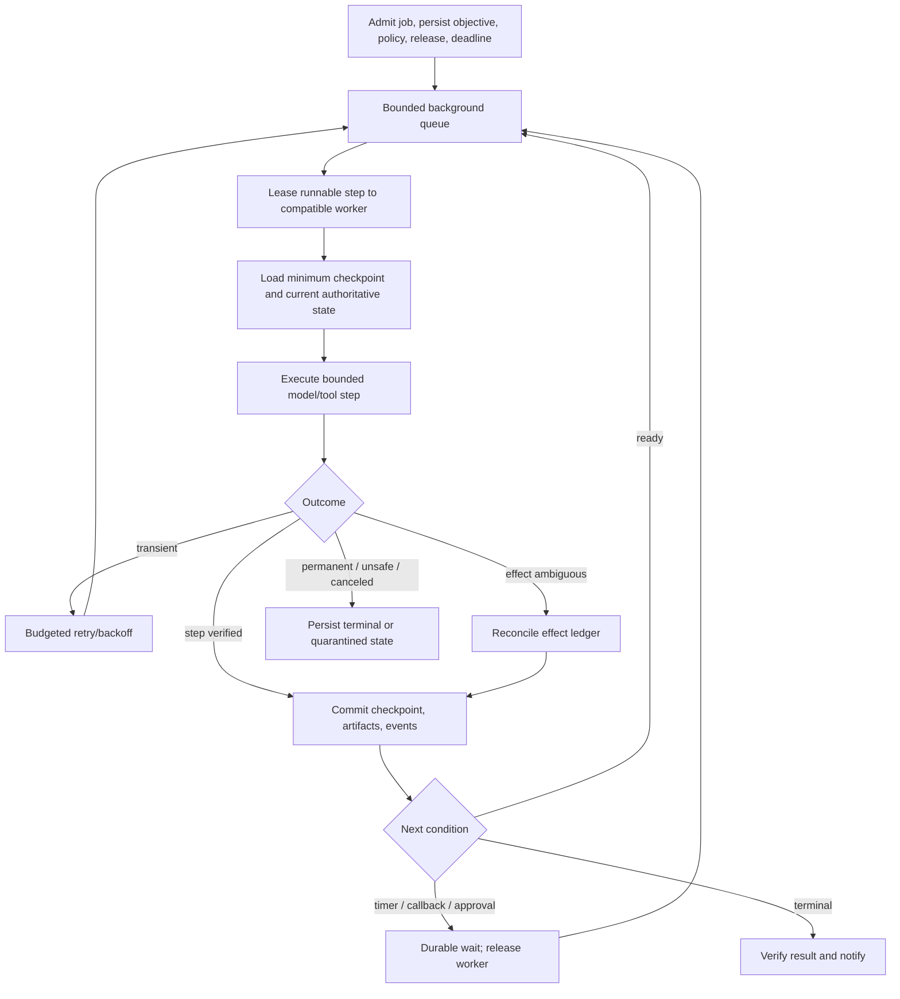
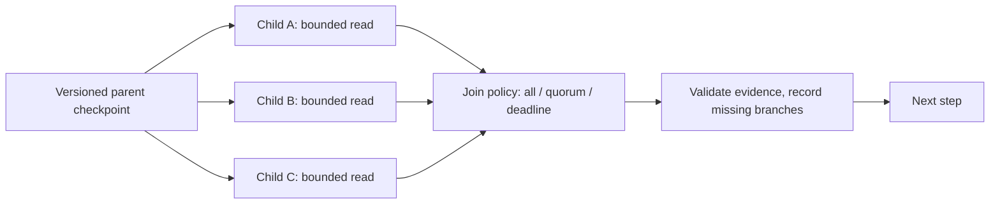

# Interactive and Long-Running Reference Architectures

> **Status:** Research-backed reference architectures  
> **Last researched:** 2026-08-30  
> **Scope:** Concrete vendor-neutral patterns for interactive agents, asynchronous durable jobs, and hybrid escalation from a live session to long-running work.  
> **Evidence:** [Production operations and architectures research packet](../research/packets/production-operations-and-architectures.md)  
> **Section index:** [Production agent architectures](README.md)

Interactive and long-running agents can share identity, policy, state, tools, and evaluation, but they should not share the same latency contract or lifecycle assumption. A network session is a delivery channel; a durable run is the work.

## Choose the execution shape

| Question | Interactive run | Long-running durable run | Hybrid |
|---|---|---|---|
| Is the user waiting? | Yes; seconds-to-minutes | No; minutes-to-days | Starts live, continues asynchronously |
| Primary SLO | First useful progress and terminal deadline | Accepted work completes/resumes by deadline | Honest handoff plus durable completion |
| Connection loss | Event stream reconnects; run policy decides whether work continues | No effect on run | Transition creates a durable job before acknowledging |
| Waiting | Keep short; avoid tying up scarce workers | Durable timer/event/approval wait | Convert long waits into durable state |
| State | Durable run state plus ephemeral stream cursor | Durable workflow/checkpoints/artifacts | Same run or explicit parent/child lineage |
| Capacity | Reserved online pool | Bounded background queues/service classes | Separate pools and admission policies |
| Result delivery | Stream plus durable final retrieval | Notification plus poll/get result | Stream job ID, then notification/reconnect |
| Versioning | Usually one release for a short run | Pin or migrate across releases explicitly | Record release at handoff and child start |

Use the interactive path only when the work can reasonably finish inside its deadline. Long model computation is not by itself durable orchestration; a provider background response still needs application-level state, cancellation, tool/effect recovery, and result delivery.

## Reference A: interactive tool-using agent

```mermaid
sequenceDiagram
    participant U as User/client
    participant A as Run API
    participant C as Interactive controller
    participant M as Model gateway
    participant T as Tool gateway
    participant S as Run/effect state
    participant E as Event stream

    U->>A: Create run + idempotency key + deadline
    A->>S: Persist admitted run and release
    A-->>U: run_id + resumable event cursor
    A->>C: Schedule in reserved interactive class
    C->>M: Bounded model request
    M-->>C: Proposed tool call or answer
    C->>T: Authorized structured read/prepare
    T-->>C: Evidence-bearing result
    C->>M: Minimal updated context
    M-->>C: Candidate terminal answer/action
    C->>S: Verify and persist terminal state
    C->>E: Append progress/result events
    E-->>U: Stream events
    Note over U,E: Reconnect reads from durable cursor; socket is not the run
```

### Interactive invariants

- Persist admission and `run_id` before acknowledging work.
- Reserve capacity and bound queue delay; reject or offer asynchronous continuation when the deadline is implausible.
- Stream semantic events such as accepted, evidence found, approval required, effect verified, and completed. Do not fake progress.
- Limit model turns, tool calls, generated tokens, parallel branches, cost, and elapsed time.
- Parallelize only independent, cancellable reads.
- Treat user interruption as durable cancel/modify input, with an attempt/version boundary to ignore stale late results.
- Preserve final state and evidence for retrieval after disconnect.
- Put writes behind a specific approval/effect protocol and verify postconditions.

### Interactive failure handling

| Failure | Response |
|---|---|
| Client disconnects | Continue or cancel according to declared policy; persist events either way |
| Stream delivery fails | Resume from cursor; never rerun the task just to recreate events |
| Model exceeds deadline | Cancel where possible, ignore stale result, produce explicit terminal/deferred state |
| Read tool times out | Retry once only if safe and within budget; otherwise report bounded uncertainty |
| Write tool times out | Mark effect unknown and reconcile before any retry |
| Approval takes too long | Suspend durably and resume on decision, or expire the proposal |
| Scope expands beyond online budget | Offer/perform explicit hybrid handoff if product policy permits |

## Reference B: long-running durable agent



### Durable invariants

- Workflow state is authoritative; the model does not decide whether a step committed.
- Checkpoints occur at deterministic boundaries before and after effects, waits, and fan-out joins.
- Workers are replaceable and release leases when waiting on timers, callbacks, approvals, or provider jobs.
- Every retry reuses or derives stable idempotency identity and observes the remaining deadline.
- Large outputs live in an artifact store; checkpoints contain versioned references and concise decision records.
- Model, tool, workflow, policy, and context versions are pinned or migrated explicitly.
- Notifications are derived from durable terminal events and can be retried without rerunning the job.

### Durable state model

```mermaid
stateDiagram-v2
    [*] --> Admitted
    Admitted --> Ready
    Ready --> Running: worker lease
    Running --> Ready: verified checkpoint; next step
    Running --> Waiting: timer / event / approval
    Waiting --> Ready: durable wakeup
    Running --> Recovering: transient or ambiguous failure
    Recovering --> Ready: retry/reconciliation succeeds
    Recovering --> Quarantined: operator decision required
    Ready --> Canceled: durable cancellation
    Waiting --> Canceled: durable cancellation
    Running --> Completed: terminal evidence committed
    Running --> Failed: permanent failure / budget exhausted
    Quarantined --> Ready: safe repair/redrive
    Completed --> [*]
    Failed --> [*]
    Canceled --> [*]
```



Use explicit wait reasons and wakeup correlation IDs. Deduplicate callbacks. A timer firing or message delivery only makes work eligible; it does not prove the preceding external event occurred.

## Reference C: interactive-to-durable handoff

Some tasks begin as a conversation and reveal work that cannot finish safely within the live budget. Make the transition visible and atomic.

```mermaid
sequenceDiagram
    participant U as User
    participant I as Interactive run
    participant D as Durable workflow
    participant S as State/artifacts

    I->>S: Persist scoped objective, evidence, policy, artifacts, and remaining budget
    I->>D: Create child/resumed job with idempotency key
    D->>S: Atomically record durable ownership and release version
    D-->>I: job_id + accepted deadline + notification policy
    I-->>U: Handoff confirmed with job_id and cancellation/result controls
    D->>D: Execute, checkpoint, wait, and recover
    D->>S: Persist verified terminal result
    D-->>U: Notify; result remains retrievable
```

The handoff record should include:

- exact accepted objective, exclusions, and success evidence;
- current user/tenant identity, policy, approvals, and whether approvals survive handoff;
- source run and conversation/artifact references;
- immutable release and workflow versions;
- deadline, priority, cost/run budgets, and notification policy;
- cancellation authority and retention;
- outstanding or unknown effects;
- ownership: the interactive run must stop executing transferred work.

Do not copy the entire transcript into a job prompt. Create a versioned task brief and evidence references. Revalidate mutable facts, credentials, and authorization when the durable step executes.

## Shared data and component boundaries

Both architectures should use the same contract for:

| Concern | Shared contract | Different policy |
|---|---|---|
| Identity/tenant | Principal and tenant propagate to every call | Interactive may require live re-auth for commit; durable uses scoped expiring grants |
| Run state | Durable state machine and append-only events | Online has tighter state-transition deadlines |
| Models/tools | Gateways enforce compatibility, quotas, policy, telemetry | Separate capacity classes and retry budgets |
| Context/memory | Provenance, scope, version, minimum necessary context | Durable jobs refresh stale facts after waits |
| Effects | Same effect ledger and reconciliation | Long jobs encounter more expiry/version drift |
| Evaluation | Same release/evaluator lineage | Interactive favors sampled fast checks; durable can run deeper terminal verification |
| Delivery | Durable event IDs and final result | Stream cursor versus notification/poll |

## Fan-out and join

Long-running research can parallelize independent retrieval, but the controller—not a conversational agent—owns the join.



Give children unique identities, limited authority, independent budgets, and artifact outputs. Define whether the join needs all branches, a quorum, or the best evidence before a deadline. Cancel unnecessary branches and explicitly record partial results. Never fan out writes without a domain transaction or compensation design.

## Overload isolation

Interactive and background traffic need separate queues, concurrency reservations, provider budgets, and SLOs. During pressure:

1. pause evaluations, maintenance, and optional enrichment;
2. reduce background admission and fan-out;
3. preserve interactive and reconciliation capacity;
4. offer durable handoff rather than silently lengthening an online request;
5. reject before enqueue when neither deadline can be met.

Long-running backlog catch-up must be throttled below spare capacity so it does not cause a second incident.

## Common anti-patterns

| Anti-pattern | Consequence | Replacement |
|---|---|---|
| Websocket/session equals run | Disconnect loses work or triggers duplicate rerun | Durable `run_id` plus resumable event cursor |
| Worker sleeps while awaiting approval | Capacity exhaustion and fragile process state | Durable wait and wakeup |
| Provider background call equals workflow | No application-level tool/effect/cancel/release recovery | Store provider operation inside a durable workflow step |
| Entire transcript is checkpoint | Context bloat, authority confusion, stale facts | Structured run state plus artifacts and compact context view |
| Retry whole job from the start | Duplicate cost and effects | Resume from verified checkpoint with idempotency |
| One queue for every workload | Batch/noisy tenants starve online and recovery work | Class queues, reservations, fair scheduling |
| Notify then persist result | User sees a result that cannot be retrieved | Persist terminal state, then emit retryable notification |
| Upgrade all active runs in place | Mixed semantics and unrecoverable state | Version pinning or explicit migration |

## Architecture review checklist

- [ ] Interactive and durable paths have separate admission, capacity, and SLOs.
- [ ] A durable run exists independently of stream, process, and provider request.
- [ ] Events resume by cursor and notification retries do not rerun work.
- [ ] Waits release workers and wakeups are deduplicated.
- [ ] Checkpoints bracket effects and preserve version lineage.
- [ ] Handoff is atomic, scoped, visible, and transfers execution ownership once.
- [ ] External facts and approvals are revalidated after long waits.
- [ ] Fan-out has bounded children, explicit join semantics, and cancellation.
- [ ] Background catch-up cannot consume interactive/reconciliation reserves.
- [ ] Long-running version migration and rollback are tested.

## Related guides

- [Production agent control plane](production-agent-control-plane.md)
- [Durable execution](../runtime/durable-execution.md)
- [Agent-user interaction protocol](../protocols/agent-user-interaction-protocol.md)
- [Delegation, handoffs, and shared state](../orchestration/delegation-handoffs-and-shared-state.md)
- [Queues, scheduling, and backpressure](../operations/queues-scheduling-and-backpressure.md)
- [Deployment, release, and incident response](../operations/deployment-release-and-incident-response.md)

## Selected sources

- [OpenAI background mode](https://developers.openai.com/api/docs/guides/background)
- [Temporal task queues](https://docs.temporal.io/task-queue)
- [Temporal worker performance](https://docs.temporal.io/develop/worker-performance)
- [Temporal worker versioning](https://docs.temporal.io/production-deployment/worker-deployments/worker-versioning)
- [Google SRE: Addressing cascading failures](https://sre.google/sre-book/addressing-cascading-failures/)
- [AWS Agentic AI Lens: Asynchronous execution](https://docs.aws.amazon.com/wellarchitected/latest/agentic-ai-lens/agentperf04-bp01.html)
