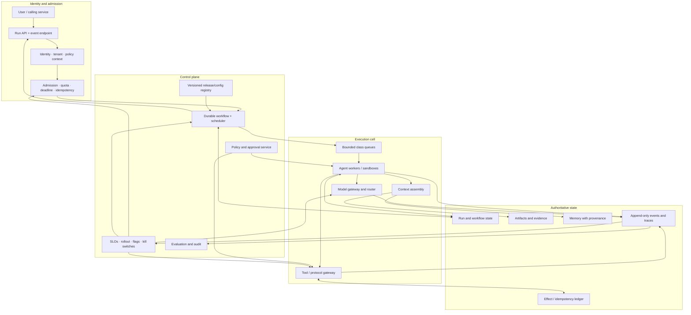
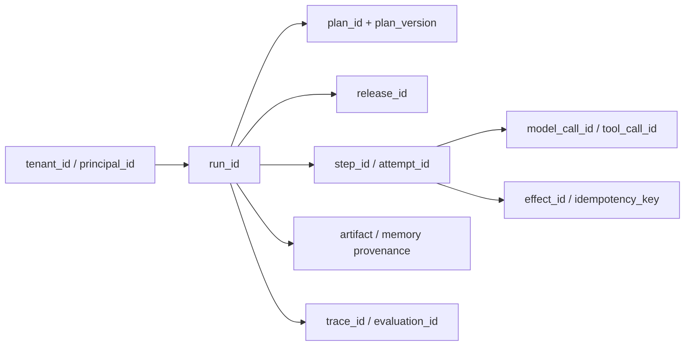
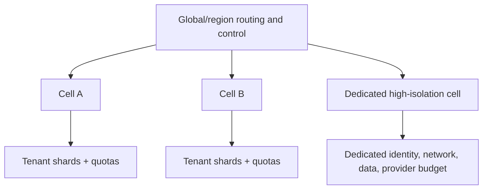

# Production Agent Control Plane

> **Status:** Research-backed reference architecture  
> **Last researched:** 2026-08-30  
> **Scope:** A vendor-neutral control-plane and execution-cell architecture for durable, tool-using, multi-tenant agents.  
> **Evidence:** [Production operations and architectures research packet](../research/packets/production-operations-and-architectures.md)  
> **Section index:** [Production agent architectures](README.md)

A production agent platform should not be one model-facing service with ambient access to tools and mutable chat history. Separate admission, durable control, models, tools, state, effects, approvals, and evaluation so each has one authority and a bounded failure domain.

## Reference architecture



Arrows describe logical responsibility, not a required deployment count. A small system can combine services in one process while preserving contracts and state ownership; a large system can split them by region, tenant cell, risk, or workload.

## Control plane and execution plane

The **control plane** defines versions, policy, routes, capacity, rollout, and containment. It should be low-volume, strongly audited, and unavailable-by-default for unsafe mutations. The **execution plane** processes tenant runs inside assigned cells under those decisions. It is high-volume and expected to degrade, retry, and scale.

Do not put emergency control behind the same model, queue, credentials, or state path it must disable. Kill switches and release rollback need an independent authenticated route.

## Component responsibilities

| Component | Owns | Boundary requirement |
|---|---|---|
| Run API and event endpoint | create/get/cancel/resume; durable event cursor; result retrieval | A dropped connection cannot erase or duplicate a run |
| Identity and policy context | principal, tenant, roles, entitlements, region, purpose | Untrusted prompt content cannot redefine identity or authority |
| Admission controller | idempotency, deadlines, class, quotas, dependency/cell capacity | Rejects or defers work before unbounded enqueue |
| Release/config registry | immutable behavior manifests and targeted configuration | Every run resolves and records an observed release |
| Durable workflow/scheduler | run states, timers, waits, leases, retries, cancellation, version pin | Orchestrates effects but does not invent authorization |
| Agent worker/sandbox | bounded reasoning and local task execution | Ephemeral compute; no ambient long-lived credentials |
| Model gateway/router | compatible route, provider limits, cache, telemetry, request policy | Routing changes are versioned and evaluated |
| Tool/protocol gateway | tool contracts, grants, credential exchange, throttles, effect IDs | Validates and authorizes structured intent; reconciles ambiguous results |
| Context assembly | minimum relevant instructions, state, artifacts, memory, provenance | Chat text is not authoritative state or permission |
| Run/state store | current durable state and optimistic/version controls | One writer/transition rule per invariant |
| Artifact/evidence store | large inputs/outputs, citations, test results, checkpoints | Immutable/versioned references with retention policy |
| Memory service | scoped learned facts/preferences with provenance and deletion | Memory cannot silently override current policy or source data |
| Effect ledger | intended, dispatched, acknowledged, verified, unknown, compensated | Durable idempotency and reconciliation source |
| Approval service | challenge, decision, scope, expiry, approver identity | Approval binds to exact effect and version |
| Events/traces | append-only lifecycle and causal lineage | Redacted but sufficient for audit, SLOs, and replay |
| Evaluation/operations | quality, safety, capacity, releases, alerts, containment | Observes task outcomes and can halt affected paths |

## Identity and lineage spine

Carry a small set of stable identifiers across every boundary:



IDs should be opaque and globally unique inside the operational domain. They enable cancellation, deduplication, audit, cost attribution, release comparison, and incident reconciliation. Never use free-form model text as an identifier for an external write.

## One source of truth per kind of state

| State | Authoritative owner | Why the transcript is insufficient |
|---|---|---|
| Run lifecycle and ready work | workflow/run store | Needs concurrency control, timers, retries, and terminal invariants |
| Domain records | domain system/tool | The agent has only an observation, possibly stale |
| External effects | effect ledger plus domain verification | Timeout or generated text does not establish commit |
| Large intermediate results | artifact store | Prompts are bounded and mutable |
| Durable learned memory | memory service with provenance | Must support scope, conflict, expiry, deletion, and audit |
| Human authorization | approval service | Must bind actor, effect, scope, version, and expiry |
| Telemetry | append-only event/trace system | Mutable state cannot reconstruct a trustworthy timeline |

The context builder reads authoritative references and creates a bounded model view. Model output becomes a proposal that a deterministic boundary validates; it does not mutate truth directly.

## Effect path

```mermaid
sequenceDiagram
    participant W as Worker
    participant P as Policy/Approval
    participant G as Tool Gateway
    participant L as Effect Ledger
    participant D as Domain System

    W->>P: Structured intent + principal + policy facts
    P-->>W: Grant scoped to effect, version, expiry
    W->>G: Commit request + grant + idempotency key
    G->>L: Record intended/dispatched
    G->>D: Domain operation
    alt explicit result
        D-->>G: Operation ID / result
        G->>D: Read authoritative postcondition
        D-->>G: Current state
        G->>L: Record verified or failed
        G-->>W: Evidence-bearing outcome
    else timeout or disconnect
        G->>L: Record unknown
        G->>D: Reconcile by operation/idempotency ID
        D-->>G: Committed / absent / still unknown
        G->>L: Update state
        G-->>W: Reconciled outcome; no blind retry
    end
```

High-risk tools may require prepare/commit, human approval, dry-run, or a separate verifier. Compensation is a new authorized effect, not deletion of history.

## Tenant cells and isolation

Assign each run to an execution cell using tenant, region, data policy, workload, and risk. A cell contains bounded queues and workers and may have distinct provider accounts, tool credentials, state partitions, and network policy.



Enforce tenant identity at API, scheduler, model gateway, state/memory, tool gateway, sandbox, and telemetry. Cell isolation reduces blast radius but creates capacity fragmentation and rebalancing work. Dedicated infrastructure is appropriate when threat, compliance, data residency, or noisy-neighbor risk justifies it—not simply because a tenant pays more.

## Failure boundaries and degraded modes

| Failure | Contain | Safe degraded behavior |
|---|---|---|
| Model provider slow/throttled | Model gateway and affected route quota | Defer, use an already-qualified compatible route, or return scoped partial result |
| Tool unavailable | Tool gateway/circuit and workflow wait | Preserve proposal; retry within deadline or require resume |
| Workflow control impaired | Stop new admissions; preserve queue and state | Read-only run status; avoid starting untracked work |
| Memory unavailable/contaminated | Memory service and write flag | Continue without optional memory or freeze writes; never use suspect facts silently |
| Event stream disconnected | Delivery adapter | Resume by durable cursor; run continues according to policy |
| Evaluator unavailable | Eval lane and promotion gate | Mark provisional; hold releases/high-impact outcomes as policy requires |
| One cell overloaded or compromised | Cell routing and credentials | Stop/admit elsewhere only when state, residency, and duplicate-run policy allow |

## Deployment topology decisions

| Decision | Start with | Split when |
|---|---|---|
| Workflow and workers | Same service/process, separate logical interfaces | Long waits, independent scaling, version pinning, or durable recovery require it |
| Model gateway | Shared library behind one policy boundary | Multiple providers/routes, central quota, data policy, or cost attribution emerge |
| Tool gateway | Per-domain adapters under common contract | Credentials, effects, tenant isolation, or protocol peers need independent control |
| State stores | One database with explicit schemas and append-only events | Scale, retention, consistency, or isolation needs differ |
| Cells | One regional pool with class/tenant quotas | Noisy neighbors, blast radius, residency, or regulatory isolation requires cells |
| Evaluation | Offline pipeline plus production sampling | Promotion gates, delayed labels, or high-risk auditing need dedicated infrastructure |

Preserve seams early; distribute only when reliability, isolation, or scale evidence warrants the cost.

## Architecture review checklist

- [ ] A durable run identity survives disconnects, retries, and worker replacement.
- [ ] Admission is bounded by deadline, tenant, and every scarce downstream resource.
- [ ] Release, policy, route, tools, and evaluator versions are traceable per run.
- [ ] Model output is untrusted proposal data at effect and state boundaries.
- [ ] Workflow state, artifacts, memory, approvals, and effects have distinct owners.
- [ ] External writes use scoped authority, idempotency, and postcondition verification.
- [ ] Cancellation and kill switches operate outside the model path.
- [ ] Events resume by durable cursor and do not define run lifetime.
- [ ] Tenant identity and throttles propagate through every layer.
- [ ] Cells, degraded modes, recovery, and reconciliation are exercised.

## Related guides

- [Interactive and long-running reference architectures](interactive-and-long-running-reference-architectures.md)
- [Execution boundaries](../runtime/execution-boundaries.md)
- [Durable execution](../runtime/durable-execution.md)
- [Permissions, sandboxing, and secrets](../security/permissions-sandboxing-and-secrets.md)
- [Queues, scheduling, and backpressure](../operations/queues-scheduling-and-backpressure.md)
- [Model routing, cost, and latency](../operations/model-routing-cost-and-latency.md)
- [Tool discovery and selection](../tools/tool-discovery-and-selection.md)
- [Tool fleet operations](../tools/tool-fleet-operations.md)

## Selected sources

- [Google SRE: Service best practices](https://sre.google/sre-book/service-best-practices/)
- [Temporal task queues](https://docs.temporal.io/task-queue)
- [Temporal worker versioning](https://docs.temporal.io/production-deployment/worker-deployments/worker-versioning)
- [Kubernetes multi-tenancy](https://kubernetes.io/docs/concepts/security/multi-tenancy/)
- [AWS SaaS Lens foundations](https://docs.aws.amazon.com/wellarchitected/latest/saas-lens/foundations.html)
- [AWS Agentic AI Lens: Multi-tenant scaling](https://docs.aws.amazon.com/wellarchitected/latest/agentic-ai-lens/agentperf07.html)
