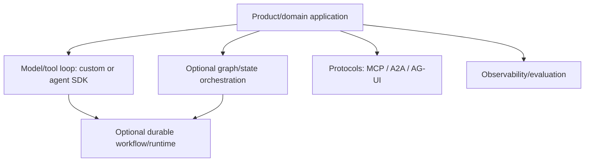
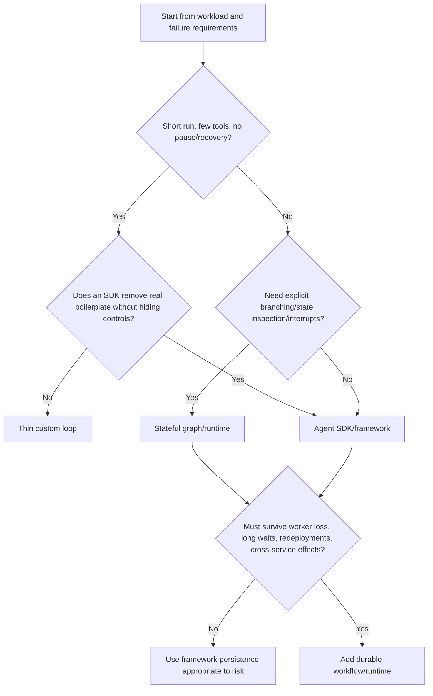

# Custom Loop vs Agent Framework vs Workflow Engine

> **Status:** Research-backed draft  
> **Last researched:** 2026-08-30  
> **Scope:** Selecting the orchestration/runtime abstraction; not a ranking of individual products  
> **Research packet:** [Core agent loop and runtime boundary](../research/packets/core-agent-runtime.md)

## Short answer

- Use a **thin custom loop** when the loop is short, the tool surface is small, and owning every transition is simpler than adapting a framework.
- Use an **agent SDK/framework** when its runner, tool adapters, state, handoffs, guardrails, streaming, and traces remove demonstrated work without obscuring required semantics.
- Use a **stateful graph/runtime** when explicit branching, checkpoints, interrupts, and state inspection are central.
- Add a **durable workflow engine** when work must survive long waits, process loss, redeployments, and side-effect recovery.

These layers can be combined. An agent SDK may run inside durable workflow activities; a graph runtime may provide checkpoints while a workflow engine owns cross-service recovery.

## Do not compare unlike layers

MCP is not an alternative to LangGraph. Temporal is not an alternative to a provider SDK. An agent harness can use both.

## Decision matrix

| Criterion | Thin custom loop | Agent SDK/framework | Stateful graph/runtime | Durable workflow engine |
|---|---|---|---|---|
| Basic model/tool loop | Full control, some boilerplate | Built in | Built in or composed | Usually not model-specific |
| Explicit branching | Code | Framework-dependent | First-class | First-class code/workflow |
| Tool adapters/schemas | Build or use provider SDK | Usually strong | Often ecosystem-dependent | Use activities/adapters |
| Streaming UX | Build | Often built in | Often event/state streams | Durable state; token stream may remain separate |
| Handoffs/subagents | Build | Often built in | Natural subgraphs/nodes | Model as child workflows/activities |
| Checkpoints/interrupts | Build | Varies | Core strength | Core strength |
| Crash/redeploy recovery | Build | Often limited or via integration | Step/graph recovery | Core strength |
| Long timers/approvals | Build carefully | Varies | Supported in some runtimes | Core strength |
| External effect semantics | Entirely yours | Entirely yours unless documented adapter | Entirely yours at tool boundary | Structured activities, still needs idempotency/reconciliation |
| Policy/authorization | Entirely yours | Hooks/guardrails help; still yours | Nodes/middleware; still yours | Activities/interceptors; still yours |
| Provider portability | High if adapter is clean | Varies | Often high with integrations | High at workflow layer |
| Debugging/trace UI | Build/integrate | Often strong | Often strong state visualization | Strong workflow history/operator UI |
| Operational burden | Low initially; grows with features | Dependency/version burden | State store/runtime burden | Platform/workers/history/versioning burden |
| Semantic transparency | Highest if well engineered | Can be obscured by defaults | Explicit graph, but framework semantics matter | Explicit replay model, but learning curve |

## Selection flow

## Thin custom loop

### Choose it when

- one agent and a small tool set are enough;
- the loop has a few clear transitions;
- provider streaming/tool primitives already cover needs;
- the team needs precise control over policy, context, and errors;
- runs can restart safely or use a simple persisted state machine;
- framework adaptation would exceed the implementation being replaced.

### You must own

- output classification and tool dispatch;
- budgets, repeated-action detection, timeout, cancellation, and terminal reasons;
- context/session state and compaction;
- tool schemas, error normalization, approval, and authorization;
- trace/event model;
- effects, idempotency, and recovery;
- provider differences and upgrades.

### Exit signals

- custom code accumulates graphs, checkpoints, pending approvals, replay, leases, or operator repair tools;
- each new tool requires repetitive adapters and event plumbing;
- handoffs/nested runs require complex transcript and budget propagation;
- platform teams are rebuilding a workflow engine.

## Agent SDK/framework

### Choose it when

- its abstraction matches the desired loop;
- current version supports required language/provider/tool types;
- built-in tracing, streaming, sessions, guardrails, handoffs, or MCP materially reduce work;
- escape hatches exist for context, policy, tool error, and model configuration;
- the team can pin, test, and monitor fast-moving versions;
- framework behavior is included in eval baselines.

### Audit before selection

- default and configurable turn/step limits;
- provider parallel-call vs executor concurrency behavior;
- timeout and cancellation scope, including synchronous and nested tools;
- error categories and retry budgets;
- session vs run vs memory state;
- approval serialization and resume behavior;
- tool authorization boundary;
- trace content/privacy defaults;
- checkpoint and durable-integration semantics;
- provider fallback/output normalization;
- deprecations and project support trajectory.

### Exit signals

- critical invariants require fighting middleware/defaults;
- framework upgrades repeatedly change tool/state semantics;
- debugging requires reading internals for common failures;
- provider portability exists only in name because behavior diverges;
- the application needs durable waits/effects the framework does not own.

## Stateful graph/runtime

### Choose it when

- control flow and state transitions need to be visible and testable;
- checkpoints, interrupts, time travel, or state inspection add real value;
- deterministic nodes and agentic nodes must compose;
- parallel branches and merge semantics are explicit;
- complex recovery occurs at graph step boundaries.

### Cautions

- a graph can encode unnecessary complexity for a simple loop;
- node boundaries become checkpoint and versioning boundaries;
- concurrent state reducers/merges need deterministic semantics;
- external writes still require idempotency and receipts;
- graph recursion limits bound execution but do not define successful completion;
- subgraph state scope must be deliberate.

## Durable workflow engine

### Choose it when

- runs wait minutes to months for people, timers, webhooks, or remote work;
- completed model/tool calls must not be repeated after worker loss;
- queues, retries, leases, timers, and recovery are becoming product infrastructure;
- cross-service effects and compensation require a durable history;
- operators need inspect/retry/cancel/migrate capabilities;
- active runs can span deployments.

### You still own

- agent loop semantics and model context;
- tool selection and provider behavior;
- authorization, containment, and approval UX;
- downstream idempotency and unknown-effect reconciliation;
- completion verification and evals;
- sensitive-data decisions for durable history.

### Costs

- deterministic replay/versioning constraints;
- new control plane, workers, database/history, and on-call surface;
- activity granularity and serialization design;
- workflow retention and migration;
- live streaming separate from durable state;
- team learning and local testing complexity.

## Common combinations

| Combination | Good fit | Boundary rule |
|---|---|---|
| Provider SDK + thin custom loop | Small, controlled agent | Keep tool/policy/effect contracts explicit |
| Agent SDK + application database | Moderate sessions, short runs | Do not call database session state “durable execution” |
| Agent framework + LangGraph-style runtime | Stateful agentic workflow | Define checkpoint and external-effect boundary |
| Agent SDK + Temporal/Restate/DBOS/Prefect | Long-running recoverable agent | Put model/tools in recorded activities/steps per integration semantics |
| Harness + remote sandbox hands | Coding/computer-use/research with isolation | Brain never receives ambient sandbox/host authority |
| Graph/runtime + A2A/MCP/AG-UI | Interoperable remote/UI/tool boundaries | Protocol transport does not replace trust, authorization, or durability |

## Framework evaluation protocol

Run the same representative tasks under controlled configurations:

1. pin model/provider parameters and tool implementations;
2. implement the smallest idiomatic version in each candidate;
3. include success, refusal, malformed tool, timeout, cancellation, approval, crash, replay, and effect ambiguity;
4. measure final state, trajectory, tokens, cost, latency, attempts, and operator effort;
5. inspect traces and state after partial failure;
6. upgrade a dependency/tool schema and replay historical fixtures;
7. document custom code and infrastructure still required.

SWE-bench Verified showed scaffold choice can materially change outcomes for the same model. Treat the harness/runtime as part of the evaluated system, not neutral plumbing.

## Anti-patterns

- Choose a framework from a feature checklist without testing semantics.
- Build a custom engine because a simple SDK feels “less pure.”
- Add a durable workflow platform to a short read-only request.
- Expect an agent framework to solve distributed effect safety automatically.
- Expect a workflow engine to improve model judgment automatically.
- Compare technologies at different layers as substitutes.
- Hide all domain workflow steps inside one opaque agent call/activity.
- Adopt multi-agent support before a single-agent baseline and eval exist.
- Ignore deprecation/migration direction in fast-moving ecosystems.

## Decision checklist

- [ ] Workload variation and required autonomy are documented.
- [ ] Failure survival, wait, and effect requirements are explicit.
- [ ] A thin custom baseline or reason to skip it exists.
- [ ] Candidate abstraction owns a demonstrated problem.
- [ ] Loop, retry, timeout, cancellation, approval, and state semantics were verified in current docs/source.
- [ ] External-effect and authorization responsibilities remain explicit.
- [ ] Framework/runtime and model are evaluated together on repeated tasks.
- [ ] Dependency maturity, support trajectory, and upgrade policy are acceptable.
- [ ] Operational infrastructure and operator repair needs are budgeted.
- [ ] An exit/migration path exists for session, run, and business state.

## Related guides

- [Agentic systems](../foundations/agentic-systems.md)
- [The production agent loop](../foundations/agent-loop.md)
- [Choosing an agent runtime language](../languages/choosing-an-agent-runtime-language.md)
- [Selecting a provider-native agent framework](provider-native-agent-frameworks.md)
- [Selecting an independent agent framework](independent-agent-frameworks.md)
- [Selecting across evolving agent framework ecosystems](evolving-agent-framework-ecosystems.md)
- [Durable execution](../runtime/durable-execution.md)
- [Temporal vs Restate vs DBOS vs Prefect vs Dapr Workflow](durable-agent-workflow-runtimes.md)
- [Framework ecosystem map](../frameworks/README.md)
- [Technology index](../indexes/technology-index.md)

## Research notes

The comparison synthesizes current architecture descriptions from [LangGraph](https://docs.langchain.com/oss/python/langgraph/overview), [OpenAI Agents SDK](https://openai.github.io/openai-agents-python/running_agents/), [Vercel AI SDK](https://ai-sdk.dev/docs/agents/overview), [Pydantic AI durability](https://pydantic.dev/docs/ai/capabilities/durable_execution/overview/), and the durable engines in the [research packet](../research/packets/core-agent-runtime.md). It intentionally avoids a product winner because workload semantics and versions dominate selection.
