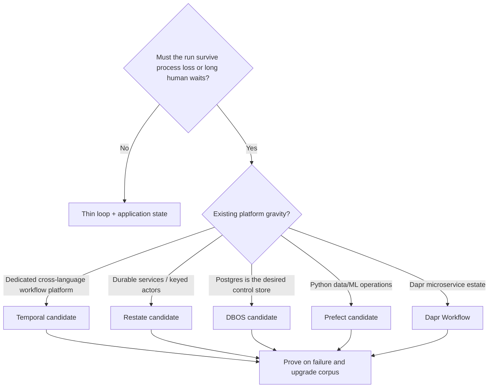
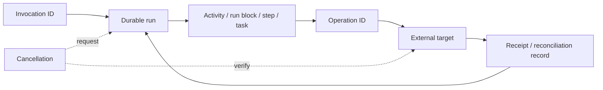
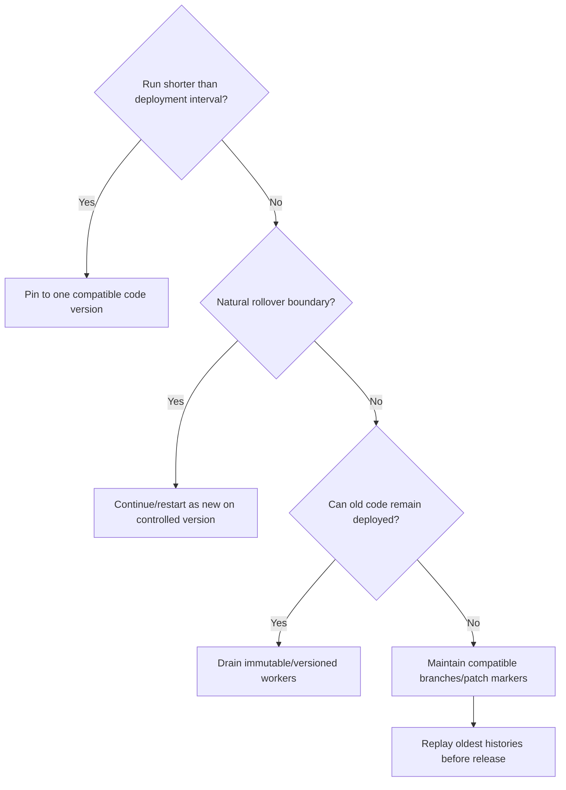

# Selecting a Durable Runtime for Agent Workflows

**Research date:** 2026-08-31  
**Status:** Research-backed decision guide  
**Compared:** Temporal, Restate, DBOS, Prefect 3, and Dapr Workflow

## Decision first

Choose the execution model before the brand:

There is no universal winner. The decisive question is what source of truth and replay contract the team can operate safely for the longest run lifetime.

## Compare the correct semantics

| Dimension | Temporal | Restate | DBOS | Prefect | Dapr Workflow |
|---|---|---|---|---|---|
| Recovery model | Replay deterministic workflow against event history | Re-enter handler; replay journaled SDK operations/results | Re-run deterministic workflow; substitute checkpointed step outputs | Re-orchestrate flow/task states; retry/cache/persist chosen units | Replay deterministic orchestrator against actor-stored event history |
| I/O boundary | Activity/child/Nexus | `ctx.run` and service syscalls | Step/transaction | Task or flow code chosen by author | Activity/child workflow |
| Native stateful entity | Long-running entity Workflow pattern | Virtual Object, single writer per key | Workflow/message tables; application DB | Flow/task states; application-owned domain data | Workflow actor; Dapr Actor ecosystem |
| Human wait | Signal/Update + timer | Durable promise/awakeable/handler | Message/event + durable sleep | Suspend/resume with typed input | External event + timer; suspend/resume |
| Code evolution | Worker Deployment Versioning, pin/auto-upgrade, patch | Immutable deployment pinning; compatible reassignment | Patch markers or application versions | Deployment/code artifact discipline; cache keys | Workflow version + patches; Continue-as-New |
| Result/history store | Temporal service/Cloud | Restate replicated log/state | Postgres/SQLite for local dev | Prefect DB + configured result storage | Actor-compatible state store |
| Control-plane shape | Dedicated service + workers | Log-first runtime + service endpoints | Embedded library; optional/recommended Conductor | Server/Cloud + work pools/workers | Sidecars + placement/scheduler + app workers |
| Language center | Go, Java, TS, Python, .NET, Ruby and more by support level | TS, Java/Kotlin, Python, Go, Rust by version matrix | Python, TS, Go, Java repos | Python | SDK-dependent; Dapr Agents is Python |
| Biggest surprise | Workflow code and deploys must stay replay-safe | Invocation remains pinned to an immutable endpoint | Distributed HA recovery is a separate coordination concern | Result persistence is not automatic replay durability | State-store limits and sidecar/actor topology shape workflows |

## Hard gates

Reject a candidate before prototyping if any answer is unacceptable:

- required language/SDK feature parity is missing;
- the team cannot retain or migrate code for the maximum in-flight lifetime;
- stored prompts, tool results, or headers cannot meet encryption and retention policy;
- the runtime’s self-host/managed topology conflicts with network or residency requirements;
- there is no tested way to reconcile ambiguous external effects;
- cancellation cannot be observed at the actual effect boundary;
- operator repair needs unsupported private-store mutation;
- storage/history growth cannot be bounded without losing required audit evidence.

## Failure ownership model

Durability does not remove distributed ambiguity. Use a stable invocation ID to deduplicate admission and a distinct operation ID for each effect attempt lineage. The target must either accept that key or support lookup. Persist the receipt before advancing. If the target cannot answer whether it committed, route the run to `OUTCOME_UNKNOWN` and repair; do not guess.

## When each system is the strongest candidate

### Temporal

Choose Temporal when:

- workflows span services/languages and require a mature dedicated platform;
- event history, Signals/Updates, child workflows, schedules, search/visibility, replay tooling, and worker routing are valuable;
- the team can enforce deterministic workflow code, activity idempotency, history budgets, and versioned worker operations;
- managed Cloud or an experienced self-hosted platform team fits the organization.

The cost is a real service/control plane, task-queue and worker operations, deterministic-code constraints, and long-lived deployment/version management. Temporal is not an agent framework; run model calls and agent loops at explicit activity boundaries or through a tested integration.

### Restate

Choose Restate when:

- ordinary service handlers plus durable async/await are the desired programming model;
- keyed single-writer Virtual Objects fit agent sessions, inboxes, or domain entities;
- durable calls, state, timers, and promises should share one log-first runtime;
- container/serverless endpoints and the supported SDK mix fit deployment.

The cost is Restate runtime operation, immutable endpoint retention, journal growth, SDK-aware concurrency, and current feature/language maturity checks. Bound model-call retries explicitly: default retry-until-terminal behavior can otherwise multiply cost.

### DBOS

Choose DBOS when:

- embedding a library is preferable to operating a separate orchestrator service;
- Postgres is already a trusted HA dependency and its write/retention profile fits the workload;
- application database effects can benefit from a shared transactional boundary;
- lightweight queues, sleeps, messages, streams, and agent adapters cover the needed surface.

The cost is database write/connection/storage pressure and an explicit distributed recovery choice. A local process restart is not the same as fleet-wide HA; use Conductor or implement/test equivalent ownership. Keep large outputs outside Postgres checkpoints.

### Prefect

Choose Prefect when:

- Python data, ML, batch, infrastructure, and dynamic mapped work dominate;
- work pools, deployment infrastructure, schedules, events, automations, and UI-visible states are primary value;
- task-level retries/caches/results are sufficient and effect safety will be designed explicitly;
- suspend/resume with typed human input fits the process.

Do not select it solely because a page calls tasks transactional. Prefect transaction/cache records do not atomically commit arbitrary remote effects, result persistence must be configured, and cancellation depends on enforceable infrastructure termination.

### Dapr Workflow

Choose Dapr Workflow when:

- Dapr sidecars, actors, state stores, identity, pub/sub, service invocation, and operations are already strategic;
- workflow durability should use the same portable building-block platform;
- replayable orchestration, external events, child workflows, timers, and current version/management APIs fit;
- state-store limitations and coupled scaling of an app’s workflows/activities are acceptable.

The cost is the broad Dapr operational surface—sidecars, placement/scheduler, actor state, component configuration, and SDK/runtime compatibility. Configure concurrency; defaults do not protect a cluster from runaway fan-out.

## Workload mapping

| Workload | First candidate | Why | Verify against |
|---|---|---|---|
| Cross-service order/payment lifecycle | Temporal or Restate | Durable calls, timers, interactions, recovery | External effect idempotency and code-version lifetime |
| One stateful agent inbox per customer | Restate Virtual Object or Temporal entity Workflow | Serialized per-key state/event loop | Hot-key throughput, history/journal rollover, tenant isolation |
| Agent embedded in a Postgres application | DBOS | Minimal new data-plane infrastructure | DB capacity, distributed recovery, step size, version drain |
| ML/data research pipeline with agent steps | Prefect | Python task orchestration, mapping, infrastructure | Result store, side effects, suspension, worker loss |
| Dapr-native multi-service platform | Dapr Workflow | Existing runtime/building blocks | State-store limits, reminder/scheduler health, version parity |
| Short read-only assistant request | None of these by default | Durability overhead may not buy value | Simple database session + bounded retry |
| Week-long high-risk approval and effect | Any surviving hard gates | All have wait primitives | Exact proposal identity, expiry, reauthorization, ambiguous commit |

## Versioning is a workload property

Do not pick a versioning feature without comparing maximum run duration, deployment frequency, history/schema retention, rollback window, and cost of keeping old workers/endpoints. Prompt, tool, policy, and artifact schemas need application versions even if the workflow engine versions code.

## Proof-of-adoption experiment

Use the same representative workflow in every serious candidate:

1. Agent drafts a proposed external action.
2. Runtime waits for signed human approval for 24 hours without compute.
3. Tool commits using a target-side operation key.
4. A second model call explains the receipt.
5. Large evidence is an artifact reference, not history payload.

Inject failures after every durable boundary and during:

- request admission and duplicate submission;
- model call before/after provider acceptance;
- tool target commit before receipt persistence;
- approval before/after redeploy and policy change;
- cancellation racing tool completion;
- worker SIGTERM/SIGKILL and runtime/state-store failover;
- old code replacement and stored-state migration;
- UI stream disconnect/reconnect;
- 100× normal fan-out and oldest-history replay.

Measure completed outcomes, duplicate/missed effects, recovery latency, operator minutes, stored bytes, database/runtime writes, queue age, model/tool cost, and deployment complexity. Feature parity is not sufficient.

## Operator and security checklist

- [ ] Admission and every effect have separate stable idempotency identities.
- [ ] Retry ownership, caps, backoff, jitter, deadline, and permanent-error mapping are explicit.
- [ ] Cancellation is tested at coordinator, worker, child, and external-effect layers.
- [ ] Pending approvals survive restart and bind actor, tenant, proposal hash, expiry, and policy version.
- [ ] Old histories replay or remain pinned through a deployment drill.
- [ ] History/journal/result growth alerts precede hard limits.
- [ ] Large/sensitive payloads use references, encryption, access control, and retention.
- [ ] Live token streaming is separate from replayable semantic run events.
- [ ] Operator UI/CLI exposes inspect, pause, safe retry, reconcile, compensate, resume, migrate, and terminate.
- [ ] Multi-tenant quotas apply to admission, queued/running work, fan-out, storage, and model/tool spend.
- [ ] Managed and open-source features are documented separately.

## Common mistakes

- Calling any persisted framework state “durable execution.”
- Treating `exactly once` as a guarantee about a third-party API.
- Retrying the whole agent after a single ambiguous tool call.
- Persisting raw credentials, prompts, or giant model outputs in history.
- Letting a model call run directly inside deterministic replay code.
- Assuming cancellation rolls back effects already accepted by a target.
- Keeping one workflow open forever without rollover or version strategy.
- Selecting from happy-path syntax instead of failure and repair evidence.
- Treating cache hits as a substitute for target-side idempotency.
- Inferring an engine guarantee from an agent-framework adapter without testing it.

## Related guides and sources

- [Durable execution](../runtime/durable-execution.md)
- [Idempotency and side effects](../reliability/idempotency-and-side-effects.md)
- [Queues, scheduling, and backpressure](../operations/queues-scheduling-and-backpressure.md)
- [Custom loop vs framework vs workflow engine](custom-loop-vs-framework-vs-workflow-engine.md)
- [Research packet and source mapping](../research/packets/durable-agent-workflow-runtimes.md)
- [Temporal](../frameworks/temporal-for-agent-workflows.md), [Restate](../frameworks/restate-for-agent-workflows.md), [DBOS](../frameworks/dbos-for-agent-workflows.md), [Prefect](../frameworks/prefect-for-agent-workflows.md), and [Dapr Workflow](../frameworks/dapr-workflow-for-agent-workflows.md)
