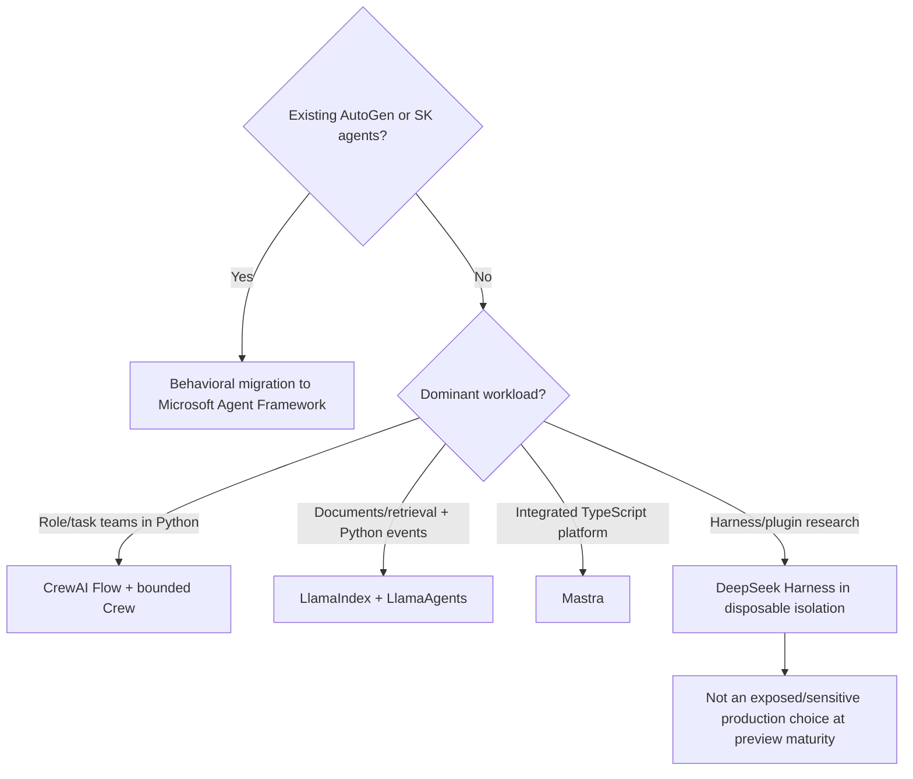
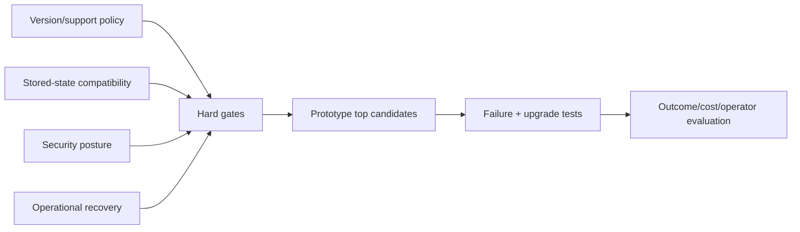

# Selecting Across Evolving Agent Framework Ecosystems

**Research date:** 2026-08-31  
**Status:** Research-backed decision guide  
**Compared:** AutoGen/Semantic Kernel migration, CrewAI, LlamaIndex/LlamaAgents, Mastra, and DeepSeek Harness

## Decision first

Lifecycle is a hard gate before feature fit:

If a hard requirement depends on an experimental or preview surface, compare the cost of building that boundary with a stable core rather than accepting the entire preview stack.

## Comparison at the correct boundary

| Dimension | AutoGen/SK migration | CrewAI | LlamaIndex/LlamaAgents | Mastra | DeepSeek Harness |
|---|---|---|---|---|---|
| Current posture | Exit/migration path | Active Python framework + managed AMP | Active data/agent ecosystem with new server stack | Active full-stack TypeScript platform | Developer preview |
| Control center | Preserve old behavior in MAF | Flow events around Crews | Workflow events around data agents | Agent/workflow/server composition | Cordis plugin tree and agent loop |
| State center | Old snapshots → MAF session/checkpoint/domain export | Flow state UUID and persistence | Workflow Context + separate Memory | Workflow snapshot + memory/storage | Append-only SessionEvent log |
| Production hosting | MAF deployment path | Self-host or AMP | WorkflowServer + adapters/CLI | Mastra server/platform + engines | Local Web/CLI; production rejected at maturity gate |
| Best fit | Existing Microsoft agent estate | Role/task collaboration inside explicit Python workflow | Document/retrieval-heavy Python workloads | Integrated TS product/platform | Harness architecture experimentation |
| Main surprise | API parity is not behavioral parity | Latest checkpoint may be mid-turn; conversational layer experimental | LlamaDeploy was replaced; durability adapter owns new semantics | Cross-package concurrency/resume/shutdown seams evolve rapidly | Plugins are code; service isolation is not security containment |

These candidates can coexist with provider SDKs, MCP/A2A/AG-UI, artifact stores, and durable workflow engines. Do not ask one framework to own every concern because it has a module with the same noun.

## Lifecycle and migration scorecard

Reject or constrain a candidate when:

- it is maintenance-only for a new long-lived system;
- preview status conflicts with data or availability requirements;
- the oldest in-flight state cannot be loaded, migrated, or pinned;
- the deployment/control plane lacks required authentication or tenant isolation;
- cancellation, replay, and ambiguous effects have no testable contract;
- no supported upgrade path exists over the maximum run/retention lifetime.

## Decision patterns

### Existing AutoGen or Semantic Kernel agents

Migrate to MAF by topology and behavior. Capture source traces and state fixtures, run MAF as a write-disabled shadow, compare termination/tool visibility/streaming/cost, and drain old in-flight runs. Retain Semantic Kernel functions/vector stores through adapters when that reduces risk.

Do not rewrite business logic merely to remove all old package references in one release.

### Python autonomous team

Use a CrewAI Flow as the process owner and embed a Crew as one bounded step. Persist typed state at intentional boundaries, use deterministic approval, and add outer stuck-run detection. Choose AMP only after evaluating its service operations and data terms separately.

Do not model a fixed business process as role-play among agents.

### Document-centric agent platform

Use LlamaIndex for ingestion/retrieval/data tools and Workflows for event-driven control. Keep Context, Memory, artifacts, and effects distinct. Adopt the current LlamaAgents server/durable stack rather than deprecated LlamaDeploy; version user workflow semantics independently from engine fingerprints.

Do not place large documents or parser output directly in workflow history.

### Full-stack TypeScript agent product

Use Mastra when its integrated agents, tools, memory, workflows, server, storage, and observability remove real integration work. Pin the whole profile and stress concurrent workflow/HITL/UI recovery. Compare the selected durable engine as its own runtime.

Do not use private workflow snapshots as a public product API.

### Composable workspace-harness experiment

Use DeepSeek Harness only in a disposable, independently sandboxed environment. Its event-sourced sessions and Cordis capability seams are worth studying, but the official maturity/security statement excludes exposed or sensitive production use. Pin/audit every plugin and protect session logs as sensitive data.

Do not equate plugin service isolation with OS/process isolation.

## Shared proof matrix

| Scenario | Evidence |
|---|---|
| Upgrade with oldest stored run | Load/migrate/pin result, explicit incompatible-state handling |
| Crash after effect commit | Stable operation ID and reconciliation; no blind replay |
| Human wait over deployment | Discoverable pending request, exact proposal, policy revalidation |
| Concurrent same-session/flow | Serialize/reject/fork behavior; no state or tenant pollution |
| Parallel child suspension | All sibling payloads/results retained and resumable |
| Provider failure in async work | Exception reaches run state; deadline prevents silent hang |
| SIGTERM/SIGKILL | Admission stops, state persists/drains, forced recovery works |
| UI reconnect/retry | Idempotent event reduction, no missing/duplicate tool parts |
| Multi-agent runaway | Finite depth, handoffs, iterations, concurrency, tokens, cost, time |
| Plugin/tool compromise | External sandbox/resource authorization limits blast radius |
| State format change | Schema version, migration diagnostics, rollback, old worker drain |

## State ownership table

| State | Correct owner |
|---|---|
| User-visible conversation | Application message/event store |
| Framework loop/checkpoint | Pinned framework runtime store |
| Business process | Domain DB or durable workflow |
| External effects | Operation ledger and target-system receipts |
| Long-term memory | Governed tenant-scoped memory service |
| Large documents/results | Artifact store with provenance/digest |
| Pending approvals | Application approval service and audit log |
| Raw framework/provider evidence | Restricted trace/artifact store |

Framework stores can implement one row in this table. They do not automatically become the authoritative owner of the others.

## Common mistakes

- Starting new work on a maintenance-mode framework because its documentation is familiar.
- Porting classes without comparing default loop and context behavior.
- Calling the latest snapshot a completed transaction.
- Treating LLM-classified feedback as authorization.
- Using a deprecated deployment repository because old tutorials rank highly.
- Inferring a durable engine guarantee from an in-process workflow example.
- Treating integrated breadth as automatic cross-package compatibility.
- Exposing a developer Web UI that can execute shell/tools.
- Letting model-controlled plugins, memory, or runtime context alter policy.
- Generalizing vendor customer metrics instead of replaying local workload traces.

## Adoption checklist

- [ ] Lifecycle/support posture fits the expected system lifetime.
- [ ] Exact package, language, adapter, storage, engine, and host profile is pinned.
- [ ] Migration/replacement history and deprecated tutorials are identified.
- [ ] Conversation, workflow, memory, artifact, approval, and effect owners are separate.
- [ ] Replay semantics state which code/model/tools can repeat.
- [ ] Oldest persisted state survives an upgrade drill.
- [ ] Concurrent, nested, suspended, cancelled, and shutdown cases pass.
- [ ] External sandbox and resource authorization enforce real authority.
- [ ] Managed-hosting behavior is not attributed to the open-source library.
- [ ] Candidate beats a thin loop or deterministic workflow on repeated outcome/cost/operator evidence.

## Related guides and sources

- [AutoGen and Semantic Kernel migration](../frameworks/autogen-and-semantic-kernel-migration.md)
- [CrewAI](../frameworks/crewai.md)
- [LlamaIndex and LlamaAgents](../frameworks/llamaindex-and-llamaagents.md)
- [Mastra](../frameworks/mastra.md)
- [DeepSeek Harness](../frameworks/deepseek-harness.md)
- [Microsoft Agent Framework](../frameworks/microsoft-agent-framework.md)
- [Independent framework comparison](independent-agent-frameworks.md)
- [Research packet and source mapping](../research/packets/framework-lifecycle-and-second-wave.md)
