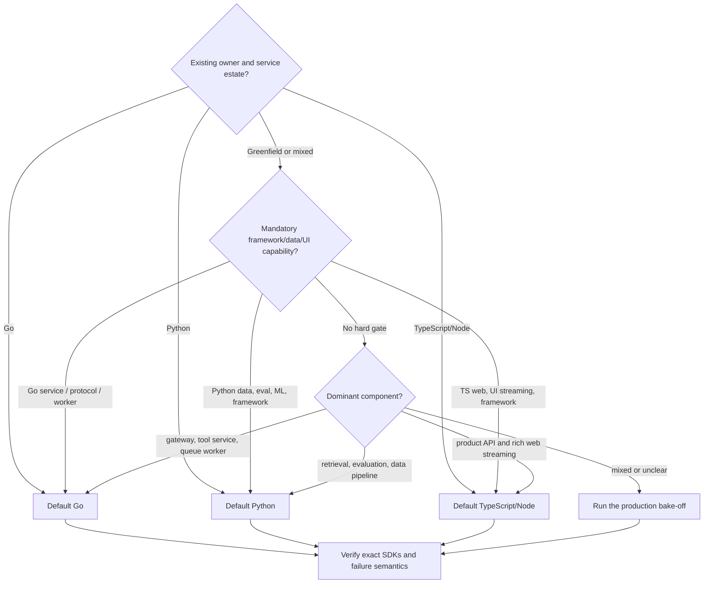
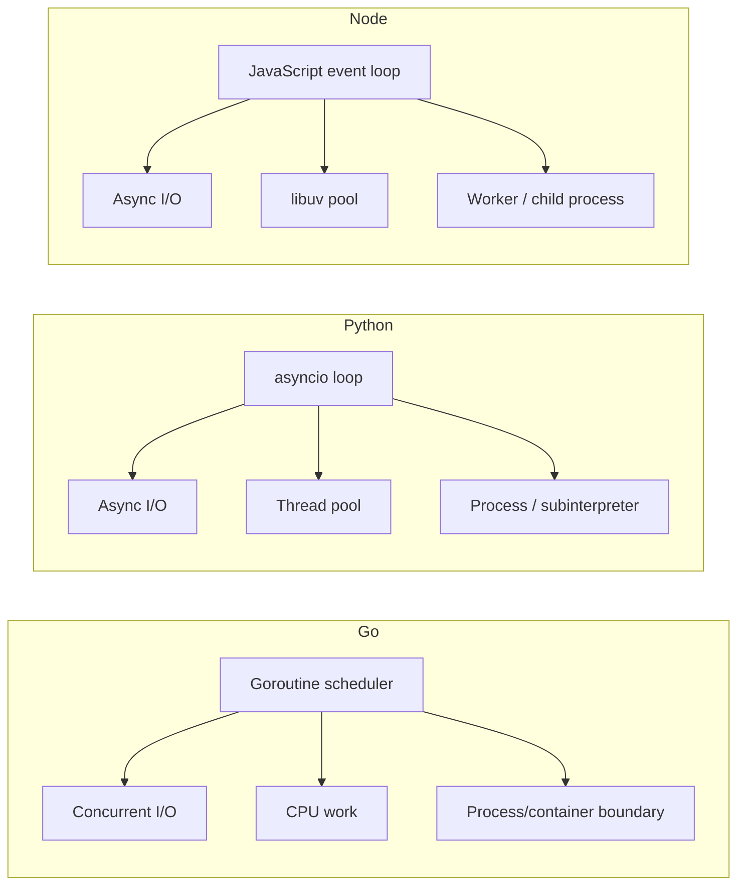
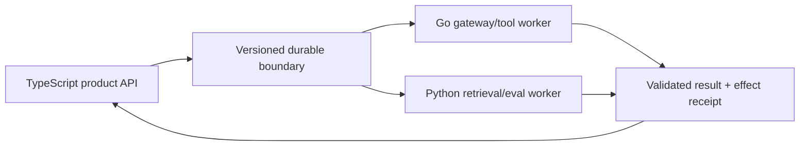

# Go vs Python vs TypeScript/Node.js for Agent Runtimes

> **Status:** Research-backed decision guide  
> **Last researched:** 2026-08-31  
> **Scope:** Selecting Go, Python, or TypeScript/Node.js for agent APIs, controllers, gateways, workers, tools, streams, and durable activities.  
> **Evidence:** [Go runtime packet](../research/packets/go-agent-runtimes.md) and [Python/TypeScript runtime packet](../research/packets/python-and-typescript-agent-runtimes.md)

Default to the language the owning production team already operates. Override that default only for a mandatory capability, a clear component boundary, or measured workload evidence. All three runtimes can build production agents; none turns cooperative cancellation into rollback, static types into runtime trust, or an in-process tool into a sandbox.

## Fast decision



If two options score closely, team operability wins. A new language boundary must earn its deployment, schema, trace, cancellation, retry, release, and incident cost.

## Current baseline

| Runtime | Production baseline on 2026-08-31 | Important caveat |
|---|---|---|
| Go | 1.27.0 stable | Framework maturity varies: ADK Go 2.0 is GA, Genkit Agents is Beta, Microsoft Agent Framework Go is preview, and OpenAI's official Go package is a base API client rather than its Agents SDK. |
| Python | CPython 3.14.7 stable; 3.15 prerelease | Free-threaded 3.14 is supported but optional, and native dependency readiness remains separate. |
| Node.js | 24.20.0 LTS; 26.8.1 Current | Production should normally use an LTS line; edge/serverless runtimes are not equivalent to full Node. |

Pin the exact toolchain, SDKs, framework packages, deployment target, and durable engine used in a comparison. Runtime labels alone are not reproducible evidence.

## Decision matrix

| Criterion | Go | Python | TypeScript/Node.js | Decision implication |
|---|---|---|---|---|
| Existing service ownership | Strong in Go estates and infrastructure/platform teams | Strong in data, ML, backend, and research teams | Strong in web/product/full-stack teams | Existing on-call capability is the highest-value default. |
| Agent ecosystem | Growing; ADK, Genkit, MAF preview, base provider SDKs | Broadest Python-led framework/data/eval surface | Broad web/product agent and UI integration surface | Gate on exact required feature, not package count. |
| I/O concurrency | Goroutines and blocking-style APIs; explicit ownership needed | `asyncio`; synchronous calls can block loop | Event loop; CPU/sync callbacks can stall all requests | All require admission and downstream bounds. |
| Structured ownership | `errgroup` and application conventions | Standard `TaskGroup` and AnyIO scopes | Primarily application/framework convention | None prevents detached work automatically. |
| Cancellation | `context.Context`, cooperative | Task cancellation at await points, cooperative | `AbortSignal`, cooperative | Test every library and fence late effects. |
| CPU work | Goroutines run in parallel; still bound CPU and memory | Process/subinterpreter/native/free-threaded choices | Worker threads, child processes, external workers | Remote model latency often dominates; isolate hostile work in all three. |
| Runtime validation | Go structs plus explicit decoder/schema/domain validation | Pydantic and alternatives; coercion policy matters | Zod/JSON Schema alternatives; TS types erased | Static types never authorize model/tool data. |
| Streaming | Channels, `io`, HTTP; byte budgets are application policy | Async iterators/queues; bounds are application policy | Mature Node/Web stream backpressure primitives | Node has ergonomic strengths; correctness is not automatic. |
| Memory/deployment | Compact service footprint; container-aware runtime controls | Worker/process multiplicity and native dependencies can increase footprint | Efficient I/O process; workers and large dependency graphs add cost | Measure real prompts, pools, and concurrent streams. |
| Data/evaluation | Capable, fewer Python-native scientific tools | Usually strongest ecosystem fit | Capable product analytics and web testing | Evaluation can be a separate Python component. |
| Web/UI integration | Separate contracts normally | Separate contracts normally | Shared language and streaming/UI libraries can reduce product friction | Shared language does not remove wire validation. |
| Durable runtime | Temporal, Restate, DBOS, Dapr Workflow | Temporal, Restate, DBOS, Prefect, Dapr and adapters | Temporal, Restate, DBOS and framework integrations | Choose engine and replay model first, then best-owned SDK. |
| MCP | Official Tier 1 Go SDK | Official Tier 1 Python SDK | Official Tier 1 TypeScript SDK | Protocol parity still needs auth, transport, and conformance tests. |
| Observability | OTel traces/metrics stable; logs Beta; strong pprof/trace/race tooling | OTel traces/metrics stable; logs Development; async/process diagnostics | OTel traces/metrics stable; logs Development; event-loop diagnostics | Go has excellent runtime tooling; all need agent-level causality. |
| Supply chain | Modules/checksum DB/govulncheck; cgo and generators need policy | Wheels/source/native builds, lock/hash policy | Large npm graphs, scripts, lock/provenance policy | Compare the actual dependency graph and build path. |

## The concurrency distinction



Go can execute CPU work across runtime threads without moving it to a separate language-level worker construct. That is useful, but it can also let CPU-heavy tools contend directly with HTTP handlers, GC, and cancellation work. Bound them by resource class.

Python and Node make event-loop blocking especially visible. Python can move blocking work to threads or CPU work to processes/subinterpreters; Node can use worker threads or child processes. Cancellation of the waiting task does not automatically stop those workers.

The shared invariant is more important than the mechanism: every child has an owner, every scarce resource has a limit, every cancellation reaches a consumer, and every late result is fenced.

## Framework availability without category confusion

| Capability | Go | Python | TypeScript/Node.js |
|---|---|---|---|
| OpenAI base API | Official Go client | Official Python client | Official JS/TS client |
| OpenAI Agents SDK | Not an official Go surface | Official | Official |
| Google ADK | Go 2.0 GA | Python 2.0 GA | Available; verify exact parity |
| Genkit | Stable Go core; Agents API Beta | Available | Stable ecosystem; verify API channel |
| Microsoft Agent Framework | Public preview with missing checked features | Available with package-level maturity differences | Available with package-level maturity differences |
| MCP | Official Tier 1 SDK | Official Tier 1 SDK | Official Tier 1 SDK |

“The provider has a Go SDK” may mean only HTTP models. “The framework supports Go” may mean a preview surface. “The MCP SDK supports the current revision” does not mean its OAuth, cancellation, or transport behavior fits the deployment.

Build a capability matrix against pinned versions:

- model and streaming APIs;
- tool-call and structured-output fidelity;
- session/checkpoint concurrency;
- approvals and resume;
- cancellation and deadlines;
- provider adapters;
- MCP client/server/auth;
- tracing and usage;
- deployment and shutdown;
- security advisories and upgrade policy.

## Component-first defaults

| Component | Practical default when there is no stronger existing owner |
|---|---|
| Agent gateway/model proxy/MCP adapter | Go for a small, bounded service; TypeScript if tightly coupled to a web product |
| Interactive web product controller | TypeScript/Node.js |
| Data/retrieval/evaluation-heavy controller | Python |
| High-concurrency tool/API service | Go |
| Python-native ML or scientific tool | Python behind a validated service/activity boundary |
| Browser/edge UI transport | TypeScript; keep long-running agent work in a full service/durable worker |
| Durable workflow controller | The best-owned, fully featured SDK for the chosen engine |
| Hostile code/browser/shell worker | Separate sandbox service/container; implementation language is secondary |

These are starting points, not universal winners.

## Cancellation and effects

| Scenario | Go | Python | TypeScript/Node.js |
|---|---|---|---|
| Caller cancels model request | Context must reach client/transport and body reader | Task cancellation must propagate and be re-raised after cleanup | Abort signal must reach client/stream |
| Parallel sibling fails | Group cancels context if constructed for it | `TaskGroup` cancels/drains siblings | Owning abstraction aborts/settles promises |
| Blocking/CPU tool | Code must poll context or run in killable boundary | Thread may continue; process can be terminated explicitly | Loop may stall; worker/process has separate termination |
| External write committed | Reconcile by effect ID | Same | Same |
| Detached cleanup | Separately bounded `WithoutCancel` context | Separately owned shield/task scope | Separate signal/owner |

Do not score a language as “supports cancellation” from the primitive alone. Run the exact provider, framework, database, subprocess, stream, and durable path under cancellation.

## Type and schema boundaries

Go types exist at runtime, Python annotations often drive validators, and TypeScript types are erased. None establishes trust by itself.

For all three:

- cap bytes and collection sizes;
- reject duplicates/unknown fields according to version policy;
- validate shape plus domain semantics;
- preserve absent/null/default distinctions;
- authorize at the effect boundary;
- version durable and cross-language payloads;
- test generated JSON Schema against the exact provider;
- validate tool results and model outputs;
- retain adversarial and cross-language golden fixtures.

Go 1.27 `encoding/json/v2` has stricter defaults but still requires an explicit unknown-member policy. Python validator coercion and TypeScript transforms also require explicit review.

## Performance and cost

Do not benchmark an empty local loop and extrapolate to an agent:

```text
end-to-end =
  admission + context/retrieval + model + tools + retries +
  validation + streaming/drain + persistence + recovery
```

Go can reduce service footprint, validation/serialization cost, and scheduler overhead for some workloads. Python can reduce engineering cost when the required data/eval ecosystem is native. TypeScript can reduce product integration cost across API and UI. Those are all real costs.

Measure:

- p50/p95/p99 first-progress, first-token, and final latency;
- queue and semaphore wait by resource;
- memory/RSS per ready worker and active long-context run;
- scheduler/event-loop delay and CPU throttling;
- stream bytes and slow-consumer behavior;
- connection reuse and file descriptors;
- cancellation-to-cleanup latency;
- crash recovery and duplicate-effect rate;
- cold start and artifact/image size;
- engineer time to implement, diagnose, upgrade, and roll back.

Compare cost per successful, policy-compliant task rather than raw requests per second.

## When a polyglot system earns its cost



A split is justified when:

- one component requires a language-specific library or framework;
- Go isolates a protocol gateway or high-concurrency tool service from a Python/TS controller;
- Python data/evaluation work materially benefits from native libraries;
- TypeScript owns the web/UI contract;
- independent scaling, trust, or blast-radius ownership is valuable;
- measurements show a meaningful footprint or latency improvement.

Each boundary must carry:

- run/turn/tool/effect and trace IDs;
- tenant/principal and authorization context;
- deadline and cancellation state;
- schema and release versions;
- retry owner and idempotency key;
- data handling/redaction policy;
- result provenance and effect receipt.

Prefer one controller. Duplicating the agent state machine in multiple languages creates divergent retry, approval, and recovery behavior.

## Production bake-off

Build one vertical slice per serious candidate:

1. accept an interactive request and stream versioned events;
2. call the same provider through the intended SDK;
3. run two bounded read tools in parallel;
4. validate and approve one idempotent write;
5. persist a checkpoint in the intended storage or durable engine;
6. disconnect a slow client and cancel mid-model and mid-tool;
7. crash after the write commits but before the result is recorded;
8. restart, reconcile, and complete without duplicate effect;
9. diagnose every staged fault from telemetry and profiles;
10. build the artifact reproducibly and run dependency/security gates.

### Scorecard

| Category | Weight guidance | Evidence |
|---|---:|---|
| Correctness and recovery | Highest | Failure-injection and effect-reconciliation pass rate |
| Team operability | Highest | Diagnosis, deploy, patch, rollback, and on-call confidence |
| Mandatory capability | Gate | Exact SDK/framework/runtime feature tests |
| Security and schema | High | Adversarial fixtures and containment review |
| Cancellation/shutdown | High | Terminal-state, cleanup, and leak evidence |
| Load and resource bounds | High | Tail latency, memory, queue/pool occupancy |
| Upgrade stability | High | State/schema/replay/SDK compatibility tests |
| Developer experience | Medium | Change lead time and testability |
| Syntax or benchmark aesthetics | Low | Consider only after production gates pass |

## Decision table

| Situation | Default choice |
|---|---|
| Existing Go service and on-call team owns the domain | Go |
| Existing Python production service owns the domain | Python |
| Existing Node/TypeScript product service owns the domain | TypeScript/Node.js |
| Greenfield protocol gateway, model proxy, MCP service, or bounded worker | Go |
| Greenfield data/evaluation/retrieval-heavy system | Python |
| Greenfield web product with rich streaming UI | TypeScript/Node.js |
| OpenAI Agents SDK is mandatory | Python or TypeScript, not Go |
| ADK Go or a verified Go-native framework meets every requirement | Go is a serious controller candidate |
| Long-running, side-effecting workflow | Choose durable engine first, then best-owned SDK |
| CPU-heavy trusted local computation | Go may simplify parallelism; still isolate/bound by resource |
| Model-generated or hostile code | Separate sandbox boundary in any language |
| No decisive evidence | Existing team language |

## Release decision checklist

- [ ] The component and production owner are explicit.
- [ ] Exact stable/LTS toolchain and every critical SDK/version are pinned.
- [ ] Required provider, framework, MCP, and durable features pass parity tests.
- [ ] Concurrency, pools, buffers, subprocesses, memory, and tenants are bounded.
- [ ] Cancellation reaches every layer and late results cannot advance state.
- [ ] Effects have IDs, receipts, and ambiguous-outcome reconciliation.
- [ ] Runtime validation and authorization cover every untrusted boundary.
- [ ] Streaming remains bounded under slow consumers and disconnect.
- [ ] Shutdown, crash, replay, upgrade, and rollback pass failure injection.
- [ ] Runtime-health and agent telemetry reconstruct incidents.
- [ ] Dependency integrity, vulnerability, SBOM, and provenance controls pass.
- [ ] Every additional language boundary has a named, measured justification.
- [ ] The owning team accepts the on-call and upgrade burden.

## Related guides

- [Go agent runtimes](../languages/go-agent-runtimes.md)
- [Python agent runtimes](../languages/python-agent-runtimes.md)
- [TypeScript and Node.js agent runtimes](../languages/typescript-node-agent-runtimes.md)
- [Python vs TypeScript/Node.js](python-vs-typescript-node-agent-runtimes.md)
- [Choosing an agent runtime language](../languages/choosing-an-agent-runtime-language.md)
- [Custom loop vs framework vs workflow engine](custom-loop-vs-framework-vs-workflow-engine.md)
- [Durable runtime selection](durable-agent-workflow-runtimes.md)

## Selected sources

- [Go 1.27 release notes](https://go.dev/doc/go1.27)
- [Go context](https://pkg.go.dev/context)
- [Go diagnostics](https://go.dev/doc/diagnostics)
- [OpenAI Go API library](https://github.com/openai/openai-go)
- [OpenAI Agents SDK languages](https://developers.openai.com/api/docs/guides/agents)
- [Google ADK Go](https://adk.dev/get-started/go/)
- [Genkit Go 1.0](https://genkit.dev/blog/announcing-genkit-go-1-0/)
- [Microsoft Agent Framework Go](https://learn.microsoft.com/en-us/agent-framework/get-started/)
- [MCP 2026-07-28 release](https://blog.modelcontextprotocol.io/posts/2026-07-28/)
- [OpenTelemetry Go](https://opentelemetry.io/docs/languages/go/)
- [Python version status](https://devguide.python.org/versions/)
- [Python asyncio](https://docs.python.org/3.14/library/asyncio-task.html)
- [Node release status](https://nodejs.org/en/about/previous-releases)
- [Node event-loop guidance](https://nodejs.org/en/learn/asynchronous-work/dont-block-the-event-loop)
