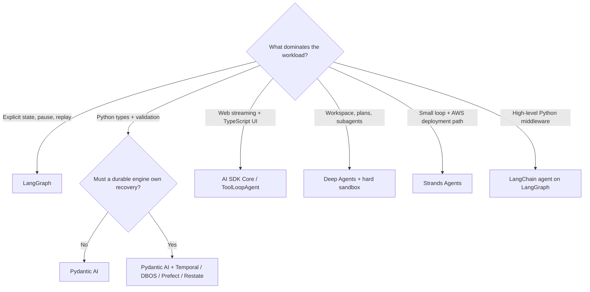
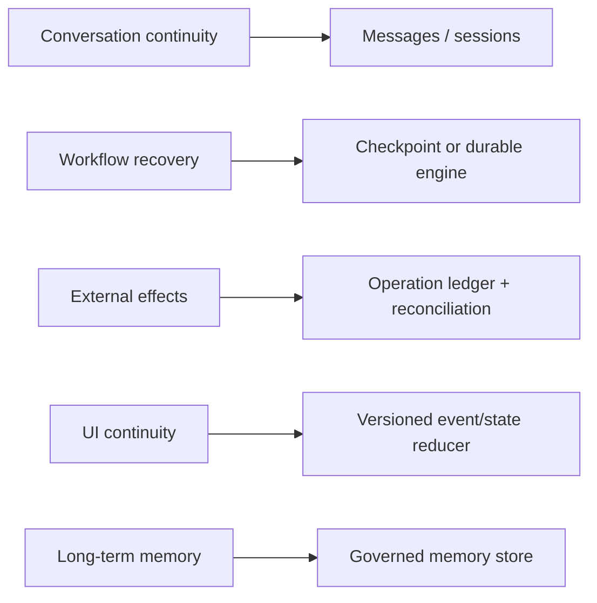
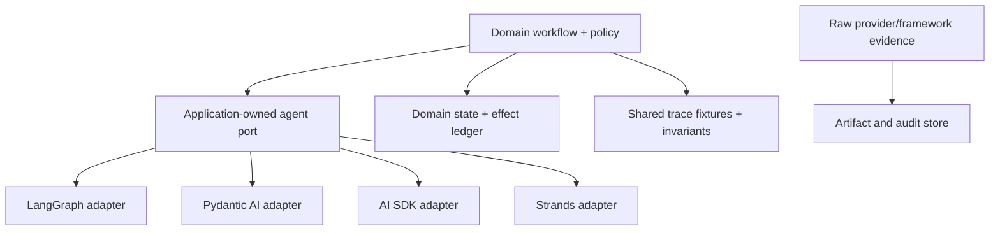

# Selecting an Independent Agent Framework

**Research date:** 2026-08-31  
**Status:** Research-backed decision guide  
**Compared:** LangChain, LangGraph, Deep Agents, Pydantic AI, Vercel AI SDK, and Strands Agents

## Decision first

Choose the execution shape before choosing the ecosystem:

This produces a shortlist. Adopt only after the exact language, package set, persistence backend, provider adapter, and deployment mode survive workload-specific failure tests.

## Compare equivalent layers

The names overlap, but the products do not occupy the same layer.

| Candidate | Actual abstraction | Natural fit | Main hidden obligation |
|---|---|---|---|
| LangChain agents | High-level model/tool agent and middleware on LangGraph | Fast Python agent assembly with middleware and broad integrations | Understand the graph, checkpoint, and middleware behavior beneath the convenience API |
| LangGraph | Stateful graph/functional runtime with superstep checkpoints | Explicit workflows, interrupts, replay, forks, and subgraphs | Make every re-executed node and external effect safe |
| Deep Agents | Opinionated planning/filesystem/subagent harness | Research, coding, and long-horizon workspace work | Enforce permissions in the backend/sandbox and govern writable memory |
| Pydantic AI | Typed Python agent, dependency injection, validation, and tool/result control flow | Python services that value schema precision and explicit failure handling | Bound layered retries and prove the selected durable integration |
| AI SDK | TypeScript generation/streaming/tool/agent and UI protocol stack | Full-stack web agents and provider experimentation | Test provider-specific semantics and repair UI state across retries/resume |
| Strands Agents | Lightweight model-driven loop plus hooks, sessions, Graph/Swarm | Provider-flexible Python/TypeScript agents, especially in AWS estates | Replace cooperative/local defaults with explicit durable, bounded operations |

Do not compare LangGraph checkpoints to Pydantic validation or AI SDK UI streams. A production system may legitimately combine a UI protocol, agent loop, durable engine, and sandbox.

## State and recovery are the decisive differences

No framework collapses these into one safe store:

- **LangGraph** checkpoints state per thread and retains successful pending writes in a failed superstep. An interrupted node starts again from its beginning when resumed. Time travel re-executes everything after the selected checkpoint.
- **Pydantic AI** can place selected model/tool operations inside Temporal, DBOS, Prefect, or Restate, but the integration defines a new serialization and retry boundary.
- **AI SDK** application/UI messages can survive the request, while the newer WorkflowAgent durability surface is a separate, beta-line concern at this research date.
- **Strands sessions** restore messages and agent state; they do not establish whether an ambiguous external write committed.
- **Deep Agents memory/filesystem backends** improve continuity and context offload; they do not replace a business-state ledger or workspace snapshot policy.

For every candidate, document five owners: conversation, workflow, memory, artifacts, and external effects.

## Decision patterns

### Explicit, inspectable workflow

Start with LangGraph when the topology, state reducers, interrupts, branching, subgraphs, replay, or operator inspection are central. Prefer LangChain's `create_agent` when its model/tool middleware removes meaningful boilerplate and the hidden graph remains understandable. Add Agent Server only after separately evaluating its queue, lease, PostgreSQL, Redis, retention, and scaling behavior.

Isolate external effects into idempotent tasks or effect-ledger operations. Never put a non-idempotent write before an interrupt and assume it runs once.

### Typed Python service

Start with Pydantic AI when Python type checking, dependency injection, structured results, schema validation, and precise tool failure paths are the main benefits. Select retry ownership per layer; an `N` tool retry budget means `N+1` attempts and is independent from transport, fallback, output, and hook retries.

If a run must survive process loss or long waits, prototype one official durable integration using the oldest checkpoint you expect to keep alive. Do not infer that the integration maps every model-visible validation failure correctly.

### TypeScript web product

Start with AI SDK Core and `ToolLoopAgent` when streaming UI, typed local tools, React/server integration, and provider experimentation dominate. Keep the default step bound only as a starting point; add wall-clock, token, cost, tool, and concurrency budgets. Treat UI parts as a replicated state machine: every tool call needs a stable identity and a valid progression through pending, approval, result, error, cancellation, invalidation, and retry.

Adopt `WorkflowAgent` only if its beta support posture and end-to-end recovery tests fit the release policy.

### Autonomous workspace harness

Start with Deep Agents when planning, context offload, files, shell/sandbox work, and delegated subagents are requirements rather than optional features. Apply least privilege in the sandbox or backend. Built-in filesystem middleware is useful defense in depth, but first-match/default-allow rules and subagent policy replacement make it unsuitable as the only boundary.

Separate immutable human instructions from agent-writable memory. Add ownership, quotas, optimistic concurrency, review, and rollback.

### Lightweight loop with AWS alignment

Start with Strands when a compact Python/TypeScript loop, hooks, provider adapters, MCP, OpenTelemetry, and an optional AgentCore deployment path align with the platform. Select sequential tool execution for dependent writes; otherwise explicitly bound concurrent execution. Prove cancellation at every downstream client because non-cooperative tools and remote MCP calls may continue.

Evaluate Graph and Swarm per language. Defaults and lifecycle states are not guaranteed to match between Python and TypeScript.

## Portability without lowest-common-denominator design

Normalize business semantics: tenant/run identity, tool contracts, authorization decisions, operation IDs, effect receipts, artifact provenance, resource use, completion state, and evaluation outcomes. Preserve raw provider messages, reasoning/tool parts, stream events, checkpoints, and diagnostics by reference. A universal transcript often discards useful evidence while retaining accidental lock-in.

## Proof-oriented bake-off

Prototype the two strongest candidates with recorded model responses first, then repeat the boundary tests against real providers.

| Test | Evidence required |
|---|---|
| Process crash during model stream | Restored state, duplicate-input behavior, provider request evidence |
| Parallel tool sibling fails | Which successful results persist and which work reruns |
| Pause for approval then deploy | Exact resumable state, expiry, rejection, and policy revalidation |
| External write returns timeout | Operation ID, reconciliation path, and no blind retry |
| Cancellation during sync/async/remote tool | Downstream cancellation, late completion, commit suppression |
| Retry after partial UI stream | No duplicate, orphan, or stale tool parts |
| Provider swap | Lost capabilities, changed schemas, usage gaps, raw diagnostics |
| Concurrent same-session runs | Queue/reject/fork behavior and consistent state |
| Persisted-state upgrade | Oldest supported checkpoint/session can migrate or is pinned |
| Malicious memory/file/tool result | Authorization and containment hold despite model instructions |
| Runaway topology | Step, depth, handoff, concurrency, wall-time, token, and cost limits |

Score repeated workload traces on outcome quality, invariant violations, p95/p99 latency, cost, operator effort, repairability, and upgrade risk—not demo brevity.

## Common selection errors

- Calling a session, transcript, or checkpoint “exactly-once durable execution.”
- Treating provider adapters as behavioral parity.
- Selecting an abstraction without its production persistence/deployment product.
- Letting framework state become the sole business record.
- Assuming an abort signal can undo a committed write or kill a synchronous thread.
- Assuming tool-level path rules equal sandbox containment.
- Enabling multi-agent orchestration before a single-agent baseline proves a measurable benefit.
- Leaving steps, graph depth, handoffs, parallelism, or nested orchestrator timeouts unbounded.
- Upgrading packages without replaying the oldest live state and UI event stream.
- Generalizing vendor case-study outcomes to a different workload.

## Adoption checklist

- [ ] Candidate category matches the dominant workload rather than ecosystem popularity.
- [ ] Exact language, version, provider adapter, persistence backend, and deployment mode are pinned.
- [ ] Conversation, workflow, memory, artifact, UI, and effect owners are explicit.
- [ ] Resume semantics state exactly what code and model/tool work can repeat.
- [ ] External writes use operation identities, receipts, and reconciliation.
- [ ] Retry budgets compose under one run-wide deadline/token/cost ceiling.
- [ ] Cancellation and late-result behavior are tested for every tool class.
- [ ] Permissions are enforced at the resource and sandbox/backend boundary.
- [ ] Multi-agent limits are finite and propagated to nested work.
- [ ] Trace and persisted-state schemas have retention, redaction, migration, and rollback plans.
- [ ] A repeated failure-injection bake-off beats the thin custom-loop baseline.

## Related guides and sources

- [LangChain, LangGraph, and Deep Agents](../frameworks/langchain-langgraph-and-deep-agents.md)
- [Pydantic AI](../frameworks/pydantic-ai.md)
- [Vercel AI SDK](../frameworks/vercel-ai-sdk.md)
- [Strands Agents](../frameworks/strands-agents.md)
- [Provider-native framework comparison](provider-native-agent-frameworks.md)
- [Evolving agent framework ecosystems](evolving-agent-framework-ecosystems.md)
- [Custom loop vs framework vs workflow engine](custom-loop-vs-framework-vs-workflow-engine.md)
- [Research packet and source mapping](../research/packets/independent-agent-frameworks.md)
