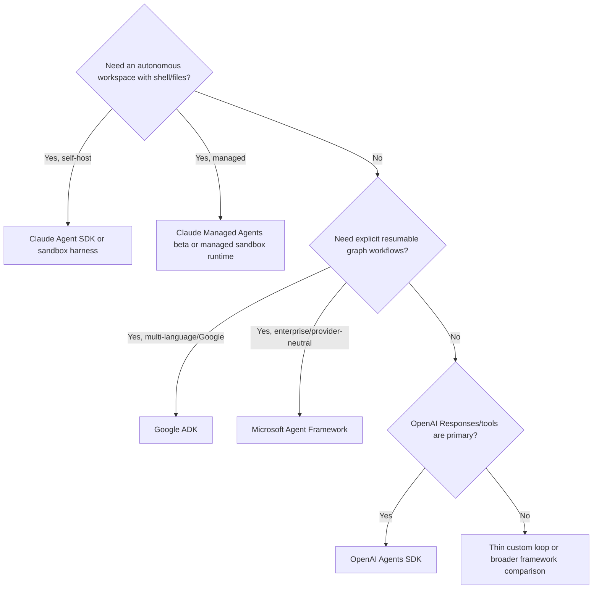
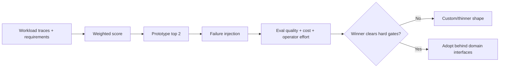
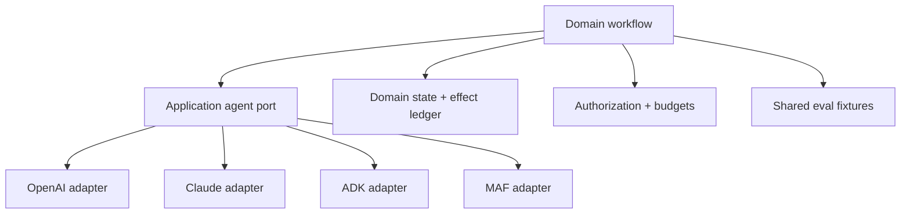

# Selecting a Provider-Native Agent Framework

**Research date:** 2026-08-30  
**Status:** Research-backed decision guide  
**Compared:** OpenAI Agents SDK, Claude Agent SDK, Claude Managed Agents, Google ADK, and Microsoft Agent Framework

## Decision first

Choose the runtime shape before the vendor:

Then prove the exact implementation. The diagram produces a shortlist, not an adoption decision.

## Comparison at the right abstraction

| Dimension | OpenAI Agents SDK | Claude Agent SDK | Claude Managed Agents | Google ADK | Microsoft Agent Framework |
|---|---|---|---|---|---|
| Core shape | In-process runner | Local process/workspace harness | Managed stateful harness service | Event/session toolkit + graph runtime | Agent pipeline + superstep workflow runtime |
| Best native fit | OpenAI Responses, hosted tools, handoffs | Filesystem/shell/skills/subagent work | Long-horizon Claude work without operating loop/sandbox fleet | Google platform and polyglot stateful agents/workflows | Microsoft estate, provider abstraction, explicit workflows |
| Primary languages | Python, TypeScript | Python, TypeScript | Broad API client SDKs | Python, TypeScript, Go, Java, Kotlin | C#, Python, Go |
| Conversation state | Client sessions or OpenAI continuation | Local transcript; optional external mirror | Server-side event/session state | Session events + scoped state + memory services | Agent sessions/context providers |
| Workflow resume | Serializable interrupted state plus external durable integrations | Transcript resume; live approval recovery needs application work | Service-owned pause/steer/resume | Event replay and invocation rehydration | End-of-superstep checkpoints and pending requests |
| Tool execution | Local, hosted, built-in, MCP | Built-in local tools, custom tools, MCP | Sandbox built-ins; client custom tools | Function, ecosystem, MCP/A2A, subagents | Function/provider/MCP/remote agents |
| Policy extension | Guardrails and hooks | Ordered permissions and hooks | Permission policies + service controls | Runner plugins and callbacks | Layered middleware and requests |
| Telemetry | Built-in tracing; custom processors | OTel through hosted subprocess | Service events/spans | OTel/logs/plugins | OTel/middleware/workflow events |
| Main lock-in | Responses item/tool/session semantics | Claude Code harness behavior and workspace conventions | Stateful service/event/sandbox contract | ADK event/service and graph semantics | Package/provider/workflow/checkpoint contracts |
| Main operational surprise | A session or interruption is not a durable business process | Each active agent is a subprocess with local state | Managed state changes compliance and retention posture | Event replay and feature parity are version/language specific | Stability varies across a large package and adapter matrix |

## Weight the decision by failure cost

A framework fit score should not be a feature count.

Suggested weights are workload-specific, but hard gates usually include:

- data residency and retention;
- exact language and deployment compatibility;
- authorization/identity integration;
- crash and human-wait recovery;
- effect reconciliation;
- cancellation and tenant isolation;
- telemetry export and deletion;
- version support over maximum run lifetime.

Quality, latency, cost, and developer effort follow only after hard gates pass.

## Decision patterns

### Pattern 1 — Interactive OpenAI-first product

Start with OpenAI Agents SDK if handoffs, hosted tools, structured outputs, approval interruptions, and trace integration remove real custom loop work. Keep an application-owned session identifier, domain transcript, authorization service, and effect ledger. Add a durable workflow only to the paths that outlive request workers.

Do not adopt a graph runtime solely because a future workflow might be complex.

### Pattern 2 — Autonomous coding or workspace worker

Compare Claude Agent SDK with sandbox/harness alternatives, not just in-process SDKs. Model subprocess density, workspace restoration, egress, credentials, compaction, and artifact persistence. If those operations are undifferentiated and the beta/data terms fit, compare Claude Managed Agents as a separate buy-vs-build decision.

Do not treat a session transcript as a workspace snapshot.

### Pattern 3 — Stateful polyglot agent platform

ADK is attractive when session, state, memory, artifact, plugin, and graph concepts map onto a shared platform and several runtime languages matter. Require a per-language capability matrix and cross-version event replay suite. Serialize same-session writes unless a storage service provides an explicit semantic merge contract.

Do not choose broad language availability if only one immature language surface contains a hard requirement.

### Pattern 4 — Enterprise workflow and Microsoft integration

Microsoft Agent Framework is attractive where `IChatClient`/provider clients, middleware, checkpointed workflows, Foundry, and .NET/Python/Go fit established architecture. Pin the complete package set and inspect maturity per extension. Checkpoint and restore nested approvals, handoffs, and the exact UI/protocol adapter.

Do not treat “provider-neutral” as “provider-equivalent.”

### Pattern 5 — Long-lived business process

If days-long waits, compensation, schedules, and external writes dominate, let a durable workflow engine own the business process. Invoke the chosen agent SDK inside bounded activities and persist model/tool artifacts by reference. This is a composition, not a framework failure.

## The portability envelope

Aim for portable business semantics, not identical framework events.

Keep these above the adapter:

- task/run/tenant identities;
- domain state and completion contract;
- tool schema and error taxonomy;
- operation IDs and effect receipts;
- resource authorization;
- artifact references and provenance;
- normalized usage/latency records;
- outcome and invariant-based evaluations.

Let these remain adapter-specific where necessary:

- raw provider messages and reasoning items;
- hosted tool events;
- framework checkpoints and trace payloads;
- session continuation tokens;
- streaming delta shapes;
- sandbox and subagent controls.

Serializing one provider’s transcript into a “universal” schema often loses information while preserving lock-in. Preserve raw evidence by reference and normalize only what the domain consumes.

## Proof-oriented bake-off

Implement the smallest representative slice in the two strongest candidates. Use recorded providers where possible, then confirm the real integration boundary.

| Scenario | Evidence to compare |
|---|---|
| Normal success | Final state, trajectory, tokens, cost, latency |
| Malformed tool arguments | Repair attempts, validation location, transcript integrity |
| Tool timeout | Cancellation propagation, retry ownership, final state |
| Ambiguous write | Effect ledger and reconciliation; no duplicate |
| Human approval | Exact pause state, expiry, restart, rejection, resume |
| Concurrent user turn | Queue/reject/fork behavior and state isolation |
| Crash/redeploy | Restore point, lost work, orphan process/tool, operator action |
| Context growth | Compaction latency, information loss, cache behavior |
| Version upgrade | Old state/checkpoint replay and migration diagnostics |
| Provider swap | Capability loss, message/tool translation, eval regression |
| Tenant attack | Workspace/state/credential/telemetry isolation |
| Observability outage | Whether agent work continues, blocks, or loses audit evidence |

Repeat stochastic scenarios. Evaluate outcome, state, and invariants rather than requiring one exact model trajectory.

## Common mistakes

- Selecting by sample brevity or marketing checklist.
- Comparing a managed service to a library without pricing operations and retention.
- Treating in-memory state as a production default.
- Calling transcript resume “durable execution.”
- Assuming approval survives process loss or authorizes a later changed action.
- Assuming “allowed tools” always means tools unavailable unless listed.
- Assuming framework middleware covers hosted, nested, remote, and local tools identically.
- Updating a framework without replaying persisted state from the oldest live run.
- Letting provider-specific messages become the authoritative business record.
- Building a multi-agent topology before a single-agent baseline shows a measurable need.

## Selection checklist

- [ ] Workload shape and maximum run lifetime are known.
- [ ] Runtime category—not just vendor—is selected intentionally.
- [ ] Exact language, version, adapter, and hosting capability profile is recorded.
- [ ] Conversation, workflow, memory, artifact, and effect state have separate owners.
- [ ] Pause/resume and crash recovery were demonstrated through the production store.
- [ ] Cancellation prevents late commits or marks them for reconciliation.
- [ ] Tool permissions and resource authorization are separately enforced.
- [ ] Trace, session, checkpoint, prompt, and artifact retention satisfy policy.
- [ ] The runner remains bounded by deadlines, attempts, tokens, cost, and concurrency.
- [ ] Upgrade and exit paths exist for the oldest in-flight state.
- [ ] The selected framework wins on repeated workload evaluations and operator effort.

## Related guides and sources

- [OpenAI Agents SDK](../frameworks/openai-agents-sdk.md)
- [Claude Agent SDK and Managed Agents](../frameworks/claude-agent-sdk-and-managed-agents.md)
- [Google ADK](../frameworks/google-adk.md)
- [Microsoft Agent Framework](../frameworks/microsoft-agent-framework.md)
- [Custom loop vs framework vs workflow engine](custom-loop-vs-framework-vs-workflow-engine.md)
- [Independent agent framework comparison](independent-agent-frameworks.md)
- [Choosing an agent runtime language](../languages/choosing-an-agent-runtime-language.md)
- [Research packet and source mapping](../research/packets/provider-native-agent-frameworks.md)
