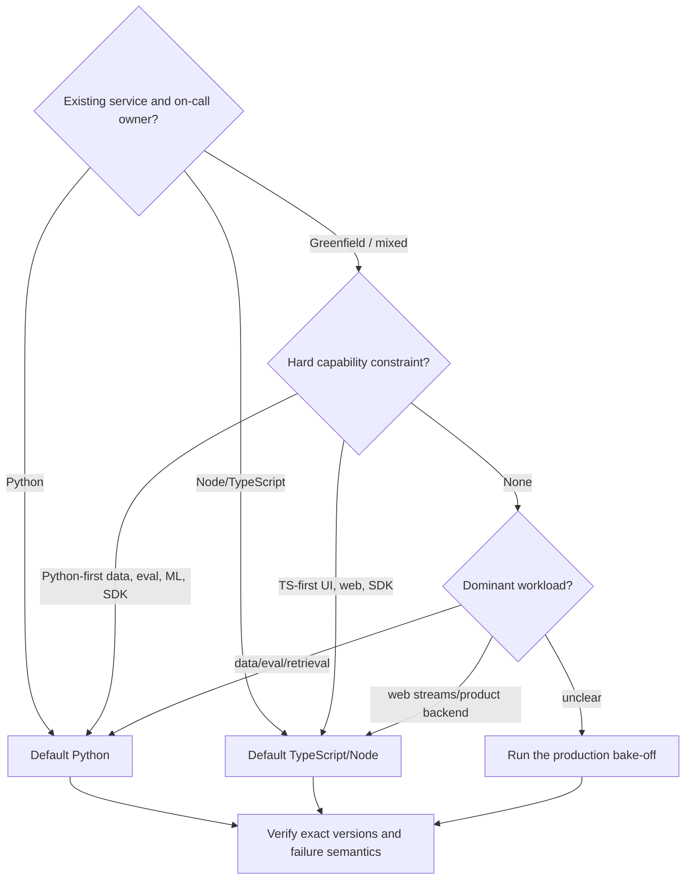
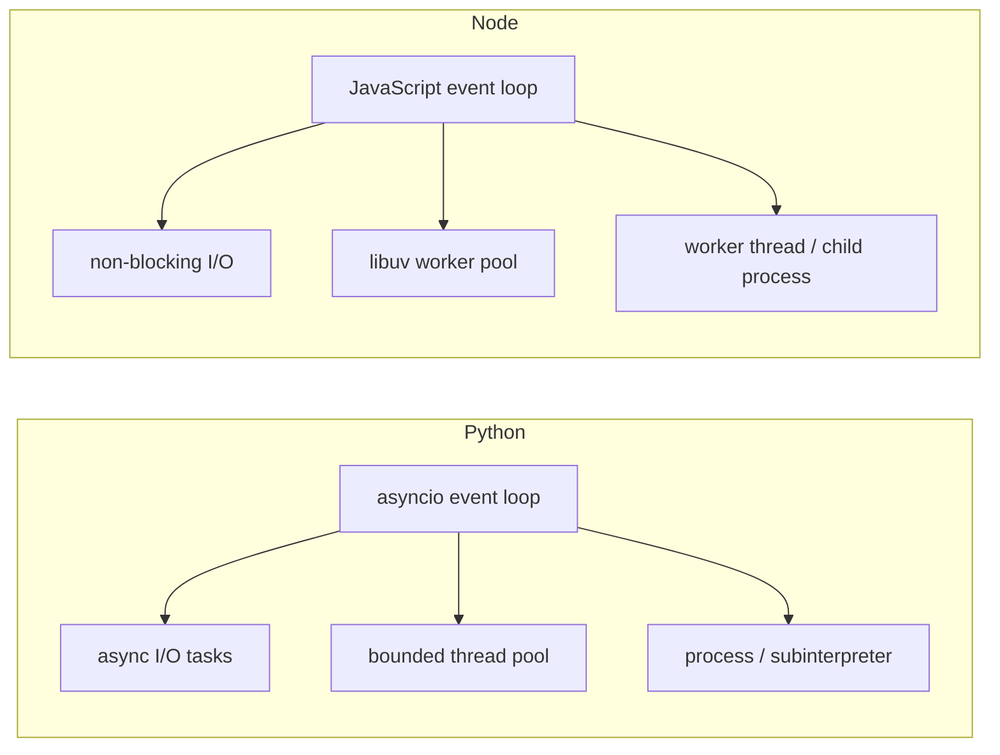
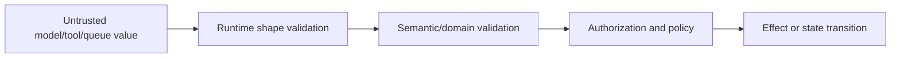
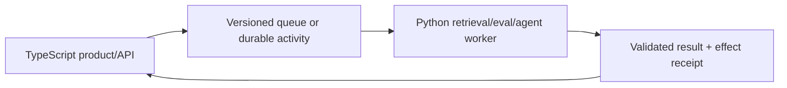

# Python vs TypeScript/Node.js for Agent Runtimes

> **Status:** Research-backed decision guide  
> **Last researched:** 2026-08-31  
> **Scope:** Selecting between Python and TypeScript/Node.js for agent APIs, workers, tools, streams, and workflow activities.  
> **Evidence:** [Python and TypeScript/Node.js research packet](../research/packets/python-and-typescript-agent-runtimes.md)

Use the language the owning production team already operates unless a required capability or measured workload property decides otherwise. Both languages can build excellent agents. The dangerous choice is the one whose cancellation, CPU isolation, runtime validation, packaging, and failure diagnostics the team has not proven.

## Fast decision



If the result is close, familiarity wins. A polyglot split must buy a clear capability, isolation, or ownership advantage large enough to repay another deployment, schema, trace, retry, and incident boundary.

## Current baseline

| Runtime | Production baseline on 2026-08-31 | Important caveat |
|---|---|---|
| Python | CPython 3.14.7 stable; 3.15 prerelease | Free-threaded 3.14 is supported but optional, not the default. |
| Node.js | 24.20.0 LTS; 26.8.1 Current | Node recommends production use an LTS line; edge runtimes are not full Node. |

Do not compare an experimental Python build against Node LTS, or Node Current against an older Python minor, without saying so. Pin the exact profiles used in evidence.

## Decision matrix

| Criterion | Python | TypeScript/Node.js | Decision implication |
|---|---|---|---|
| Agent/data ecosystem | Broad agent, retrieval, evaluation, ML, scientific ecosystem | Broad web/product agent ecosystem; strong UI streaming integration | Choose the mandatory capability, not package count. |
| I/O concurrency | `asyncio` is strong when all work yields | Event loop is strong when callbacks stay small | Both need admission and per-resource bounds. |
| Structured concurrency | `TaskGroup` and AnyIO provide explicit child ownership | Usually application/framework convention | Python has stronger standard structured ownership; Node teams must build/verify it. |
| Cancellation | Task cancellation at await points; `CancelledError` must propagate | `AbortSignal` notification; every dependency must honor it | Both are cooperative and need late-result fencing. |
| Blocking work | Easy to accidentally call sync code in `async def`; threads keep running after cancel | Any CPU/sync callback can stall all requests on the loop | Inventory and inject stalls before selection. |
| CPU parallelism | Processes, subinterpreters, compatible free-threaded build | Worker threads, child processes, external workers | Compare serialization, startup, memory, termination, and team skill. |
| Runtime validation | Pydantic and alternatives; coercion defaults need review | Zod/JSON Schema alternatives; TS types are erased | Both require explicit boundary schemas. |
| Streaming/backpressure | Async iterators plus application queue/buffer policy | Mature Node/Web streams and pipeline/backpressure primitives | Node has ergonomic advantage, not automatic correctness. |
| Web/UI integration | Separate frontend contracts/build often expected | Shared language/tooling can reduce product friction | Shared language does not remove trust validation. |
| Data/evaluation | Usually strongest integration | Capable, but fewer Python-native research/data tools | Keep evaluation in Python if that materially helps; serving can differ. |
| Process footprint | Multiple workers/interpreters can multiply memory | One event loop is efficient; workers/processes add per-boundary cost | Measure actual concurrency and dependency footprint. |
| Durable runtime | Temporal, Restate, DBOS, Prefect, Dapr and framework adapters | Temporal, Restate, DBOS and framework integrations | Compare the selected engine's exact SDK parity and replay model. |
| Observability | OTel traces/metrics stable; logs Development | OTel traces/metrics stable; logs Development | Add runtime health beyond agent spans. |
| Supply chain | Interpreter, wheels/native builds, lock/hash policy | Large transitive npm graphs, scripts, lock/provenance policy | Neither ecosystem is secure by default. |
| Deployment targets | Services, workers, data/batch environments | Services, serverless, browser-adjacent and edge variants | Exact target compatibility can decide the choice. |

## The concurrency difference that matters



Both runtimes multiplex I/O. Python's common trap is a synchronous library called from async code; Node's is synchronous/CPU work inside any callback or promise continuation. The impact differs in mechanics but converges operationally: unrelated agent runs stall, timers and cancellations are observed late, and overload compounds.

### Minimum concurrency proof

- Run expected concurrent model streams with a slow downstream consumer.
- Inject a 500 ms CPU loop into one request and observe unrelated p99 latency.
- Saturate filesystem/DNS/crypto work separately from application CPU work.
- Fill tool/provider semaphores and verify admission remains bounded and tenant-fair.
- Cancel during parallel tools and prove every child reaches a terminal state.
- Measure memory per API worker plus thread/process/worker pools.

Do not rely on throughput from a no-op model mock; real connection pools, validation, event streaming, and trace export change the shape.

## Cancellation comparison

| Scenario | Python expectation | Node expectation |
|---|---|---|
| Caller stops an async model request | Await receives cancellation; client must close request/stream | Provider receives signal; client must reject/close promptly |
| Parallel sibling fails | `TaskGroup` cancels and drains siblings | Owning abstraction must abort/settle all promises explicitly |
| Sync/blocking tool | Await can cancel, thread may continue | Loop is blocked, or worker/process follows separate protocol |
| CPU worker | Process/interpreter cancellation and termination are explicit | Worker termination and result fencing are explicit |
| Shielded cleanup | `shield()` preserves selected task while caller remains cancelled | Use separate signal/ownership and bounded cleanup scope |
| External write already committed | Reconcile by effect/operation ID | Reconcile by effect/operation ID |

The invariant is language-neutral: once cancellation wins, a late result cannot advance run state. It may still carry an effect receipt needed for reconciliation.

## Type safety comparison



Python annotations and TypeScript interfaces are developer aids. Neither makes `U` trusted. Pydantic is often coercive by default; Zod transforms can change input/output representation and not every type converts to JSON Schema. In both:

- derive or review one versioned wire schema;
- test provider schema subset and generated schema;
- test absent/null/default/unknown-field behavior;
- validate arguments and results;
- constrain identifiers, amounts, units, enums, and sizes;
- perform authorization at the effect boundary;
- retain cross-language golden and adversarial fixtures.

## Ecosystem fit, without a popularity contest

| Capability | Python-leaning examples | TypeScript-leaning examples | Broad/both |
|---|---|---|---|
| Typed lightweight agent loop | Pydantic AI | Vercel AI SDK | OpenAI Agents SDK, Strands |
| Graph/checkpoint orchestration | LangGraph Python often leads examples | LangGraph.js available; verify parity | Durable engine can sit beneath either |
| Integrated framework/platform | CrewAI, LlamaIndex ecosystems are Python-led | Mastra is TypeScript-led | Google ADK and provider SDKs span languages with uneven parity |
| Evaluation/data | Python-native datasets/statistics/ML | JS product analytics and browser test stacks | OpenTelemetry and external eval services |
| Durable workflow | Prefect/Dapr Agents are Python-specific strengths | Web-stack-friendly Restate/DBOS/Temporal SDKs | Temporal/Restate/DBOS have both; verify each feature |

Representative does not mean recommended. Use the [provider-native](provider-native-agent-frameworks.md), [independent](independent-agent-frameworks.md), [evolving ecosystem](evolving-agent-framework-ecosystems.md), and [durable runtime](durable-agent-workflow-runtimes.md) comparisons for the actual framework decision.

## Deployment comparison

### Python workers

Multiple ASGI worker processes multiply heaps, clients, pools, caches, and in-memory agent state. Externalize session/checkpoint state and coordinate admission centrally. Shutdown must cancel/drain task groups before the process manager's grace deadline.

### Node processes

A single process can carry many streams efficiently until the event loop or memory is saturated. Uncaught exceptions should terminate under an external supervisor. Async cleanup must start on the termination signal; the `exit` event is too late.

### Edge and serverless

TypeScript code can target Node, browser, serverless, or edge, but these are different runtime contracts. Edge polyfills/stubs may compile and import while lacking behavior. Platform duration and post-response rules make in-process long-running autonomy unsafe. Externalize durable work and test the exact runtime/compatibility date.

Python serverless has analogous lifetime/cold-start constraints even without the edge API confusion. In either runtime, a request handler is not a durable scheduler.

## Security comparison

| Layer | Python | Node |
|---|---|---|
| Runtime restrictions | Isolated mode/import/path and OS controls; no general malicious-code sandbox | Stable permission model, explicitly not a malicious-code sandbox |
| Serialization hazard | Pickle can execute code; multiprocessing may use it | JSON/prototype/resource concerns; package scripts execute code |
| Dependency surface | Wheels/source builds/native extensions | Deep npm graphs, lifecycle scripts, module-format complexity |
| Real containment | Separate OS identity, container/VM/sandbox, egress and credentials | Same |

Do not execute model-generated code, plugins, or untrusted parsers in the agent server process in either language.

## Cost and performance reasoning

Model and tool latency usually dominates. Optimize runtime only after decomposing:

```text
end-to-end = queue + context + model + tools + retries + validation + stream/drain + persistence
```

Runtime choice can materially affect queueing, validation, stream memory, CPU tools, cold start, and worker footprint. It rarely changes remote model generation speed. Compare cost per successful task, not raw requests per second.

Measure:

- memory per ready API/worker and per active run;
- event-loop p99 delay and runnable queue;
- first-progress, first-token, and final latency;
- validation/serialization CPU by payload class;
- executor/worker pool queue wait;
- cold start and dependency import/load time;
- cancellation-to-cleanup latency;
- crash recovery and duplicate-effect rate;
- engineering/on-call time to diagnose staged faults.

## When a polyglot design is justified



A split is justified when:

- a mandatory Python-only or TypeScript-only capability exists;
- data/evaluation workers benefit materially from Python while the web product remains Node;
- CPU/native/security work needs an isolated specialized service;
- independent deployment/blast-radius ownership is desirable;
- measurements show a meaningful serving or footprint advantage.

The boundary must carry run, tenant/principal, trace, deadline, cancellation state, release/schema version, idempotency/effect ID, data policy, and result provenance. Define which side owns retries and ambiguous-effect reconciliation.

Avoid duplicating the agent loop in both languages. Prefer one controller and specialized activity/tool services.

## Production bake-off

Build the smallest slice that contains the hard problems, not two hello-world agents.

### Required scenario

1. Accept an interactive request and stream typed events.
2. Run two bounded read tools in parallel.
3. Require approval for one idempotent write.
4. Persist a checkpoint and resume in the intended durable runtime.
5. Disconnect the client, cancel mid-model, and cancel mid-tool.
6. Crash the worker after the write response is lost.
7. Replay/reconcile without duplicating the effect.
8. Diagnose the run from traces and runtime telemetry only.

### Scorecard

| Category | Weight guidance | Evidence |
|---|---:|---|
| Correctness/recovery | Highest | failure-injection pass rate and effect receipts |
| Team operability | Highest | time to diagnose, deploy, rollback, patch |
| Mandatory capabilities | Gate | exact SDK/framework/runtime versions |
| Cancellation/shutdown | High | terminal state, cleanup time, leak checks |
| Load/resource behavior | High | p95/p99, loop lag, memory, queue bounds |
| Schema/security | High | adversarial fixtures and containment review |
| Developer experience | Medium | change lead time, testability, review quality |
| Syntax/boilerplate | Low | only after production gates pass |

## Decision table

| Situation | Default choice |
|---|---|
| Existing Python production service owns domain and on call | Python |
| Existing Node/TypeScript product service owns domain and on call | TypeScript/Node.js |
| Greenfield data/evaluation/retrieval-heavy system | Python, unless the product stack creates a stronger operational reason |
| Greenfield web product with rich streaming UI | TypeScript/Node.js, unless a mandatory Python capability dominates |
| CPU-heavy local tool in either service | Isolate it; language choice alone does not solve it |
| Long-running side-effecting runs | Choose durable engine first, then its best-owned SDK |
| Edge deployment with full Node-dependent agent stack | Prefer full Node or move agent work behind a service |
| One Python-only library in a Node estate | Isolated Python activity/tool worker, not wholesale rewrite |
| One TypeScript-only UI/runtime library in Python estate | Thin TypeScript edge/API layer with Python controller if ownership stays clear |
| No decisive difference | Existing team language |

## Release decision checklist

- [ ] Exact stable/LTS runtime and critical SDK versions are pinned.
- [ ] Required agent, provider, protocol, and durable features are parity-tested.
- [ ] CPU/blocking work is isolated and every queue/buffer is bounded.
- [ ] Cancellation reaches every layer and cannot become silent success.
- [ ] Late results and committed effects are fenced/reconciled.
- [ ] Runtime validation covers all untrusted input and output.
- [ ] Streaming remains bounded under slow consumers and disconnects.
- [ ] Deployment target, shutdown, crash, and restore behavior are proven.
- [ ] Runtime-health plus agent traces reconstruct staged incidents.
- [ ] Lock, hash/signature/provenance, SBOM, and upgrade policies pass.
- [ ] Polyglot cost is justified by a named capability or measured result.
- [ ] The owning team agrees to the on-call and upgrade burden.

## Related guides

- [Go vs Python vs TypeScript/Node.js](go-vs-python-vs-typescript-node-agent-runtimes.md)
- [Python agent runtimes](../languages/python-agent-runtimes.md)
- [TypeScript and Node.js agent runtimes](../languages/typescript-node-agent-runtimes.md)
- [Choosing an agent runtime language](../languages/choosing-an-agent-runtime-language.md)
- [Custom loop vs framework vs workflow engine](custom-loop-vs-framework-vs-workflow-engine.md)
- [Durable runtime selection](durable-agent-workflow-runtimes.md)

## Selected sources

- [Python version status](https://devguide.python.org/versions/)
- [`asyncio` task and cancellation semantics](https://docs.python.org/3.14/library/asyncio-task.html)
- [Python concurrent futures](https://docs.python.org/3.14/library/concurrent.futures.html)
- [PEP 779 free-threaded support](https://peps.python.org/pep-0779/)
- [Node.js release status](https://nodejs.org/en/about/previous-releases)
- [Node event-loop guidance](https://nodejs.org/en/learn/asynchronous-work/dont-block-the-event-loop)
- [Node worker threads](https://nodejs.org/api/worker_threads.html)
- [Node abort APIs](https://nodejs.org/api/globals.html)
- [TypeScript erased types](https://www.typescriptlang.org/docs/handbook/typescript-from-scratch.html)
- [OpenAI Agents SDK languages](https://developers.openai.com/api/docs/guides/agents)

