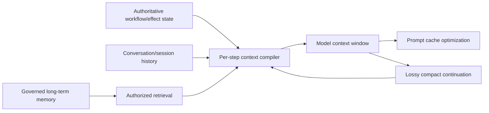

# Context and Memory

> **Status:** Research-backed core available; provider-specific and adaptive-memory deep dives remain queued.  
> **Last researched:** 2026-08-30  
> **Evidence:** [Security, evaluation, context, and memory research packet](../research/packets/security-evaluation-context-memory.md)

## Read in this order

1. [Context engineering](context-engineering.md) — typed lanes, budgets, retrieval, tool-result reduction, caching, and context evaluation.
2. [Compaction and continuity](compaction-and-continuity.md) — loss-aware checkpoints, resets, handoffs, recovery, and continuity tests.
3. [Memory architecture](memory-architecture.md) — governed writes, retrieval, temporal updates, forgetting, poisoning, and evaluation.

## Boundary map

The six boxes are not interchangeable. In particular, memory is not a workflow database, compaction is not durability, and caching is not memory.

## Stable baseline

- Compile context for the next decision from typed, provenance-aware lanes.
- Reserve per-lane and total token budgets; advertised window size is not uniform usable attention.
- Retrieve progressively and offload large artifacts behind immutable references.
- Preserve authoritative state and raw lineage outside compact summaries.
- Treat compaction as a lossy migration with a versioned preservation contract.
- Gate every durable memory write; extraction is not verification.
- Authorize tenant/subject scope before semantic retrieval.
- Design supersession, conflict, TTL, deletion, and anti-poisoning behavior from the start.

## Remaining research queue

- Versioned provider comparison for caching, context editing, server-side compaction, and state retention.
- Empirical context-budget and retrieval-ablation studies by workload.
- Multi-agent shared-memory consistency, ownership, and propagation.
- Privacy/regional retention and deletion verification across derived stores and caches.
- Replication and production testing of emerging memory-poisoning and information-flow defenses.
- Adaptive/learned memory and procedural-skill promotion with strict outcome validation.
