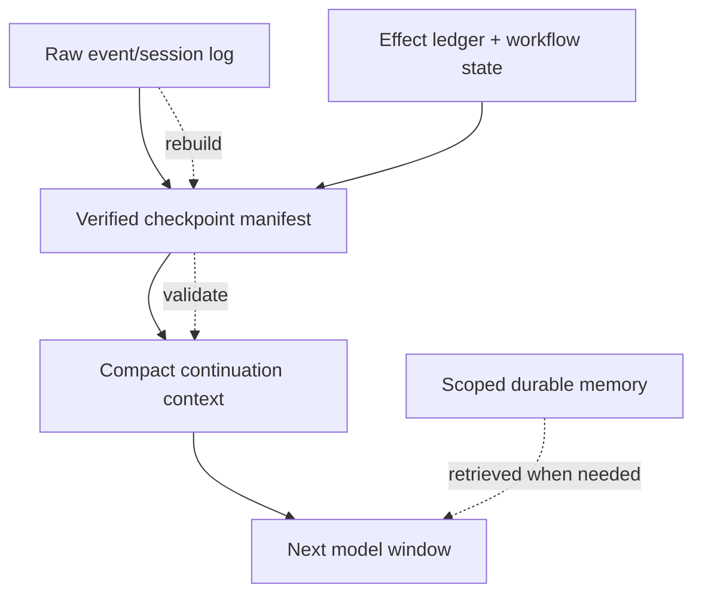
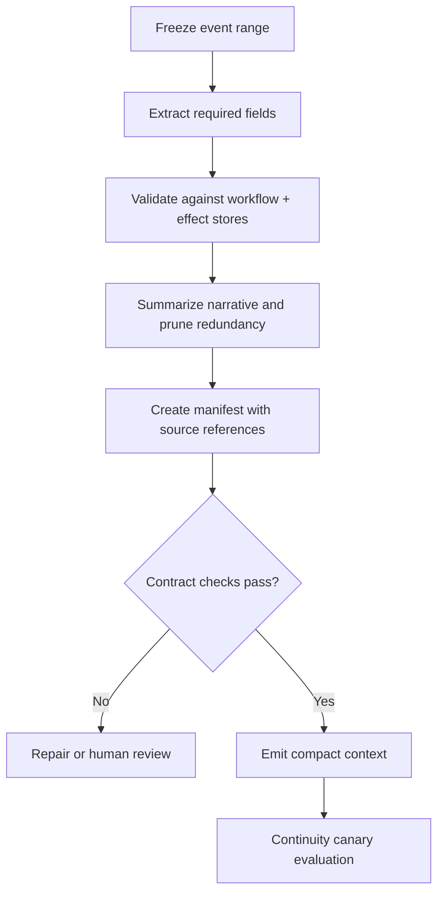
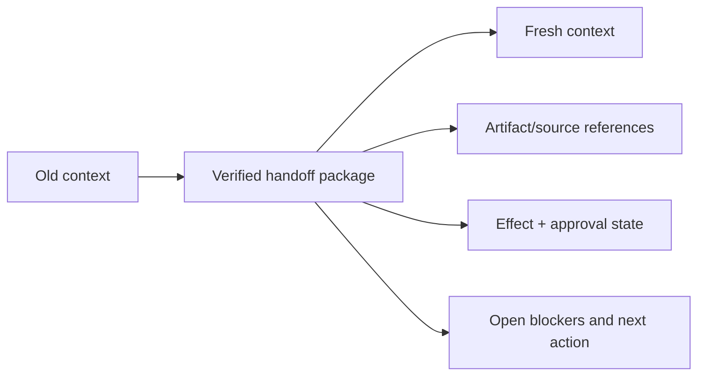
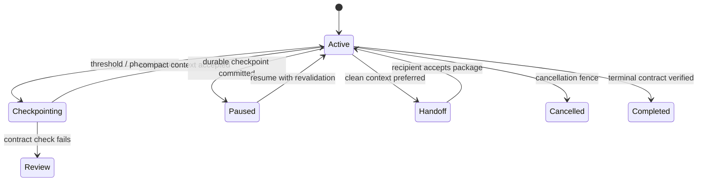

# Compaction and Continuity

> **Status:** Research-backed draft  
> **Last researched:** 2026-08-30  
> **Scope:** Loss-aware context compaction, checkpoints, resets, handoffs, and recovery for long-running agents.  
> **Evidence:** [Security, evaluation, context, and memory research packet](../research/packets/security-evaluation-context-memory.md)  
> **Section index:** [Context and memory](README.md)

Compaction is a lossy migration from one context representation to another. It can extend a run, but it is not durability, memory correctness, or a substitute for authoritative state. Treat each compaction as a checkpoint with an explicit preservation contract and reversible lineage.

## Four layers of continuity

| Layer | Role | Can it be lossy? |
|---|---|---|
| Raw event/session log | Recovery, audit, reprocessing, source lineage | No, subject to deliberate retention/deletion policy |
| Workflow/effect state | Authoritative run position, approvals, effects, deadlines | No |
| Checkpoint manifest | Verified bridge for resume/handoff | Concise but must preserve required fields and references |
| Compact context | Model-readable working representation | Yes, with known limits and rebuild path |

If the only copy of an approval, effect outcome, user correction, or source is inside a summary, the design has already lost durability.

## Compaction triggers

Compact before the hard context limit. Trigger on a combination of:

- total and per-lane token thresholds with reserved output/recovery headroom;
- repeated or superseded tool results;
- completed subtask boundaries;
- low context contribution or growing distractor ratio;
- latency/cost thresholds;
- provider-specific compaction guidance;
- a deliberate handoff, pause, or checkpoint;
- a shift to a materially different task phase.

Do not wait for an overflow error: recovery may need additional tokens, and the model may degrade before the nominal limit.

## Preservation contract

Every checkpoint should preserve or reference:

| Category | Required content |
|---|---|
| Task | Current objective, accepted constraints, completion contract, explicit user corrections |
| Authority | Policy/version, tenant/principal, permission scope, active approvals and expiries |
| Progress | Completed subgoals, open subgoals, dependencies, current plan version |
| Effects | Effect IDs and committed/observed/failed/unknown states; reconciliation needs |
| Verified facts | Canonical values, source IDs/versions, effective times, confidence if derived |
| Artifacts | Immutable references, hashes/versions, ownership, sensitivity |
| Decisions | Material choices and concise rationale/evidence—not hidden chain-of-thought |
| Failures | Current blocker/error class, attempts, retry eligibility, backoff/deadline |
| Budgets | Steps, tokens, cost, time, retries, delegations remaining |
| Continuation | Exact next action or decision, expected inputs, stop/cancel state |
| Lineage | Parent checkpoint, raw event range, compactor/version, created time |

Keep hypotheses and unverified model claims clearly separate from verified state.

## Compaction pipeline

Validation should be deterministic for structured fields. A model can propose a summary, but it should not decide whether a payment committed, an approval is valid, or a budget remains.

## Provider-managed versus application-managed compaction

| Approach | Advantages | Risks and requirements |
|---|---|---|
| Provider-managed compaction | Low orchestration effort; optimized for provider's model/context representation | May be opaque; harder to inspect, migrate, reproduce, or enforce domain-specific preservation |
| Provider stateless compact endpoint | Can preserve provider semantics while application stores result; may support privacy modes | Still provider-specific and possibly opaque; record version and canonical continuation format |
| Application summary | Inspectable, portable, domain-aware | Summary quality, token cost, schema maintenance, injection and omission risk |
| Deterministic state projection | Strong for structured run/effect facts | Cannot preserve all nuanced conversation or evidence alone |
| Hybrid | Structured checkpoint plus model-generated concise narrative | More components, but best separation of truth and working context |

OpenAI's current compaction documentation, for example, supports server-side compaction and a standalone compact endpoint, with an opaque compaction item intended to be passed forward. That mechanism can be operationally useful, but the application still needs its own workflow/effect state and raw lineage.

## Reset and handoff can be better than compaction

Repeated summaries can accumulate stale goals, defensive over-caution, and false assumptions. A clean context is preferable when:

- the task phase changes sharply;
- the existing window is dominated by abandoned approaches or errors;
- a fresh agent/worker needs a bounded responsibility;
- compaction has already occurred several times;
- the model exhibits loop fixation or “context anxiety”;
- security requires isolating untrusted material or a subtask;
- the current provider/model changes.

A handoff should be task-scoped, reviewable, and generated from authoritative state plus referenced evidence. It should not copy the entire old conversation into a new wrapper.

## Common loss modes

| Loss mode | Symptom | Prevention/detection |
|---|---|---|
| User correction disappears | Agent reverts to old interpretation | Correction field plus continuity canary |
| Unknown effect becomes “failed” | Duplicate write on resume | Effect ledger state independent of summary |
| Source provenance collapses | Derived claim treated as fact | Source IDs, versions, trust, and effective time |
| Approval loses parameters/expiry | Commit exceeds consent | Exact approval digest and commit-time revalidation |
| Open issue marked complete | Premature final answer | Checklist with evidence-backed terminal status |
| Security warning omitted | Poisoned content gains influence | Untrusted-source labels and quarantined references |
| Contradiction silently resolved | Stale preference overrides update | Preserve supersession/conflict metadata |
| Budget resets accidentally | Runaway continuation | Durable counters outside context |
| Summary-of-summary drift | Growing confident inaccuracies | Periodic rebuild from raw events/checkpoints |

## Compaction and prompt injection

Compaction can launder untrusted content: a malicious document becomes an assistant-authored summary and loses its original warning label. Controls:

- propagate provenance and trust through every derived item;
- never let the summarizer promote evidence into authority;
- keep quoted or remote instructions out of the checkpoint's control fields;
- require deterministic validation for approvals, effects, identity, tenant, and budgets;
- record the raw source range and compactor version;
- test delayed payloads that activate only after compaction or handoff;
- gate any memory write separately from compaction.

## Continuity evaluation

For each long-running scenario, compare:

1. uninterrupted reference run where feasible;
2. one compaction at each candidate phase;
3. repeated compaction cycles;
4. reset/handoff from the checkpoint;
5. crash and resume before and after an effect;
6. compaction with injected, conflicting, stale, and oversized content;
7. deletion or expiry of a referenced memory/source;
8. model/provider migration using the same checkpoint.

Grade:

- final state and policy invariants;
- preserved user corrections and constraints;
- effect/approval/budget accuracy;
- required-source recall and provenance;
- duplicate/repeated work;
- time, cost, and tokens to recover;
- false confidence versus appropriate clarification or abstention.

Create small continuity canaries: questions or deterministic checks for the fields most likely to vanish. Avoid exposing answer keys to the production model; run checks through the control plane where possible.

## Operational lifecycle

Resume must revalidate current policy, permissions, resource versions, approvals, deadlines, and external effect outcomes. A checkpoint is evidence of past state, not authorization to ignore changes while paused.

## Readiness checklist

- [ ] Raw session/events and workflow/effect state survive independently of compact context.
- [ ] Compaction starts before the hard window limit and preserves recovery headroom.
- [ ] A versioned preservation contract covers task, authority, effects, facts, artifacts, failures, budgets, and lineage.
- [ ] Structured fields are checked against authoritative stores.
- [ ] Derived summaries retain source/trust labels and cannot silently write memory.
- [ ] Reset/handoff is available when clean context beats accumulated continuity.
- [ ] Resume revalidates policy, approval, resource, and unknown effects.
- [ ] Tests cover multiple compactions, crashes, injection, conflict, deletion, and provider/model changes.

## Related guides

- [Context engineering](context-engineering.md)
- [Memory architecture](memory-architecture.md)
- [Durable execution](../runtime/durable-execution.md)
- [Run controls](../runtime/run-controls.md)
- [Prompt injection and untrusted data](../security/prompt-injection-and-untrusted-data.md)

## Selected sources

- [OpenAI compaction](https://developers.openai.com/api/docs/guides/compaction)
- [OpenAI conversation state](https://developers.openai.com/api/docs/guides/conversation-state)
- [Anthropic context engineering](https://www.anthropic.com/engineering/effective-context-engineering-for-ai-agents)
- [Anthropic harness design for long-running applications](https://www.anthropic.com/engineering/harness-design-long-running-apps)
- [Letta stateful agents and stored messages](https://docs.letta.com/v1-sdk/concepts/stateful-agents)
