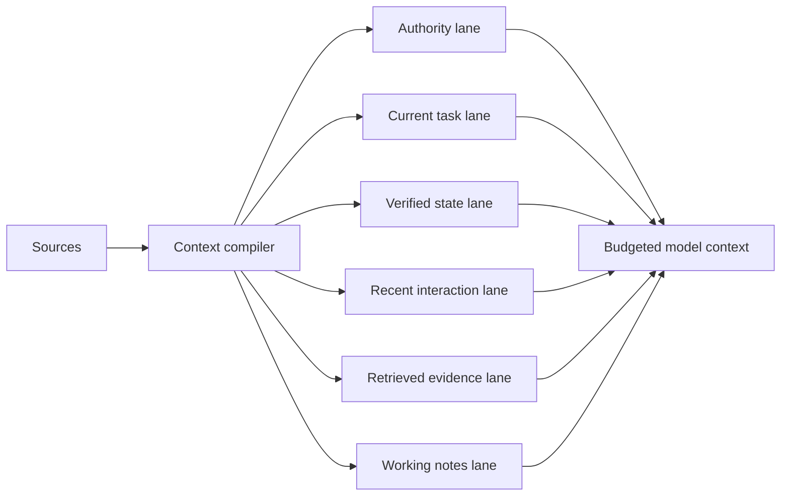
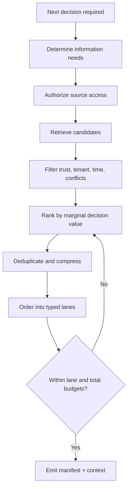
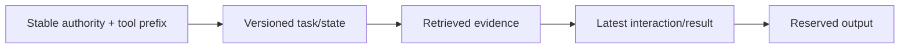

# Context Engineering for Agents

> **Status:** Research-backed draft  
> **Last researched:** 2026-08-30  
> **Scope:** Selecting, structuring, budgeting, caching, and evaluating the information visible to an agent at each model call.  
> **Evidence:** [Security, evaluation, context, and memory research packet](../research/packets/security-evaluation-context-memory.md)  
> **Section index:** [Context and memory](README.md)

Context is a compiled, per-step view of the task—not an append-only transcript. Its quality depends on authority, relevance, freshness, provenance, and token cost. A larger model window increases capacity but does not guarantee uniform attention or justify including everything.

## Context is a finite attention budget

Long-context research has repeatedly found that usable performance depends on task, position, distractors, and model—not only whether the text fits. “Lost in the Middle,” RULER, LongBench, and later controlled industry work all undermine the assumption that every token is equally usable.

The compiler should know why each item is present, where it came from, how long it is valid, and what it is allowed to influence.

## Do not conflate the state layers

| Mechanism | Purpose | Authority | Typical lifetime |
|---|---|---|---|
| Context window | Information available to one inference | Mixed; lane-specific | One call |
| Conversation/session history | User-agent interaction record | Evidence, not business truth | Session or longer |
| Working notes/scratch | Agent's current hypotheses and progress | Unverified | Run/checkpoint |
| Durable workflow state | Authoritative run position, approvals, effects | System of record | Run plus retention |
| Retrieval/RAG | External knowledge selected for a query | Source-dependent evidence | Recomputed per need |
| Long-term memory | Scoped reusable user/task/experience items | Candidate/derived knowledge | Cross-session until expiry/deletion |
| Prompt cache | Reuse of identical/stable token prefixes | No semantic authority | Provider cache policy |
| Compaction summary | Lossy continuation representation | Derived checkpoint | Until next compaction/reset |

A cache hit does not mean the information is current. A memory retrieval does not make a fact authoritative. A persisted conversation does not tell the runtime whether an external write committed.

## Typed context lanes

### 1. Authority and invariants

Include platform constraints, policy references, tool-use rules, and completion contract. Keep this lane stable, concise, and programmatically protected. Do not interpolate remote content into it.

### 2. Current task and user intent

Represent the latest accepted objective, constraints, explicit corrections, unresolved ambiguities, and approved scope. Preserve the distinction between a request and a later quoted document.

### 3. Verified state and effect ledger

Include facts queried from authoritative systems, resource versions, approvals, deadlines, budgets, completed effects, unknown outcomes, and cancellation state. Prefer structured summaries and opaque IDs over prose.

### 4. Recent interaction

Keep turns needed for reference resolution, social continuity, and corrections. Old chat is not automatically relevant. Summarize or retrieve older conversation by need.

### 5. Retrieved evidence and memory

Each item needs source, tenant/subject, timestamp, trust, sensitivity, relevance, and conflict status. Clearly delimit it as evidence that may contain malicious instructions.

### 6. Working notes

Maintain hypotheses, plan state, open questions, and partial results outside durable truth. Discard stale branches aggressively; a model's earlier explanation can become an anchoring error.

## Compilation pipeline

Compile for the next decision, not for every possible future question. Progressive disclosure keeps the initial tool catalog and evidence set small while allowing targeted expansion.

## Token budgeting

Reserve headroom before selecting evidence:

| Budget | Contains | Failure if omitted |
|---|---|---|
| Output | Final answer, structured proposal, or tool call | Truncation and malformed output |
| Tool schemas | Active tool definitions and constraints | Invalid or confused calls |
| Control | Authority, task, verified run state | Goal drift and unsafe behavior |
| Recovery | Error/result and enough history to react | Repeated failures and loops |
| Evidence | Retrieved documents, memory, artifacts | Unsupported or stale answer |
| Safety margin | Provider tokenization variance and unexpected result size | Window overflow |

Set per-lane limits as well as a total limit. Otherwise one long tool result can crowd out the task, approval state, or security constraints.

Useful metrics:

- tokens by lane and source;
- fraction of supplied items cited or used in the action;
- retrieval precision/recall for required evidence;
- duplicated or superseded tokens;
- context growth per step and compaction frequency;
- success/cost/latency under context ablations;
- policy/injection failures by source lane;
- cache read/write tokens and realized cost—not theoretical cacheability.

## Ordering and prefix stability

Provider caching generally rewards an identical or stable prefix. Place stable instructions and tool definitions before volatile conversation/evidence when that respects the provider's cache semantics. But never use ordering as the security boundary: precedence must be explicit in the compiler and policy layer.

Changing any early token can invalidate a prefix cache. Group tools deterministically, avoid timestamps or request IDs in the stable prefix, and move volatile values later. Record actual cache metrics because provider thresholds, lifetimes, routing, and accounting differ.

## Prompt caching is not memory

| Prompt cache can… | Prompt cache cannot… |
|---|---|
| Reduce repeated prefix processing cost/latency under provider rules | Decide which facts are true, relevant, or authorized |
| Reuse stable instructions, examples, or tool definitions | Preserve business state after deletion or expiry |
| Expose cached/cache-write token metrics | Guarantee output determinism |
| Influence prompt-layout economics | Replace retrieval, workflow state, or memory governance |

Cached tokens may still count toward rate limits, and a semantically equivalent but byte/token-different prefix may miss. Compaction can also change the prefix and reduce reuse. Verify current provider documentation rather than hard-coding prices or thresholds in architecture.

## Tool catalogs and results

### Tool definitions

- Expose only tools relevant and authorized for the current task.
- Keep names and descriptions distinct; overlapping tools increase selection error.
- Use lazy discovery for large catalogs, but treat discovered metadata as a trust-controlled artifact.
- Version schemas and include only details needed to call safely.
- Separate high-impact capabilities from broad convenience tools.

### Tool results

- Return a concise typed envelope: status, authoritative fields, provenance, pagination/truncation, retryability, and artifact reference.
- Store large raw artifacts outside context and retrieve sections on demand.
- Replace obsolete results with a state summary while retaining raw trace references.
- Do not repeatedly echo the same result through assistant summaries and subsequent prompts.
- Mark tool content untrusted even when the execution succeeded.

## Retrieval and context selection

Semantic similarity alone is insufficient. Rank or filter by:

1. authorization and tenant/subject scope;
2. required source class or authority;
3. freshness/effective time and resource version;
4. conflict/supersession status;
5. trust and provenance;
6. relevance to the current decision;
7. diversity/coverage and redundancy;
8. sensitivity and token cost.

Authorization must happen before vector ranking; otherwise a cross-tenant item can influence retrieval even if removed later.

## When to retrieve, summarize, compact, or reset

| Situation | Preferred action |
|---|---|
| Required fact exists in authoritative store | Retrieve the specific current record |
| Large artifact may be needed later | Store by immutable reference; fetch sections progressively |
| Recent turns contain repeated details | Create a reversible checkpoint summary plus source links |
| Old errors and abandoned plans dominate | Prune or start a clean handoff with explicit state |
| Context approaches configured threshold | Compact before hard overflow; reserve output/recovery headroom |
| Summary has compounded across many cycles | Rebuild from raw session/checkpoints or reset with verified manifest |
| Distinct independent subproblem | Isolate in a separate context and return a bounded artifact/result |

## Evaluate context as a component

Create tasks where required evidence varies by position, length, trust, freshness, conflict, and distractor load. Test:

- required-item recall before the model is called;
- outcome with and without each lane/item (ablation);
- success as context grows while task difficulty stays constant;
- middle-position and multi-document evidence use;
- correct rejection of stale, unauthorized, or poisoned content;
- tool catalog pruning and selection error;
- cache hit, latency, and cost without quality regression;
- continuity through one and multiple compaction cycles;
- cross-tenant and sensitive-data non-retrieval.

Do not rely on needle-in-a-haystack alone; lexical retrieval is much narrower than synthesis, conflict resolution, or long-running state tracking.

## Anti-patterns

| Anti-pattern | Consequence |
|---|---|
| Append the entire transcript forever | Distraction, stale conflicts, cost, injection persistence |
| Put retrieved text in the privileged instruction lane | Converts data into apparent authority |
| Load every tool up front | Selection errors, token cost, larger attack surface |
| Treat long window as solved memory | No provenance, updates, forgetting, or cross-session governance |
| Summarize summaries repeatedly | Compounding loss and provenance collapse |
| Select only by embedding similarity | Stale, unauthorized, redundant, or low-authority results |
| Optimize cache hit rate alone | Can preserve stale context and harm decisions |
| Measure token count but not contribution | Smaller or larger context can both be worse |

## Readiness checklist

- [ ] Context is compiled per decision from typed lanes with explicit precedence.
- [ ] Every non-authority item has provenance, tenant, trust, freshness, and sensitivity.
- [ ] Per-lane budgets preserve control, output, and recovery headroom.
- [ ] Large tool/artifact content is offloaded and progressively retrieved.
- [ ] Tool catalogs are task-relevant, authorized, and versioned.
- [ ] Prompt caching is measured as an optimization and never used as semantic state.
- [ ] Context quality is evaluated with ablation, length, position, conflict, and injection tests.
- [ ] Raw history and authoritative state remain recoverable when context is compacted.

## Related guides

- [Compaction and continuity](compaction-and-continuity.md)
- [Memory architecture](memory-architecture.md)
- [Tool contracts](../tools/tool-contracts.md)
- [Prompt injection and untrusted data](../security/prompt-injection-and-untrusted-data.md)
- [Observability and tracing](../evaluation/observability-and-tracing.md)
- [Delegation, handoffs, and shared state](../orchestration/delegation-handoffs-and-shared-state.md)
- [Tool discovery and selection](../tools/tool-discovery-and-selection.md)
- [Tool results, artifacts, and provenance](../tools/tool-results-artifacts-and-provenance.md)

## Selected sources

- [Anthropic: Effective context engineering for AI agents](https://www.anthropic.com/engineering/effective-context-engineering-for-ai-agents)
- [OpenAI prompt caching](https://developers.openai.com/api/docs/guides/prompt-caching)
- [Google Gemini context caching](https://ai.google.dev/gemini-api/docs/caching)
- [Lost in the Middle](https://aclanthology.org/2024.tacl-1.9/)
- [RULER](https://arxiv.org/abs/2404.06654)
- [LongBench](https://aclanthology.org/2024.acl-long.172/)
- [Chroma Context Rot technical report](https://www.trychroma.com/research/context-rot)
