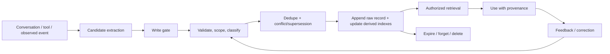
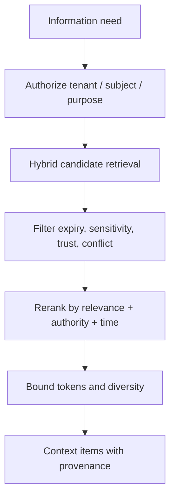

# Memory Architecture for Agents

> **Status:** Research-backed draft  
> **Last researched:** 2026-08-30  
> **Scope:** Production design for cross-step and cross-session memory, including write policy, retrieval, updates, forgetting, security, and evaluation.  
> **Evidence:** [Security, evaluation, context, and memory research packet](../research/packets/security-evaluation-context-memory.md)  
> **Section index:** [Context and memory](README.md)

Memory is a governed data system, not a vector database and not a long transcript. A production memory layer decides what may persist, whose scope it belongs to, how it is verified and updated, when it can be retrieved, and how it is deleted. The model may propose memories; it should not silently convert arbitrary content into durable truth.

## First separate memory from adjacent state

| Need | Correct primary mechanism |
|---|---|
| Know whether an external write committed | Effect ledger / authoritative external state |
| Resume a workflow after crash | Durable checkpoint and workflow state |
| Resolve a pronoun from two turns ago | Recent conversation history |
| Find facts in a corpus | Retrieval/RAG with source versions |
| Remember a user preference across sessions | Scoped long-term memory with consent and update/delete semantics |
| Reuse a successful task procedure | Versioned, evaluated procedural artifact—not unverified reflection |
| Reduce repeated prefix cost | Prompt cache |
| Fit a long run into a window | Compaction/checkpoint |

Never use model memory as the system of record for money, inventory, permissions, compliance status, identity, approvals, or effect completion. Retrieve those facts from their authoritative systems.

## Useful taxonomy, practical stores

Research often describes:

- **semantic memory:** facts and concepts;
- **episodic memory:** events and prior experiences;
- **procedural memory:** rules, strategies, and skills;
- **working memory:** information active for the current task.

This vocabulary is useful, but production stores should reflect governance:

| Store | Contents | Typical write authority |
|---|---|---|
| Profile/preference | Explicit user choices, communication preferences | User or policy-gated extraction |
| Fact/relationship | Derived or verified claims with source and time | Validated pipeline; authoritative link where possible |
| Event/episode | What happened, with outcome and effect references | Runtime from observed state, not model self-report |
| Procedure/policy | Approved playbooks, not improvised guesses | Human/administrative publishing workflow |
| Checkpoint | Current run/task continuation | Durable runtime |
| Raw interaction/evidence | Immutable source record under retention rules | Ingestion/runtime; not injected wholesale into context |

## Memory lifecycle

Every arrow needs policy and audit. Memory quality is largely determined at the write boundary; retrieval-time filtering cannot undo a poisoned fact already consolidated and propagated.

## Memory record contract

| Field | Purpose |
|---|---|
| Stable ID and version | Address, update, audit, and rebuild the item |
| Tenant, subject, and audience | Prevent cross-user/agent/organization leakage |
| Type | Preference, fact, episode, procedure, checkpoint, etc. |
| Content or structured value | The actual item, preferably normalized |
| Source and evidence references | Preserve who/what asserted it and the raw origin |
| Trust and verification state | User-stated, tool-observed, inferred, corroborated, approved |
| Confidence | Calibrated uncertainty for derived items; never substitutes for authority |
| Created, effective, observed, expires | Separate storage time from when the claim is true |
| Sensitivity and purpose | Access, logging, residency, and retention policy |
| Writer and pipeline version | Diagnose extraction/consolidation defects |
| Supersedes, contradicts, derived-from | Preserve change and lineage rather than silent overwrite |
| Use statistics | Last retrieved/used, outcome feedback—with privacy controls |
| Review/deletion state | User visibility, correction, legal hold, tombstone, purge status |

Keep the raw append-only record and rebuildable derived indexes separate. An embedding index is a projection, not the source of truth.

## Write policy

### Candidate extraction is not validation

A model can identify a possible preference or fact, but the write gate should decide:

1. **Is it useful beyond the current task?** Do not persist ephemeral details by default.
2. **Is persistence expected and consented?** Follow product and privacy policy.
3. **Who is the subject and audience?** Never infer tenant scope from text alone.
4. **What is the source?** User assertion, authoritative tool state, remote document, or model inference.
5. **Can the source establish this claim?** A webpage cannot establish a private user's preference; a model cannot establish that an external write succeeded.
6. **Is it sensitive or prohibited?** Credentials, authentication material, and unnecessary sensitive attributes should not enter memory.
7. **Does it conflict or supersede?** Preserve temporal change and ask for clarification where consequence is material.
8. **What is its expiry and deletion behavior?** Every durable class needs a lifecycle.

### Hot-path versus background writes

| Pattern | Strength | Risk | Use when |
|---|---|---|---|
| Immediate hot-path write | Available on the next turn | Adds latency; self-reinforces mistakes/injection | Explicit user preference with low consequence and clear scope |
| Background extraction | Can batch, corroborate, dedupe, scan policy | Eventual consistency; may miss immediate need | Most derived facts and episodes |
| Human/admin curation | Strong governance | Cost and delay | Procedures, high-impact rules, organization-wide memory |
| Authoritative synchronization | Fresh, verifiable | Integration complexity | Facts already owned by a system of record |

Do not write the agent's rationale as a successful experience until the outcome has been observed. A failed or lucky trajectory can otherwise train future behavior in the wrong direction.

## Retrieval pipeline

### Ordering is security-sensitive

Authorization and scope filters must run before semantic search or cross-item aggregation. Even an item later removed can influence nearest-neighbor selection, counts, caches, or model-based reranking.

### Retrieval scoring dimensions

- required subject/tenant/audience match;
- purpose and permission;
- semantic/lexical relevance;
- source authority and verification state;
- effective time, recency, expiry, and temporal relation to the question;
- supersession and contradiction;
- task-specific importance;
- diversity and redundancy;
- sensitivity and context cost.

Surface sources and conflict to the model. For consequential decisions, re-query the authoritative system rather than relying on a memory snapshot.

## Updates, contradictions, and forgetting

Silent overwrite destroys evidence. Prefer:

- immutable versions with `supersedes` relationships;
- effective-time ranges for preferences and facts;
- explicit conflict sets when claims cannot yet be resolved;
- user-visible correction for personal memory;
- TTL for volatile items and review dates for procedures;
- decay or archival based on use and consequence, not relevance score alone;
- tombstones that prevent deleted items from being re-imported from a stale derived index;
- cascading deletion through summaries, embeddings, caches, eval datasets, and replicas;
- legal holds separated from ordinary retrieval access.

“Forgetting” is not only storage deletion. Verify that the item no longer appears in retrieval, prompt caches under your control, compact summaries, indexes, backups according to policy, or learned procedural artifacts.

## Memory poisoning and privacy

Memory makes prompt injection persistent. Attacks can insert a false trusted contact, security rule, preference, procedure, or “successful” trajectory through normal inputs, retrieved content, or tool results.

### Write-time controls

- external/tool content remains untrusted through extraction and consolidation;
- only designated sources can create designated memory types;
- high-impact facts require authoritative corroboration or review;
- procedures and policy cannot be self-published by the acting agent;
- provenance and trust must survive summarization;
- unusual writes, volume, and trust elevation generate alerts;
- one tenant's content cannot select, update, or embed into another tenant's index.

### Read-time controls

- authorize scope before search;
- treat memory as evidence, not instructions;
- do not use low-trust items to choose destinations, credentials, or permissions;
- surface age, source, conflicts, and verification state;
- revalidate high-impact claims at an authoritative source;
- isolate or quarantine suspicious descendants.

Emerging 2026 studies show delayed and cross-session poisoning in several stateful agent setups. Exact attack rates are setup-dependent, but the architectural implication is strong: a memory write is a security-sensitive effect.

## Shared and multi-agent memory

Shared memory increases coordination and blast radius. Define:

- owner and allowed writers/readers;
- namespace and tenant boundary;
- schema and version compatibility;
- conflict-resolution authority;
- whether a peer's output is an assertion, observation, or approved procedure;
- propagation and deletion behavior;
- provenance through summaries and handoffs;
- quotas to prevent one agent from crowding out or poisoning others.

Prefer message/artifact passing for task-local coordination. Promote an item to shared memory only through a separate policy.

## Memory evaluation

Evaluate the whole lifecycle, not only retrieval accuracy.

| Stage | Metrics and tasks |
|---|---|
| Candidate/write | Precision/recall of useful writes; prohibited/sensitive writes; source/scope accuracy; latency/cost |
| Storage/update | Dedupe, conflict preservation, temporal update, supersession, TTL, transactional behavior |
| Retrieval | Recall/precision, authorized-scope correctness, source authority, conflict coverage, token budget |
| Use | Answer/action improvement, source attribution, appropriate revalidation, abstention when missing |
| Forget/delete | Time to disappear from all serving indexes and contexts; no resurrection |
| Security | Poisoning, delayed activation, cross-tenant leakage, trust escalation, malicious consolidation |
| Long horizon | Multi-session recall, temporal reasoning, selective forgetting, compaction interaction |

LongMemEval and MemoryAgentBench broaden evaluation beyond simple recall, but product suites must add privacy, deletion, poisoning, and authoritative-state checks.

## Framework implementation lessons

Current frameworks expose different abstractions:

- LangGraph distinguishes thread-scoped state/checkpoints from long-term namespaced stores.
- LlamaIndex's current `Memory` combines bounded short-term messages with optional long-term blocks; older memory types are marked deprecated.
- AutoGen defines a memory protocol around query, context update, add, and clear.
- Letta keeps attached memory blocks in context and retains old messages outside the active window for later retrieval.
- Pydantic AI history processors manage message history but do not by themselves create a governed long-term memory system.

Use these APIs as adapters. Keep scope, validation, source lineage, deletion, and authority in an application contract so a framework migration does not redefine memory semantics.

## Anti-patterns

| Anti-pattern | Why it fails |
|---|---|
| Store every conversation turn in a vector DB | Noise, privacy risk, stale conflicts, no write policy |
| Let the agent decide what is true about its own work | Self-reinforcing hallucination and lucky-outcome learning |
| Retrieve before tenant filtering | Cross-tenant influence/leakage |
| Replace old values silently | Loses temporal truth, correction evidence, and rollback |
| Treat reflection as a skill | Unverified procedures can amplify failure |
| Use memory for authoritative state | Stale/derived data controls real effects |
| Delete only the primary row | Embeddings, summaries, caches, replicas can resurrect it |
| Report only recall accuracy | Ignores harmful writes, misuse, privacy, and forgetting |

## Production readiness checklist

- [ ] Memory is separated from workflow state, effect ledger, RAG, history, compaction, and caching.
- [ ] Every item has scope, source, trust, time, sensitivity, lineage, and deletion metadata.
- [ ] Candidate extraction passes a deterministic/policy write gate.
- [ ] Business truth and high-impact effects are revalidated against authoritative systems.
- [ ] Authorization and tenant filtering occur before retrieval/ranking.
- [ ] Updates preserve supersession/conflict; expiry and forgetting are designed.
- [ ] Derived indexes can be rebuilt and deletion propagates without resurrection.
- [ ] Shared memory has explicit ownership and write authority.
- [ ] Evals cover write, retrieval, use, updates, abstention, deletion, poisoning, and tenant leakage.

## Related guides

- [Context engineering](context-engineering.md)
- [Compaction and continuity](compaction-and-continuity.md)
- [Prompt injection and untrusted data](../security/prompt-injection-and-untrusted-data.md)
- [Durable execution](../runtime/durable-execution.md)
- [Evaluation-driven development](../evaluation/evaluation-driven-development.md)

## Selected sources

- [LangGraph memory concepts](https://docs.langchain.com/oss/python/concepts/memory)
- [LlamaIndex Memory](https://developers.llamaindex.ai/python/framework/module_guides/deploying/agents/memory/)
- [Letta stateful agents](https://docs.letta.com/v1-sdk/concepts/stateful-agents)
- [CoALA](https://arxiv.org/abs/2309.02427)
- [LongMemEval](https://openreview.net/forum?id=pZiyCaVuti)
- [MemoryAgentBench](https://arxiv.org/abs/2507.05257)
- [AgentPoison](https://proceedings.neurips.cc/paper_files/paper/2024/hash/eb113910e9c3f6242541c1652e30dfd6-Abstract-Conference.html)
- [MINJA](https://arxiv.org/abs/2503.03704)
