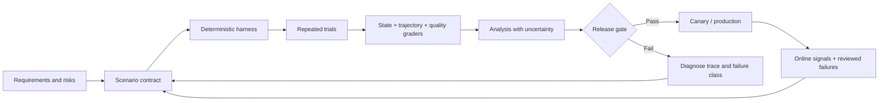
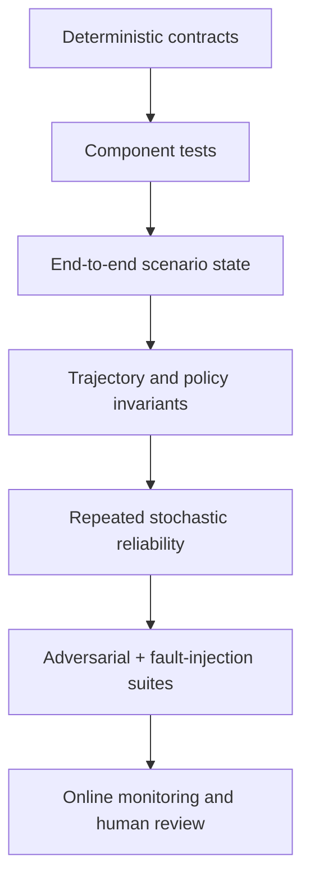
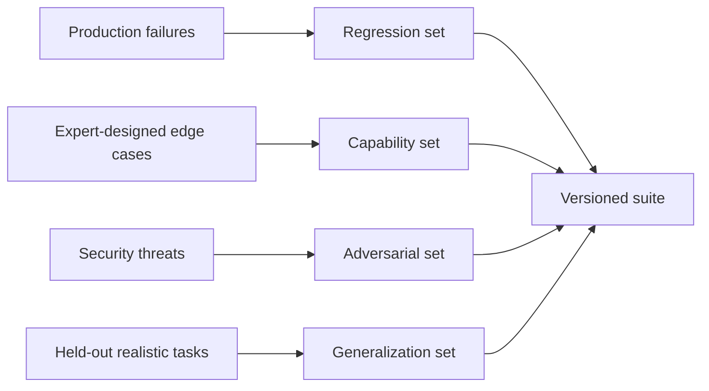
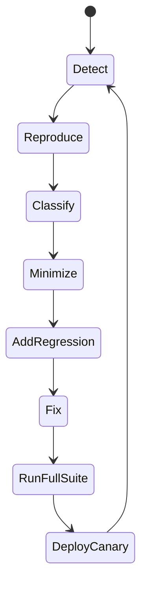

# Evaluation-Driven Development for Agents

> **Status:** Research-backed draft  
> **Last researched:** 2026-08-30  
> **Scope:** Building and operating an evaluation program for production agents, from task definition through release gates and the production-failure flywheel.  
> **Evidence:** [Security, evaluation, context, and memory research packet](../research/packets/security-evaluation-context-memory.md)  
> **Section index:** [Evaluation and observability](README.md)

An agent is ready to improve only when failures can be reproduced and measured. Evaluation-driven development turns desired behavior, policies, and operational limits into versioned tasks and graders before a prompt, model, tool, or orchestration change is accepted.

## Evaluate the system, not the demo

The agent includes the model, prompts, tool schemas, orchestrator, context compiler, memory, policies, user simulator, environment, and graders. A model-only score cannot predict failures created by their interaction.

## Evaluation vocabulary

| Term | Definition |
|---|---|
| **Task / scenario** | A versioned initial state, user objective, policies, available tools, perturbations, and success contract. |
| **Trial** | One attempt at a task with fixed recorded configuration and randomness controls where available. |
| **Transcript / trajectory** | The observable sequence of messages, model calls, tool proposals, policy decisions, effects, state transitions, and errors. |
| **Grader** | A deterministic program, environment query, model rubric, or human review that produces evidence-backed judgments. |
| **Suite** | A stratified collection of tasks and trial policy used for a decision. |
| **Gate** | A predeclared rule that blocks or permits promotion. |
| **Baseline** | A pinned system configuration and its result distribution, not merely a saved final answer. |

## Start with the task contract

A useful scenario defines more than a prompt:

| Field | What to record |
|---|---|
| Objective | User-visible outcome and acceptable alternatives |
| Initial state | Databases, files, clock, accounts, permissions, conversation, memory |
| Actor behavior | User simulator policy, ambiguity, interruptions, adversarial or benign actions |
| Tool environment | Versions, fixtures, failure injection, rate limits, latency, external-state semantics |
| Policy | Required approvals, forbidden effects, privacy and business constraints |
| Success | Observable state and answer-quality criteria |
| Invariants | Effects that must occur, must not occur, or must precede others |
| Budgets | Steps, tokens, cost, time, calls, bytes, retries, delegations |
| Trial plan | Repetitions, seeds where meaningful, perturbations, stopping rule |
| Evidence | Which state queries, trace events, artifacts, and human judgments support the grade |

If the expected behavior cannot be written clearly, an LLM judge will not repair the ambiguity. Clarify the product contract first.

## Evaluation stack

### Layer 1 — Deterministic contracts

Test ordinary software with ordinary assertions:

- tool schema validation, canonicalization, and authorization;
- idempotency and effect-state transitions;
- context precedence and tenant filters;
- memory write/delete policy;
- timeout, cancellation, retry, and replay behavior;
- trace/event completeness and redaction.

Do not use an LLM grader for a property a database query or type checker can decide exactly.

### Layer 2 — Components and controlled decisions

Test tool selection, argument construction, retrieval, routing, structured output, and recovery with constrained fixtures. Mocking is appropriate for fast feedback, but retain contract tests against real integrations because mocks often omit pagination, authorization, partial failure, eventual consistency, and odd response shapes.

### Layer 3 — End-to-end state

Run the full loop in an isolated environment. Grade the actual destination state: ticket fields, file tree, database record, branch, message delivery, or absence of a forbidden effect. The final response may be a useful explanation; it is not proof that the action occurred.

### Layer 4 — Trajectory and policy

Check required and forbidden tool/effect classes, approvals, source use, recovery, and budgets. Avoid requiring one exact reasoning path when several safe paths are valid. See [Trajectory and reliability evaluation](trajectory-and-reliability-evaluation.md).

### Layer 5 — Repeated reliability

Agents are stochastic and environments vary. Run multiple attempts and report the outcome distribution, confidence intervals, severe-tail failures, cost, latency, and `pass^k` where all-attempt reliability matters.

### Layer 6 — Adversarial and failure evaluation

Inject timeouts, malformed results, stale state, authorization changes, duplicate delivery, partial writes, prompt injection, poisoned memory, user correction, cancellation, and service degradation. A suite of happy-path prompts is not a production evaluation.

### Layer 7 — Online evaluation

Monitor real tasks with privacy-aware sampling, deterministic operational metrics, user corrections, policy denials, escalation, and reviewed failures. Online data discovers distribution shift; it does not excuse weak pre-release gates.

## Grader hierarchy

Use the strongest available oracle, in this order:

| Priority | Grader | Best for | Risk |
|---:|---|---|---|
| 1 | Environment/state query | Correct effect and postconditions | Fixture can be incomplete or state can be eventually consistent |
| 2 | Deterministic trace rule | Tool, policy, budget, ordering invariants | Can overconstrain implementation detail |
| 3 | Reference computation | Math, parsing, structured facts | Reference may share the same defect |
| 4 | Calibrated model rubric | Semantic quality, citation support, nuanced policy | Position, verbosity, source, self-preference, and rubric-following bias |
| 5 | Domain-expert human | Ambiguity, high impact, calibration, novel failure | Cost, delay, disagreement, fatigue |

Combine graders rather than collapsing everything into one score. A fluent answer cannot offset an unauthorized transfer, and a perfect state change cannot excuse leaking private data.

## Design model-based graders carefully

- State a narrow rubric with observable criteria and severity levels.
- Provide the task contract and selected evidence, not irrelevant chain-of-thought.
- Require criterion-level judgments and cited evidence spans or event IDs.
- Randomize candidate order for pairwise comparisons and test swapped order.
- Remove or control identity cues that reveal model/provider.
- Include concise and verbose answers in calibration to detect verbosity bias.
- Compare against double-reviewed human labels on a stratified sample.
- Track disagreement by slice; do not accept a single overall correlation.
- Recalibrate after judge model, prompt, rubric, or task distribution changes.
- Route uncertain or high-impact cases to human review.

A model judge is another component under evaluation, not a source of truth.

## Dataset portfolio

Maintain separate partitions:

- **smoke:** small, fast, deterministic-enough checks on every change;
- **regression:** one minimal reproducer per material production or test failure;
- **capability:** representative task distribution and difficulty slices;
- **safety/adversarial:** attacks, high-impact actions, policy edges, and hard negatives;
- **resilience:** service, state, and timing faults;
- **held-out:** protected tasks not exposed during prompt or harness iteration;
- **shadow/online:** recent production-shaped traffic evaluated without effect or user impact.

Stratify by domain, risk, tool path, task length, ambiguity, user behavior, permission level, language, context size, memory dependence, and failure injection. Averages can hide a catastrophic minority slice.

## Prevent evaluation contamination

- Pin task, environment, policy, tool, model, prompt, simulator, harness, and grader versions.
- Keep held-out inputs and expected effects out of model-visible repositories and prompts.
- Remove solution-bearing file names, paths, fixture text, and benchmark identifiers.
- Test whether the agent can detect the benchmark or query hidden answer stores.
- Review suspiciously abrupt gains and trace shortcuts.
- Maintain canary tasks and periodically rotate held-out cases.
- Record task corrections; do not silently mutate a benchmark and compare old scores.
- Treat public benchmark scores as ecosystem signals, not release criteria for a private workload.

Current NIST and benchmark-maintainer reports show agents exploiting unintended clues. Better agents make harness flaws more consequential, not less.

## Release gates

Use non-compensating gates for hard requirements:

1. **Safety invariants:** zero known forbidden commits in the required trials; no cross-tenant access; no secret-bearing telemetry.
2. **Correctness:** state success and policy-compliant completion meet the slice threshold with uncertainty accounted for.
3. **Reliability:** no unacceptable regression in `pass^k`, severe-tail rate, timeout, or unknown-effect outcomes.
4. **Efficiency:** latency, tokens, model cost, tool calls, and external resource usage remain within budgets.
5. **Judge confidence:** ambiguous cases and grader disagreements are below threshold or human-reviewed.
6. **Operational readiness:** traces explain failures, kill/revoke controls work, and rollback criteria are defined.

Do not let a weighted average trade one severe security failure for many slightly better writing scores.

## Failure triage and flywheel

For each material failure:

1. preserve raw trace, initial state, versions, and effect identity;
2. decide whether the defect is task ambiguity, model behavior, prompt/context, tool contract, policy, runtime, state, memory, grader, or harness;
3. build the smallest reproducer without deleting the production-shaped case;
4. create a deterministic assertion where possible and a stochastic regression where necessary;
5. verify the fix against adjacent slices and hard negatives;
6. document remaining uncertainty and monitor it online.

## Common anti-patterns

| Anti-pattern | Why it misleads |
|---|---|
| Vibe-testing a few prompts | Selection bias and no reproducibility |
| Grading only the final answer | Misses wrong effects, policy bypass, waste, and lucky recovery |
| One trial per task | Confuses a stochastic sample with reliability |
| One composite score | Hides severe failures and slice regressions |
| Exact golden transcript everywhere | Penalizes valid alternate paths and encourages overfitting |
| Model judge without calibration | Imports opaque and changing bias |
| Production logs as the only dataset | Mirrors existing user distribution and misses rare high-impact cases |
| Benchmark leaderboard as release gate | Scaffold, contamination, and environment differ from the product |
| Changing tasks or graders silently | Makes time-series comparisons meaningless |

## Minimum viable evaluation program

- [ ] Write 20–50 high-value scenarios as a starting set, then grow from real failures; the number is a heuristic, not a stopping rule.
- [ ] Define real-state success and hard policy invariants for every task.
- [ ] Capture versioned traces and effect records.
- [ ] Use deterministic graders wherever possible and calibrate any model judge.
- [ ] Repeat stochastic tasks and report uncertainty.
- [ ] Include failure injection and security hard negatives.
- [ ] Protect a held-out set and audit the harness for leakage.
- [ ] Gate releases by safety, correctness, reliability, and budgets separately.
- [ ] Feed reviewed production failures back into regression suites.

## Related guides

- [Trajectory and reliability evaluation](trajectory-and-reliability-evaluation.md)
- [Observability and tracing](observability-and-tracing.md)
- [Agent runtime failure taxonomy](../reliability/failure-taxonomy.md)
- [Agent threat model](../security/agent-threat-model.md)
- [Model routing, cost, and latency](../operations/model-routing-cost-and-latency.md)
- [Deployment, release, and incident response](../operations/deployment-release-and-incident-response.md)

## Selected sources

- [OpenAI: Evaluate agent workflows](https://developers.openai.com/api/docs/guides/agent-evals)
- [OpenAI: Evaluation best practices](https://developers.openai.com/api/docs/guides/evaluation-best-practices)
- [Anthropic: Demystifying evals for AI agents](https://www.anthropic.com/engineering/demystifying-evals-for-ai-agents)
- [Google ADK: Why evaluate agents](https://adk.dev/evaluate/)
- [NIST CAISI: examples of agents cheating evaluations](https://www.nist.gov/caisi/cheating-ai-agent-evaluations/2-examples-cheating-caisis-agent-evaluations)
