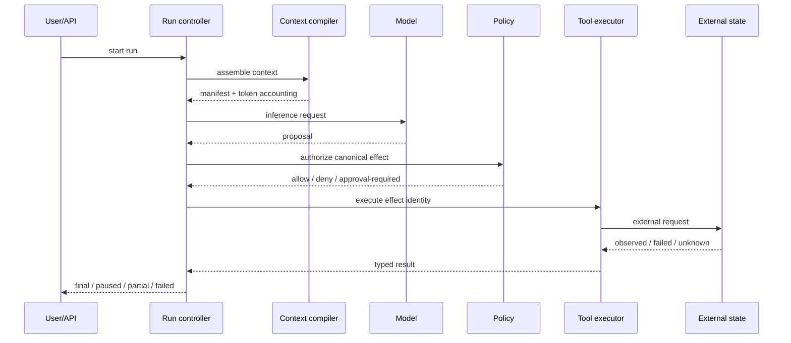
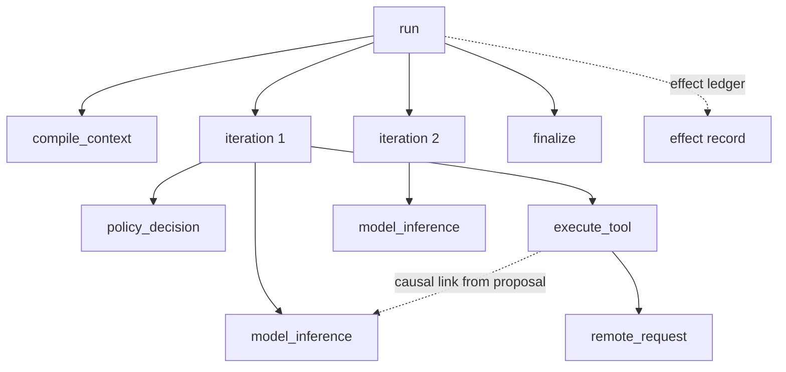
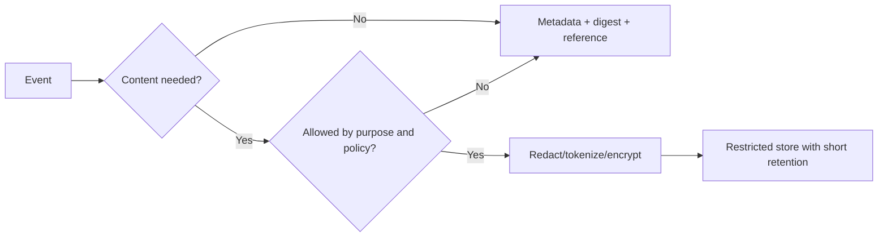

# Observability and Tracing for Agents

> **Status:** Research-backed draft  
> **Last researched:** 2026-08-30  
> **Scope:** Application-owned event semantics, distributed traces, metrics, logs, privacy, replay evidence, and operational diagnosis for agent runs.  
> **Standards note:** OpenTelemetry GenAI agent semantic conventions are explicitly **Development** as of this research date.  
> **Evidence:** [Security, evaluation, context, and memory research packet](../research/packets/security-evaluation-context-memory.md)  
> **Section index:** [Evaluation and observability](README.md)

An agent trace must explain decisions and effects across model, tool, policy, memory, and runtime boundaries. A chat transcript is insufficient: it does not reliably show what was authorized, committed, retried, persisted, or observed after failure.

## Three related but different records

| Record | Purpose | Retention and integrity |
|---|---|---|
| **Operational trace** | Diagnose latency, errors, causal path, and service dependencies | Sampled where appropriate; content minimized; correlated spans |
| **Evaluation transcript** | Reproduce and grade a trial | Versioned, access-controlled fixture with selected evidence |
| **Effect/audit ledger** | Prove policy decision and external-action state | Durable, append-only or tamper-evident, complete for material effects |

Do not force one record to serve all three purposes. Sampling a trace must never delete the only evidence of a financial or destructive effect.

## Canonical event flow

Every arrow should be traceable by stable IDs without requiring raw prompt capture.

## Application-owned event envelope

Keep a versioned event schema even when exporting to OpenTelemetry or a vendor platform.

| Field family | Recommended fields |
|---|---|
| Identity | `event_id`, `schema_version`, `event_type`, timestamp, monotonic sequence |
| Causality | `trace_id`, `span_id`, parent/link IDs, `run_id`, `attempt_id`, `step_id`, `effect_id` |
| Configuration | agent/prompt/model/tool/policy/context-compiler/memory/harness versions |
| Principal | tenant, end-user pseudonymous ID, workload identity, delegation/approval reference |
| Operation | phase, tool/operation name, canonical resource class, outcome/status, retryability |
| Cost and time | queue, model, tool, policy, approval, total latency; input/output/cached tokens; monetary estimate |
| Context | manifest/digest, lane token counts, retrieval IDs, compaction/checkpoint ID—not raw content by default |
| Policy/effect | decision, rule/version, reason code, approval digest, idempotency key, effect-state transition |
| Error | stable class, source, retryable flag, external status, unknown-outcome indicator |
| Data governance | sensitivity, content-capture mode, redaction version, retention class, access tier |

Prefer stable enums and IDs to free-form text. Keep vendor-specific payloads in namespaced optional fields.

## Trace topology

Parent-child spans capture execution nesting; span links can capture semantic causality when async queues, parallel tools, or replay break the tree. Preserve your own `run_id`, `attempt_id`, `step_id`, and `effect_id` because trace backends can sample, split, or expire data.

## OpenTelemetry: use with a stability layer

Current OpenTelemetry GenAI conventions cover agent creation/invocation, workflows, plans, tool execution, model operations, and selected attributes. They are useful for interoperability, but as of 2026-08-30:

- the agent/framework span document is marked **Development**;
- model/system content fields are opt-in because of cost and privacy;
- causal linking from a specific inference to a specific tool execution remains an open issue;
- grouping multi-step agent work into logical rounds/workflow units remains under design.

Therefore:

1. maintain a stable application event envelope;
2. map it to the current OTel version at export;
3. pin semantic-convention versions;
4. isolate schema migration in the exporter;
5. test that critical IDs and effect transitions survive backend ingestion.

## What to measure

### Outcome and reliability

- run terminal state and completion reason;
- task/state success from evaluator or business postcondition;
- policy denials, approval requests, approvals, expiries, and invalidations;
- effect attempts, committed/observed/failed/unknown/reconciled transitions;
- retry, replay, cancellation, timeout, and recovery rates;
- user correction, escalation, abandonment, and rollback.

### Quality and behavior

- tool selection/argument errors;
- unsupported claims and evidence coverage;
- repeated equivalent calls, plan churn, loop depth, handoff count;
- retrieval usefulness, stale/conflicting context, memory used/ignored;
- eval grader scores with grader/version and uncertainty.

### Performance and cost

- queue, context assembly, time-to-first-token, generation, policy, tool, approval, and end-to-end latency;
- input/output/reasoning/cached/cache-write tokens as provider exposes them;
- tool/API bytes, calls, retries, and rate-limit waits;
- cost by tenant, task class, successful outcome, model, and failure class;
- concurrency, saturation, backpressure, and abandoned in-flight work.

Aggregate by task and risk slice. Per-run token totals alone do not reveal whether expensive runs succeed.

## Content capture and privacy

Raw prompts, tool arguments, results, and model outputs can contain credentials, personal data, customer records, source code, medical/financial details, or adversarial payloads. Default to metadata and references.

Controls:

- classify before export and redact at source;
- use content capture only for declared debug/eval purposes;
- store references/digests and retrieval item IDs where possible;
- tokenize user identifiers and segregate tenants;
- encrypt separately and restrict support/evaluator access;
- set shorter retention for content than for aggregate metrics;
- make deletion propagate to trace content, eval datasets, and derived indexes;
- prevent credentials in headers, URLs, exception strings, model context, and screenshots;
- treat trace viewers and exported datasets as high-value attack surfaces.

Redaction rules themselves need versions and regression tests. A downstream DLP scan is a backstop, not permission to capture everything.

## Observability for replay and recovery

Replay needs more than model text:

- initial durable state and version;
- exact configuration and policy versions;
- context manifest and retrieved item versions;
- tool request identity and result/error class;
- external effect state and idempotency key;
- nondeterministic choices or recorded outputs where the runtime requires deterministic replay;
- cancellation/deadline and approval state;
- compaction/checkpoint/handoff lineage.

Do not automatically re-execute a historical effect during diagnostic replay. Use a no-effect harness or recorded adapter, and reconcile external state separately.

## Alerts with operational meaning

| Signal | Suggested alert condition |
|---|---|
| Unknown external outcome | Any high-impact effect; sustained rate for lower impact |
| Cross-tenant authorization mismatch | Any occurrence |
| Secret/DLP hit in telemetry | Any confirmed occurrence |
| Runaway behavior | Step/cost/tool-call near hard limit or repeated equivalent action pattern |
| Injection/policy denial | Adaptive/repeated pattern, sensitive-read + egress chain, or memory-write attempt |
| Reliability regression | Lower confidence bound or critical slice crosses gate |
| Latency/cost | Outcome-normalized tail crosses SLO/budget |
| Trace completeness | Missing effect/policy/causal events above tolerance |
| Memory anomaly | Sudden write volume, new high-trust item from low-trust source, tenant mismatch |

Alerts should link to a run timeline, affected principal/resource, policy decision, effect record, and safe operator action.

## Debugging workflow

1. Start from the observed business or user failure, not the last model message.
2. Locate the effect/state record and determine whether the outcome is known.
3. Walk causal links backward through tool, policy, proposal, context manifest, and source.
4. Compare the event sequence with required invariants and budgets.
5. Identify the first divergence, not every downstream symptom.
6. Reproduce with pinned state/configuration in a no-effect environment.
7. Add a regression task and a deterministic invariant where possible.

## Anti-patterns

| Anti-pattern | Consequence |
|---|---|
| One giant “agent span” | No attribution of model, policy, tool, wait, or retry latency |
| Transcript-only logging | Cannot prove effects, authorization, or recovery |
| Raw content everywhere | Privacy/secret breach and expensive telemetry |
| Vendor trace as sole system of record | Schema/stability lock-in and missing effect guarantees |
| Unversioned prompts, graders, and policies | Results cannot be reproduced or compared |
| High-cardinality values in metrics | Cost and backend failure; use trace/log dimensions appropriately |
| Sampling all failures the same as successes | May miss rare severe effects; use tail/risk-aware policies |
| Logging hidden chain-of-thought | Privacy and product risk without a reliable correctness oracle |

## Readiness checklist

- [ ] Run, attempt, step, tool, approval, and effect identities are stable and correlated.
- [ ] Policy decisions and effect-state transitions are durable even if traces are sampled.
- [ ] The application owns a versioned event schema and maps to pinned OTel conventions.
- [ ] Content capture is opt-in, purpose-bound, redacted, restricted, and deletable.
- [ ] Metrics connect cost/latency to outcomes and critical slices.
- [ ] Traces show cancellation, retry, replay, compaction, memory, and unknown outcomes.
- [ ] Operators can find the first causal divergence and reproduce it without reapplying effects.
- [ ] Trace completeness and redaction are themselves tested.

## Related guides

- [Evaluation-driven development](evaluation-driven-development.md)
- [Trajectory and reliability evaluation](trajectory-and-reliability-evaluation.md)
- [Durable execution](../runtime/durable-execution.md)
- [Idempotency and side effects](../reliability/idempotency-and-side-effects.md)
- [Context engineering](../context-memory/context-engineering.md)
- [Scaling, capacity, and SLOs](../operations/scaling-capacity-and-slos.md)
- [Deployment, release, and incident response](../operations/deployment-release-and-incident-response.md)
- [Production agent control plane](../architectures/production-agent-control-plane.md)

## Selected sources

- [OpenTelemetry GenAI agent semantic conventions](https://github.com/open-telemetry/semantic-conventions-genai/blob/main/docs/gen-ai/gen-ai-agent-spans.md)
- [OTel causal span linking issue #309](https://github.com/open-telemetry/semantic-conventions-genai/issues/309)
- [OTel workflow grouping issue #94](https://github.com/open-telemetry/semantic-conventions-genai/issues/94)
- [OpenAI trace grading](https://developers.openai.com/api/docs/guides/trace-grading)
- [Anthropic: Demystifying evals for AI agents](https://www.anthropic.com/engineering/demystifying-evals-for-ai-agents)
