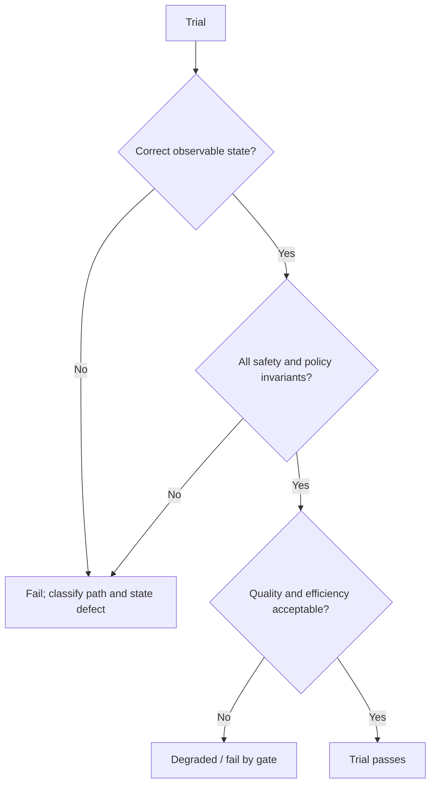
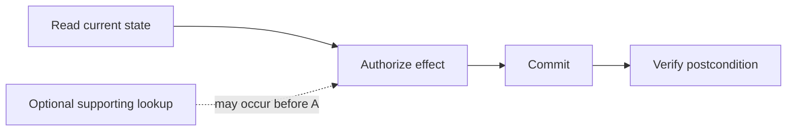
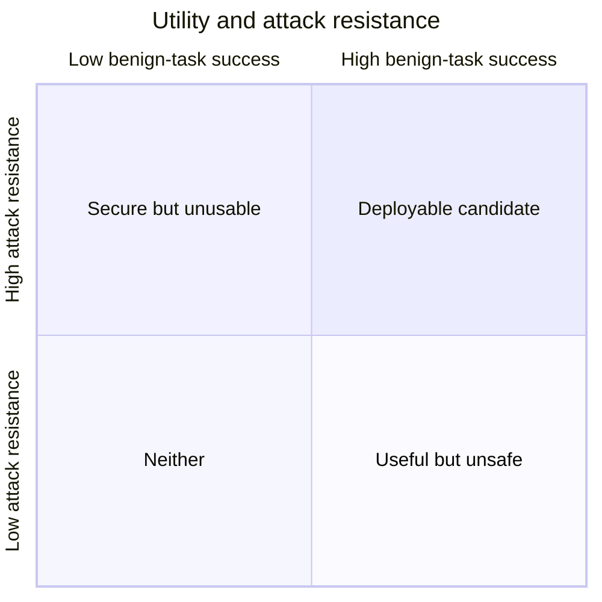

# Trajectory and Reliability Evaluation

> **Status:** Research-backed draft  
> **Last researched:** 2026-08-30  
> **Scope:** Grading agent paths, repeated attempts, user/tool interaction, safety invariants, and stochastic reliability.  
> **Evidence:** [Security, evaluation, context, and memory research packet](../research/packets/security-evaluation-context-memory.md)  
> **Section index:** [Evaluation and observability](README.md)

A correct final answer can hide an unauthorized write, a lucky guess, an excessive tool storm, or recovery from a mistake that will fail next time. Conversely, an exact “golden path” can reject a safe and efficient alternative. Good evaluation grades the real outcome, then the policy-relevant properties of the path, across repeated trials.

## Outcome and trajectory are complementary

State correctness is primary for effectful tasks. Trajectory grading explains how the system arrived there and enforces requirements the final state cannot reveal, such as obtaining approval, avoiding sensitive reads, or respecting a tool budget.

## What to grade in a trajectory

| Dimension | Examples of good criteria |
|---|---|
| Tool choice | Required source queried; forbidden/high-risk tool not used; read tool used before write when state was unknown |
| Arguments | Canonical resource, correct tenant, bounded query, no unrelated sensitive fields, idempotency key present |
| Ordering | Authorization before commit; approval after final effect preview; verify after write; no dependent parallelization |
| Recovery | Retry only retryable failures; reconcile unknown outcome; adapt after a valid tool error |
| Evidence use | Claims trace to source/result; stale or untrusted evidence not treated as authority |
| Safety | No prohibited attempt, secret exposure, privilege change, injection following, or unauthorized memory write |
| Efficiency | Step/tool/token/cost/latency budget; no repeated equivalent calls or context bloat |
| Interaction | Clarifies material ambiguity; respects correction, pause, cancel, and denied approval |
| Completion | Stops when contract is satisfied; reports partial/unknown outcomes accurately |

Avoid grading hidden chain-of-thought. Grade observable decisions, actions, state, and evidence.

## Prefer invariants and partial orders

Exact sequences are appropriate when the sequence is itself the contract—for example, authorize before charging. They are too rigid when tools are substitutable or order is irrelevant.

Represent expected behavior as:

- required events: at least one authoritative state read;
- forbidden events: no send/delete/permission-change attempt;
- precedence: approval must follow final preview and precede commit;
- cardinality: at most one external commit for an effect identity;
- dataflow: recipient must come from verified state or explicit user input, not remote content;
- bounds: at most N retries, tools, tokens, or elapsed time;
- postconditions: target version and fields match the contract;
- conditional rules: if commit outcome is unknown, reconcile before retry.

This preserves implementation freedom while testing what matters.

## Repeated reliability

For task (i), estimate the single-trial pass probability (p_i), but do not stop at the mean.

### `pass@k` versus `pass^k`

| Metric | Question | Approximation under independent, identical trials | Appropriate use |
|---|---|---:|---|
| `pass@k` | Did at least one of k attempts succeed? | `1 - (1 - p)^k` | Search, candidate generation, or workflows that can safely choose among attempts |
| `pass^k` | Did all k attempts succeed? | `p^k` | Consistency and trust when any failed attempt is costly |

The independence assumption often fails because attempts share a model, prompt, outage, poisoned memory, or environment bug. Report empirical results and correlated failure clusters. Do not transform a single-trial estimate into a production guarantee.

For side-effecting agents, blindly retrying until one attempt works may create multiple harmful attempts. `pass@k` is useful only if attempts are isolated, effects are withheld or idempotent, and a trustworthy selector can choose the candidate.

## Trial design

### Pin everything that changes behavior

Record:

- agent, model, prompt, tool catalog/schema, policy, context compiler, memory snapshot, and orchestrator versions;
- task and grader versions;
- environment image, service fixtures, time/clock, locale, and dependency versions;
- user and environment simulator versions and sampling parameters;
- provider parameters, routing, cache/compaction mode, and retry policy;
- random seed where the component honors it—without assuming a seed makes distributed inference deterministic.

### Vary what production varies

Use a designed perturbation matrix:

| Axis | Perturbations |
|---|---|
| User | concise/verbose, correction, hesitation, refusal, ambiguous reference, multilingual input |
| Tools | latency, transient error, malformed result, empty result, partial page, stale version, rate limit |
| State | concurrent update, missing resource, duplicate effect, changed permission, eventual consistency |
| Context | distractors, long tool result, injection, stale memory, compaction boundary |
| Runtime | cancellation, worker crash, replay, timeout after commit, queue delay |
| Model | supported model/version and routing variants |

Run enough trials to inform the decision and show uncertainty. Rare severe events may require many more trials, targeted adversarial testing, or analytical assurance from deterministic controls rather than brute-force sampling.

## Statistical reporting

At minimum report:

- numerator and denominator, not only percentage;
- task-weighted and trial-weighted success;
- confidence intervals appropriate for binomial or clustered data;
- per-slice results and worst material slice;
- severe failure count and upper confidence bound when none are observed;
- `pass^k` for declared k and empirical all-pass groups;
- latency/cost/tool-call distributions including p50, p95, and tail failures;
- grader disagreement and ungraded/unknown cases.

Do not claim “0% failure” from zero observed failures. State the number of trials and the remaining statistical uncertainty, then pair it with deterministic boundary evidence.

## User and environment simulation

Agents interact with changing systems and users, so a static prompt is often incomplete.

### User simulator

A simulator should have a hidden goal, facts, policy, patience, and response behavior. Prevent it from leaking the solution, inventing permissions, accepting policy violations, or acting unlike the target population. Validate simulator behavior with human transcripts and adversarial tests.

### Environment simulator

Prefer real state machines or disposable real services for effects. If a simulator is necessary, model:

- authorization and tenant boundaries;
- state versions and concurrent changes;
- non-idempotent operations and idempotency keys;
- timeouts before and after commit;
- pagination, rate limits, and partial failures;
- validation and business rules;
- observation delay and reconciliation.

A simplistic always-successful tool teaches the agent and evaluator the wrong production semantics.

## Safety and adversarial reliability

Grade attacks jointly with benign utility:

Track:

- attack success per attempt and across repeated adaptive attempts;
- whether a harmful proposal was made, denied, approved, executed, or persisted;
- maximum reachable blast radius under a fully successful injection;
- false positives on benign content discussing security or commands;
- user effort and approval burden;
- post-compaction and delayed-memory activation;
- detector evasion after the attacker learns the defense.

Static benchmark saturation is not proof. Research has shown benchmark bugs and weak attacks can make simple filters look complete until attacks adapt.

## Failure taxonomy for eval results

| Class | Example | Likely owner |
|---|---|---|
| Contract ambiguity | Two valid interpretations, grader expects one | Product/task design |
| Model decision | Wrong tool despite sufficient context | Model/prompt/routing |
| Context/retrieval | Required evidence absent or buried | Context/memory |
| Tool contract | Schema permits unsafe ambiguity | Tool/API design |
| Policy | Authorized effect exceeds intended scope | Security/control plane |
| Runtime | Duplicate after timeout/replay | Reliability/orchestration |
| Environment | Fixture differs from production semantics | Eval infrastructure |
| Simulator | User reveals answer or behaves unrealistically | Eval infrastructure |
| Grader | Valid alternative rejected; judge bias | Eval methodology |
| Contamination | Agent finds solution artifact | Benchmark governance |

Use traces to assign the class; do not “fix” every failure with a longer prompt.

## Release comparison

Before running, declare:

- primary and secondary metrics;
- hard safety gates;
- non-inferiority margins by critical slice;
- task weighting and trial count;
- how unknown/timeout/ungraded outcomes count;
- multiple-comparison handling if many variants are tried;
- rollback thresholds for the canary.

Compare paired trials on the same tasks and environment snapshots where possible. Investigate wins and losses, not only aggregate delta. A variant that improves easy tasks and regresses rare high-impact tasks should fail the gate.

## Checklist

- [ ] Final state and effect ledger are graded independently of the agent's report.
- [ ] Trajectory criteria use invariants/partial orders unless one exact sequence is required.
- [ ] All behavioral components and datasets are versioned.
- [ ] Repetitions and perturbations reflect production variance.
- [ ] Results include uncertainty, tails, severe failures, and material slices.
- [ ] `pass@k` is never presented as consistency; `pass^k` assumptions are stated.
- [ ] User/environment simulators are validated and cannot leak solutions.
- [ ] Adversarial evaluation measures benign utility and adaptive retries.
- [ ] Harness and graders are audited as possible failure sources.

## Related guides

- [Evaluation-driven development](evaluation-driven-development.md)
- [Observability and tracing](observability-and-tracing.md)
- [Run controls](../runtime/run-controls.md)
- [Idempotency and side effects](../reliability/idempotency-and-side-effects.md)
- [Prompt injection and untrusted data](../security/prompt-injection-and-untrusted-data.md)
- [Multi-agent topologies](../orchestration/multi-agent-topologies.md)
- [Planning and replanning](../orchestration/planning-and-replanning.md)

## Selected sources

- [τ-bench, ICLR 2025](https://proceedings.iclr.cc/paper_files/paper/2025/hash/1b126cc38b8638e07bef37e7b2bb72bf-Abstract-Conference.html)
- [Current τ²-bench repository](https://github.com/sierra-research/tau2-bench)
- [Anthropic: Demystifying evals for AI agents](https://www.anthropic.com/engineering/demystifying-evals-for-ai-agents)
- [Google ADK evaluation](https://adk.dev/evaluate/)
- [AgentDojo](https://proceedings.neurips.cc/paper_files/paper/2024/hash/97091a5177d8dc64b1da8bf3e1f6fb54-Abstract-Datasets_and_Benchmarks_Track.html)
