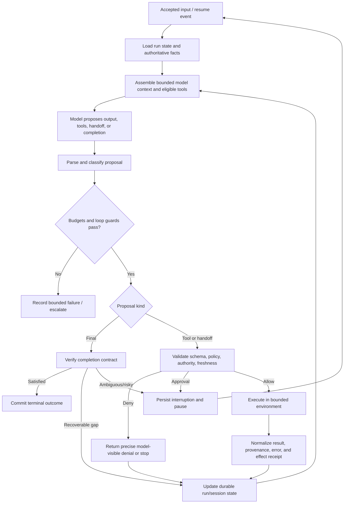
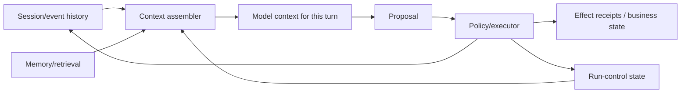
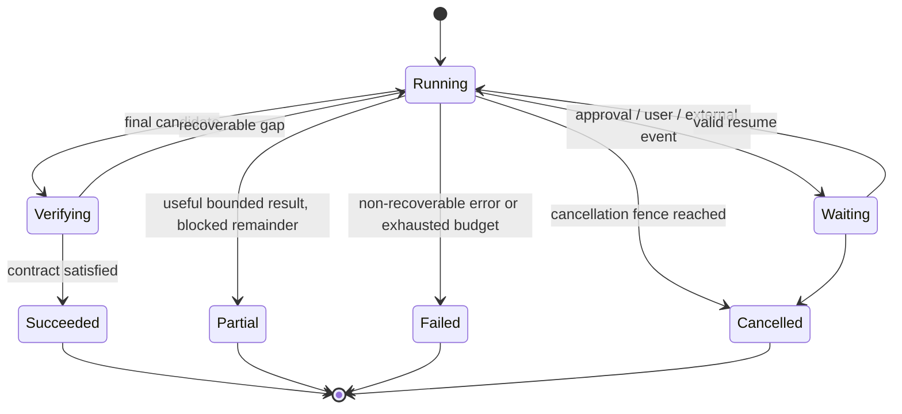

# The Production Agent Loop

> **Status:** Research-backed draft  
> **Last researched:** 2026-08-30  
> **Scope:** Framework-independent control flow for a bounded, observable, policy-enforced tool-using agent  
> **Research packet:** [Core agent loop and runtime boundary](../research/packets/core-agent-runtime.md)

## Mental model

The model does not execute the system. It proposes the next semantic action. The runtime decides whether that proposal is valid, authorized, affordable, safe to execute, and sufficient to finish.

ReAct's interleaving of reasoning, action, and observation is the historical core. Production systems add explicit policy, effect, state, recovery, and completion boundaries.

## Reference loop

## Loop invariants

These invariants are more important than a framework's class names:

1. **A proposal is not authority.** Tool visibility and schema validity never replace authorization at execution time.
2. **Every turn is bounded.** A run can end as success, safe partial result, escalation, cancellation, or explicit failure.
3. **Effects have identities.** A retry or replay can determine whether an action was already committed.
4. **Observations are typed and attributable.** The model receives useful data plus status, provenance, truncation, and error meaning.
5. **State is committed at known boundaries.** Recovery never relies only on whatever happened to be in model context.
6. **Completion is verified.** High-value success is checked against authoritative state or an explicit acceptance contract.
7. **Policy is rechecked near commit.** Authority or target state may change while a run waits or reasons.
8. **Nested work inherits limits.** Handoffs and subagents cannot escape the root run's authority, cost, or cancellation domain.

## Phase responsibilities

| Phase | Runtime responsibility | Do not delegate solely to the model |
|---|---|---|
| Accept | Authenticate caller, validate input, create stable run/tenant IDs | Identity or tenant selection |
| Load | Read run state, pending effects, approvals, relevant business facts | Guessing whether earlier effects completed |
| Context assembly | Select instructions, history, facts, tools, and budgets | Unlimited history/tool exposure |
| Model call | Request a constrained proposal; capture usage and provider metadata | Business authorization |
| Parse/classify | Validate response shape and classify final/tool/handoff/refusal | Treating malformed output as intent |
| Policy | Check tool eligibility, arguments, resource scope, freshness, and approval | Prompt-only security rules |
| Execute | Enforce timeout, cancellation, concurrency, sandbox, network, and idempotency | Free-form execution on the host |
| Normalize | Produce compact structured result, evidence, error category, receipt | Raw unbounded logs as context |
| Persist | Atomically record progress where possible | Conversation history as the only source of truth |
| Verify | Test completion contract and unresolved obligations | “I am done” as proof |
| Terminate | Record explicit terminal reason and deliver outcome | Silent truncation or ambiguous partial success |

## State is not one object

| State class | Examples | Retention and authority |
|---|---|---|
| Model context | Instructions, selected messages, tool schemas, recent results | Ephemeral inference input; never authoritative business state |
| Session/event history | User messages, proposals, tool observations, handoffs | Recoverable interaction record; may need redaction and compaction views |
| Run control | Turn count, budgets, pending calls, approvals, cancellation, lease | Authoritative for orchestration and recovery |
| Business/effect state | Orders, files, deployments, emails, receipts | Authoritative external truth; protected by domain authorization and idempotency |
| Long-term memory | Preferences, learned facts, procedures | Curated, scoped, freshness-checked; not a replay log |

OpenAI exposes several conversation-state strategies, LangGraph checkpoints graph state, LlamaIndex separates workflow context from memory, and Anthropic's Managed Agents architecture separates session history from harness context transformation. The names differ; the separation remains useful.

## Proposal classification

A robust runner recognizes more than “text” and “tool call”:

- final candidate;
- one or more tool calls;
- handoff/delegation request;
- request for human input or approval;
- refusal or policy denial;
- malformed/incomplete provider output;
- recoverable tool-argument error;
- terminal tool or infrastructure error;
- explicit safe partial result.

Map each class to a deliberate transition. Sending every error back to the model creates loops; aborting every malformed argument makes tools brittle.

## Sequential and parallel tool calls

Parallelism has two decisions:

1. May the provider/model propose more than one tool in a turn?
2. How many proposed calls may the runtime execute concurrently?

Current OpenAI SDK documentation explicitly separates those controls. A production runtime should also consider dependency and effect classes:

| Calls | Default execution | Reason |
|---|---|---|
| Independent, read-only, bounded | Parallel within a concurrency cap | Reduces latency with limited conflict risk |
| Same resource or shared mutable state | Sequential or locked | Avoids races and stale reads |
| External writes | Sequential unless an explicit transaction/coordination model exists | Easier idempotency, approval, and recovery |
| Mixed approval requirements | Do not let ungated sibling effects surprise the reviewer | Approval must define branch/barrier semantics |
| Large/unbounded results | Throttle and store artifacts out of context | Prevents memory/token blowups |

## Completion contract

Completion is a runtime decision informed by model output, not a phrase detector.

Define:

- required artifacts or authoritative state;
- validation/tests and acceptable tolerances;
- unresolved obligations that block success;
- whether partial completion is deliverable;
- maximum verification cost;
- escalation conditions;
- terminal reason taxonomy.

## Error and retry routing

Before retrying, answer three questions:

1. Did the operation have a side effect?
2. Is the same attempt safe to repeat under the same operation ID?
3. Should code retry the transport, should the model revise its proposal, or should the run stop?

| Error | Correct owner | Typical transition |
|---|---|---|
| Transient provider/network failure before acceptance | Transport/runtime | Bounded retry with backoff and replay-safety check |
| Tool arguments fail schema/business validation | Model-visible correction path | Return concise actionable error; consume tool retry budget |
| Authorization denial | Policy/runtime | Do not retry blindly; explain allowed alternatives or stop |
| External effect outcome unknown | Effect reconciler | Query by idempotency key/receipt; do not simply call again |
| Tool timeout with cooperative cancellation confirmed | Runtime | Retry only if effect is idempotent and budget permits |
| Tool timeout but work may continue | Runtime/operator | Fence future commit, reconcile orphan, then decide |
| Completion verification fails | Model or deterministic repair | Continue only with remaining budget and new evidence |
| Budget exhausted | Runtime | Terminal bounded failure or human escalation |

Pydantic AI's current retry documentation is a useful example of why layers must be named: transport, model fallback, tool correction, output correction, and hook retries do not share a single budget automatically.

## Minimum trace model

Capture enough to reconstruct decisions without requiring hidden reasoning:

- run, session, tenant, parent/child, and attempt IDs;
- model/provider/configuration version and usage;
- context manifest: source IDs, sizes, freshness—not necessarily sensitive content;
- eligible tool set and policy version;
- proposal class and tool/handoff metadata;
- policy decision, approval, and denial reason;
- tool timing, status, truncation, error class, idempotency key, and receipt;
- checkpoints and recovery/replay events;
- budget deltas and termination reason;
- completion-verification results.

OpenTelemetry's GenAI conventions are evolving; isolate semantic mappings behind one instrumentation layer and record the schema version.

## Anti-patterns

- A single unbounded `while` loop whose only stop condition is model text.
- Counting model turns but not tool calls, cost, elapsed time, or nested work.
- Executing a tool immediately after JSON validation with no policy boundary.
- Returning stack traces, secrets, or megabytes of logs to the model.
- Retrying an unknown-outcome write.
- Saving only conversation messages while losing approvals, budgets, and effect receipts.
- Assuming cancellation kills threads, subprocesses, remote jobs, and sibling branches.
- Treating checkpoint creation as proof that an external effect is committed exactly once.
- Letting a subagent inherit all tools and ambient credentials by default.
- Trusting the agent's final prose instead of authoritative verification.

## Production checklist

- [ ] Every transition in the loop has an owner and terminal behavior.
- [ ] State classes and authoritative stores are documented.
- [ ] Proposal parsing, policy, authorization, and execution are separate stages.
- [ ] Tool concurrency is capped independently of provider parallel-call settings.
- [ ] Read, reversible write, and irreversible effect classes have different controls.
- [ ] All retry layers and total budgets are inventoried.
- [ ] Unknown effect outcomes enter reconciliation, not blind retry.
- [ ] Approval state persists and is revalidated before commit.
- [ ] Cancellation reaches descendants and prevents late commits.
- [ ] Completion is verified against an explicit contract.
- [ ] Every terminal path records a reason and usable partial state.
- [ ] Crash, timeout, duplicate delivery, stale approval, and replay are tested.

## Related guides

- [Agentic systems](agentic-systems.md)
- [Execution boundaries](../runtime/execution-boundaries.md)
- [Run controls](../runtime/run-controls.md)
- [Durable execution](../runtime/durable-execution.md)
- [Tool contracts](../tools/tool-contracts.md)
- [Failure taxonomy](../reliability/failure-taxonomy.md)

## Research notes

The loop mechanics were cross-checked across the [OpenAI Agents SDK](https://openai.github.io/openai-agents-python/running_agents/), [Vercel AI SDK](https://ai-sdk.dev/docs/agents/loop-control), [LangGraph](https://docs.langchain.com/oss/python/langgraph/overview), [Pydantic AI](https://pydantic.dev/docs/ai/core-concepts/agent/), and [Strands](https://strandsagents.com/docs/user-guide/concepts/agents/agent-loop/). Runtime boundaries and failure guidance incorporate direct production reports and durable-engine documentation listed in the [research packet](../research/packets/core-agent-runtime.md).

