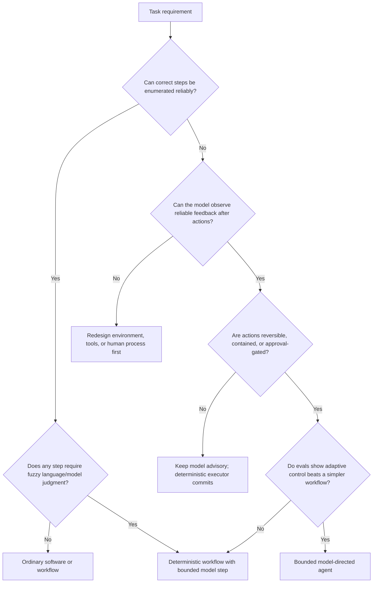
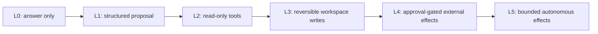
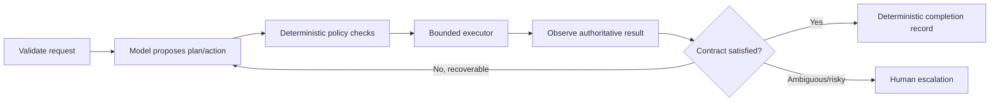

# Agentic Systems: Choose the Minimum Necessary Autonomy

> **Status:** Research-backed draft  
> **Last researched:** 2026-08-30  
> **Scope:** Deciding whether a capability should be ordinary software, a model-assisted workflow, a deterministic agentic workflow, or a model-directed agent  
> **Research packet:** [Core agent loop and runtime boundary](../research/packets/core-agent-runtime.md)

## Production position

Use an agent when the environment is variable enough that enumerating the correct action sequence is impractical, the model can observe meaningful feedback, and the value of adaptive decisions exceeds the additional cost, latency, and risk.

If the steps are known, encode them in ordinary code or a workflow. Model judgment can still be used inside those steps without giving the model control of the whole process.

## Four different systems often called “agents”

| System | Who chooses the next step? | Best fit | Primary risk |
|---|---|---|---|
| Ordinary software | Code | Stable rules, calculations, validations, transactions | Requirements or code defects |
| Model-assisted function | Code; model fills one bounded judgment/output | Classification, extraction, rewriting, ranking | Model error inside a narrow contract |
| Agentic workflow | Predetermined code paths with bounded model decisions | Known process with fuzzy decisions | Hidden nondeterminism inside apparently fixed flow |
| Model-directed agent | Model proposes actions dynamically from tools and observations | Open-ended, multi-step tasks in changing environments | Compounding errors, cost, unsafe actions, uncertain completion |

Anthropic's engineering vocabulary distinguishes **workflows**, whose paths are predefined in code, from **agents**, whose models dynamically direct tool use and process. This guide uses that distinction because it maps to runtime responsibility, not marketing terminology.

## Decision tree

## When autonomy earns its cost

An agent is most defensible when several of these are true:

- The task requires discovering which information or action is needed.
- The environment changes during execution and useful observations can update the plan.
- Inputs are unstructured and paths vary materially between cases.
- Success can be checked through tests, authoritative state, or a strong rubric.
- Failed attempts are cheap, reversible, isolated, or compensable.
- Human escalation is available for ambiguous intent or consequential decisions.
- A fixed workflow has been tried and fails on measured variation—not merely because an agent sounds more flexible.

Typical fits include bounded research, coding in an isolated workspace with tests, incident investigation with read-only tools, and customer-support resolution where policy and transactional effects remain enforced outside the model.

## When an agent is unnecessary or unsafe

Prefer deterministic code or a narrow model call when:

- the correct procedure is stable and known;
- the task is a one-shot transformation or retrieval;
- every valid action must follow a strict order;
- an incorrect action is irreversible, high-value, or difficult for a reviewer to understand;
- the environment provides weak or misleading feedback;
- success cannot be verified independently;
- latency, throughput, or cost is dominated by repeated inference;
- compliance requires a reproducible decision path that cannot rely on probabilistic control;
- the organization cannot yet trace, stop, recover, or audit the execution.

> [!IMPORTANT]
> “The model can probably follow the procedure” is not a reason to move a known procedure out of code. Natural-language control is harder to test, version, authorize, and recover.

## The autonomy ladder

Increase autonomy one measured step at a time.

| Level | Runtime responsibility before promotion |
|---|---|
| L0–L1 | Output validation, grounding, refusal/escalation |
| L2 | Tool authorization, untrusted-result handling, trace coverage, budgets |
| L3 | Workspace isolation, rollback, tests, cancellation, effect inventory |
| L4 | Legible approval, durable pause/resume, freshness check, exact target preview |
| L5 | Least privilege, containment, idempotency, commit-time authorization, continuous monitoring, incident response |

Promotion should require eval evidence at the next level. More capable models do not remove the need to cap authority.

## Hybrid systems are the production default

A strong design usually alternates deterministic and model-directed regions:

This preserves flexibility where the model adds value and keeps invariants in code:

- identity and tenant boundaries;
- authorization and business rules;
- schema and resource validation;
- idempotency and effect recording;
- budgets and time limits;
- completion criteria for high-value workflows;
- audit and retention requirements.

## Cost and reliability implications

Each open-ended loop turn adds another opportunity for model, tool, network, state, and policy failure. Even if each step is individually strong, long horizons can reduce end-to-end reliability. τ-bench's repeated-run metric (`pass^k`) is a useful reminder: a good single-run success rate can hide poor consistency over repeated attempts.

Autonomy also adds:

- repeated input/context tokens and model latency;
- tool discovery and result tokens;
- retries and verification calls;
- persistent state and recovery infrastructure;
- review and incident-response cost;
- new attack paths through tools and external content.

Measure task success against total cost and risk, not against a chat response that looks plausible.

## Weak implementations

| Anti-pattern | Why it fails | Better boundary |
|---|---|---|
| Put the whole business process in a system prompt | Rules are probabilistic, hard to diff semantically, and easy to lose in long context | Code the process; use the model at explicit judgment points |
| Give a general agent every API | Selection degrades, context grows, and blast radius expands | Task-scoped tools and lazy discovery with policy filtering |
| Treat a final natural-language claim as completion | The model can declare success without authoritative state | Verify artifacts, tests, database state, or receipts |
| Add subagents when one agent fails | Multiplies context, cost, and coordination errors | Diagnose the failed capability; add topology only for measurable isolation or parallelism |
| Use approval for every write | Causes fatigue without reducing ambient authority | Contain reversible work; gate only consequential boundary crossings |
| Assume a better model fixes the runtime | Does not fix duplicate effects, missing checkpoints, or broken cancellation | Engineer the loop and effect semantics independently |

## Design checklist

- [ ] The reason for model-directed control is written in one sentence.
- [ ] A simpler code/workflow baseline exists and has been evaluated.
- [ ] The environment returns authoritative observations.
- [ ] Success and safe partial completion are machine-checkable where possible.
- [ ] Each tool's authority and side effects are classified.
- [ ] The run has explicit turn, tool, time, token, cost, and concurrency budgets.
- [ ] High-impact effects are contained, approval-gated, or kept deterministic.
- [ ] State, session history, and business truth are separate.
- [ ] Retries cannot silently duplicate effects.
- [ ] Cancellation and recovery behavior are tested under failure.
- [ ] Traces support trajectory and final-state evaluation.
- [ ] There is an escalation path for ambiguous intent and failed verification.

## Signals to reduce autonomy

- Repeated plans or tools dominate traces.
- Most successful runs follow the same action sequence.
- Reviewers approve nearly everything without meaningful scrutiny.
- A deterministic verifier frequently corrects the agent after the fact.
- Cost/latency grows faster than task quality.
- Incidents arise from authority the workload rarely needs.
- Provider/model changes alter business behavior despite unchanged requirements.

When these appear, extract the stable sequence into code, narrow tools, and leave only the genuinely variable decision to the model.

## Related guides

- [The production agent loop](agent-loop.md)
- [Execution boundaries](../runtime/execution-boundaries.md)
- [Run controls](../runtime/run-controls.md)
- [Custom loop vs framework vs workflow engine](../comparisons/custom-loop-vs-framework-vs-workflow-engine.md)

## Research notes

The main architecture claims are triangulated from [Anthropic's workflow/agent distinction](https://www.anthropic.com/engineering/building-effective-agents), [OpenAI's practical guide](https://openai.com/business/guides-and-resources/a-practical-guide-to-building-ai-agents/), current SDK loop documentation, and reliability evidence from [AgentBench](https://arxiv.org/abs/2308.03688) and [τ-bench](https://proceedings.iclr.cc/paper_files/paper/2025/hash/1b126cc38b8638e07bef37e7b2bb72bf-Abstract-Conference.html). See the [research packet](../research/packets/core-agent-runtime.md) for complete claim scope and caveats.

