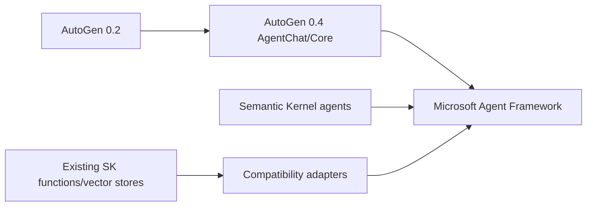
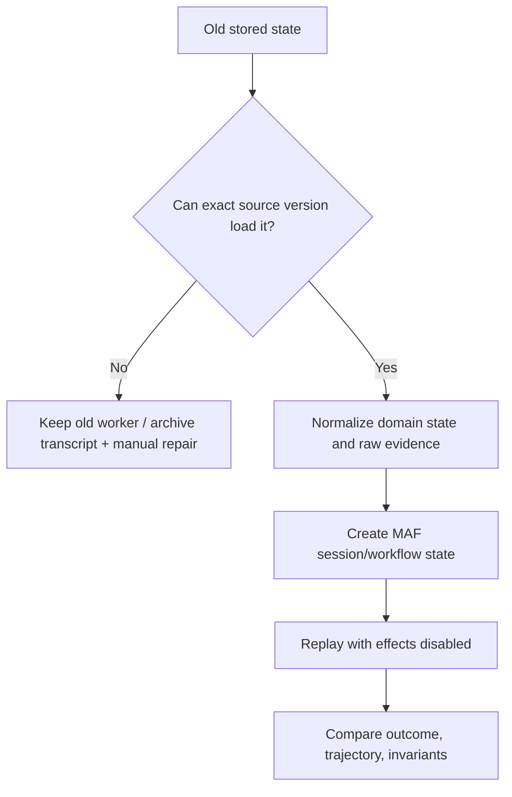
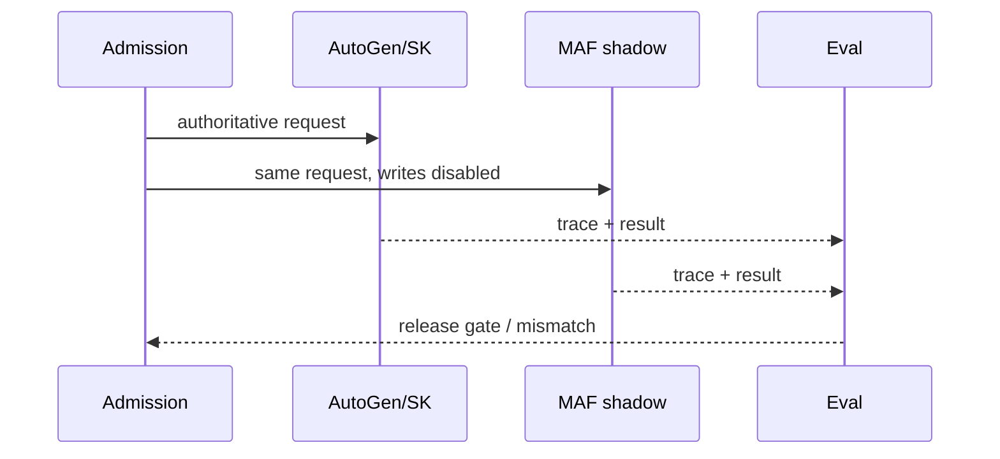

# Migrating AutoGen and Semantic Kernel Agent Systems

**Research date:** 2026-08-31  
**Status:** Research-backed migration guide  
**Direction:** Microsoft currently directs new agent projects and existing migrations to Microsoft Agent Framework

## Bottom line

Do not begin a strategic new system on AutoGen: its official repository is in maintenance mode, community-managed, and no longer receives new features. For existing AutoGen or Semantic Kernel agent systems, migrate behavior—not class names—to Microsoft Agent Framework (MAF), using workload traces and old persisted state as the acceptance contract.

Use the [AutoGen retained-production engineering guide](autogen/README.md) to operate, contain, test, and retire an existing AutoGen estate before or during migration.

Semantic Kernel remains useful beyond agents, including existing kernels, functions, filters, prompt assets, connectors, and vector-store components. Use the [Semantic Kernel retained-ecosystem guide](semantic-kernel/README.md) to decide what to stabilize, retain, adapt, or migrate. Move only the agent/runtime boundary that benefits; a staged adapter migration is safer than a rewrite.

## Establish the exact source estate

Before changing code, record:

- AutoGen 0.2 versus 0.4+, Python versus .NET, and exact package names;
- AgentChat versus Core runtime and standalone versus distributed deployment;
- AutoGen Studio/Bench, extensions, code executors, memory, and custom agents;
- Semantic Kernel language, agent types, `Kernel` plugins, thread/provider resources, orchestration patterns, and vector stores;
- maximum lifetime and format of stored teams, agents, threads, messages, approvals, and artifacts.

The old `pyautogen` package name is a supply-chain trap: Microsoft’s migration documentation says it lost administrative access after 0.2.34. Follow the official `autogen-agentchat` package guidance for any maintained 0.2 estate; do not trust the old name by familiarity.

## Map semantics, not APIs

| Source behavior | MAF direction | Migration proof |
|---|---|---|
| AutoGen `AssistantAgent` | `Agent` plus provider client | Default tool-loop count, final response, errors, usage |
| AutoGen RoundRobin | `SequentialBuilder` or workflow | Reset/termination and whether turns repeat |
| AutoGen SelectorGroupChat | `GroupChatBuilder` | Speaker eligibility, selector prompt, fallback |
| AutoGen Swarm | `HandoffBuilder` | Active-agent transfer, context visibility, stop rule |
| AutoGen Magentic-One | `MagenticBuilder` | Plan ledger, progress checks, final synthesis |
| AutoGen state save/load | MAF session/workflow checkpoint | Schema migration, in-flight safety, external effects |
| SK provider-specific agent/thread | MAF `Agent`/`AIAgent` and session | Hosted/local history and resource deletion |
| SK `KernelFunction`/plugin | Direct MAF tool or compatibility wrapper | Schema, DI scope, auth, error mapping |
| SK invocation stream | MAF response/update stream | Ordering, tool/reasoning parts, final aggregation |

The official migration samples note a critical default: AutoGen’s assistant may allow one tool iteration by default while a MAF agent can continue a multi-turn tool loop. A line-for-line port can therefore increase cost and side effects. Set explicit run-wide limits before comparison.

## State is the hardest migration surface

AutoGen team state recursively captures participant and manager state. Current source cautions that saving while a team is running can be inconsistent and that older formats may be incompatible. Pause/resume is experimental and custom agents own their resume behavior. This is continuity, not a business effect log.

Do not transform opaque pickle-like state with unreviewed deserialization. Load using a pinned isolated source worker, export a safe schema, and migrate only at a completed-turn/checkpoint boundary. Keep old workers available until long-running states drain or are explicitly abandoned.

MAF sessions can be local or service-managed. Provider thread/conversation deletion is not uniform and may remain a provider SDK responsibility. Maintain a resource inventory and deletion workflow during migration.

## Behavioral canary plan

1. Capture representative, adversarial, long, and failed source traces with provider responses recorded where policy permits.
2. Freeze source prompts, tools, model/provider, termination conditions, and state fixture versions.
3. Port one topology at a time, starting with a single agent.
4. Run shadow execution with external writes stubbed or routed to a dry-run adapter.
5. Compare outcome quality, tool visibility, message order, token/cost, latency, stop behavior, and operator repair.
6. Canary by tenant/workload with one write owner; retain an immediate route back only for new work.
7. Drain or pin old in-flight runs; never let both runtimes commit the same operation.

## Regression targets

- [ ] Tool outputs remain visible only to the intended downstream agents.
- [ ] Termination conditions reset, combine, and persist as expected.
- [ ] Handoff, selector, round-robin, and Magentic topology reaches the same completion contract.
- [ ] Streaming preserves provider IDs, tool/reasoning parts, cancellation, and terminal state.
- [ ] One explicit total limit bounds turns, tools, tokens, cost, concurrency, and wall time.
- [ ] Saved source state loads using the oldest supported source version.
- [ ] Approval/rejection resumes after a process/deployment change with policy revalidation.
- [ ] External writes use stable operation IDs and never depend on snapshot exactly-once behavior.
- [ ] Hosted thread/conversation/file/vector resources retain and delete according to policy.
- [ ] Telemetry schema, sampling, redaction, and correlation remain operable.
- [ ] AutoGen distributed-runtime assumptions have an explicit MAF hosting replacement.

## Keep AutoGen temporarily when

- an existing stable deployment has no current feature need and is isolated behind application contracts;
- migration risk exceeds the support risk for a bounded remaining lifetime;
- old persisted state must drain under its original code;
- the team maintains security patches, provider compatibility, and an exit date.

Maintenance mode is not immediate breakage. It is increasing opportunity cost and support ownership.

## Keep Semantic Kernel components when

- non-agent plugins, vector stores, connectors, or application services remain valuable;
- a compatibility wrapper lets MAF consume them without duplicating data migration;
- the retained SDK has a current support and security path.

Do not preserve the `Kernel` as a global service locator inside every new agent merely to avoid an adapter.

## Primary sources and failure-test leads

- [AutoGen official maintenance-mode repository](https://github.com/microsoft/autogen)
- [AutoGen v0.2→v0.4 migration](https://microsoft.github.io/autogen/stable/user-guide/agentchat-user-guide/migration-guide.html) and [Core runtime architecture](https://microsoft.github.io/autogen/stable/user-guide/core-user-guide/core-concepts/architecture.html)
- [AutoGen→MAF guide](https://learn.microsoft.com/en-us/agent-framework/migration-guide/from-autogen/) and [migration samples](https://github.com/microsoft/agent-framework/tree/main/python/samples/autogen-migration)
- [Semantic Kernel→MAF guide](https://learn.microsoft.com/en-us/agent-framework/migration-guide/from-semantic-kernel/)
- State adoption tests from [AutoGen team implementation](https://github.com/microsoft/autogen/blob/main/python/packages/autogen-agentchat/src/autogen_agentchat/teams/_group_chat/_base_group_chat.py) and [serialization issue #6793](https://github.com/microsoft/autogen/issues/6793)

See the [Microsoft Agent Framework production playbook](microsoft-agent-framework/README.md), [Semantic Kernel retained-ecosystem guide](semantic-kernel/README.md), [AutoGen retained-production guide](autogen/README.md), [evolving ecosystem selection](../comparisons/evolving-agent-framework-ecosystems.md), the [Semantic Kernel deep-dive packet](../research/packets/semantic-kernel-agents-deep-dive.md), and the earlier [ecosystem packet](../research/packets/framework-lifecycle-and-second-wave.md).
