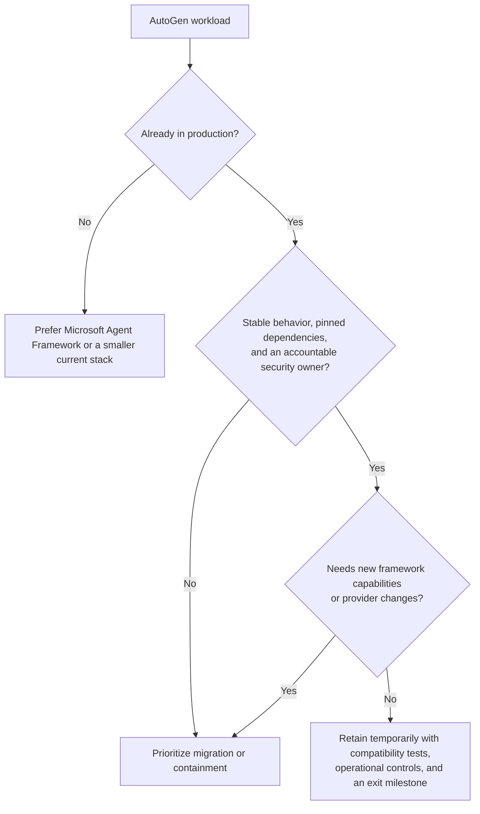

# AutoGen: retained-production engineering guide

> **Research snapshot:** 2026-08-31  
> **Primary line covered:** AutoGen Python 0.7.5  
> **Lifecycle:** maintenance mode; existing systems still run, but new feature development has moved to Microsoft Agent Framework.

AutoGen has not disappeared. Its repository, packages, documentation, security-reporting path, and community support remain available, and the project still accepts bug fixes, security patches, and documentation improvements. The operational consequence of maintenance mode is narrower: teams should not expect new framework capabilities, rapid compatibility work, or a vendor-backed feature roadmap. Retaining AutoGen can be reasonable for a stable deployment; selecting it for a new strategic platform usually is not.

This area documents the framework as it exists now, including the places where its abstractions stop. It distinguishes:

- documented contracts from behavior found in the official source;
- a useful in-process runtime from a durable workflow engine;
- resumable agent state from exactly-once execution;
- a prototype UI from a production control plane; and
- a controlled retention decision from indefinite framework drift.

## Lifecycle decision

Maintenance mode is not itself an emergency migration event. The triggers that matter are exposure to untrusted input or code, unsupported provider changes, defects outside the accepted maintenance scope, inability to reproduce the deployment, or an approaching business change that would require new framework behavior.

## Current package reality

These versions were verified on the research date. Recheck the official package registry and release page before changing an environment.

| Surface | Verified version/state | Production implication |
|---|---|---|
| Python `autogen-core`, `autogen-agentchat`, `autogen-ext` | 0.7.5; AgentChat and Extensions pin Core 0.7.5 | Pin the complete compatible set, not one package in isolation. |
| AutoGen Studio on PyPI | 0.4.2.2; dependency range is below AutoGen 0.6 | Do not install it into a 0.7.5 runtime. Isolate it as a prototype environment. |
| AutoGen Studio on repository `main` | Source version and ranges differ from the published package | Never infer deployable compatibility from repository `main`. |
| `Microsoft.AutoGen.Core` for .NET | 0.4.0-dev.3 prerelease | Treat .NET and Python as separate maturity/version surfaces; do not assume feature parity. |
| Repository lifecycle | Maintenance banner updated in April 2026 | Expect fixes/security/docs, not feature expansion. New users are directed to Microsoft Agent Framework. |

The similarly named `pyautogen` and `autogen` packages are a supply-chain trap. Microsoft states that it lost administrative access to `pyautogen`; releases after 0.2.34 are not Microsoft releases. For the old 0.2 line, the official migration guidance points to `autogen-agentchat~=0.2`. For current retained systems, record the exact distribution names, versions, hashes, index, and signer/attestation evidence in the deployment manifest.

## Guide map

Read the minimum path that matches the system:

| Need | Guide |
|---|---|
| Understand Core, AgentChat, Extensions, Studio, lifecycle, and compatibility boundaries | [Architecture and lifecycle](architecture-and-lifecycle.md) |
| Design message protocols, agent identity, routing, and runtime ownership | [Agents, messages, and runtime contracts](agents-messages-and-runtime-contracts.md) |
| Expose local tools, stateful workbenches, MCP servers, or code execution | [Tools, workbenches, MCP, and code execution](tools-workbenches-mcp-and-code-execution.md) |
| Choose RoundRobin, Selector, Swarm, Magentic-One, GraphFlow, or a single agent | [Teams, group chat, and control flow](teams-group-chat-and-control-flow.md) |
| Persist and restore state without inventing exactly-once guarantees | [State, persistence, and resume](state-persistence-and-resume.md) |
| Stream safely, interrupt a run, and involve humans | [Streaming, intervention, and human control](streaming-intervention-and-human-control.md) |
| Evaluate the gRPC runtime and deploy session workers | [Distributed runtime and deployment](distributed-runtime-and-deployment.md) |
| Instrument, test, replay, and diagnose behavior | [Observability, testing, and debugging](observability-testing-and-debugging.md) |
| Establish threat boundaries, quotas, retry rules, and incident controls | [Security, reliability, and operations](security-reliability-and-operations.md) |
| Pin, upgrade, retain, or migrate by behavioral contract | [Maintenance, upgrades, and migration](maintenance-upgrades-and-migration.md) |

The broader cross-framework decision is already covered in [AutoGen and Semantic Kernel migration](../autogen-and-semantic-kernel-migration.md). The target framework has its own [Microsoft Agent Framework guide](../microsoft-agent-framework.md).

## Production baseline

An AutoGen deployment should have all of the following before it handles valuable effects or untrusted content:

- exact package and artifact pins, including provider SDKs and executor images;
- one in-flight run per logical session, with optimistic concurrency or a lease;
- bounded turns, tool iterations, model calls, tokens, elapsed time, output size, and executor resources;
- a tool policy layer that validates structured arguments and authorizes the final operation;
- an idempotency/effect ledger outside AutoGen for externally visible writes;
- state snapshots written only at consistent boundaries, with schema and config fingerprints;
- an application-owned [state and event contract](../../runtime/agent-state-and-event-contracts.md) for stable identity, terminal outcomes, ordering, replay, and framework-independent repair;
- isolated code execution with no host Docker socket, ambient credentials, or unrestricted egress;
- telemetry redaction, because framework spans can contain message content;
- deterministic contract tests plus a small live-provider compatibility suite; and
- a named owner, an upgrade/incident procedure, and a dated migration decision.

If these controls sound larger than the application, a smaller explicit agent loop may be the better architecture. AutoGen is valuable when its message routing, team patterns, or extension ecosystem removes more complexity than it adds.

## What this guide does not claim

- A state snapshot is not a transaction log and does not make side effects exactly once.
- The gRPC runtime is not documented as a durable queue; several state operations are unimplemented in its worker runtime.
- `SingleThreadedAgentRuntime` does not mean handlers are serial: queued messages are received in order, while handlers run in separate asynchronous tasks.
- AutoGen Studio is not a production authentication, authorization, or deployment plane.
- A Docker-backed executor is safer than host execution but is not automatically hardened.
- GitHub issue reports are useful regression seeds, not evidence of incident frequency.

## Strongest primary sources

- [Microsoft AutoGen repository and maintenance statement](https://github.com/microsoft/autogen)
- [AutoGen releases](https://github.com/microsoft/autogen/releases)
- [AutoGen stable documentation](https://microsoft.github.io/autogen/stable/)
- [AutoGen security policy](https://github.com/microsoft/autogen/blob/main/SECURITY.md)
- [AutoGen support policy](https://github.com/microsoft/autogen/blob/main/SUPPORT.md)
- [Migration from AutoGen to Microsoft Agent Framework](https://learn.microsoft.com/en-us/agent-framework/migration-guide/from-autogen/)
- [Official Agent Framework migration samples](https://github.com/microsoft/agent-framework/tree/main/python/samples/autogen-migration)
- [Research packet for this guide set](../../research/packets/autogen-deep-dive.md)
