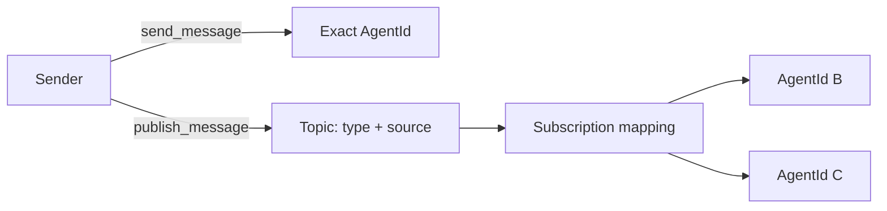

# Agents, messages, and runtime contracts

> **Applies to:** AutoGen Core and AgentChat 0.7.5.  
> **Research date:** 2026-08-31.

The safest way to design an AutoGen system is to start with its message protocol and ownership rules, then choose an agent abstraction. Starting with a powerful `AssistantAgent` and adding tools until a demo works often hides concurrency, context, and authorization assumptions that become expensive later.

## Identity and activation

A Core `AgentId` is `(type, key)`. The runtime uses registered factories to create an instance lazily for an identity and routes subsequent messages to it. Paging inactive agents out of memory is not implemented as a transparent runtime feature, so a large theoretical identity space does not automatically provide a scalable virtual-actor system.

Define the key deliberately:

- use a stable session or entity identifier, not an untrusted display name;
- include tenant scoping in the application lookup and authorization, not only in a string key;
- prevent two workers from owning the same stateful identity concurrently; and
- decide when an identity and its state expire.

The runtime can route to an identity, but the application must authenticate the caller and authorize access to that identity.

## Direct messages, topics, and subscriptions

Direct send represents request/response-style one-to-one interaction. Publish represents fan-out through subscriptions. A type subscription commonly maps the topic source to the target agent key, which is convenient for session-local pub/sub. If no subscription matches, a publication can have no recipient; absence of delivery is not necessarily an exception.

For each message type, document:

| Contract dimension | Question |
|---|---|
| Producer | Which authenticated component may emit it? |
| Recipient | Exact identity, topic subscription, or both? |
| Schema | Which fields are required, versioned, and size-bounded? |
| Context | Which fields are safe to place in model context or telemetry? |
| Delivery | May a handler see duplicates, concurrent messages, or late replies? |
| Effect | Is it read-only, reversible, idempotent, or approval-gated? |
| Failure | Who receives an error and what may be retried? |

## Message and event taxonomy

AgentChat distinguishes conversational messages from observable events:

- `BaseChatMessage` is content meant to participate in the conversation. Common variants include text, multimodal, structured, handoff, stop, and tool-call-summary messages.
- `BaseAgentEvent` describes activity visible to the application or user, such as a tool-call request/execution, model streaming chunk, thought, memory operation, or user-input request. It is not automatically an agent-to-agent statement.

Both carry useful correlation metadata such as IDs, source, creation time, usage, and metadata. Preserve these fields in logs and stream adapters, but do not assume every event is included in the final conversation. In particular, model streaming chunk events are yielded during streaming and intentionally excluded from `TaskResult.messages`.

Application message types should be structured data rather than prompts carrying hidden control syntax. Validate at the boundary and translate into provider-specific content only when calling the model.

## `AssistantAgent` ownership

`AssistantAgent` retains model context and is not thread-safe or coroutine-safe. Pass only new task messages on subsequent runs; replaying the entire history duplicates context. Never share one instance across concurrent requests. A practical ownership rule is one agent/team graph per logical session, with at most one active run and a versioned state record.

The default model context is unbounded. Long-lived sessions should select and test an explicit context strategy such as a buffered or token-limited context, while keeping authoritative business state outside the transcript. Context truncation changes model-visible facts; it is not merely a cost optimization.

An `AssistantAgent` can combine tools or workbenches, memory, handoffs, model streaming, structured output, and tool reflection. That breadth has behavioral consequences:

- the default `max_tool_iterations` is 1;
- a model may request multiple tool calls and the agent executes them concurrently by default when the model client permits it;
- `parallel_tool_calls=False` is important for ordered side effects and handoffs;
- reflection after tool use adds another inference and may change output/cost; and
- if multiple handoffs are emitted together, only the first is used.

When ordering is meaningful, represent it in deterministic application control flow. Do not hope the model happens to emit calls in a safe sequence.

## Runtime concurrency is easy to misread

`SingleThreadedAgentRuntime` has one input queue, but its source creates a separate asynchronous task to process each dequeued message. Queue reception is FIFO; handler completion and shared-resource access are not serialized. This matters for caches, mutable clients, files, and external effect adapters.

The runtime is documented for development and standalone applications rather than high-throughput/high-concurrency workloads. Its default `ignore_unhandled_exceptions=True` can delay surfacing background handler failures until later processing or shutdown. Configure and test error propagation rather than treating an empty response as success.

Shutdown choices differ:

- `stop_when_idle()` drains work to an idle boundary and is normally the graceful option;
- `stop()` lets the current message finish and discards following queued work; and
- the busy-wait-style `stop_when()` helper is discouraged in the source documentation.

Close model clients, workbenches, executors, and runtimes explicitly. Process exit is not a reliable cleanup protocol.

## Exception, cancellation, and retry contract

Establish one application-level result envelope that distinguishes:

- deterministic validation/policy rejection;
- transient provider or transport failure before an effect;
- model/tool timeout;
- user or operator cancellation;
- uncertain effect outcome; and
- framework/programming defect.

Retries belong at the boundary that knows whether an operation is safe. A model call may be retryable; a tool that submitted an order may not be. Carry an idempotency key into every effect adapter and record the outcome in an external ledger. AutoGen message IDs are useful correlation identifiers, not a complete effect-idempotency system.

Cancellation tokens must be propagated into model clients, tools, and executors, and user code must honor them. For a cooperative, state-consistent stop at a turn boundary, use the AgentChat external termination pattern; reserve immediate cancellation for deadlines or emergency revocation and treat the session as needing consistency review afterward.

## When to write a custom agent

Prefer a smaller custom Core or AgentChat agent when:

- it should accept only a narrow typed protocol;
- it must never invoke arbitrary tools selected from a large catalog;
- ordering or transaction phases must be deterministic;
- context construction requires domain-specific rules;
- state must have a stable, explicitly versioned schema; or
- tests need to assert exact transitions rather than a conversational trace.

Keep `AssistantAgent` when its standard tool loop and context behavior are the behavior you actually want. Replacing it with a custom wrapper that recreates every feature adds risk without reducing authority.

## Contract checklist

- [ ] Every stateful agent/team instance has one owner and one active run.
- [ ] Message schemas, size limits, producers, recipients, and versions are documented.
- [ ] Routing keys are never treated as authentication or authorization.
- [ ] Context retention/truncation is explicit and tested.
- [ ] Parallel tool calls are disabled wherever calls conflict or order matters.
- [ ] Message/event IDs propagate into model, tool, effect, and telemetry records.
- [ ] Handlers and effect adapters have a documented retry/idempotency policy.
- [ ] Graceful drain, immediate cancellation, and crash recovery are tested separately.

## Sources

- [Agents and agent runtime](https://microsoft.github.io/autogen/stable/user-guide/core-user-guide/framework/agent-and-agent-runtime.html)
- [Message and communication](https://microsoft.github.io/autogen/stable/user-guide/core-user-guide/framework/message-and-communication.html)
- [Topic and subscription](https://microsoft.github.io/autogen/stable/user-guide/core-user-guide/core-concepts/topic-and-subscription.html)
- [AgentChat agents tutorial](https://microsoft.github.io/autogen/stable/user-guide/agentchat-user-guide/tutorial/agents.html)
- [AgentChat message reference](https://microsoft.github.io/autogen/stable/reference/python/autogen_agentchat.messages.html)
- [`SingleThreadedAgentRuntime` source](https://github.com/microsoft/autogen/blob/main/python/packages/autogen-core/src/autogen_core/_single_threaded_agent_runtime.py)
- [`CancellationToken` source](https://github.com/microsoft/autogen/blob/main/python/packages/autogen-core/src/autogen_core/_cancellation_token.py)
