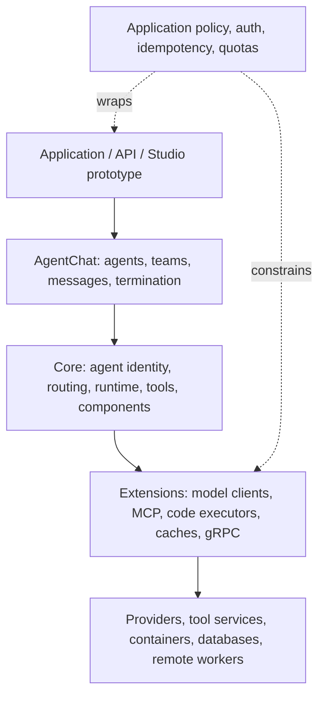

# Architecture and lifecycle

> **Applies to:** AutoGen Python 0.7.5 unless a surface is named explicitly.  
> **Research date:** 2026-08-31.

AutoGen is best understood as a layered message-driven framework, not as one agent class. Core provides identities, routing, runtimes, tools, and component contracts. AgentChat supplies opinionated conversational agents and team patterns. Extensions integrates model providers, MCP, executors, caches, and other infrastructure. Studio is a separate prototyping product with its own package cadence and compatibility constraints.

## The application stack

The dotted policy boundary is intentionally application-owned. AutoGen coordinates calls, but it does not know the business authorization for a wire transfer, whether a duplicate ticket is safe, or which tenant may read a document. Those decisions must live outside model-generated text and remain enforceable even if an agent is compromised.

## Core

Core exposes the event-driven programming model:

- an `AgentId` combines an agent type and key;
- factories lazily create agent instances when the runtime first routes to an identity;
- direct messages target one agent;
- published messages target a topic and are mapped to agents by subscriptions;
- runtimes own delivery, serialization, lifecycle, and state behavior; and
- component configuration can be serialized independently of live agent state.

The message types are the real application protocol. A robust system treats them like public API schemas: version them, validate them, define who may emit them, and make handlers idempotent where a retry can occur. A string topic source or agent key is useful for routing, but is not an authorization boundary.

Core currently exposes two very different runtime profiles:

| Runtime | Suitable use | Important limit |
|---|---|---|
| `SingleThreadedAgentRuntime` | development, embedded applications, bounded single-process workloads | FIFO queue intake does not serialize handler tasks; it is not intended for high-throughput distributed work. |
| gRPC worker/host runtime in Extensions | experimental cross-process/cross-language routing | no durable-delivery contract; worker state APIs are unimplemented; source contains reconnect, timeout, and cancellation limitations. |

Do not write code against a generic “runtime” assumption. Persisted state, intervention handlers, delivery failure, and shutdown semantics differ by implementation.

## AgentChat

AgentChat sits on Core and provides a smaller application-facing vocabulary:

- `AssistantAgent` combines a model client, model context, tools/workbenches, optional memory, handoffs, and reflection;
- `BaseChatMessage` objects carry conversational content between participants;
- `BaseAgentEvent` objects expose observable actions such as tool calls and streaming chunks;
- teams run multiple participants under a group-chat manager or graph; and
- termination conditions stop a run and are reset after a completed run.

`AssistantAgent` is intentionally broad—the documentation calls it a “kitchen sink” agent. It is excellent for proving a flow, but a high-risk production agent often benefits from a smaller custom agent with an explicit message protocol and fewer capabilities. AgentChat objects are stateful and generally must not be shared between concurrent tasks.

AgentChat often creates an embedded Core runtime. That makes Core behavior relevant even when application code never constructs a runtime directly. For example, AgentChat configures unhandled runtime exceptions differently from the standalone runtime default so background failures surface more readily.

## Extensions

Extensions contains most environmental authority:

- provider-specific chat-completion clients;
- MCP clients and workbenches;
- local and Docker code executors;
- caches, memory adapters, and search tools;
- gRPC runtime components; and
- optional integrations with a broad dependency matrix.

This package should be installed with only the extras a deployment needs. Every model SDK, MCP transport, browser, database adapter, and executor expands the compatibility and vulnerability surface. Pin extras and transitive dependencies in the same tested lockfile as Core and AgentChat.

## Studio

AutoGen Studio is a rapid-prototyping UI, not the production runtime tier. Its own documentation describes it as experimental/research software, and its authentication support is experimental and disabled by default. The published 0.4.2.2 package constrains AutoGen dependencies below 0.6, so it cannot share an environment with the 0.7.5 framework set.

Use Studio to explore components and export a candidate configuration. Then review that configuration as untrusted input, move it into a separately built runtime, replace secrets with references, apply policy and tenancy, test it, and deploy through normal controls. Do not expose Studio itself as an internet-facing operations console or rely on its WebSocket/authentication experiment for production identity.

## Component configuration is not live state

AutoGen has two serialization concepts:

| Concept | Examples | Purpose |
|---|---|---|
| Component configuration | provider, model name, tool/component declarations, team construction | reconstruct compatible objects |
| Live state | model context, team thread, current turn, manager-specific progress | continue a particular session |

A component dump does not capture a live conversation. A state snapshot does not necessarily carry the code/config needed to interpret it. A restorable deployment stores both, plus application schema versions, exact packages, prompt/tool fingerprints, and any external-effect receipts.

Callable selectors, approval functions, graph conditions, and other Python callables are not generally serializable component configuration. Reattach them from trusted code during construction and validate that restored configuration cannot name arbitrary import paths or commands.

## Lifecycle reality

The repository says AutoGen is in maintenance mode: no new features or enhancements are planned; maintenance is community-managed; accepted work is focused on bug fixes, security patches, and documentation. New users are directed to Microsoft Agent Framework, developed by the teams behind AutoGen and Semantic Kernel.

That produces three reasonable postures:

| Posture | Use when | Required discipline |
|---|---|---|
| Retain | stable existing workload, reproducible environment, bounded exposure, no new framework needs | pins, compatibility tests, security ownership, operational containment, exit date |
| Contain then migrate | valuable workload with unsafe execution, provider drift, weak state/effect controls, or high change rate | reduce authority first; migrate behavior incrementally |
| Start elsewhere | new workload or major redesign | evaluate Microsoft Agent Framework, a provider SDK, or a simple custom loop based on actual needs |

Do not freeze merely because the version is pinned: provider APIs, model behavior, base container images, certificates, OS libraries, and vulnerabilities continue to change. Conversely, do not perform an untested flag-day rewrite only because of the banner. Migration risk is a production risk too.

## Compatibility ledger

Keep a small machine-readable deployment record even though this repository remains Markdown-only:

| Record | Why it matters |
|---|---|
| exact distributions, versions, hashes, and index | prevents package-name confusion and unreproducible installs |
| Python/.NET/runtime/OS/container versions | establishes executable compatibility |
| provider model, API version, SDK, endpoint capabilities | model-client behavior is provider-specific and changes independently |
| prompt, tool schema, component config, state schema fingerprints | explains behavior and restore compatibility |
| MCP server artifact/digest and declared capabilities | remote/local tool authority is code-level dependency |
| known open defects and regression tests | turns maintenance uncertainty into controlled evidence |
| owner, last validation date, migration trigger/date | prevents “temporary retention” becoming unowned permanence |

## Sources

- [AutoGen repository maintenance statement](https://github.com/microsoft/autogen)
- [Application stack](https://microsoft.github.io/autogen/stable/user-guide/core-user-guide/core-concepts/application-stack.html)
- [Runtime architecture](https://microsoft.github.io/autogen/stable/user-guide/core-user-guide/core-concepts/architecture.html)
- [AgentChat agents](https://microsoft.github.io/autogen/stable/user-guide/agentchat-user-guide/tutorial/agents.html)
- [AutoGen Studio documentation](https://microsoft.github.io/autogen/stable/user-guide/autogenstudio-user-guide/index.html)
- [AutoGen Core on PyPI](https://pypi.org/project/autogen-core/)
- [AutoGen Studio 0.4.2.2 on PyPI](https://pypi.org/project/autogenstudio/0.4.2.2/)
- [Microsoft.AutoGen.Core on NuGet](https://www.nuget.org/packages/Microsoft.AutoGen.Core/)
- [AutoGen FAQ and package-name warning](https://github.com/microsoft/autogen/blob/main/FAQ.md)

