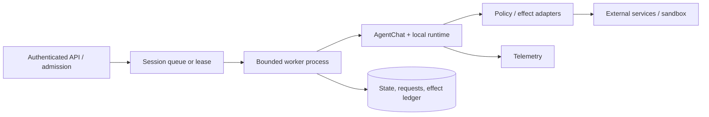
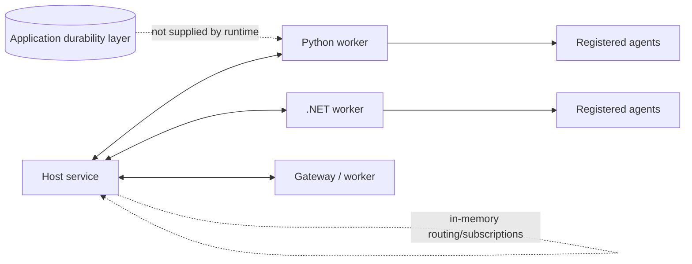

# Distributed runtime and deployment

> **Applies to:** AutoGen Core/Extensions 0.7.5 and AgentChat applications deployed as session workers.  
> **Research date:** 2026-08-31.

AutoGen's gRPC runtime provides experimental cross-process and cross-language message routing. It should not be mistaken for a durable workflow engine or message broker. Its current worker source leaves state APIs unimplemented and contains open implementation limitations around reconnects, timeouts, errors, and cancellation. Use it only when those semantics are acceptable and covered by application infrastructure.

## Two architectures, two contracts

### Embedded session worker

This is the default production shape for most retained deployments. A worker reconstructs one compatible team per session, runs one bounded task, saves state, and releases resources. Horizontal scale comes from many independent session workers, not from sharing a live agent object.

### AutoGen distributed runtime

Workers and the host exchange serialized messages over gRPC using shared protobuf/CloudEvents-oriented contracts. Cross-language operation therefore requires compatible protobuf schemas and behavioral semantics, not just matching agent names.

## What the gRPC runtime does not establish

Current official code and migration guidance do not establish:

- durable broker-backed delivery;
- exactly-once processing or effects;
- automatic recovery of in-flight requests after host/worker failure;
- implemented worker save/load state and metadata APIs;
- transparent reconnection with replay;
- a production SLA; or
- Python/.NET package feature parity.

The worker read loop can log an exception and continue, while request futures and connection loss need application-level treatment. The host's connection/subscription mappings are not a durable session record. If losing or duplicating a message would violate the business contract, put a durable command/workflow layer outside AutoGen.

## Decision rule

Use the embedded architecture unless at least one measured requirement needs AutoGen-level remote agent routing or Python/.NET interoperability. Even then, compare:

| Option | Strength | Trade-off |
|---|---|---|
| embedded workers + durable queue | simple recovery and operational boundary | agent-to-agent calls remain inside a process/job |
| durable workflow engine + bounded AutoGen activities | explicit retries, timers, human waits, compensation | another system and serialization boundary |
| AutoGen gRPC runtime + application durability | native remote agent routing | experimental semantics; team owns recovery/control plane |
| domain services with ordinary RPC/events | strong typed service boundaries | less agent-native routing flexibility |

Do not deploy the gRPC runtime merely because the application uses multiple agents. AgentChat teams already run in one process.

## Session-worker deployment contract

### Admission and ownership

Authenticate requests before model context construction. Map the principal to tenant/session, enforce quotas, and require a request idempotency key. Serialize writes per session using a queue/partition key, lease, or optimistic state version. Reject or queue overlapping runs; AgentChat teams cannot run concurrently.

### State and effects

Persist state in a real database/object store, not the official FastAPI sample's single JSON files. That sample is educational: it uses local files, permissive CORS, and no production authentication, tenant isolation, database concurrency, or effect ledger. Copy its API shape only after replacing those assumptions.

Keep effect idempotency and receipts outside framework state. A worker crash after an external write but before snapshot commit is an uncertain outcome that must be reconciled, not retried as a whole conversation.

### Dependency and artifact isolation

Build an immutable artifact with exact AutoGen/provider dependencies. Keep Studio in a separate environment. Start MCP servers and executors with explicit identities, mounts, network, and limits. Do not inject broad platform credentials into the agent process; use short-lived, audience-restricted credentials at the tool adapter.

### Graceful shutdown

1. stop admitting new runs;
2. let active runs reach an external-termination or terminal boundary within a grace period;
3. cancel remaining work and mark affected sessions for reconciliation;
4. commit only known-consistent state/receipts;
5. close workbenches, model clients, executors, runtime, and telemetry exporters; and
6. release leases after commits/uncertain markers are durable.

`SingleThreadedAgentRuntime.stop()` discards queued messages after the current one; `stop_when_idle()` is the normal graceful drain. Test the shutdown path with real tools rather than relying on process signals alone.

## Capacity and backpressure

Budget per request:

- concurrent sessions and per-tenant concurrency;
- model calls, tokens, and cost;
- team turns/messages and tool iterations;
- wall time and individual model/tool deadlines;
- stream buffer and result/artifact bytes;
- executor CPU, memory, processes, disk, and network; and
- MCP/provider request rate.

Autoscaling should use queued work and measured latency/cost, not the count of agent objects. Protect providers and tools with global concurrency/rate limiters. A runaway team can otherwise amplify one user request into many simultaneous model and tool calls.

## Failure and recovery table

| Failure | Required evidence | Response |
|---|---|---|
| worker dies before effect | request/run record only | reconstruct from last committed state and retry under same request key |
| worker dies after effect request | effect ledger/provider status | reconcile; never assume failure means no effect |
| host/worker gRPC disconnect | message/request correlation and application command record | fail explicitly or reconcile; do not claim transparent replay |
| state-version conflict | stored/current versions and lease owner | discard stale result or rerun from current state per product policy |
| provider behavior change | live contract test and exact endpoint/model metadata | rollback/pin/disable affected capability |
| executor exceeds resource limit | sandbox event and artifact receipt | kill/destroy sandbox, quarantine artifacts, review external effects |

## Distributed-runtime evaluation checklist

- [ ] The use case needs remote agent routing, not merely horizontal request scale.
- [ ] Message schemas are shared, versioned, and cross-language tested.
- [ ] Delivery, duplicate, timeout, disconnect, and cancellation semantics are application-defined.
- [ ] Durable commands, state, and effects live outside the runtime.
- [ ] Host and worker loss are tested with fault injection.
- [ ] Observability correlates caller, host, worker, agent, model, and tool IDs.
- [ ] There is a simpler fallback architecture if maintenance gaps block a defect.

## Sources

- [Core runtime architecture](https://microsoft.github.io/autogen/stable/user-guide/core-user-guide/core-concepts/architecture.html)
- [Distributed agent runtime](https://microsoft.github.io/autogen/stable/user-guide/core-user-guide/framework/distributed-agent-runtime.html)
- [gRPC worker runtime source](https://github.com/microsoft/autogen/blob/main/python/packages/autogen-ext/src/autogen_ext/runtimes/grpc/_worker_runtime.py)
- [gRPC host service source](https://github.com/microsoft/autogen/tree/main/python/packages/autogen-ext/src/autogen_ext/runtimes/grpc)
- [Single-threaded runtime source](https://github.com/microsoft/autogen/blob/main/python/packages/autogen-core/src/autogen_core/_single_threaded_agent_runtime.py)
- [AgentChat FastAPI sample](https://github.com/microsoft/autogen/tree/main/python/samples/agentchat_fastapi)
- [Microsoft migration guide from AutoGen](https://learn.microsoft.com/en-us/agent-framework/migration-guide/from-autogen/)
