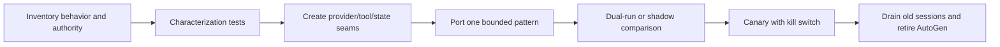

# Maintenance, upgrades, and migration

> **Decision date:** 2026-08-31. Revisit on any security/provider incompatibility, required new capability, or ownership change.  
> **Current retained Python line:** 0.7.5.

AutoGen maintenance mode changes the optimization target. The goal is no longer to accumulate framework-specific features; it is to keep a stable retained workload safe and reproducible while reducing the cost and risk of eventual migration. New projects should normally start with Microsoft Agent Framework or a smaller current architecture.

## What maintenance mode means

The official repository says:

- no new AutoGen features or enhancements are planned;
- maintenance is community-managed;
- contributions are limited to bug fixes, security patches, and documentation improvements; and
- new users should start with Microsoft Agent Framework.

It does **not** mean existing packages stop executing or that every workload must be rewritten immediately. Security reporting, package metadata, docs, releases, issues, and community channels remain. It does mean response time and future compatibility must not be assumed, and the team retaining AutoGen owns a credible fallback.

## Retain, contain, or migrate

| Signal | Retain temporarily | Contain and prioritize migration |
|---|---|---|
| workload change | stable, bounded behavior | frequent feature/provider/integration change |
| reproducibility | exact lock, images, config, state corpus | cannot rebuild or verify package identity |
| authority | read-only/reversible or strongly gated | arbitrary code, broad credentials, high-value effects |
| defects | known issues covered by tests/mitigations | required fix outside maintenance scope or unavailable |
| state/effects | tested snapshots and external receipts | opaque state, overlapping runs, blind retries |
| ownership | named security/operations owner and exit date | unowned dependency or indefinite exception |
| target parity | migration gap currently riskier than retention | target behavior validated and rollout ready |

Containment can be valuable before migration: remove host code execution, narrow tools and egress, put AutoGen behind typed APIs, externalize state/effect receipts, and isolate provider/MCP clients. Those controls both reduce current risk and create migration seams.

## Upgrade discipline inside AutoGen

Pin Core, AgentChat, and Extensions as a tested set. AgentChat/Extensions 0.7.5 pin Core 0.7.5 exactly; provider extras add their own compatibility surface. Keep Studio out of this environment because its published dependency range is below 0.6.

Review every release between current and target. Recent history shows why:

| Release | Relevant change examples | Regression focus |
|---|---|---|
| 0.6.0 | GraphFlow concurrent fan-out; callable conditions experimental | ordering, shared effects, serialization |
| 0.6.2 | streaming tools, multiple tool iterations, GenAI spans | stream/event contract, budgets, telemetry data |
| 0.6.4 | GraphFlow state retained after termination until graph completion | resume/reset behavior |
| 0.7.1 | nested teams, richer MCP, code-executor approval, parallel-tool control, state JSON fix | team config, MCP capability, approvals, state corpus |
| 0.7.4 | Redis-related fixes | integration-specific compatibility |
| 0.7.5 | streaming correlation, graph cycle, MCP pending-future and Docker security changes | correlation, graph termination, disconnects, executor policy |

The table is a testing guide, not a complete changelog. Read the official notes and diff for every used component.

Upgrade gate:

1. build a clean candidate artifact from the lockfile and verify package provenance;
2. run deterministic orchestration, state, stream, cancellation, and policy tests;
3. restore and continue a redacted corpus of real state shapes;
4. run live provider/MCP/executor compatibility canaries;
5. shadow or canary without external writes, then with tightly scoped idempotent writes;
6. drain old workers before writing incompatible state; and
7. preserve a rollback artifact and state-read strategy.

## Migration is behavioral, not a class rename

Microsoft Agent Framework (MAF) was created by the teams behind AutoGen and Semantic Kernel, but its architecture is not binary-compatible. The official guide contrasts AutoGen's event-driven Core/team model with MAF's agent plus typed graph workflow/data-flow model. State, sessions, checkpointing, streaming events, tool-loop defaults, and provider clients differ.

Before selecting a target class, capture:

- input/output schemas and validation;
- model context construction and retention;
- provider/model capabilities and exact tool-call behavior;
- default and maximum tool iterations;
- parallel tool-call ordering;
- team speaker/handoff/graph semantics;
- message/event streaming and terminal result;
- termination reset, cancellation, and human-wait behavior;
- component config and state snapshot semantics;
- tool authorization, approval, idempotency, and receipts; and
- latency, token/call cost, error, and quality baselines.

A key documented difference: AutoGen `AssistantAgent` defaults to one tool iteration, while MAF agents can perform multi-turn tool use automatically. A literal port can therefore change cost, latency, number/order of effects, and termination. Set explicit limits and compare trajectories.

## Pattern mapping to Microsoft Agent Framework

The official migration samples provide these starting correspondences:

| AutoGen | MAF starting point | What still needs proof |
|---|---|---|
| `AssistantAgent` | Agent | context, tool-loop, provider, state/session behavior |
| `RoundRobinGroupChat` | sequential/group-chat workflow builder | visibility, stop/reset, output aggregation |
| `SelectorGroupChat` | group-chat workflow builder | selection prompt/rules and routing trace |
| `Swarm` | handoff workflow builder | allowed topology, context shared on handoff, parallel calls |
| `MagenticOneGroupChat` | Magentic workflow builder | planning/stall limits, tools, security boundary |
| GraphFlow/custom Core routing | typed workflow graph/edges or application orchestration | checkpoint and transition semantics |
| agent as a tool | agent tool wrapper | nesting, budgets, cancellation, trace correlation |

These are conceptual mappings, not state/config converters. Follow the current MAF documentation for provider support and hosting; do not assume the migration guide's deployment-status statements remain static.

## Strangler migration plan

### 1. Inventory and freeze

Record packages, models, prompts, tools, teams, runtime, Studio-produced artifacts, state schemas, data classes, external effects, known issues, traffic, cost, and owners. Stop adding AutoGen-specific features unless necessary for containment.

### 2. Characterize

Create replay tests and live golden scenarios for successful, rejected, timed-out, cancelled, and uncertain-effect paths. Snapshot representative pre/post states and typed trajectories.

### 3. Extract application contracts

Move authentication, policy, tool schemas, effect idempotency, state envelope, and telemetry IDs behind framework-neutral interfaces. Keep the implementation simple; the seam should reflect a real business boundary, not a generic “agent platform.”

### 4. Port a low-risk slice

Choose a read-only or reversible workload with few sessions and a clear rubric. Rebuild it with explicit target limits rather than copying defaults.

### 5. Shadow and compare

Run the target on captured/redacted inputs without committing effects. Compare validated output, trajectory constraints, tool intent, context exposure, latency, calls/tokens/cost, and failure behavior. Natural-language equality is neither required nor sufficient.

### 6. Canary effects

Route a small cohort with a kill switch, same external idempotency ledger, and rapid fallback. Do not let both systems commit the same effect unless the provider key makes the operation provably deduplicated.

### 7. Drain and retire

Pin old sessions to AutoGen until complete or explicitly migrate their state at a clean boundary. Disable admission, revoke credentials/tools, archive audit/state per retention policy, remove packages/images/MCP artifacts, and keep the characterization corpus for incident/audit needs.

## Rollback

Rollback must address both code and state. Define:

- which version may read the latest snapshots;
- whether new effects are visible/idempotent to the old path;
- how traffic/session affinity is reversed;
- when rollback is unsafe because state or business effects advanced; and
- how to reconcile canary sessions instead of silently moving them backward.

A package rollback without a state/effect strategy is not a rollback plan.

## Other destination choices

MAF is the official successor, not the only valid architecture. A provider SDK plus a small explicit loop can be better for one model and a handful of tools. A durable workflow engine with bounded agent activities can be better for timers, days-long human work, retries, and compensation. Conventional services are better when behavior is deterministic. Choose the minimum system that meets the verified contract.

## Sources

- [AutoGen maintenance statement](https://github.com/microsoft/autogen)
- [AutoGen releases](https://github.com/microsoft/autogen/releases)
- [Python migration guide and package-name history](https://microsoft.github.io/autogen/stable/user-guide/agentchat-user-guide/migration-guide.html)
- [Migration from AutoGen to Microsoft Agent Framework](https://learn.microsoft.com/en-us/agent-framework/migration-guide/from-autogen/)
- [Official AutoGen-to-Agent-Framework samples](https://github.com/microsoft/agent-framework/tree/main/python/samples/autogen-migration)
- [AutoGen support policy](https://github.com/microsoft/autogen/blob/main/SUPPORT.md)
- [AutoGen security policy](https://github.com/microsoft/autogen/blob/main/SECURITY.md)
- [Repository cross-framework migration guide](../autogen-and-semantic-kernel-migration.md)
- [Repository Microsoft Agent Framework guide](../microsoft-agent-framework.md)

