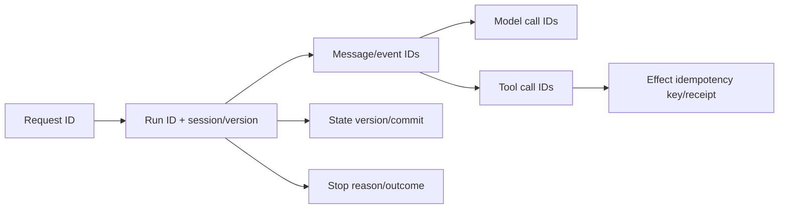

# Observability, testing, and debugging

> **Applies to:** AutoGen Core, AgentChat, and Extensions 0.7.5.  
> **Research date:** 2026-08-31.

An AutoGen system is diagnosable only if a user request can be followed across run, message, model, tool, external effect, state commit, and streamed output. Framework telemetry supplies useful spans and events, but the application must add its own session/effect semantics and protect message content.

## Observability model

Carry these identifiers as structured fields rather than embedding them in free-form prompts. Record the exact component/package/config fingerprints needed to reproduce the run.

## Built-in telemetry and logging

Core and AgentChat integrate with OpenTelemetry. Instrumented surfaces include the single-threaded and gRPC runtimes, tool execution, chat-agent invocation, and model-related GenAI spans. Tracing can be disabled with a no-op tracer provider or `AUTOGEN_DISABLE_RUNTIME_TRACING=true` where collection is not allowed.

There are several distinct streams:

- Core trace logs are human-oriented and their formatting is not a stable machine contract.
- Core event logs are structured framework activity.
- AgentChat trace/event logs describe team and participant activity.
- OpenTelemetry spans support distributed correlation and provider/tool timings.

The runtime telemetry source can serialize message content into span attributes. Assume prompts, messages, tool arguments/results, file paths, and errors can be sensitive. Use an allowlist processor before export, attribute-length limits, encryption, access controls, tenant-aware sampling, and retention/deletion policies. Avoid recording authentication headers or secrets at the source.

Add application spans for admission, state load/commit, policy decision, human approval, idempotency reservation, effect reconciliation, and stream delivery. Default framework spans cannot know those business boundaries.

## Minimum run record

| Category | Fields |
|---|---|
| identity | tenant (pseudonymous if possible), session, request, run, parent run |
| build | AutoGen/provider packages and hashes, application revision, executor/MCP digests |
| behavior | component/config, prompt/tool schema, model endpoint/capability fingerprints |
| trajectory | typed message/event sequence, speaker/transition, tool intent and outcome |
| resource | token usage, model/tool calls, latency, retries, bytes, executor limits |
| control | termination/cancellation source, stop reason, approval/policy decision |
| durability | input/output state versions, commit result, effect receipt/watermark |
| outcome | validated result class, user-visible error, uncertainty/reconciliation status |

Store full payloads only in a restricted debug artifact when necessary; use hashes, schemas, classifications, and bounded redacted excerpts in routine telemetry.

## Testing pyramid

### Deterministic contract tests

Use fake tools and `ReplayChatCompletionClient`, which returns queued model responses and records create calls. These tests should assert:

- exact message/event types and required metadata;
- tool schema and normalized arguments;
- context construction/truncation;
- one versus multiple tool iterations;
- parallel tool-call behavior and ordering controls;
- team speaker/graph transition and termination reset;
- stream chunk correlation and final `TaskResult`;
- state round-trip with compatible configuration; and
- cancellation/timeout propagation.

Replay tests validate orchestration contracts, not model quality. They must not be the only evaluation.

### Scenario and adversarial tests

Run representative tasks with rubric-based output validation and trajectory constraints. Include prompt injection from users, retrieved documents, MCP results, and tool errors; unauthorized cross-tenant identifiers; oversized results; repeated handoffs; stalled teams; malformed structured output; and attempts to exceed tool/code authority.

Test that refusal/containment happens below the model. A test that merely expects the agent to say “I cannot” does not prove the tool adapter refused the call.

### Failure and recovery tests

Fault-inject every boundary:

- provider timeout before/after response bytes;
- tool disconnect before/after an effect;
- stream consumer disconnect and reconnect;
- worker death before/after state commit;
- stale lease and state-version conflict;
- MCP server restart or schema drift;
- executor OOM/timeout/network denial; and
- shutdown during model, tool, and human-wait phases.

Use issue reports as targeted seeds. For example, the 0.6.4 team-state datetime failure fixed in 0.7.1 motivates JSON round-trip tests; current GraphFlow interruption and condition reports motivate crash-at-transition tests. Do not infer defect rates from issue counts.

### Live compatibility tests

Maintain a small, cost-bounded suite against every production provider/model/API version. Assert capability contracts—tool call shape, structured output, streaming correlation, usage availability, cancellation, and error classes—rather than exact natural language. Run before package/model/provider changes and periodically to detect remote drift.

Avoid making AutoGenBench the primary 0.7 validation strategy. Its official package documentation is oriented to legacy 0.1/0.2 benchmark workflows. Use application-owned tests and current AgentChat interfaces unless maintaining a compatible legacy benchmark is an explicit requirement.

## Debugging procedure

1. Reproduce with the exact package lock, model endpoint/API version, config, prompt/tool fingerprints, and redacted pre-run state.
2. Locate the first divergence in the typed message/event trajectory, not only the final answer.
3. Determine whether it originated in context construction, provider output, routing/selection, tool policy/execution, state restore, or stream presentation.
4. Replay up to that boundary with deterministic model/tool doubles.
5. Run the smallest live-provider test necessary to isolate remote behavior.
6. Add a regression test before changing framework/application code.

Common signals:

| Symptom | First checks |
|---|---|
| repeated old user message | caller may be passing full history to a stateful `AssistantAgent` |
| missing streaming text in saved messages | chunks are events and excluded from `TaskResult.messages` |
| nondeterministic side effects | parallel tool calls or concurrent session runs |
| team cannot run again | previous cancellation/incomplete terminal handling; termination/state consistency |
| restore changes behavior | package/config/name/tool/prompt mismatch, missing workbench/remote state |
| hidden handler failure | runtime unhandled-exception configuration and background task logs |
| trace data leak | message/tool content serialized into log/span attributes |

## Release gate

- [ ] Lockfile and artifact digests are reproducible.
- [ ] Deterministic orchestration, state, streaming, and cancellation suites pass.
- [ ] Adversarial policy/tool/code-execution tests pass.
- [ ] Crash-point and uncertain-effect recovery tests pass.
- [ ] Live tests pass for every deployed provider/model endpoint.
- [ ] Telemetry redaction is verified with canary secrets.
- [ ] Cost, latency, loop, and error budgets meet thresholds.
- [ ] Known relevant AutoGen issues have explicit accept/mitigate/test decisions.

## Sources

- [Core telemetry](https://microsoft.github.io/autogen/stable/user-guide/core-user-guide/framework/telemetry.html)
- [AgentChat tracing and observability](https://microsoft.github.io/autogen/stable/user-guide/agentchat-user-guide/tracing.html)
- [Core logging](https://microsoft.github.io/autogen/stable/user-guide/core-user-guide/framework/logging.html)
- [ReplayChatCompletionClient](https://microsoft.github.io/autogen/stable/reference/python/autogen_ext.models.replay.html)
- [Runtime telemetry source](https://github.com/microsoft/autogen/tree/main/python/packages/autogen-core/src/autogen_core/_telemetry)
- [AutoGenBench package README](https://github.com/microsoft/autogen/blob/main/python/packages/agbench/README.md)
- [Team-state issue #6793](https://github.com/microsoft/autogen/issues/6793)
- [GraphFlow interruption issue #7043](https://github.com/microsoft/autogen/issues/7043)

