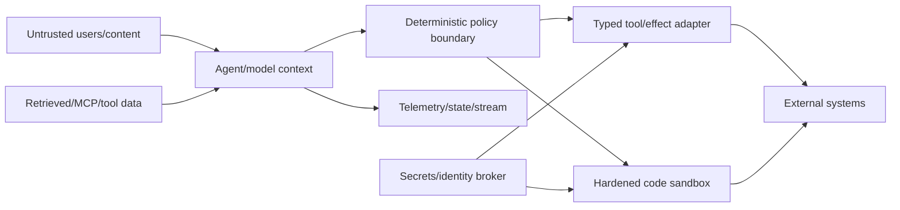

# Security, reliability, and operations

> **Applies to:** retained AutoGen 0.7.5 deployments.  
> **Research date:** 2026-08-31.

The production security model cannot be “the agent follows its system prompt.” Model input is untrusted, tool output can contain adversarial instructions, and a correct-looking trajectory can still duplicate an external effect after a timeout. Security and reliability meet at the same boundaries: identity, capability, resource limits, durable receipts, and recoverable state.

## Threat model

Every arrow is a data-flow review point. Retrieved data and tool results remain untrusted even if they came from an authenticated service. The model can propose an operation; only deterministic code can authorize and commit it.

Primary threats include:

- direct and indirect prompt injection causing unauthorized tool use or data disclosure;
- cross-tenant access through agent keys, session IDs, caches, state, or shared workbenches;
- supply-chain substitution through confusing package names, unpinned MCP commands/images, or mutable model/tool configuration;
- arbitrary code escaping through mounts, daemon sockets, credentials, or network access;
- duplicate/uncertain effects after cancellation, timeout, retry, or crash;
- sensitive prompts, tool arguments, results, and secrets leaking through spans, logs, streams, or snapshots;
- unbounded loops, parallel tool calls, fan-out, output, or executor consumption; and
- lifecycle risk when a maintenance-mode dependency no longer receives desired enhancements or compatibility work.

## Identity, tenancy, and authorization

Authenticate at the application edge and propagate an immutable execution context—not model-visible identity claims—into policy/tool adapters. The context should contain principal, tenant, session, scopes/roles, request/run IDs, and policy version.

Agent IDs, topic sources, participant names, and tool arguments are routing/application data. Never trust them to select a tenant or privileged resource. Resolve resources under the authenticated tenant, then authorize the exact action.

Use separate state keys, encryption context, cache namespace, artifact bucket prefix, workbench/MCP session, telemetry attributes, rate limits, and executor environment per tenant/session as appropriate. Test cross-tenant identifier substitution at every API and restore path.

## Secrets

- keep secrets out of prompts, component dumps, agent state, Studio exports, logs, and images;
- obtain short-lived audience-restricted credentials at the tool boundary;
- expose a specific capability rather than the raw credential;
- clear environment/files and destroy the sandbox after use;
- rotate on exposure and make revocation interrupt/cancel active privileged work; and
- scan/redact provider and tool errors before returning them to the model.

An MCP stdio server inherits the client process environment unless explicitly restricted. A Docker executor can also receive secrets through environment variables or mounted files. Both require allowlisted injection, not inheritance.

## Supply chain and lifecycle controls

Pin official distribution names, versions, hashes, package index, and trusted-publishing/attestation evidence. Microsoft states that it lost administrative access to `pyautogen`; versions after 0.2.34 are not Microsoft releases. Do not “upgrade” a legacy environment based on a package name alone.

Also pin:

- provider SDKs and model API versions;
- MCP server package/image/commit and schema hash;
- executor base image by digest and installed packages;
- prompt, tool, component, and state schemas; and
- OS/container/runtime artifacts.

Scan continuously even when framework code is frozen. AutoGen's generic security policy provides a private Microsoft reporting path, but it does not publish a supported-version matrix or remediation SLA. Record a contingency to isolate, patch locally, replace the affected integration, or migrate if a critical defect is not fixed in time.

## Resource and authority budgets

Enforce ceilings outside the model:

| Layer | Required limits |
|---|---|
| request/session | concurrency, rate, total wall time, total cost/tokens |
| team/agent | messages/turns, model calls, tool iterations, handoffs/stalls |
| provider/tool | timeout, retry budget, parallel calls, request/result bytes |
| stream | buffer, event rate, reconnect retention, public payload schema |
| executor | CPU, memory, PIDs, disk/files, wall time, network, mounts, artifacts |
| storage/telemetry | snapshot/artifact/log size, retention, tenant quota |

Combine semantic termination with hard budgets. Disable parallel tool calls when operations conflict, ordering matters, a handoff is possible, or aggregate authority would exceed policy.

## Reliable effect protocol

For every externally visible write:

1. normalize the operation and derive a stable idempotency key from the application request/step;
2. validate and authorize exact arguments;
3. reserve the key in an external ledger;
4. call a provider API that supports idempotency when available;
5. record provider request/receipt/status;
6. return a bounded semantic result to the agent; and
7. commit agent state with the effect watermark.

Classify failures as known-not-applied, known-applied, or uncertain. Retry only the first category (or query/reconcile the third). Retrying the entire model run can change the plan and is not an idempotency mechanism.

Compensation is a domain operation, not database rollback. Define who may compensate, whether it is safe, and what happens when compensation fails.

## Incident response

### Contain

- stop admission or disable the affected tool/MCP server/provider route;
- revoke scoped credentials and cancel active privileged runs;
- isolate executor artifacts and preserve relevant immutable receipts;
- block state writes from stale workers if the schema/runtime is suspect.

### Establish facts

Correlate request, run, message, tool, effect, state version, package/config fingerprint, principal, and timestamps. Determine which effects are known, absent, or uncertain. Do not rely on the conversational transcript alone.

### Recover

- reconcile provider state using receipts/idempotency keys;
- restore from the last compatible known-good snapshot only after effect reconciliation;
- patch/pin/disable and run deterministic, adversarial, crash-point, and live compatibility gates; and
- migrate or contain longer if the maintenance line cannot meet the needed fix window.

### Learn

Add a regression test at the first violated boundary, narrow authority, update the compatibility ledger and threat model, and set a new retention/migration decision date.

## Operational readiness checklist

### Before launch

- [ ] Official package identity and full dependency lock are verified.
- [ ] Threat/data-flow reviews cover user, retrieved, MCP, tool, executor, state, stream, and telemetry content.
- [ ] One active writer per session and external effect idempotency are enforced.
- [ ] Tools authorize below the model and use short-lived credentials.
- [ ] Code execution is disposable, resource-limited, network-restricted, and has no daemon socket.
- [ ] Termination, cancellation, timeout, retry, and uncertain-effect paths are fault-tested.
- [ ] State/telemetry are encrypted, redacted, access-controlled, and retention-bound.

### Continuously

- [ ] Track AutoGen releases/security reports and relevant dependency/provider changes.
- [ ] Run live provider/tool compatibility canaries.
- [ ] Alert on loops, budget exhaustion, policy rejects, duplicate keys, uncertain effects, state conflicts, and restore failures.
- [ ] Exercise shutdown, credential revocation, tool kill switch, restore, and migration rollback.
- [ ] Review the named owner and migration milestone on schedule.

## Sources

- [AutoGen security policy](https://github.com/microsoft/autogen/blob/main/SECURITY.md)
- [AutoGen support policy](https://github.com/microsoft/autogen/blob/main/SUPPORT.md)
- [AutoGen FAQ and package warning](https://github.com/microsoft/autogen/blob/main/FAQ.md)
- [AutoGen 0.7.5 release security changes](https://github.com/microsoft/autogen/releases/tag/python-v0.7.5)
- [MCP workbench reference](https://microsoft.github.io/autogen/stable/reference/python/autogen_ext.tools.mcp.html)
- [Command-line code executors](https://microsoft.github.io/autogen/stable/user-guide/core-user-guide/components/command-line-code-executors.html)
- [Magentic-One security guidance](https://microsoft.github.io/autogen/stable/user-guide/agentchat-user-guide/magentic-one.html)
- [Runtime telemetry](https://microsoft.github.io/autogen/stable/user-guide/core-user-guide/framework/telemetry.html)

