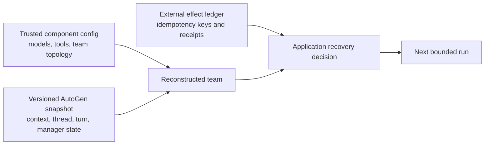
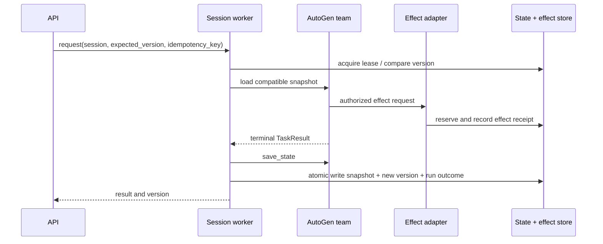

# State, persistence, and resume

> **Applies to:** AutoGen AgentChat/Core 0.7.5. Runtime support varies by implementation.  
> **Research date:** 2026-08-31.

AutoGen state lets compatible objects continue a conversation or team run. It is not a durable event log, a database transaction, or a proof that an external side effect happened exactly once. Production recovery requires a boundary around both AutoGen state and the real-world effects it requests.

## Configuration, state, and effects



All three inputs are necessary. Component configuration reconstructs behavior, live state reconstructs progress, and the effect ledger establishes what happened outside the framework.

## What state contains

The exact schema is component-specific:

- `AssistantAgent` state primarily carries its model context;
- a team state recursively contains participant and group-chat-manager state;
- manager state may include the group thread, current turn, next speaker, graph progress, or pattern-specific fields;
- tools/workbenches may implement their own state contract; and
- Core runtime state is implementation-defined.

From AutoGen 0.4.9 onward, team state is keyed by participant names rather than agent IDs. Configuration must still reconstruct compatible participants with stable, unique names. Renaming or restructuring a team is a state migration, not a cosmetic edit.

Important exclusions:

- `SingleThreadedAgentRuntime` does not save subscriptions with runtime state;
- the gRPC worker runtime's state/metadata APIs raise `NotImplementedError` in current source;
- `McpWorkbench` does not persist the remote MCP session/server state; and
- arbitrary Python callables such as selectors, graph conditions, and approval functions are not recovered from a live-state snapshot.

Never promise restore coverage from the existence of `save_state()` alone. Test the exact component graph.

## Consistent snapshot protocol

Do not save or load a team while it is running; AgentChat rejects some concurrent lifecycle operations, and a snapshot taken across an in-flight effect is ambiguous. Save at a clean boundary after the streaming terminal result or graceful termination.



If state and effect receipts cannot share one database transaction, use an outbox/reconciliation protocol and surface uncertain outcomes. Never blindly retry the entire agent run after a timeout: it can plan a different trajectory and repeat an effect.

## Snapshot envelope

Wrap framework state in an application-owned envelope:

```json
{
  "application_schema": 4,
  "session_id": "opaque-id",
  "state_version": 18,
  "saved_at": "2026-08-31T12:00:00Z",
  "autogen_packages": {
    "autogen-core": "0.7.5",
    "autogen-agentchat": "0.7.5",
    "autogen-ext": "0.7.5"
  },
  "component_fingerprint": "sha256:...",
  "prompt_tool_fingerprint": "sha256:...",
  "framework_state": {},
  "last_run_id": "...",
  "effect_watermark": "..."
}
```

The shape is illustrative, not an AutoGen API. Encrypt snapshots containing conversation/tool data, authorize reads by tenant/session, set retention/deletion rules, and use authenticated encryption or a separate integrity mechanism. Do not allow a client to submit arbitrary serialized component providers/import paths.

## Concurrency control

Agent and team instances are stateful and not safe for concurrent runs. Enforce one writer per session with both:

- a short-lived lease or session-affinity queue to prevent normal overlap; and
- optimistic concurrency (`expected_version`) to prevent stale writers after lease expiry or process failure.

Every committed snapshot increments the version. A worker that loses its lease must not commit. Read-only consumers should receive a copy/redacted view, not a mutable live agent object.

## Upgrade and schema migration

State compatibility has changed across releases. A concrete example: issue #6793 reported JSON serialization failure for `datetime` in team state on 0.6.4; fix #6797 shipped in 0.7.1. This is evidence that state serialization deserves upgrade tests, not evidence that every 0.6.4 state is corrupt.

For each upgrade:

1. freeze a corpus of representative, redacted snapshots;
2. restore under the candidate full package set and matching trusted config;
3. save again and validate the envelope/schema;
4. run one no-effect continuation and compare messages, routing, stop reason, and tool intent;
5. test old and new worker coexistence only if both can interpret the chosen schema;
6. drain old workers before writing a state shape they cannot read; and
7. retain a rollback artifact and migration audit.

GraphFlow has a current issue report (#7043) describing a resume problem when interruption occurs between graph transitions. Treat it as a regression seed: crash at every transition edge, restore, and assert the graph either advances exactly once or returns an explicit recoverable status. Issue reports are not service-level guarantees or prevalence data.

## Pause is not durable suspension

AgentChat pause/resume hooks are experimental. The base chat agent's default implementation is a no-op; a custom agent must define how its model/tool operations pause. Pausing does not itself return control from an active run, persist state, release the process, or create a durable wake-up event.

For human delays measured in minutes or days:

1. end the run through a handoff/source/external termination boundary;
2. persist state and the pending human task in the application database;
3. release runtime resources;
4. authenticate and validate the human response later; and
5. start a new bounded run with only the new response.

## Failure matrix

| Failure point | Status | Recovery |
|---|---|---|
| before any effect, before snapshot | previous state valid | retry bounded run if model-call policy permits |
| effect reserved, not submitted | ledger proves safe | resume/retry with same effect key |
| effect submitted, response lost | uncertain | query provider/reconcile; do not rerun blindly |
| terminal result obtained, snapshot write fails | outcome may be known, state stale | persist run/effect result, reconstruct or escalate |
| snapshot written, response to caller lost | state advanced | return stored result for request idempotency key |
| snapshot incompatible after upgrade | blocked restore | route to old version or run explicit migration |

## Production checklist

- [ ] Save only at tested consistent boundaries.
- [ ] Store config, package, prompt/tool, and schema fingerprints with state.
- [ ] Enforce one writer and optimistic concurrency per session.
- [ ] Keep external-effect receipts outside framework state.
- [ ] Encrypt, authorize, retain, and delete snapshots as sensitive data.
- [ ] Test state coverage for every agent, team, tool, workbench, and runtime used.
- [ ] Maintain redacted old-snapshot and crash-point test corpora.
- [ ] Treat human waits as application workflows, not in-memory pause.

## Sources

- [AgentChat state tutorial](https://microsoft.github.io/autogen/stable/user-guide/agentchat-user-guide/tutorial/state.html)
- [AgentChat state reference](https://microsoft.github.io/autogen/stable/reference/python/autogen_agentchat.state.html)
- [`SingleThreadedAgentRuntime` state source](https://github.com/microsoft/autogen/blob/main/python/packages/autogen-core/src/autogen_core/_single_threaded_agent_runtime.py)
- [gRPC worker runtime source](https://github.com/microsoft/autogen/blob/main/python/packages/autogen-ext/src/autogen_ext/runtimes/grpc/_worker_runtime.py)
- [Team-state `datetime` issue #6793](https://github.com/microsoft/autogen/issues/6793)
- [Team-state fix #6797](https://github.com/microsoft/autogen/pull/6797)
- [GraphFlow resume issue #7043](https://github.com/microsoft/autogen/issues/7043)
- [Maintainer discussion of component configuration versus state](https://github.com/microsoft/autogen/discussions/6005)
