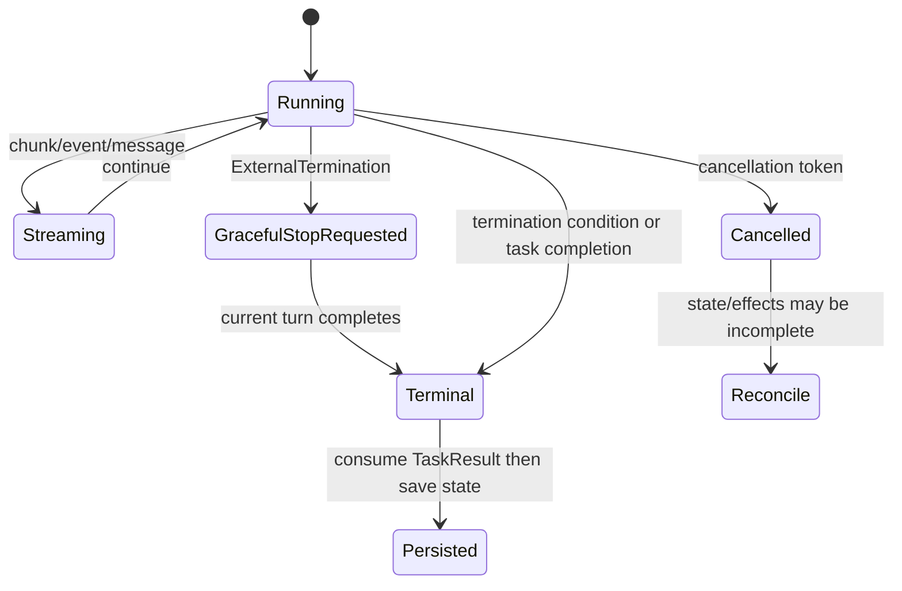
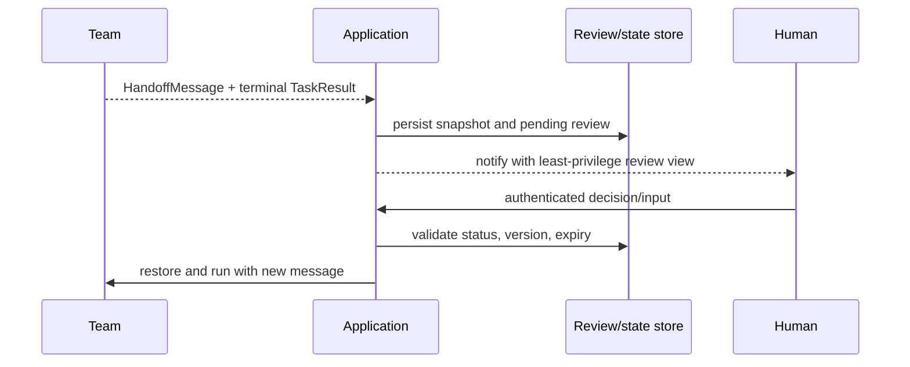

# Streaming, intervention, and human control

> **Applies to:** AutoGen AgentChat/Core 0.7.5. Pause/resume remains experimental.  
> **Research date:** 2026-08-31.

Streaming is a lifecycle protocol, not just a UI convenience. A consumer must distinguish transient chunks and events from durable conversational messages, consume the terminal result, propagate cancellation, and persist only at a consistent boundary. Human approval has the same requirement: move control out of an active run when the wait can outlive the process.

## Stream contract

`run_stream()` yields agent events and chat messages, followed by a final `TaskResult`. Model chunk events make partial text visible, but `ModelClientStreamingChunkEvent` objects are intentionally not included in `TaskResult.messages`. The final result and its stop reason are the authoritative run boundary.

Build the adapter with these rules:

- preserve event ID, source, type, timestamp, usage, and parent/run correlation;
- assign a monotonically increasing application sequence number;
- allow reconnect from the last acknowledged sequence or expose a stored terminal result;
- render chunks as provisional and replace/finalize them from the completed message;
- apply backpressure and bounded buffers rather than accumulating an unlimited stream;
- redact sensitive tool/model content before browser or telemetry delivery; and
- do not save state until the stream has produced its terminal `TaskResult` or a tested graceful-stop boundary.

If the client disconnects, decide independently whether to cancel the run. For expensive or effectful work, an abandoned client should not silently leave an unbounded background agent. For an idempotent queued job, continuing and storing the result may be correct.

## Events are not all conversation

AgentChat events include tool-call requests and executions, thoughts, memory activity, user-input requests, and streaming chunks. Showing raw events can leak chain-of-thought-like internal content, tool arguments, credentials embedded in errors, or private retrieved data. Create an allowlisted public event schema; keep operational traces in a more restricted sink.

Never reconstruct agent state by replaying only the browser-visible stream. It may omit chunks, internal events, tool/workbench state, or the final framework snapshot.

## Graceful termination versus cancellation

Use `ExternalTermination` for an operator/user stop that can wait for the current turn. AgentChat observes it after the turn, produces a terminal result, and leaves the team at a more consistent boundary. This is the preferred mechanism for ordinary “stop generating” when the current model/tool operation can be allowed a short grace period.

Use a `CancellationToken` when a deadline, revoked credential, shutdown budget, or safety incident requires prompt interruption. Propagate it into model clients, tools, workbenches, and executors; custom code must explicitly honor it. Immediate cancellation can raise `CancelledError` and leave team/termination state unreset or an external effect uncertain. Mark the session for reconciliation before accepting more work.

Use two deadlines:

1. a cooperative deadline that triggers external termination; and
2. a shorter final grace interval followed by cancellation and resource teardown.

## Intervention handlers

Core `InterventionHandler` can inspect, log, modify, or drop messages on send, publish, and response paths. In the current implementation it is supported by `SingleThreadedAgentRuntime`, not the gRPC worker runtime. Its error/drop behavior is runtime-specific.

Good uses include development assertions, protocol compatibility adapters, and defense-in-depth logging/redaction. It is a weak sole authorization boundary because:

- runtime portability is limited;
- it sees messages, not necessarily the final external operation;
- a tool or application path may bypass the intercepted route; and
- modifying/dropping a message can create caller assumptions that differ from reality.

Authorize again inside the effect adapter using authenticated application context. Treat an intervention as one control in the message plane, not a transaction firewall.

## Human input patterns

### Blocking input

`UserProxyAgent` can call an input function during a running team. This is acceptable for a local demonstration or a short, bounded interactive prompt. While it waits, the team remains running and cannot be used concurrently. Provide a timeout and cancellation path.

It is a poor fit for human response times measured in hours, mobile approval, queue-based review, or process restarts.

### Handoff and resume

For durable human work, use a termination condition such as `HandoffTermination` or `SourceMatchTermination` to return control to the application. Persist the clean state and a separate review record, then resume with the new human response in another run.

The review record should include session/version, exact proposed operation and normalized arguments, evidence shown to the reviewer, principal, policy version, expiry, decision, and audit timestamp. If arguments or relevant state change, invalidate the approval.

### Pause/resume hooks

Pause/resume was introduced as experimental functionality. It does not automatically suspend the coroutine, persist anything, or release resources. `BaseChatAgent` defaults are no-ops, so only rely on it for agents whose pause contract you own and test. It can be useful for short-lived media/tool control inside one process, not as a durable human workflow.

## Approval design

Ask the human to approve a meaningful effect, not an agent persona. “Allow researcher agent” is too broad; “send this redacted email to these recipients before this expiry” is reviewable.

Approval must be:

- **specific:** canonical operation, arguments, resource, and maximum amount/scope;
- **informed:** show provenance and relevant data, not hidden prompt text;
- **authenticated:** bind to a principal with authority for the tenant/resource;
- **fresh:** expire and re-check policy/state at commit;
- **single-use or bounded:** link to an idempotency/effect key; and
- **auditable:** retain decision metadata without exposing unnecessary sensitive content.

Human review is not a substitute for deterministic validation. A reviewer should never be asked to catch malformed JSON, path traversal, or an amount outside a known limit.

## Test matrix

- slow consumer and buffer limit;
- disconnect before/after a tool effect;
- duplicate reconnect and terminal-result replay;
- chunk/event order and message correlation;
- external termination during model and tool turns;
- cancellation ignored by a custom tool;
- human response after expiry or state-version change;
- double approval submission;
- application restart while review is pending; and
- redaction of arguments, results, errors, and internal events.

## Sources

- [AgentChat streaming](https://microsoft.github.io/autogen/stable/user-guide/agentchat-user-guide/tutorial/agents.html#streaming-tokens)
- [AgentChat messages and events](https://microsoft.github.io/autogen/stable/reference/python/autogen_agentchat.messages.html)
- [Human-in-the-loop tutorial](https://microsoft.github.io/autogen/stable/user-guide/agentchat-user-guide/tutorial/human-in-the-loop.html)
- [Termination conditions](https://microsoft.github.io/autogen/stable/user-guide/agentchat-user-guide/tutorial/termination.html)
- [`CancellationToken` source](https://github.com/microsoft/autogen/blob/main/python/packages/autogen-core/src/autogen_core/_cancellation_token.py)
- [`InterventionHandler` source](https://github.com/microsoft/autogen/blob/main/python/packages/autogen-core/src/autogen_core/_intervention.py)
