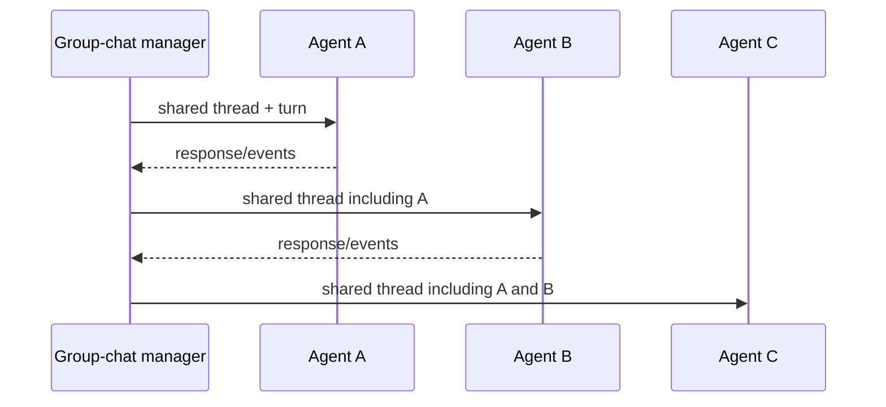

# Teams, group chat, and control flow

> **Applies to:** AutoGen AgentChat 0.7.5. GraphFlow and several pause/graph capabilities remain experimental.  
> **Research date:** 2026-08-31.

Start with one agent. Add a team only when role separation, context specialization, handoff, deterministic sequencing, or review measurably improves the result. A team multiplies model calls, shared-context exposure, termination paths, and state that must be understood; it does not automatically improve quality.

## Pattern selection

| Pattern | Control mechanism | Good fit | Main production risk |
|---|---|---|---|
| `RoundRobinGroupChat` | deterministic rotation | fixed review/refinement sequence | unnecessary turns; every participant sees shared thread |
| `SelectorGroupChat` | model selects next speaker | dynamic specialists with clear descriptions | extra inference and nondeterministic routing |
| `Swarm` | local handoff selected from `HandoffMessage` | decentralized transfer among known roles | shared context remains; conflicting parallel handoffs |
| `MagenticOneGroupChat` | planning orchestrator tracks progress and replans | bounded open-ended research/browsing/coding | high autonomy, cost, and tool authority |
| `GraphFlow` | directed graph, conditions, fan-out/join | explicit workflow topology | experimental state/condition/serialization edge cases |
| custom Core protocol | application-defined messages/state machine | strict domain protocol and isolation | more code; application owns orchestration semantics |

If the sequence is known, use deterministic application code or GraphFlow rather than paying a selector model to rediscover it. If participants do not need the same transcript, a shared group chat may violate least privilege; use targeted Core messages or isolated subflows.

## Shared context model

Most AgentChat group-chat teams broadcast participant messages through a common group thread. This makes collaboration convenient but creates two effects:

1. sensitive tool results and prompt injection can spread to every participant; and
2. a participant's output changes the future context of all other participants.

Use separate teams or typed point-to-point messages for trust boundaries. A different system prompt is not isolation when the raw shared thread still contains the data.

## Pattern-specific guidance

### RoundRobin

RoundRobin is the easiest team to reason about. Make every role necessary, bound the number of cycles, and define whether a participant may abstain. It works well for writer/reviewer or proposer/verifier loops when each turn has a typed outcome and the verifier cannot perform the same sensitive effects as the proposer.

### Selector

Selector adds a central model call to choose a speaker from participant names/descriptions and context. Make descriptions mutually distinguishable and restrict repeated speakers if the task requires diversity. A custom selector function can impose deterministic rules, but Python callables are not serializable component configuration; reconstruct it from trusted code.

Log both the candidate set and selection decision. Test loops, no-valid-speaker outcomes, malicious participant text attempting to influence selection, and provider/model changes.

### Swarm

Swarm uses participant handoffs while retaining group context. Disable parallel tool calls when handoff order matters: if a model emits multiple handoffs, only the first is used. A handoff is control-flow data, not authentication. Validate the target against the allowed graph and ensure the receiving role has only its own tools.

### Magentic-One

Magentic-One's orchestrator creates a plan, delegates, tracks progress, and replans after stalls. Defaults include finite turn/stall limits, but the pattern can still combine browsing, file access, and code execution into a powerful attack surface. Follow the official warnings: use containers, human oversight, limited network/resources, and no sensitive data. In production, also constrain domains, downloads, artifacts, total model/tool budget, and irreversible effects.

Use it for bounded, supervised tasks where exploration is the product. Do not use it as an unattended business transaction engine.

### GraphFlow

GraphFlow represents sequential branches, conditional transitions, loops, and parallel fan-out. Concurrent branch execution was added in 0.6.0. Callable conditions are experimental and not serializable. State/resume behavior has had recent defects around cycles, conditions, and interruption between transitions; pin 0.7.5 and turn relevant issue reports into regression tests.

Keep graph conditions deterministic and based on structured output when possible. Bound every cycle independently and define join behavior for partial branch failure. If crash-perfect transition semantics are required, place the durable workflow in a workflow engine and call AutoGen within bounded activities.

## Termination is a safety contract

Termination conditions are stateful. AgentChat resets them after a completed team run, and conditions can be combined with AND/OR. Text mention is rarely sufficient as the only guard because the model may omit, quote, or adversarially trigger the phrase.

Use layered termination:

- semantic completion: structured result or validated domain condition;
- hard interaction ceiling: maximum messages/turns;
- model/tool budget: tokens, calls, or cost outside the team where necessary;
- wall-clock deadline and cancellation token;
- operator/external termination; and
- executor/tool-specific limits.

`ExternalTermination` stops gracefully after the current agent turn and preserves a consistent team boundary. Direct cancellation is immediate and can leave termination/state in an inconsistent condition. Use graceful termination for normal user stop; use cancellation for deadline breach or emergency revocation.

## Nested teams and concurrency

Nested teams are supported in recent 0.7 releases, subject to pattern-specific restrictions. Treat a nested team as one participant contract: limit the input it receives, summarize/redact its output, and allocate a sub-budget. Nesting is useful for encapsulation, not for creating an unbounded hierarchy.

A team instance cannot be run concurrently. Enforce one active run per session in the application and reject or queue overlapping requests. Do not solve this by deep-copying a live team without a state/version protocol.

## Design procedure

1. Prove the task with one agent and the minimum tools.
2. Name the concrete failure a second role addresses.
3. Choose deterministic sequencing unless dynamic selection is necessary.
4. Define participant input visibility and tool authority separately.
5. Specify structured handoff/result schemas.
6. Add hard budgets and graceful external termination.
7. Test adversarial messages, loops, parallel calls, partial failures, and restore.
8. Compare quality, latency, cost, and incident surface with the single-agent baseline.

Remove a team if the measured benefit does not justify the new behavior.

## Sources

- [AgentChat teams tutorial](https://microsoft.github.io/autogen/stable/user-guide/agentchat-user-guide/tutorial/teams.html)
- [Selector group chat](https://microsoft.github.io/autogen/stable/user-guide/agentchat-user-guide/selector-group-chat.html)
- [Swarm](https://microsoft.github.io/autogen/stable/user-guide/agentchat-user-guide/swarm.html)
- [Magentic-One](https://microsoft.github.io/autogen/stable/user-guide/agentchat-user-guide/magentic-one.html)
- [GraphFlow](https://microsoft.github.io/autogen/stable/user-guide/agentchat-user-guide/graph-flow.html)
- [Termination conditions](https://microsoft.github.io/autogen/stable/user-guide/agentchat-user-guide/tutorial/termination.html)
- [Base group chat source](https://github.com/microsoft/autogen/blob/main/python/packages/autogen-agentchat/src/autogen_agentchat/teams/_group_chat/_base_group_chat.py)
- [GraphFlow interrupted-state issue #7043](https://github.com/microsoft/autogen/issues/7043)
- [GraphFlow condition issue #6716](https://github.com/microsoft/autogen/issues/6716)

