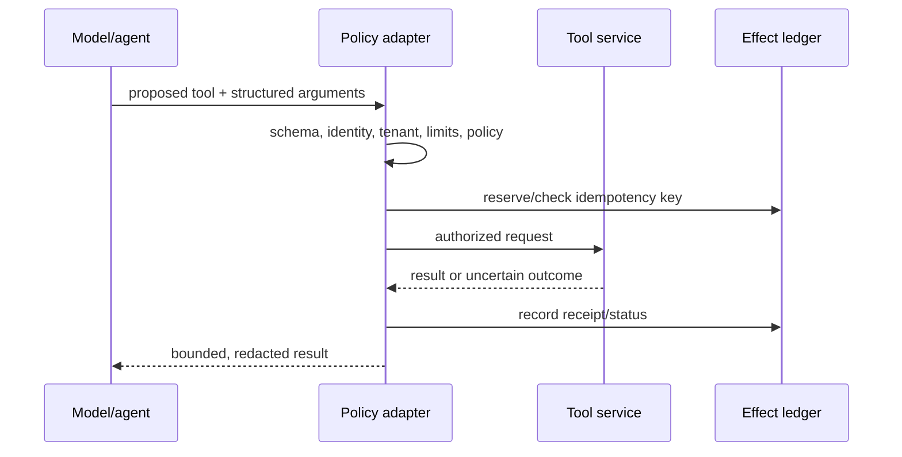

# Tools, workbenches, MCP, and code execution

> **Applies to:** AutoGen Core, AgentChat, and Extensions 0.7.5.  
> **Research date:** 2026-08-31.

Tools are the point where probabilistic planning becomes real authority. Treat every tool call as an untrusted structured request crossing into a conventional service boundary. AutoGen can expose and invoke the function, but the application remains responsible for identity, policy, validation, idempotency, isolation, and audit.

## Choose the narrowest abstraction

| Abstraction | Best fit | State/lifecycle concern |
|---|---|---|
| `FunctionTool` or typed tool | small, static operation with a stable schema | keep dependencies explicit; validate again inside the function |
| `StaticWorkbench` | fixed tools that need a shared workbench lifecycle or tool state | workbench owns reset/save/load and should be closed |
| custom `Workbench` | dynamic tool catalog or shared remote/session resources | implement lifecycle and state semantics deliberately |
| `McpWorkbench` | a trusted MCP server supplies tools/resources/prompts | session/server state is not captured by AutoGen team state |
| `CodeExecutorAgent` / executor | generated code is a required capability | creates a high-risk execution boundary and needs independent isolation |

Tools and workbenches are alternative inputs to `AssistantAgent`; a deployment can use multiple workbenches, but tool names must remain unique. Large catalogs degrade tool selection and increase the prompt-injection blast radius. Prefer per-role allowlists and expose only the tools needed for the current phase.

## Tool contract

The tool schema guides the model; it is not sufficient security validation. At invocation time:

1. validate types, lengths, formats, enumerations, and cross-field invariants;
2. derive tenant and actor from authenticated context, never from model arguments;
3. authorize the exact operation and resource;
4. apply rate, cost, result-size, and deadline limits;
5. attach an idempotency key for effects;
6. sanitize/redact the returned data before it re-enters model context; and
7. log the decision and receipt without leaking credentials or sensitive payloads.

Do not use substring filters such as “reject commands containing `rm`.” Parse the operation, restrict the capability, and enforce policy beneath the model.

## Workbench lifecycle and state

A workbench is useful when tools share a session, process, connection, cache, or other resource. It owns `start`, `stop`, `reset`, `save_state`, and `load_state`; use it as an async context manager where supported. Decide what each operation means for the external service rather than assuming the default is durable.

State coverage is component-specific. `McpWorkbench`, for example, returns an empty marker for save, performs no state restoration, and has a no-op reset in the current source. Restoring an AgentChat team therefore does not restore an MCP server session, in-flight remote request, server-side cursor, or resource mutation. Store remote continuity separately or design calls so a new MCP session is safe.

## MCP is a remote-code and data trust boundary

AutoGen supports stdio, SSE, and Streamable HTTP MCP transports. The risk profile differs:

- stdio starts a local command and gives it the process's filesystem, environment, and network authority unless the OS/container restricts it;
- remote transports introduce TLS, authentication, server-identity, availability, and data-residency concerns; and
- server-initiated sampling, roots, and elicitation expand the server's ability to request model calls, discover client resources, or prompt for input.

Only connect to trusted servers. Pin a package version or immutable image digest rather than `latest`; verify provenance; run stdio servers under a restricted OS identity/container; pass an explicit environment; deny ambient cloud credentials; and restrict filesystem roots and egress. For remote servers, require authenticated TLS, hostname verification, per-tenant credentials, and bounded reconnect/request behavior.

Maintain a capability manifest:

| Field | Control |
|---|---|
| server artifact/digest | allowlisted and scanned |
| transport and endpoint | fixed; no model-selected endpoint |
| tool/resource/prompt names | allowlisted per agent role |
| schema hash | change requires review and compatibility tests |
| sampling/roots/elicitation | disabled unless explicitly needed and policy-gated |
| arguments/results | size-limited, validated, redacted |
| timeout/concurrency | enforced outside the model |
| state expectation | stateless, reconstructable, or externally persisted |

Prompt injection can arrive in MCP tool results, resource contents, or prompt templates. Mark origin, keep instructions and data structurally separate where the provider permits it, and never let retrieved content increase tool authority.

## Code execution

The local command-line executor warns that host execution is unsafe for LLM-generated code. The Docker executor is the preferable starting point and became the documented/default direction in the 0.7.5 security work, but “runs in Docker” is not a complete sandbox.

Harden the execution environment outside AutoGen:

- use an immutable, minimal, scanned image and non-root user;
- create an ephemeral workspace and never mount the repository, home directory, secrets, SSH agent, or cloud credential locations read-write;
- never mount the Docker/Podman daemon socket—daemon access is effectively host-level authority;
- deny network by default, or route narrowly through an audited proxy;
- set CPU, memory, process, file-size, disk, and wall-clock limits;
- apply a read-only root filesystem, dropped capabilities, seccomp/AppArmor/SELinux, and no-new-privileges where supported;
- send inputs by value and collect bounded artifacts through a controlled channel; and
- destroy the environment after each trust domain/session and retain only reviewed artifacts.

The executor's timeout (60 seconds by default for the Docker executor) is only one limit. It does not replace kernel resource controls or prevent a process tree from exhausting memory/disk before the timeout.

`CodeExecutorAgent` is experimental. Its approval function is optional; without one, execution is effectively auto-approved. A Python approval callable is application code and not a portable serialized component. Reattach it from trusted code, bind approval to the exact code/artifact/digest, runtime policy version, principal, expiry, input mounts, and network profile, and re-check immediately before execution.

## Safer alternatives to arbitrary code

Prefer, in order:

1. a typed read-only query or calculator tool;
2. a constrained DSL parsed and executed by trusted code;
3. a pre-reviewed job/template with parameter validation;
4. a remote sandbox service with strong tenancy and egress controls; then
5. arbitrary generated code in a disposable hardened sandbox.

Code execution is justified when the workload genuinely needs open-ended computation or package use. It should not be a shortcut for implementing five predictable business operations.

## Failure handling

| Failure | Safe response |
|---|---|
| validation/policy rejection | return a stable, non-sensitive error; do not retry automatically |
| tool timeout before known effect | query status when possible; retry only with the same idempotency key |
| connection loss after request | mark outcome uncertain; reconcile before retry |
| oversized or hostile result | truncate/quarantine; preserve artifact reference outside model context |
| MCP server restart | establish a new session; do not assume workbench state restored it |
| executor timeout/kill | treat workspace as tainted; destroy it and review partial external effects |
| approval expired or arguments changed | require a new authorization |

## Review checklist

- [ ] Each agent receives a minimal, role-specific tool allowlist.
- [ ] Tool arguments are validated and authorized below the model.
- [ ] Effects have stable idempotency keys and external receipts.
- [ ] Remote/local MCP server artifacts and schemas are pinned.
- [ ] MCP server-initiated capabilities are disabled or explicitly governed.
- [ ] Workbench and remote-session state boundaries are documented.
- [ ] Generated code never runs on the application host or with a daemon socket.
- [ ] Executor network, resource, filesystem, artifact, and teardown policies are tested.
- [ ] Approval is bound to exact execution inputs and revalidated at commit time.

## Sources

- [Core tools and workbench reference](https://microsoft.github.io/autogen/stable/reference/python/autogen_core.tools.html)
- [MCP workbench reference](https://microsoft.github.io/autogen/stable/reference/python/autogen_ext.tools.mcp.html)
- [MCP workbench source](https://github.com/microsoft/autogen/tree/main/python/packages/autogen-ext/src/autogen_ext/tools/mcp)
- [Command-line code executors](https://microsoft.github.io/autogen/stable/user-guide/core-user-guide/components/command-line-code-executors.html)
- [CodeExecutorAgent reference](https://microsoft.github.io/autogen/stable/reference/python/autogen_agentchat.agents.html#autogen_agentchat.agents.CodeExecutorAgent)
- [AutoGen 0.7.5 release](https://github.com/microsoft/autogen/releases/tag/python-v0.7.5)
- [Magentic-One security guidance](https://microsoft.github.io/autogen/stable/user-guide/agentchat-user-guide/magentic-one.html)

