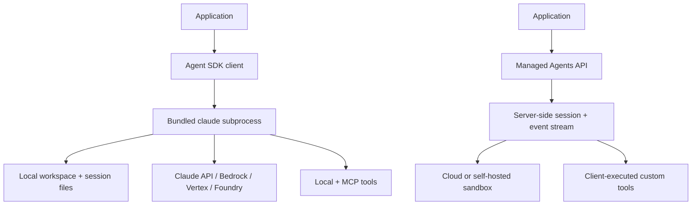
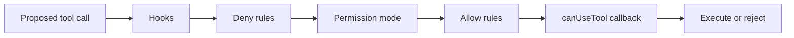
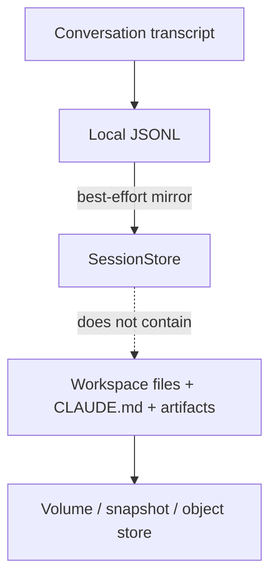
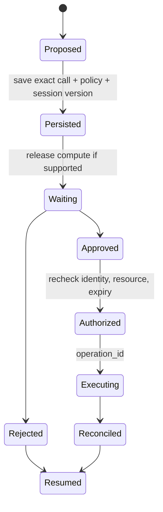

# Claude Agent SDK and Managed Agents in Production

**Research date:** 2026-08-31  
**Status:** Research-backed technology guide  
**Scope:** Self-hosted Claude Agent SDK and beta Claude Managed Agents; these are different runtime choices

> Continue from this concise overview into the [13-guide Claude Agent SDK and Anthropic agent ecosystem area](claude-agent-sdk/README.md) for the process/workspace runtime, loop, extensions, sessions/compaction, events, permissions, delegation, hosting, testing, reliability, Managed Agents, and migrations.

## Bottom line

Choose Claude Agent SDK when the product needs an opinionated Claude Code-derived harness—filesystem exploration, shell execution, editing, skills, hooks, subagents, compaction, and MCP—inside infrastructure you control. Treat each active agent as a stateful process with a workspace, not as a stateless HTTP request.

Choose Claude Managed Agents only after separately accepting its beta service, retention, sandbox, and portability contract. It removes much of the loop and sandbox operations burden; it does not make custom tools, external effects, authorization, or compliance decisions disappear.

## Two execution models

The upper path makes your compute plane authoritative. The lower path makes Anthropic’s session service authoritative while optionally delegating the execution sandbox to your infrastructure.

## Agent SDK: what you are hosting

The SDK package launches a pinned native Claude Code binary. The subprocess owns an agent loop, shell, current working directory, session transcript, built-in tools, context compaction, and long-lived stream. Consequences:

- allocate CPU, memory, disk, process descriptors, and egress per concurrent agent;
- isolate tenant workspaces and settings sources;
- decide whether sessions are ephemeral, warm, or bound to a long-lived container;
- update the embedded runtime by updating the SDK package and testing its changelog;
- supervise subprocess exit, partial output, orphan descendants, and slow teardown.

Anthropic’s hosting guide suggests 1 GiB RAM, 5 GiB disk, and one CPU per fresh agent only as a starting point. Capacity must be measured with real session length and tool activity.

## Permission semantics that matter

| Configuration | What it actually means | Production implication |
|---|---|---|
| `allowed_tools` | Auto-approve matching tools | Unlisted tools remain visible and fall through |
| Bare `disallowed_tools=["Bash"]` | Remove the tool from model context | Stronger than a mere deny-after-selection |
| Scoped deny | Keep tool visible; block matching calls | Useful for defense in depth, but pattern coverage needs tests |
| `dontAsk` | Deny any unresolved call | Good headless fail-closed default with explicit auto-approvals |
| `bypassPermissions` | Approve everything reaching the mode check | `allowed_tools` does not constrain it; use only inside a hard containment boundary |
| `acceptEdits` / inherited subagent mode | Broad automatic filesystem authority | Delegated agents may receive more power than their prompt suggests |

Hooks can observe, deny, or modify behavior, but language support differs. Do not rely on hook order unless the current implementation contract is explicit and tested. Apply resource authorization outside the model-visible process immediately before remote commits.

## Sessions are not workspaces

By default, sessions are local transcripts keyed partly by working directory. `SessionStore` can mirror entries to S3, Redis, or a database so another host can resume. It is explicitly a mirror rather than the only write path: if delivery fails, the SDK emits `mirror_error`, drops the batch, and continues. Alert on this event and decide whether the run must stop when durable history is a requirement.

The transcript excludes workspace state, memory files, installed packages, and arbitrary artifacts. Resume on another host is coherent only if the application restores a compatible working directory and runtime definition. Store a run manifest containing SDK/binary version, model, prompt/skills hashes, settings sources, tool definitions, workspace snapshot, and policy version.

Compaction replaces older context with a summary. Tell the compactor which invariants to preserve, but keep authoritative task state and evidence outside the transcript. Subagents reduce main-context growth by returning summaries, yet they add parallel cost, authority, and observability requirements.

## Human input and crash recovery

Interactive callbacks can approve, deny, or modify tool input. However, waiting inside a live subprocess is not durable coordination. A pod crash can lose the pending callback, and current issue evidence shows that resume-time callback registration and deferred tool replay require careful version-specific testing.

Use this external state machine for production approval:

If the SDK version cannot rehydrate that boundary safely, end the query before the effect and start a controlled continuation after the external decision. Never keep an unbounded one-process-per-waiting-user design by accident.

## Managed Agents changes the trade

Managed Agents persists agent configuration versions, sessions, events, sandbox state, and outputs server-side. It supports cloud or self-hosted environments, streamed events, steering and interrupts, per-session cost ceilings, built-in tools, MCP, and client-executed custom tools.

Review these boundaries before choosing it:

| Boundary | Current consequence |
|---|---|
| Maturity | Beta header and behavior-change risk |
| Data | Stateful sessions are currently ineligible for ZDR and HIPAA BAA coverage |
| Environment version | Environments persist but are not versioned; maintain an external change ledger |
| Network | Sandbox egress and provider-hosted web tools use separate controls |
| Tool execution | Custom tool results cross back from your application and need their own retry/effect contract |
| Sandbox lifetime | Session filesystem retention has a service window; durable artifacts belong in external storage |
| Portability | Event, tool, budget, and session contracts are service-specific |

Managed execution is valuable when long-lived sandbox scheduling is undifferentiated infrastructure for the product. Self-host when network, image, locality, or compliance controls require it and your team can operate the process fleet.

## Operational acceptance tests

- [ ] Confirm the SDK, embedded CLI, model, OS image, settings, and skills are a tested release unit.
- [ ] Measure subprocess memory, CPU, disk, file descriptors, cold start, and teardown by session age.
- [ ] Verify tenant isolation for workspace, environment variables, configuration directory, MCP credentials, and egress.
- [ ] Fail every `SessionStore` append/load and assert alerting, stop/continue policy, and recovery.
- [ ] Resume on a different host with and without the expected workspace snapshot.
- [ ] Crash during `canUseTool`, after approval, during tool execution, and before transcript mirroring.
- [ ] Test hook order, concurrency, exceptions, and resume registration in both chosen languages.
- [ ] Count tool usage once per model step; treat client-estimated cost as non-authoritative.
- [ ] Exercise compaction, subagent fan-out, cancellation, and interrupt under quotas.
- [ ] For Managed Agents, validate retention, deletion, sandbox expiry, budget stops, web-domain rules, and custom-tool redelivery.

## Choose the SDK when

- The built-in filesystem/shell harness is a product advantage.
- You need Bedrock, Vertex, Foundry, or Anthropic API authentication with the same harness shape.
- You can isolate and schedule stateful subprocesses and workspaces.
- You want deep hook, skill, MCP, and subagent integration and accept Claude-specific behavior.

## Prefer another shape when

- The task is a short API/tool loop without workspace semantics.
- Many sessions spend most of their life waiting and durable pause is central.
- Language/runtime restrictions cannot host the subprocess model.
- Provider-neutral loop semantics are a hard architectural requirement.
- Managed Agents’ beta or data-retention constraints are incompatible with the workload.

## Sources and related guides

Primary sources: [Agent SDK overview](https://code.claude.com/docs/en/agent-sdk/overview), [agent loop](https://code.claude.com/docs/en/agent-sdk/agent-loop), [permissions](https://code.claude.com/docs/en/agent-sdk/permissions), [hooks](https://code.claude.com/docs/en/agent-sdk/hooks), [sessions](https://code.claude.com/docs/en/agent-sdk/sessions), [session storage](https://code.claude.com/docs/en/agent-sdk/session-storage), [hosting](https://code.claude.com/docs/en/agent-sdk/hosting), [Managed Agents](https://platform.claude.com/docs/en/managed-agents/overview), and [containment lessons](https://www.anthropic.com/engineering/how-we-contain-claude).

- [Provider-native framework selection](../comparisons/provider-native-agent-frameworks.md)
- [Python vs TypeScript/Node.js](../comparisons/python-vs-typescript-node-agent-runtimes.md)
- [Permissions, sandboxing, and secrets](../security/permissions-sandboxing-and-secrets.md)
- [Compaction and continuity](../context-memory/compaction-and-continuity.md)
- [Interactive and long-running architectures](../architectures/interactive-and-long-running-reference-architectures.md)
- [Research packet](../research/packets/provider-native-agent-frameworks.md)
