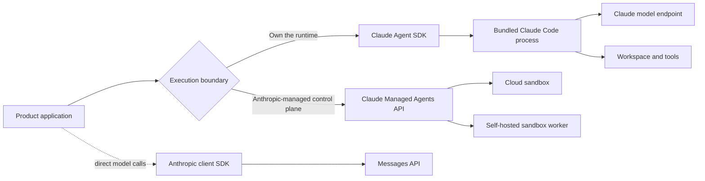

# Claude Agent SDK and Anthropic Agent Ecosystem

Research date: **2026-08-31**  
Status: **production-oriented guide to rapidly evolving SDKs and beta platform surfaces**  
Primary scope: **Claude Agent SDK for Python and TypeScript, the Claude Code-derived harness it embeds, Anthropic API client SDKs, and the separate Claude Managed Agents service**

## Bottom line

The Claude Agent SDK is not a thin model client. Each active session runs a bundled Claude Code executable as a child process, with an agent loop, filesystem workspace, tools, settings, hooks, permissions, session transcripts, and compaction behavior. Your application owns the host, isolation, scheduling, approvals, durable business state, and external side-effect safety.

Claude Managed Agents is a different product boundary. Anthropic hosts and orchestrates the agent runtime and, for cloud environments, the sandbox. It has its own beta API, persisted event model, agent definitions, budgets, multiagent threads, and retention rules. It is not “Agent SDK as a service,” and migrating to it changes operational ownership rather than merely changing a package import.

## Choose the right surface

| Need | Best starting point | Why |
|---|---|---|
| Direct prompts, streaming, or a custom tool loop in any supported language | Anthropic client SDK | It exposes the Messages API without inheriting the Claude Code harness |
| A Python or TypeScript agent that can inspect and change a workspace | Claude Agent SDK | It supplies the Claude Code loop, tools, sessions, hooks, permissions, and compaction |
| A CLI or IDE experience operated by a person | Claude Code | Its native interaction model, settings, and UI already fit the task |
| Hosted, durable agent sessions with a platform event log and managed sandbox lifecycle | Claude Managed Agents | Anthropic owns the service control plane and can host the sandbox |
| An Agent SDK workflow in another language | Invoke `claude -p` as a subprocess, or build a loop with a client SDK | The Agent SDK packages are currently Python and TypeScript only |

Do not select by name similarity. Decide who must own the process, workspace, transcript, isolation boundary, approval durability, retry behavior, and data retention.

## Reading paths

### Building a first production Agent SDK service

1. [Ecosystem boundaries and selection](ecosystem-boundaries-and-selection.md)
2. [Runtime, process, and workspace architecture](runtime-process-and-workspace-architecture.md)
3. [Agent loop, messages, instructions, and models](agent-loop-messages-instructions-and-models.md)
4. [Permissions, approvals, and security](permissions-approvals-and-security.md)
5. [Reliability, cancellation, retries, and effects](reliability-cancellation-retries-and-effects.md)
6. [Hosting, deployment, and scaling](hosting-deployment-and-scaling.md)

### Adding extensibility and continuity

1. [Tools, MCP, hooks, skills, and plugins](tools-mcp-hooks-skills-and-plugins.md)
2. [Sessions, context, compaction, and state](sessions-context-compaction-and-state.md)
3. [Streaming, events, and structured output](streaming-events-and-structured-output.md)
4. [Subagents, delegation, and multi-agent work](subagents-delegation-and-multi-agent.md)

### Operating or changing platforms

1. [Observability, testing, and debugging](observability-testing-and-debugging.md)
2. [Claude Managed Agents boundary and operations](managed-agents-boundary-and-operations.md)
3. [Migrations, limitations, and alternatives](migrations-limitations-and-alternatives.md)
4. [Deep research packet](../../research/packets/claude-agent-sdk-deep-dive.md)

## Guide map

| Guide | Production question it answers |
|---|---|
| [Ecosystem boundaries and selection](ecosystem-boundaries-and-selection.md) | Which Anthropic surface actually matches the required ownership model? |
| [Runtime, process, and workspace architecture](runtime-process-and-workspace-architecture.md) | What runs, where state lives, and what must be isolated? |
| [Agent loop, messages, instructions, and models](agent-loop-messages-instructions-and-models.md) | How does one query become a tool-using, compacting session? |
| [Tools, MCP, hooks, skills, and plugins](tools-mcp-hooks-skills-and-plugins.md) | Which extension point should implement a capability or policy? |
| [Sessions, context, compaction, and state](sessions-context-compaction-and-state.md) | What does resume preserve, and what must the application persist separately? |
| [Streaming, events, and structured output](streaming-events-and-structured-output.md) | How should SDK messages become a stable application event protocol? |
| [Permissions, approvals, and security](permissions-approvals-and-security.md) | How do permission rules interact, and where is the real security boundary? |
| [Subagents, delegation, and multi-agent work](subagents-delegation-and-multi-agent.md) | When does delegation help, and how are depth, concurrency, and cost bounded? |
| [Hosting, deployment, and scaling](hosting-deployment-and-scaling.md) | How should process trees, affinity, resources, and tenancy be operated? |
| [Observability, testing, and debugging](observability-testing-and-debugging.md) | What evidence makes an agent run explainable and testable? |
| [Reliability, cancellation, retries, and effects](reliability-cancellation-retries-and-effects.md) | How are long waits, ambiguous failures, cancellation, and duplicate effects controlled? |
| [Claude Managed Agents boundary and operations](managed-agents-boundary-and-operations.md) | What changes when Anthropic owns the session control plane? |
| [Migrations, limitations, and alternatives](migrations-limitations-and-alternatives.md) | When should a team migrate, stay put, or build a simpler loop? |

## Production invariants

1. Treat the model as an untrusted planner, not an authorization authority.
2. Keep identity, tenant authorization, secrets, and irreversible commits outside the agent process.
3. Give every session an explicit working directory, resource budget, cancellation path, and terminal-state handler.
4. Drain the SDK stream to completion; a `ResultMessage` is a lifecycle record, not always the final emitted message.
5. Translate SDK and managed events into an application-owned [state and event contract](../../runtime/agent-state-and-event-contracts.md) with stable identity, terminal outcomes, replay, and redacted projections.
6. Persist business workflow state separately from conversation transcripts and workspace files.
7. Make external mutations idempotent, or require a commit token immediately before the effect.
8. Bound subagent depth, concurrency, turns, and total spend.
9. Test settings and permission behavior against the exact bundled CLI version, not only the wrapper package API.
10. Treat hooks, files, MCP responses, web content, skills, and repository instructions as prompt-injection inputs.
11. Pin versions, record behavioral baselines, and review release notes before upgrades.

## Version and maturity snapshot

As of the research date:

- TypeScript Agent SDK latest release: [`v0.3.251`](https://github.com/anthropics/claude-agent-sdk-typescript/releases/tag/v0.3.251), published 2026-08-28.
- Python Agent SDK latest release: [`v0.2.148`](https://github.com/anthropics/claude-agent-sdk-python/releases/tag/v0.2.148), published 2026-08-28.
- Both SDKs remain pre-1.0. The bundled Claude Code binary is part of the effective runtime contract and changes with the package.
- Claude Managed Agents requires the `managed-agents-2026-04-01` beta header; memory endpoints use the separate `agent-memory-2026-07-22` beta.
- Managed Agents is stateful and is not eligible for zero-data-retention or HIPAA BAA coverage according to the current retention documentation.

These are a dated compatibility snapshot, not floating recommendations.

## Refresh triggers

Re-research this area when any of the following changes:

- either Agent SDK minor version, bundled Claude Code version, or public message types;
- permissions evaluation order, hook events, hook timeout semantics, or `defer` behavior;
- SessionStore mirroring, fork/resume behavior, or transcript format;
- subagent depth, concurrency, cost, or background-task limits;
- model aliases, effort defaults, tool-search behavior, or context-window policy;
- Managed Agents beta header, status/event schema, sandbox retention, rate limits, or data-retention eligibility;
- self-hosted sandbox trust or networking model;
- a production incident exposes an unmodeled cancellation, duplicate-effect, or approval-recovery path.

## Core sources

- [Agent SDK overview](https://code.claude.com/docs/en/agent-sdk/overview)
- [How the agent loop works](https://code.claude.com/docs/en/agent-sdk/agent-loop)
- [Hosting the Agent SDK](https://code.claude.com/docs/en/agent-sdk/hosting)
- [Secure deployment](https://code.claude.com/docs/en/agent-sdk/secure-deployment)
- [Claude Code features in the SDK](https://code.claude.com/docs/en/agent-sdk/claude-code-features)
- [TypeScript SDK reference](https://code.claude.com/docs/en/agent-sdk/typescript)
- [Python SDK reference](https://code.claude.com/docs/en/agent-sdk/python)
- [Managed Agents overview](https://platform.claude.com/docs/en/managed-agents/overview)
- [Managed Agents session event stream](https://platform.claude.com/docs/en/managed-agents/events-and-streaming)
- [API and data retention](https://platform.claude.com/docs/en/manage-claude/api-and-data-retention)
