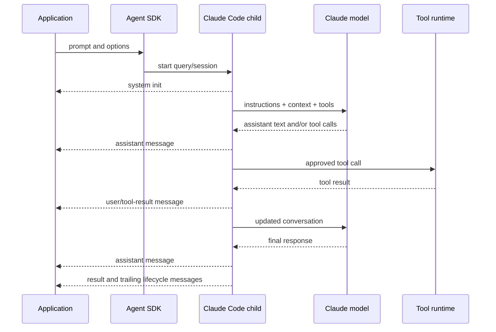

# Agent Loop, Messages, Instructions, and Models

Research date: **2026-08-31**  
Maturity: **core loop is documented; model and effort defaults are version-sensitive**

## Loop contract

The Agent SDK runs the same general execution loop as Claude Code:



A “turn” for `maxTurns` or `max_turns` is a tool-use round trip, not every emitted SDK message and not the final text response. A read-only exploration that invokes many tools can therefore consume several turns before the final answer.

## Message families

| Message | Meaning | Application action |
|---|---|---|
| System initialization | Session identity, tools, model/runtime metadata | Record the session ID and effective configuration |
| System compact boundary | Earlier context was summarized | Mark the transcript boundary and do not assume old wording remains |
| Assistant | Complete model message containing text, thinking, or tool-use blocks | Render or translate content; track API usage |
| User | User input or tool-result content fed back to the model | Distinguish real user input from harness-generated tool results |
| Stream event | Raw partial API event when partial streaming is enabled | Treat as provisional presentation data |
| Result | Terminal outcome, cost estimate, usage, duration, structured output, and session ID | Drive job state from subtype, not from presence alone |
| Informational/worker lifecycle system event | Runtime lifecycle details | Continue consuming until the stream closes |

The exact TypeScript unions and Python classes differ. Build an internal normalized event type and preserve the raw payload for debugging. Unknown message and content-block variants should be logged and safely ignored or quarantined, not crash the consumer.

### Result is not synonymous with success

Documented result subtypes include:

- `success`;
- `error_max_turns`;
- `error_max_budget_usd`;
- `error_during_execution`;
- `error_max_structured_output_retries`.

An error result can still carry a session ID and usage/cost fields. A process crash can leave cost fields at zero even after billable work. Store prior assistant usage and intermediate result evidence so accounting and diagnosis do not depend on one final field.

The stream may contain trailing system events after a Result. Iterate to completion. In single-shot mode, the query can yield an error Result and then surface an exception or nonzero process exit.

## Control the loop at multiple layers

| Control | Scope | Important limitation |
|---|---|---|
| `maxTurns` | Main loop or a subagent definition | Counts tool-use round trips, not wall time |
| `maxBudgetUsd` | Session tree | Checked between work; not a transactional billing guarantee |
| Model token limits | Individual model response | Does not bound number of requests |
| API timeout | Each request attempt | Retries multiply worst-case wall time |
| Application deadline | Whole job | Must terminate the process tree and reconcile effects |
| Permission policy | Each tool decision | Does not constrain pure model calls or resource use |
| Subagent depth/concurrency limits | Delegation tree | Must be explicitly configured for predictable fan-out |

Use all relevant layers. No single option is a complete job deadline.

## Instruction layers

Instructions can reach Claude through different channels:

1. system-prompt selection;
2. `CLAUDE.md` project context;
3. user messages;
4. skill or subagent prompts;
5. tool descriptions and results;
6. hook-modified input or output;
7. provider- or harness-generated context.

These channels differ in authority, persistence, discovery, and compaction behavior. A reliable design gives each rule one canonical home.

### Minimal default versus Claude Code preset

An SDK query with no `systemPrompt`/`system_prompt` uses a minimal prompt for tool calling. It does not automatically use the full Claude Code coding persona. `claude -p` does use that fuller prompt. To preserve the Claude Code behavior, select:

```typescript
systemPrompt: {
  type: "preset",
  preset: "claude_code",
  append: "Product-specific constraints go here."
}
```

Use the preset when the agent really is a coding agent. For a support, operations, or narrow API agent, a custom prompt avoids irrelevant coding behavior but must replace the tool guidance and safety instructions the preset would otherwise provide.

### `CLAUDE.md` is project context

When the relevant settings source is enabled, `CLAUDE.md` content is injected as project context rather than being appended to the system prompt. It is reintroduced across requests and is therefore more durable through compaction than a rule stated only in an early user message.

Multiple discovered instruction files are additive. There is no safe general assumption that a “nearer” file deterministically overrides every conflicting statement. Prevent conflicts and state precedence explicitly in the content.

Repository instructions are untrusted in a multi-tenant or third-party-code workflow. Review, filter, or disable them when the repository is not trusted to define agent behavior.

### Prompt cache behavior

Static prompt prefixes can be cached automatically. The `claude_code` preset normally embeds dynamic details such as working directory, platform, shell, git status, and memory paths, preventing cache reuse across different environments. The documented `excludeDynamicSections`/`exclude_dynamic_sections` option moves those details to the first user message, improving cross-session cache reuse at the cost of giving environment details slightly less authoritative placement.

Measure before enabling it. Cache savings can be meaningful at fleet scale, but correctness is more important than maximizing shared prefix reuse.

## Context and compaction

The active context contains the system prompt, tool definitions, project context, conversation messages, tool inputs, and tool outputs. Large command output and file reads often dominate growth.

When the window approaches its limit, the harness automatically compacts older conversation into a summary and emits a compact-boundary system message. Compaction is lossy. Exact early instructions, evidence, or pending decisions may disappear or be distorted.

Production practices:

- keep invariants in stable project/system instructions;
- store business decisions and checkpoints outside the transcript;
- trim tool output before returning it to the model;
- use Tool Search so large MCP schemas need not load up front;
- give the `PreCompact` hook an archival or checkpoint role;
- test long-running workflows through at least one real compaction boundary;
- send `/compact` deliberately only when the resulting context transition is acceptable.

Compaction does not reduce the raw durable transcript in a SessionStore. The helper that reads session messages may expose the post-compaction chain, while raw store entries retain the opaque event history.

## Models and effort

Pin an explicit model in production. If it is omitted, the SDK inherits Claude Code’s default, which can depend on authentication and subscription context.

Python currently leaves effort unset and defers to the model’s default. TypeScript currently defaults effort to `high`. Not every model supports every effort level; unsupported levels can fall back to the highest supported lower level. Record the effective model and test latency/cost/quality per language rather than assuming the same options behave identically.

The SDK exposes a fallback-model option. A fallback may preserve availability but can change latency, context, tool behavior, and output quality. Treat fallback execution as a distinct route in telemetry and evaluate it separately.

For provider-specific or custom model identifiers, Claude Code may not infer capabilities such as effort or thinking. Current model configuration supports declaring capabilities for pinned custom models. Verify the provider’s exact model ID and features rather than relying on an alias.

## Tool execution details that affect the loop

Read-only built-ins and MCP tools annotated as read-only may execute in parallel when the model requests a batch. Mutating tools execute sequentially. Custom tools default to sequential behavior unless their annotations declare read-only semantics.

Tool annotations are optimization metadata, not proof. A tool declared read-only must actually be free of side effects and thread-safe. Parallel tool hooks can also run concurrently, so shared hook state needs synchronization.

## Example result handling

```typescript
for await (const message of query({ prompt, options })) {
  persistRawEvent(message);

  if (message.type === "system" && message.subtype === "init") {
    recordSessionIdentity(message);
  }

  if (message.type === "result") {
    recordTerminalResult(message);
    // Do not break: drain trailing lifecycle events and allow cleanup.
  }
}
```

Application job completion should require both a terminal result classification and clean stream/process completion. If either is absent, classify the outcome as ambiguous and reconcile external effects.

## Validation checklist

- [ ] Maximum turns, total budget, per-attempt timeout, retries, and job deadline are all explicit.
- [ ] Result subtypes map to application terminal states.
- [ ] The consumer tolerates new message/content variants.
- [ ] The stream is drained after Result and interruption.
- [ ] Prompt source and `CLAUDE.md` trust are intentional.
- [ ] Critical facts survive compaction outside the transcript.
- [ ] Model, effort, provider, and fallback route are recorded.
- [ ] Parallel-tool assumptions are tested against real annotations.

## Sources

- [How the agent loop works](https://code.claude.com/docs/en/agent-sdk/agent-loop)
- [Modifying system prompts](https://code.claude.com/docs/en/agent-sdk/modifying-system-prompts)
- [Model configuration](https://code.claude.com/docs/en/model-config)
- [TypeScript SDK reference](https://code.claude.com/docs/en/agent-sdk/typescript)
- [Python SDK reference](https://code.claude.com/docs/en/agent-sdk/python)
- [How Claude Code uses prompt caching](https://code.claude.com/docs/en/prompt-caching)
