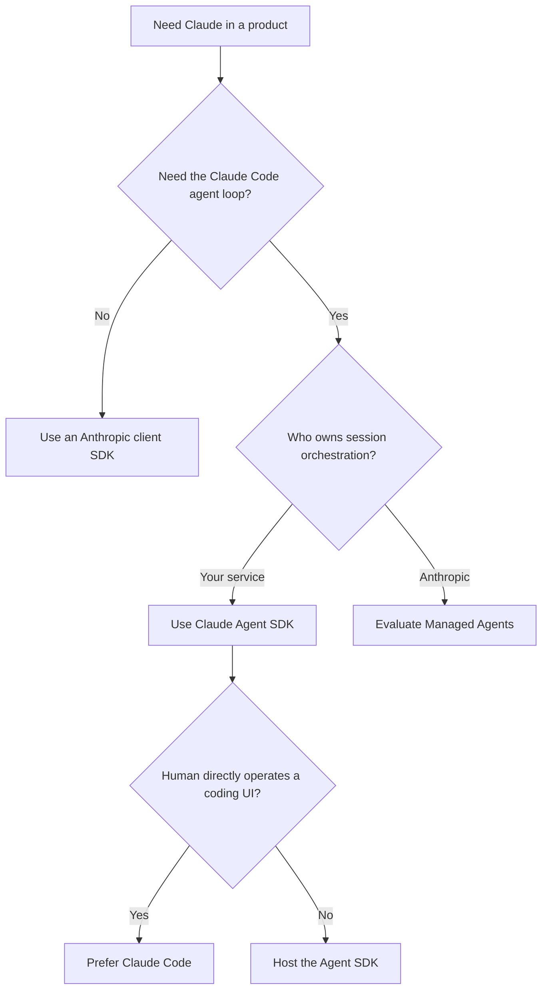

# Ecosystem Boundaries and Selection

Research date: **2026-08-31**  
Maturity: **stable architectural boundary; individual products remain fast-moving**

## The four surfaces are not interchangeable

Anthropic’s current developer ecosystem has four adjacent but operationally different surfaces.

| Surface | Execution loop | Runtime owner | State owner | Normal use |
|---|---|---|---|---|
| Anthropic client SDK | Application-defined | Your application | Your application | Direct Messages API calls and custom loops |
| Claude Agent SDK | Claude Code-derived child process | You | You, with local SDK transcripts | Tool-using workspace agents in Python or TypeScript |
| Claude Code | Claude Code application | User or CI runner | Local/user environment | Interactive or noninteractive coding work |
| Claude Managed Agents | Anthropic-managed orchestration | Anthropic control plane; Anthropic cloud or your self-hosted worker for tools | Anthropic session service plus chosen sandbox | Durable hosted agent sessions |

An API client is not a harness. A harness is not a security sandbox. A sandbox is not an authorization system. Managed hosting is not a compatibility wrapper around a local SDK session.

## Ownership is the selection test

Ask these questions in order:

1. Do you need the Claude Code tool loop, or only model requests?
2. Must the agent operate on a real workspace?
3. Who must own the process tree and isolation boundary?
4. Who must persist the transcript, sandbox, and event log?
5. Where must credentials and regulated data live?
6. Does the application need durable human approval across worker loss?
7. Can the service accept a beta hosted API and its retention contract?

The first surface that satisfies the requirements with the least inherited behavior is usually the right one.

## Anthropic client SDK: build only the loop you need

The official client SDKs expose the Claude API in Python, TypeScript, C#, Go, Java, PHP, and Ruby. They provide typed requests, streaming, timeouts, request IDs, and automatic retry behavior. They do not create a workspace, execute Bash, discover `CLAUDE.md`, compact a Claude Code transcript, or implement Agent SDK permissions.

Choose a client SDK when:

- the task is one or a few model calls;
- tools are application APIs rather than a filesystem and shell;
- the language is not Python or TypeScript;
- deterministic state-machine control matters more than a general-purpose agent loop;
- the application needs to own every retry, tool result, and prompt token.

The cost is that the application must implement tool dispatch, loop termination, context management, permissions, transcript storage, and any multi-agent behavior it actually needs.

## Claude Agent SDK: self-hosted harness

The Agent SDK packages bundle a Claude Code executable and communicate with it over a subprocess protocol. The child process owns the live loop and calls the configured model provider. Your service supplies options and prompt/input messages, consumes SDK messages, and hosts the workspace and tools.

Choose it when:

- the task benefits from Claude Code’s built-in file, shell, search, skill, subagent, hook, and permission machinery;
- a real working directory is central to the task;
- your organization can operate one process tree per concurrent session;
- you need control over isolation, networking, scheduling, and data location;
- Python or TypeScript is acceptable at the integration boundary.

The package is pre-1.0 and the bundled CLI is part of its behavior. Treat a package upgrade as both a library and harness-runtime upgrade.

## Claude Code: product, not merely a dependency

Claude Code itself is the best fit when a person is operating a coding agent in a terminal or IDE, or when a CI job can use its noninteractive interface directly. The Agent SDK deliberately differs in some defaults. For example, an SDK query with no explicit system prompt uses a minimal tool-calling prompt, while `claude -p` uses the full Claude Code prompt. Matching CLI behavior requires the `claude_code` system-prompt preset.

Do not assume a successful manual Claude Code workflow is already a production service design. A service still needs tenant isolation, authenticated ingress, durable job state, effect idempotency, resource control, and lifecycle observability.

## Claude Managed Agents: hosted control plane

Managed Agents models work as agents, environments, sessions, threads, and persisted events. A cloud environment gives each session an isolated Linux sandbox. A self-hosted environment keeps tool execution in your infrastructure while Anthropic still orchestrates the session and receives model and tool inputs/outputs.

Choose it when:

- server-side durable sessions and event history are valuable;
- the platform event model, budgets, webhooks, and session viewer reduce enough operational work;
- the current beta contract is acceptable;
- its retention and compliance posture matches the workload;
- cloud sandbox limits or the self-hosted worker model fit the security design.

Do not choose it solely to avoid containers. Cloud and self-hosted modes still require explicit tool permissions, network restrictions, vault scoping, artifact export, incident handling, and application-level authorization.

## Important non-equivalences

| Common assumption | Reality |
|---|---|
| “Agent SDK is the Anthropic Python SDK with tools” | It is a distinct package that launches a Claude Code-derived runtime |
| “Managed Agents hosts my Agent SDK code” | It exposes a separate beta resource and event model |
| “Resume restores the whole job” | Agent SDK resume restores conversation state, not external business state or arbitrary filesystem state |
| “Permissions make Bash safe” | Permissions decide whether a tool may run; isolation limits what a permitted or exploited tool can affect |
| “Self-hosted Managed Agents keeps all data local” | Tool execution is local, but model and tool inputs/outputs still traverse Anthropic’s control plane |
| “The same model ID gives the same behavior everywhere” | Harness prompts, tool schemas, effort defaults, providers, and platform lifecycle alter behavior |

## Practical selection examples

### Repository repair worker

Use the Agent SDK in a per-job container when a worker must clone a repository, inspect it, edit files, run tests, and return a patch. Keep repository credentials outside the agent, mount only the job checkout, restrict egress, and enforce an application deadline.

### Customer support action bot

Prefer a client SDK and a small explicit tool loop when the only tools are typed customer-account APIs. This avoids inheriting Bash and workspace semantics. Require application-side authorization immediately before mutations.

### Long-lived hosted research workspace

Managed Agents may fit when session history, sandbox checkpointing, streaming events, and operator inspection should be platform services. Export durable artifacts before the 30-day sandbox-state window expires.

### Existing Claude Code automation

If a stable `claude -p` pipeline already meets the requirements, the Agent SDK is justified when the application needs typed streaming, multi-turn input, programmatic hooks, in-process MCP tools, interruption, or direct session control. Otherwise, migration may add little value.

## Selection checklist

- [ ] The required loop complexity is explicit.
- [ ] Process, transcript, workspace, and artifact owners are named.
- [ ] Tenant and credential boundaries are defined.
- [ ] The approval flow survives the chosen worker lifecycle.
- [ ] Data retention and compliance constraints are checked.
- [ ] Model/provider availability and language constraints are checked.
- [ ] A simpler client-SDK loop was considered.
- [ ] The team accepts the selected surface’s maturity and upgrade cadence.

## Sources

- [Agent SDK overview](https://code.claude.com/docs/en/agent-sdk/overview)
- [CLI, SDKs, and libraries](https://platform.claude.com/docs/en/cli-sdks-libraries/overview)
- [Modifying system prompts](https://code.claude.com/docs/en/agent-sdk/modifying-system-prompts)
- [Hosting the Agent SDK](https://code.claude.com/docs/en/agent-sdk/hosting)
- [Managed Agents overview](https://platform.claude.com/docs/en/managed-agents/overview)
- [Self-hosted sandboxes](https://platform.claude.com/docs/en/managed-agents/self-hosted-sandboxes)
- [API and data retention](https://platform.claude.com/docs/en/manage-claude/api-and-data-retention)

