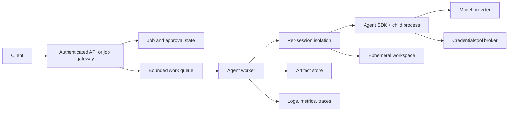

# Hosting, Deployment, and Scaling

Research date: **2026-08-31**  
Maturity: **documented deployment patterns; capacity and provider behavior remain workload-specific**

## Reference service boundary

The Agent SDK belongs behind an application service, not directly on an unauthenticated queue or public socket.



The gateway authenticates and authorizes. The scheduler imposes quotas and affinity. The worker owns process supervision. The isolation boundary limits tools. Durable stores own business state and artifacts.

## Packaging

The SDK packages bundle a native Claude Code executable. Runtime requirements documented today are Python 3.10+ or Node.js 18+ for the wrapper environment, while a separate Claude Code install is normally unnecessary.

Production image guidance:

- pin the exact SDK version and lockfile;
- use a supported OS/architecture;
- install only tools the workflow needs;
- run as a non-root user;
- verify the bundled CLI starts during image build or preflight;
- log package and CLI versions at runtime;
- maintain a previous image for rollback.

Anthropic recommends taking patch updates continuously and reviewing changelogs before minor updates. A controlled fleet should still canary every runtime change because tool and permission behavior are part of the effective contract.

## Session placement

### Ephemeral one-shot

Queue one job to any worker, create a fresh workspace, run to completion, export, destroy. No affinity is needed after completion unless the job can resume.

### Long-lived streaming session

Pin the session to one worker/process while active. Route subsequent input through an affinity key such as the application session ID. If the worker fails, explicitly declare the session interrupted and run the recovery procedure; do not silently start a new conversation.

### Hybrid durable resume

Use SessionStore for transcript state and independently persist/hydrate the workspace. Route normally by affinity, but resume elsewhere after verifying the workspace, runtime, tools, policy, and last confirmed effect.

Consistent hashing can reduce movement, but durable routing metadata is clearer when sessions can wait for approvals or remain idle for long periods.

## Capacity planning

The hosting guide’s fresh-session starting point—roughly one CPU, 1 GiB RAM, and 5 GiB disk—is not a sizing promise. Real usage varies with:

- transcript length and compaction;
- model stream buffers;
- repository size;
- Bash child processes;
- MCP servers;
- subagent fan-out;
- browsers, compilers, tests, and package managers.

Build a workload matrix and measure p50/p95/p99:

| Dimension | Measure |
|---|---|
| Memory | Whole process tree peak RSS |
| CPU | Active and throttled time per job |
| Disk | Checkout, generated files, package caches, transcripts |
| Processes | Peak descendants and leaked processes |
| API | Concurrent requests, tokens/minute, rate-limit responses |
| Network | Model, MCP, web, and package bandwidth |
| Lifecycle | Startup, first-token, tool, cancellation, cleanup latency |

Admission control should consider both host resources and organization/provider rate limits. More replicas cannot overcome a shared token or spend cap.

## Deadlines

The SDK has no complete top-level session timeout. Configure:

- `API_TIMEOUT_MS` for each model request attempt;
- `CLAUDE_CODE_MAX_RETRIES` for API retry count;
- MCP and hook timeouts;
- `CLAUDE_ASYNC_AGENT_STALL_TIMEOUT_MS` for background child silence;
- an application wall-clock deadline;
- a process-tree kill grace period.

Current defaults documented in the TypeScript reference are 600,000 ms for a request attempt, 10 retries, and 600,000 ms for a background-subagent stall. Worst-case request wall time can approach:

```text
API_TIMEOUT_MS * (CLAUDE_CODE_MAX_RETRIES + 1) + backoff
```

With defaults, that upper bound is far beyond most HTTP request deadlines. Set values intentionally and run the agent as an asynchronous job when completion can outlive ingress timeouts.

## Networking

Allow outbound access to the selected model endpoint:

- `api.anthropic.com` for direct Claude API;
- the required AWS/Google endpoints for Bedrock or Vertex;
- explicitly approved MCP, web, repository, or package destinations.

The child CLI does not need inbound network access. The application owns ingress.

A domain allowlist is stronger when traffic passes through a proxy that resolves destinations, blocks private/link-local ranges, controls redirects, and injects credentials. Simple DNS rules can be bypassed through domain fronting or changing addresses and do not inspect TLS content.

## Credentials

Prefer short-lived, job-scoped credentials delivered through a broker. The model should request an operation with business identifiers; the broker should attach the real credential after authorization.

Avoid:

- long-lived provider keys in repository files;
- inherited cloud credentials;
- full user home directories;
- tokens in `CLAUDE.md`, skills, hooks, or tool output;
- one shared credential across tenants.

Inbound product authentication and outbound model authentication are unrelated. Implement both.

## Multi-tenancy

At minimum, isolate per tenant:

- working directory;
- Claude configuration directory;
- SessionStore namespace;
- cache and temporary directories;
- environment and credentials;
- network policy;
- logs and artifacts.

Set settings sources empty unless tenant project instructions are intentionally part of the workload. Disable automatic memory and unintended Claude.ai connectors. Do not share a writable workspace between untrusted tenants.

For hostile input or code execution, use a stronger isolation boundary than a shared application process. Container-per-job is a common baseline; microVM/VM isolation may be justified by threat model.

## Autoscaling and backpressure

Scale on admitted sessions and measured process-tree resources, not only CPU. A worker that holds many approval-waiting processes may show low CPU while exhausting memory and file descriptors.

Separate queues for:

- interactive latency-sensitive sessions;
- batch jobs;
- high-resource test/build jobs;
- approval resumes;
- recovery/reconciliation work.

Apply per-tenant concurrent-session, token, spend, and queue limits before creating child processes.

## Deployment rollout

Canary by execution fingerprint:

- SDK and bundled CLI version;
- wrapper language/runtime;
- model/provider;
- system prompt hash;
- permission and hook policy version;
- extension versions;
- sandbox image.

Run golden workflows and adversarial permission tests before increasing traffic. Preserve canary transcripts and diffs for behavioral comparison. Roll back the entire image, not only the package, if toolchain differences may matter.

## Deployment checklist

- [ ] Sessions run behind authenticated, authorized ingress.
- [ ] SDK/runtime versions and image are immutable.
- [ ] Workspaces and configuration are tenant-isolated.
- [ ] Whole process trees have resource and wall-clock limits.
- [ ] Timeout × retry worst cases fit the job SLO.
- [ ] Egress and credential injection are constrained.
- [ ] Admission control includes provider rate/spend capacity.
- [ ] Active sessions have affinity or a tested recovery path.
- [ ] Autoscaling observes waiting and child-process states.
- [ ] Canaries cover permissions, compaction, cancellation, and effects.

## Sources

- [Hosting the Agent SDK](https://code.claude.com/docs/en/agent-sdk/hosting)
- [Secure deployment](https://code.claude.com/docs/en/agent-sdk/secure-deployment)
- [TypeScript SDK reference](https://code.claude.com/docs/en/agent-sdk/typescript)
- [Python SDK reference](https://code.claude.com/docs/en/agent-sdk/python)
- [External session storage](https://code.claude.com/docs/en/agent-sdk/session-storage)
- [Claude API errors](https://platform.claude.com/docs/en/api/errors)

