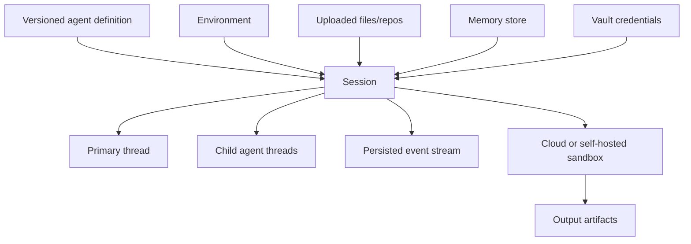

# Claude Managed Agents Boundary and Operations

Research date: **2026-08-31**  
Maturity: **beta hosted platform with explicit versioned headers and evolving operational limits**

## Separate product boundary

Claude Managed Agents is a hosted, stateful agent platform. It is not the Agent SDK child process running in Anthropic’s infrastructure.

| Concern | Agent SDK | Managed Agents |
|---|---|---|
| API/package | Python/TypeScript Agent SDK | Managed Agents beta API and general Anthropic SDK beta resources |
| Loop | Bundled Claude Code child on your host | Anthropic-managed harness |
| Session state | Local transcript or your SessionStore | Server-side sessions and events |
| Workspace | Your filesystem/isolation | Anthropic cloud sandbox or your self-hosted worker |
| Approvals | Permission rules, hooks, callbacks | Session event/tool confirmation model and policies |
| Scaling | Your processes and scheduler | Managed control plane; chosen sandbox capacity |
| Retention | Your storage plus provider policy | Stateful platform retention until delete; sandbox checkpoint limit |

Use the `managed-agents-2026-04-01` beta header for Managed Agents API requests. Memory store endpoints use `agent-memory-2026-07-22`. Official SDKs set the relevant header when using the beta resource.

## Resource model

- An agent definition selects model, system prompt, tools, MCP servers, skills, and multiagent configuration.
- Agent definitions are reusable and versioned.
- Environments describe sandbox behavior and packages but are currently not versioned; maintain your own change ledger.
- A session binds the effective agent and environment, owns history and status, and can contain multiple threads.
- Events are the durable interaction and observability model.

A session can override parts of the saved agent. An agent ID normally resolves to its latest version unless a version is pinned. Pin versions for reproducible production runs.

## Session lifecycle

Current statuses:

| Status | Meaning |
|---|---|
| `idle` | Waiting for user input or tool confirmation |
| `running` | Executing |
| `rescheduling` | A transient platform error occurred and automatic retry is in progress |
| `terminated` | Unrecoverable end or archived session |

Create a session and then send events, or include initial events at creation. User and system events enter the session; session, span, and agent events describe progress. Event type names follow a domain/action convention.

The event record’s `processed_at` is important. User input can be accepted into a queue before it is processed. Track processing state instead of assuming an accepted HTTP request immediately influenced the agent.

## Streaming and interruption

SSE streams provide live events and optional deltas, while the platform persists canonical events. Reconnect by listing/fetching persisted events and resume from a known event ID or application cursor.

Sending an interrupt followed by a message stops the current model response quickly, but an active tool may take longer. The interrupted turn currently uses the same `end_turn` stop reason as a normal finish; there is no unique model stop reason for interruption. Use the input event and processing timeline to distinguish it.

Do not assume an interrupt reversed a tool effect. Apply the same idempotency and reconciliation rules as an Agent SDK integration.

## Budgets and retries

A session budget is a hard policy in list-price cents represented by the API’s budget structure. The platform checks each thread before its next model request. In-flight work can make actual cost cross the cap slightly. When reached, the session goes idle with `budget_reached` rather than terminating.

Updating the cap or removing it can resume the session. Removing a budget is one-way: a session created without one, or with one later removed, cannot simply add it back under the current contract.

`rescheduling` means the platform is retrying a transient error. Repeated failures can exhaust retries and terminate a thread/session. Application retries should fetch the current session and event state before sending duplicate user work.

## Cloud sandbox

Current cloud environments create a fresh isolated Ubuntu Linux sandbox per session. Documented reference capacity is up to 8 GiB RAM and 10 GiB disk, but treat limits as refresh-sensitive.

Environment networking is critical:

- API-created environments can default to unrestricted sandbox networking;
- production environments should specify allowed hosts;
- MCP and package-manager allowlists are configured separately;
- server-side web search/fetch domain controls are not the same as sandbox networking.

Packages can be cached across sessions for an environment. Unpinned package installation can therefore change behavior over time. Pin packages and maintain an environment revision ledger.

When a session becomes idle, its sandbox is checkpointed. Conversation history remains until deletion, but sandbox state is retained only 30 days from sandbox creation; activity does not extend the window. Export important files to outputs or an external artifact store before then.

## Self-hosted sandbox

In self-hosted mode, Anthropic orchestrates the session while a worker in your infrastructure polls for sandbox/tool work.

Anthropic still receives model and tool inputs/outputs. Skills and memory are stored by the platform and copied or synchronized to the worker. Therefore self-hosted means local execution and network control, not a local-only data plane.

You own:

- worker image and hardening;
- egress and private service connectivity;
- environment-key rotation;
- tenant isolation;
- session secret injection;
- custom-tool blast radius;
- logging and cleanup;
- local copies of memory and skills.

A read-only memory-store configuration prevents platform synchronization/API writes, but Bash or a custom tool can still mutate the local mounted view. Remove Bash or enforce filesystem controls if the content must be immutable during execution.

## Tools and permissions

Managed toolsets include Bash, file read/write/edit, glob/grep, and web tools. Large tool output can be moved to a sandbox file with a preview when it exceeds the platform threshold, reducing event/context size.

Current defaults differ:

- agent toolset tools default to `always_allow`;
- MCP toolsets default to `always_ask`;
- server policies apply to server-executed tools;
- custom tools executed by your application are outside that enforcement and must authorize themselves.

Review effective policies instead of accepting defaults. Treat vault IDs as references, not proof the session may use the underlying account.

## Vaults, memory, and skills

Vaults are workspace-scoped credential resources. Anyone holding an API key for that workspace can potentially reference a vault, so workspace access control is the first boundary. Prefer user-specific vault selection at session creation and narrow remote scopes.

Memory stores are versioned file collections mounted into sessions. Current limits are 100 KB per memory and 2,000 memories per store. They provide durable context, not trusted database state; the agent can read and potentially modify mounted content according to tools and policy.

Skills can be attached resources or discovered from repository paths. Repository skills are a code-review boundary: a committer can inject instructions. Loading many skills adds cold-start/context overhead even when full bodies are on demand.

## Multiagent threads

Managed Agents threads have separate context and event history but share the session sandbox, filesystem, and vault credentials. Agent configurations and tool sets are thread-specific. The current documented maximum is 25 concurrent child threads, excluding the advisor.

The session budget is shared. The primary stream may show condensed child progress; inspect child thread event streams for full evidence. Shared filesystem access creates the same write-race risks as local subagents.

## Webhooks

Webhooks notify major status changes but carry identifiers rather than the complete resource. Fetch the current object after receipt.

Design for:

- signed request verification with timestamp freshness;
- at-least-once delivery and duplicate event IDs;
- out-of-order events;
- resource deletion before a delayed webhook arrives;
- idempotent consumers;
- reconciliation polling for missed delivery.

The signing timestamp is regenerated for each delivery attempt, so a retried webhook can still pass freshness checks.

## Retention and compliance

Managed Agents sessions are stateful and retained until deleted under the current documentation. The product is not eligible for zero-data-retention and is not covered by Anthropic’s HIPAA BAA at the research date, including self-hosted sandbox sessions.

Archiving and deletion require an idle session; interrupt a running session first. Deleting a session removes its record, events, and sandbox, but separately created resources such as agents, environments, vaults, memory stores, and uploaded files have their own lifecycles.

Build a deletion inventory and export needed outputs before deletion.

## Operational checklist

- [ ] Beta headers and agent/environment versions are recorded.
- [ ] Agent version is pinned where reproducibility matters.
- [ ] Environment changes have an external ledger.
- [ ] Event consumers use IDs, `processed_at`, deduplication, and reconciliation.
- [ ] Budgets, retries, and application duplicate submission are coordinated.
- [ ] Cloud sandbox networking is explicitly restricted.
- [ ] Important outputs leave the 30-day sandbox checkpoint boundary.
- [ ] Self-hosted data flow through Anthropic is accepted.
- [ ] Custom tools authorize and deduplicate their own effects.
- [ ] Retention, ZDR, BAA, and deletion requirements are approved.

## Sources

- [Managed Agents overview](https://platform.claude.com/docs/en/managed-agents/overview)
- [Agent setup](https://platform.claude.com/docs/en/managed-agents/agent-setup)
- [Start a session](https://platform.claude.com/docs/en/managed-agents/sessions)
- [Session event stream](https://platform.claude.com/docs/en/managed-agents/events-and-streaming)
- [Session operations](https://platform.claude.com/docs/en/managed-agents/session-operations)
- [Cloud environments](https://platform.claude.com/docs/en/managed-agents/environments)
- [Cloud sandbox reference](https://platform.claude.com/docs/en/managed-agents/cloud-sandboxes-reference)
- [Self-hosted sandboxes](https://platform.claude.com/docs/en/managed-agents/self-hosted-sandboxes)
- [Self-hosted sandbox security](https://platform.claude.com/docs/en/managed-agents/self-hosted-sandboxes-security)
- [Permission policies](https://platform.claude.com/docs/en/managed-agents/permission-policies)
- [Multiagent orchestration](https://platform.claude.com/docs/en/managed-agents/multiagent-orchestration)
- [Webhooks](https://platform.claude.com/docs/en/managed-agents/webhooks)
- [API and data retention](https://platform.claude.com/docs/en/manage-claude/api-and-data-retention)

