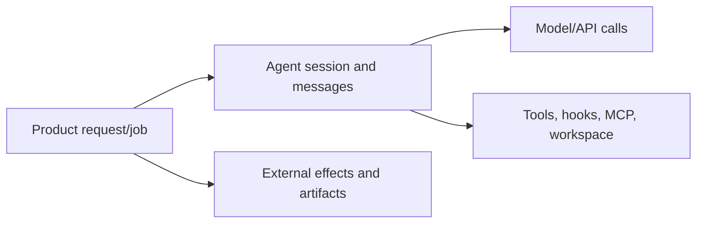

# Observability, Testing, and Debugging

Research date: **2026-08-31**  
Maturity: **OpenTelemetry integration is available; end-to-end run observability remains application-owned**

## Observe four layers

A useful trace connects all four. Model telemetry without application state cannot explain why a job was retried. Tool logs without model message IDs cannot explain why a command ran. A transcript without effect receipts cannot prove what changed externally.

## Execution fingerprint

Attach this immutable fingerprint to every run:

- application build and sandbox image;
- SDK package and bundled CLI version;
- Python/Node runtime and operating system;
- model ID, provider, region, effort, and fallback route;
- system prompt and project-instruction hashes;
- settings sources and relevant feature flags;
- tool/MCP/skill/plugin/agent definitions and versions;
- permission mode, rules, and hook-policy version;
- workspace identity and source revision;
- tenant-safe correlation IDs.

Without it, behavior changes after an upgrade look like nondeterministic model drift.

## Event schema

At minimum, record:

| Event | Useful fields |
|---|---|
| Session start | run/session ID, fingerprint, deadline, budgets |
| Model message | message ID, model, usage, latency, stop reason |
| Tool proposal | tool-use ID, normalized input hash, agent ID |
| Permission decision | rule/hook/callback, decision, policy version, latency |
| Tool completion | outcome, duration, output size/hash, effect receipt |
| Compaction | trigger, boundary sequence, context estimate |
| Subagent lifecycle | parent/child IDs, definition, turns, cost |
| Cancellation | initiator, requested/observed timestamps, in-flight operation |
| Result | subtype, usage, cost estimate, structured output status |
| Stream close | exit/cleanup status, leaked-process check |
| SessionStore mirror | batch identity, attempt, acknowledgement/error |

Redact secrets before export. Hashing can preserve correlation without storing raw prompts or tool input.

## OpenTelemetry boundary

Claude Code can emit OpenTelemetry metrics, logs, and traces when telemetry environment variables are enabled. The child CLI is the producer; the wrapper SDK forwards configuration but does not create complete product traces for you.

Operational cautions:

- exporter errors can be silent and data may be dropped;
- enable diagnostic stderr when validating the pipeline;
- do not use the console exporter on stdout because stdout carries the SDK protocol;
- prompt and tool-input content is excluded by default and opt-in fields are sensitive;
- correlate CLI spans with an application run/session ID.

Use an OTLP collector as the stable boundary. The collector can add environment labels, redact, sample, buffer, and route without changing agent workers.

## Metrics

### Reliability

- runs by terminal subtype;
- streams ending without Result;
- child-process crash and forced-kill rate;
- SessionStore mirror errors;
- MCP startup/timeouts;
- hook timeout/deny/error counts;
- approval abandonment and expiry;
- effect reconciliation incidents.

### Performance

- queue, startup, first-token, model, tool, approval, and cleanup latency;
- process-tree peak memory/CPU/disk;
- context growth and compaction frequency;
- stream queue depth and dropped/coalesced deltas;
- subagent concurrency and depth.

### Cost

- input/output/cache tokens by model and task class;
- `total_cost_usd` estimate;
- aggregated `modelUsage` across the tree;
- authoritative Usage/Cost API reconciliation;
- cost per successful business outcome.

The terminal cost estimate comes from a bundled price table and can be zero after a crash. Use it for immediate safeguards, not invoices.

## Testing pyramid

### 1. Pure adapter tests

Test:

- message normalization;
- unknown variants;
- structured-output schema validation;
- permission-rule construction;
- path normalization;
- idempotency-key generation;
- redaction;
- terminal-state mapping.

These tests should not call a model.

### 2. Fake tool and MCP tests

Use deterministic servers to simulate:

- success and domain failure;
- timeout before and after an effect;
- duplicate request;
- cancellation;
- huge output;
- malformed result;
- OAuth-needed/startup failure;
- read-only tools executing in parallel.

### 3. Harness integration tests

Against the pinned SDK/runtime, test:

- initialization fingerprint;
- each permission mode and rule precedence;
- hook timeout and concurrency;
- interrupt and drain;
- Result plus trailing events;
- session resume/fork;
- SessionStore conformance and mirror failure;
- compaction boundary;
- subagent depth/concurrency enforcement;
- file-checkpoint limitations if enabled.

### 4. Model behavioral evaluations

Run task datasets with outcome graders rather than exact text assertions. Include:

- task completion;
- unnecessary tool calls;
- unsafe proposals;
- citation/evidence quality;
- cost and latency;
- recovery after tool failure;
- behavior after compaction;
- fallback model path.

Pin prompts and environment, run multiple trials, and compare distributions.

### 5. Adversarial and chaos tests

Inject prompt attacks through files, web pages, MCP output, and skills. Kill the worker during:

- a model stream;
- tool execution;
- `canUseTool` wait;
- SessionStore mirror;
- artifact export.

Verify no unauthorized effect occurs, ambiguous effects reconcile, and cleanup/retention rules still apply.

## Debugging sequence

1. Identify the run/session and execution fingerprint.
2. Confirm the actual model, effort, provider, permissions, and tool set.
3. Find the last complete application sequence and raw SDK message.
4. Determine whether the child exited, stalled, or the consumer stopped reading.
5. Inspect tool/permission/hook events around the failure.
6. Check SessionStore mirror and workspace integrity.
7. Reconcile external effects.
8. Reproduce with the same image and a sanitized transcript/workspace.
9. Reduce to the smallest prompt/tool combination before filing an SDK issue.

Capture the Anthropic request ID when available. It is the key reference for provider support.

## Common misleading symptoms

| Symptom | Possible real cause |
|---|---|
| “Process aborted” | Streaming input generator threw |
| Session hangs | Python producer failure, undrained iterator, tool/MCP wait, or long retries |
| Lower-quality response | Different model/effort, compaction pressure, changed prompt sources, fallback route |
| Cost is zero | Child crash before final accounting |
| Resume forgot child work | SessionStore subkeys not restored |
| Approval callback never ran | Tool was auto-approved earlier in permission evaluation |
| OTel shows nothing | Export failure was dropped or telemetry emitted by child was misconfigured |
| Result observed but worker remains | Consumer broke early or trailing cleanup/process did not finish |

## Observability checklist

- [ ] Every run has a complete execution fingerprint.
- [ ] Application, harness, model, tool, and effect events correlate.
- [ ] Terminal result and clean stream close are distinct signals.
- [ ] OTel uses OTLP, not stdout console export.
- [ ] Sensitive prompt/tool fields are off or redacted.
- [ ] Tests cover compaction, interruption, mirror errors, and process death.
- [ ] Behavioral evals grade outcomes across repeated trials.
- [ ] Cost estimates reconcile with authoritative usage.
- [ ] Incident tooling preserves raw evidence without exposing tenant secrets.

## Sources

- [Agent SDK observability](https://code.claude.com/docs/en/agent-sdk/observability)
- [Cost tracking](https://code.claude.com/docs/en/agent-sdk/cost-tracking)
- [How the agent loop works](https://code.claude.com/docs/en/agent-sdk/agent-loop)
- [Troubleshooting](https://code.claude.com/docs/en/agent-sdk/troubleshooting)
- [External session storage](https://code.claude.com/docs/en/agent-sdk/session-storage)
- [Claude API errors and request IDs](https://platform.claude.com/docs/en/api/errors)

