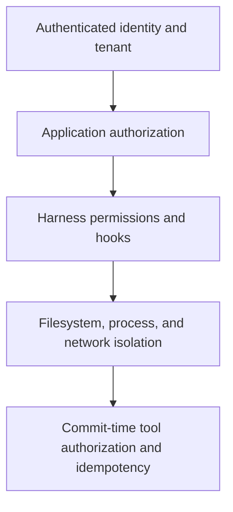
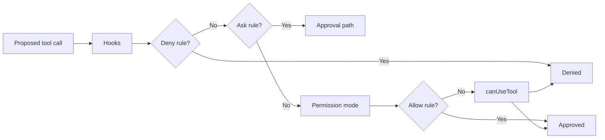

# Permissions, Approvals, and Security

Research date: **2026-08-31**  
Maturity: **permission mechanics are documented; production safety depends on external isolation and authorization**

## Security model

An Agent SDK deployment needs four separate controls:

- application authorization decides what the caller may request;
- permissions and hooks govern which tool call the harness may dispatch;
- isolation limits the damage a dispatched or exploited tool can cause;
- the tool implementation reauthorizes and commits an external mutation safely.

Removing any layer creates a gap. Prompt instructions are not an enforcement layer.

## Exact permission evaluation

Current documentation specifies this order:

1. hooks;
2. deny rules;
3. ask rules;
4. permission mode;
5. allow rules;
6. `canUseTool` callback.

A hook returning allow does not skip a later deny or ask. Deny rules still matter in bypass mode. A bare-name deny can remove a tool from the model context entirely; a scoped deny is evaluated when the tool call is proposed.

## Permission modes

| Mode | Behavior | Suitable use |
|---|---|---|
| `default` | Unresolved calls ask via callback; absent callback means deny | Interactive applications |
| `dontAsk` | Preapproved calls run; unresolved calls deny | Autonomous least-privilege jobs |
| `acceptEdits` | File edits and selected filesystem commands are auto-approved | Trusted coding workspace with other commands gated |
| `plan` | Read-only exploration and planning | Review/plan phase, not a universal sandbox |
| `auto` | TypeScript-only model classifier makes permission decisions | Experimental, evaluate against risk policy |
| `bypassPermissions` | Broadly approves tools subject to remaining deny/hook behavior | Only inside a disposable, tightly isolated environment |

`allowedTools` is not a universal capability allowlist. It auto-approves matching tools. In `bypassPermissions`, nonlisted tools can still run. For an unattended locked-down worker, combine a small exposed tool set, `dontAsk`, explicit allow rules, deny rules, and external isolation.

Some ask paths still reach the callback in modes that otherwise avoid prompting, including explicit AskUserQuestion behavior, MCP tools that declare user interaction, and organization connector policies. Test the exact combination used in production.

## Approval architecture

`canUseTool` is an in-process callback for unresolved permissions and AskUserQuestion. It does not see calls that were already auto-approved. Use `PreToolUse` if every call must be audited.

A callback can wait indefinitely and is cancelled only with the query. That makes it fragile across:

- worker restart;
- load-balancer rerouting;
- deployment;
- process deadline;
- application crash.

Prefer one of two patterns.

### Short synchronous approval

Use `canUseTool` when a person is actively connected and the wait is bounded to seconds or a few minutes. Persist the proposed action before presenting it. On disconnect or timeout, deny and drain the session.

### Durable approval

Convert the proposal into an application record with:

- tenant and user identity;
- normalized action;
- resource scope;
- risk explanation;
- expiry;
- policy version;
- session and tool-use IDs;
- hash of the exact parameters.

Pause through `defer` or a two-phase custom tool. On approval, create a one-use signed commit token. The tool validates the token and current authorization immediately before the effect. Resuming a transcript alone must never imply approval.

## AskUserQuestion

AskUserQuestion is useful for product decisions that the agent cannot infer. Current limits include one to four questions with two to four options. It is not available inside subagents invoked through the Agent tool.

Do not use it to collect secrets or as the only authorization mechanism. A malicious prompt can shape the question. The application should render a safe, typed confirmation UI for sensitive actions.

## Prompt injection

Potential instruction-bearing inputs include:

- user prompts;
- repository files and `CLAUDE.md`;
- skill and plugin content;
- web pages and search results;
- MCP tool descriptions and responses;
- shell output and logs;
- generated files from prior agents.

Assume an attacker can place instructions in any of them. Defenses:

1. narrow the available tools;
2. isolate the environment;
3. deny credential files and metadata endpoints;
4. restrict egress by destination and protocol;
5. keep secrets out of model-visible environment/context;
6. validate typed tool input;
7. reauthorize mutations at the adapter;
8. require human review for high-impact commits;
9. inspect final diffs/artifacts rather than trusting a textual summary.

Prompt sanitization alone is not a reliable defense because the agent must often read untrusted natural language to do its work.

## Containment

Anthropic’s secure-deployment guidance distinguishes permissions from sandboxing. The optional sandbox runtime uses operating-system facilities such as Bubblewrap or macOS sandboxing. Containers and those facilities still share the host kernel. Stronger adversarial isolation can require gVisor or virtual machines.

Contain at least:

- writable filesystem to the job workspace;
- read access to only necessary source/reference data;
- outbound network to model/provider and approved tool endpoints;
- no cloud instance metadata;
- no container socket or host control plane;
- capped CPU, memory, disk, process count, and wall time;
- a non-root user where supported.

Read-only credentials are still exfiltratable. Prefer an outbound proxy or capability broker that injects short-lived credentials after authorizing the destination.

## MCP and custom-tool security

Each MCP server is a supply-chain and data-flow boundary. Validate:

- server identity and TLS;
- tenant routing;
- tool schema changes;
- OAuth/token scoping;
- response size and content;
- tool annotations;
- timeout and cancellation;
- logging/redaction.

Custom tools should accept business identifiers, not raw credentials. Keep the caller’s authorization context outside the model-generated JSON and bind it at the adapter.

## Hooks are policy, not containment

Pre-tool hooks can inspect or deny a proposed call, but version changes, timeout differences, matcher errors, or resume behavior can undermine a single-hook design. Normalize Windows path separators before path policy checks. Anchor regex matchers when exact matching is required.

Post-tool hooks cannot undo an effect. Asynchronous hooks cannot block it. Managed hooks may merge with local sources and can be hard to disable. Record the effective hook set during initialization.

## Security checklist

- [ ] Caller identity and tenant are authenticated before starting a session.
- [ ] Resource authorization is checked outside model output.
- [ ] Permission evaluation and modes are tested for the pinned runtime.
- [ ] `allowedTools` is not mistaken for a strict allowlist.
- [ ] Approval survives or safely fails on worker loss.
- [ ] Every irreversible tool is idempotent and commit-authorized.
- [ ] Workspace, egress, processes, and credentials are contained.
- [ ] Prompt-bearing repository, web, MCP, skill, and plugin inputs are untrusted.
- [ ] Hook failure cannot silently authorize a critical effect.
- [ ] Audit records include proposed input, decision, policy version, and effect receipt.

## Sources

- [Agent SDK permissions](https://code.claude.com/docs/en/agent-sdk/permissions)
- [User input and approvals](https://code.claude.com/docs/en/agent-sdk/user-input)
- [Hooks in the Agent SDK](https://code.claude.com/docs/en/agent-sdk/hooks)
- [Secure deployment](https://code.claude.com/docs/en/agent-sdk/secure-deployment)
- [Claude Code sandboxing](https://code.claude.com/docs/en/sandboxing)
- [MCP in the Agent SDK](https://code.claude.com/docs/en/agent-sdk/mcp)
- [Python issue 871: approval wait recovery](https://github.com/anthropics/claude-agent-sdk-python/issues/871)
- [Python issue 993: deferred resume hook behavior](https://github.com/anthropics/claude-agent-sdk-python/issues/993)

