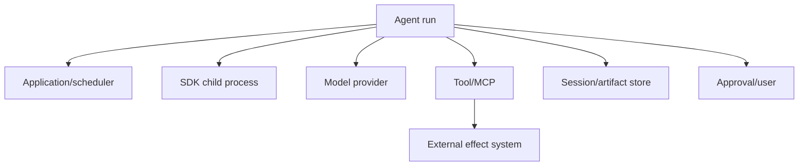
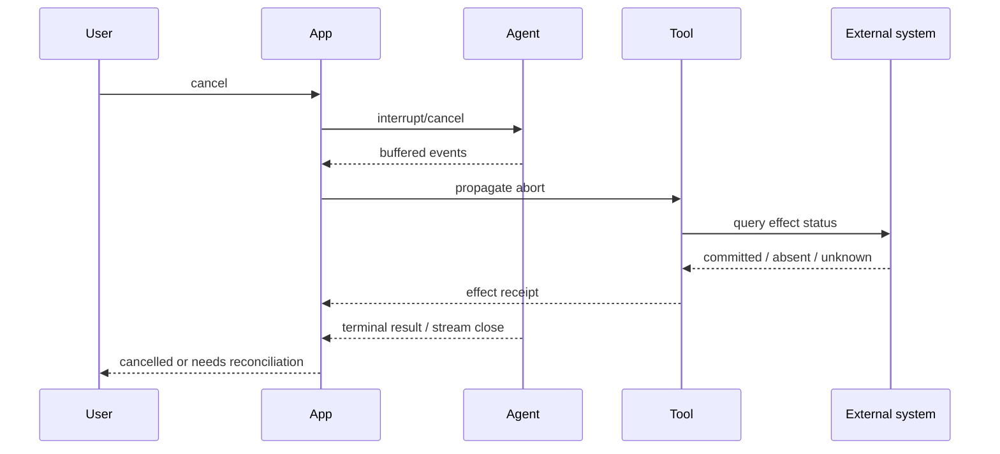

# Reliability, Cancellation, Retries, and Effects

Research date: **2026-08-31**  
Maturity: **failure primitives are documented; exactly-once business effects are application responsibility**

## Reliability objective

An agent run is reliable when it reaches a known state:

- completed with verified outputs;
- safely failed with no unaccounted effects;
- cancelled with in-flight work reconciled;
- paused with durable, expiring approval state;
- declared ambiguous and routed to recovery.

“The model returned text” is not a reliability objective.

## Failure domains



Each domain has independent timeout, retry, and cancellation semantics. A global retry of the entire run is unsafe if a tool effect may already have committed.

## Retry layers

| Layer | Current behavior | Risk |
|---|---|---|
| Agent child model client | `CLAUDE_CODE_MAX_RETRIES`, documented default 10 | Multiplies wall time and model attempts |
| Anthropic general client SDK | Transient errors retried twice by default | Applies to direct client-SDK code, not a replacement description for Agent SDK |
| SessionStore mirror | Up to three total attempts; timeout not retried due to ambiguity | Dropped batch can make resume incomplete |
| Managed Agents | Transient platform errors move session to `rescheduling` and retry | Separate hosted service contract |
| Application job | Your policy | Can duplicate tool/model work and effects |
| Tool adapter | Your policy | Must know whether operation is idempotent |

Do not stack defaults without computing the combined duration and attempt count.

## Timeout hierarchy

Choose:

```text
tool attempt timeout
  < model/MCP attempt timeout
  < turn budget
  < session deadline
  < queue/job lease
  < user-visible SLO
```

The exact relationship depends on the workload, but every inner timeout must leave time for cancellation, reconciliation, artifact export, and cleanup.

`API_TIMEOUT_MS` is per attempt. With `N` retries, worst-case time is approximately `timeout × (N + 1) + backoff`. A background subagent stall timeout resets on each event; it is not a total deadline. `maxTurns` and `maxBudgetUsd` are also not wall clocks.

## Cancellation protocol

Cancellation is a request, not proof that nothing happened.



Steps:

1. persist who requested cancellation and why;
2. stop accepting new input/tool work;
3. signal SDK interruption/cancellation;
4. propagate cancellation to MCP/custom tools;
5. continue draining buffered messages;
6. wait a bounded grace period;
7. terminate the whole process tree if necessary;
8. inspect tool receipts and external systems;
9. export evidence and clean the workspace;
10. publish the final application state.

After Python streaming interruption, drain the previous response before sending a new prompt.

## Effect-safe tools

Classify tools:

| Class | Example | Retry policy |
|---|---|---|
| Pure/read-only | Get record, search files | Retry within deadline |
| Idempotent mutation | Put object at deterministic key | Retry with stable idempotency key |
| Conditionally idempotent | Update row with expected version | Retry only with compare-and-swap |
| Non-idempotent | Send email, charge card, create deployment | Two-phase commit or reconcile before retry |
| Destructive | Delete data, rotate credentials | Explicit approval, narrow scope, receipt, recovery plan |

An ideal mutation tool has:

- `prepare` or validation returning a proposed operation;
- application approval/policy evaluation;
- a one-use operation ID/idempotency key;
- `commit` with current authorization and expected-version checks;
- a durable receipt;
- `status(operation_id)` for uncertain outcomes.

The model never invents the authority-bearing token.

## Ambiguous failures

Network timeout after sending a request means “unknown,” not “failed.” This applies to:

- MCP mutation;
- database write;
- webhook delivery;
- SessionStore append;
- artifact upload;
- deployment API.

Recovery order:

1. query by stable operation/idempotency ID;
2. accept an existing successful receipt;
3. retry only if the target guarantees idempotency;
4. otherwise require operator reconciliation.

Do not ask the model to infer whether the effect happened from its transcript.

## Terminal-state mapping

| SDK outcome | Application state |
|---|---|
| `success` + verified artifacts + clean close | Completed |
| max turns/budget | Incomplete, policy-limited |
| structured-output retries exhausted | Failed validation |
| execution error + no ambiguous effects | Failed |
| crash/stream loss during mutation | Reconciliation required |
| cancellation + confirmed no/known effects | Cancelled |
| cancellation + unknown effect | Reconciliation required |
| SessionStore mirror error | Completed only if resume durability is not promised; otherwise durability failure |

Keep the raw SDK subtype. Application states should be stable even if the SDK adds subtypes.

## Approval reliability

An in-process `canUseTool` wait ties approval durability to the worker. For a durable workflow:

- persist the proposal outside the transcript;
- expire it;
- bind approval to exact input and resource version;
- use defer or exit the job;
- resume with current permissions;
- reauthorize inside the tool.

The current open Python issues around pod-loss recovery and deferred-hook replay reinforce this design, but the pattern is needed even if those implementation bugs are fixed.

## Session recovery

Before resuming:

- confirm transcript durability and no mirror gap;
- hydrate the matching workspace;
- check source revision and pending diff;
- restore tool/MCP definitions;
- reapply permissions and deadlines;
- reconcile last in-flight operation;
- prevent two workers resuming the same session concurrently.

Use a lease or compare-and-swap in application state. SessionStore append ordering alone is not a distributed lock.

## Load and graceful shutdown

On deployment shutdown:

1. stop admitting sessions;
2. mark workers draining;
3. allow bounded safe completion;
4. interrupt remaining sessions;
5. reconcile and export;
6. kill process trees;
7. release leases only after durable terminal state.

An approval-waiting process should not block a deployment indefinitely.

## Reliability checklist

- [ ] Retry layers and worst-case wall time are calculated.
- [ ] Whole-session deadlines exist outside the SDK.
- [ ] Cancellation drains events and kills descendants if needed.
- [ ] Tools declare effect class and idempotency strategy.
- [ ] Ambiguous outcomes have status/reconciliation paths.
- [ ] Application terminal states do not depend on text output.
- [ ] Approval state is durable and input-bound.
- [ ] Resume is single-owner and verifies transcript/workspace/effects.
- [ ] Graceful shutdown handles waiting and background agents.
- [ ] Mirror errors and zero-cost crash results are observable.

## Sources

- [TypeScript SDK reference](https://code.claude.com/docs/en/agent-sdk/typescript)
- [Python SDK reference](https://code.claude.com/docs/en/agent-sdk/python)
- [How the agent loop works](https://code.claude.com/docs/en/agent-sdk/agent-loop)
- [Streaming input](https://code.claude.com/docs/en/agent-sdk/streaming-vs-single-mode)
- [User input and approvals](https://code.claude.com/docs/en/agent-sdk/user-input)
- [External session storage](https://code.claude.com/docs/en/agent-sdk/session-storage)
- [Claude API errors](https://platform.claude.com/docs/en/api/errors)
- [Python SDK documentation: retries and timeouts](https://platform.claude.com/docs/en/api/sdks/python)
