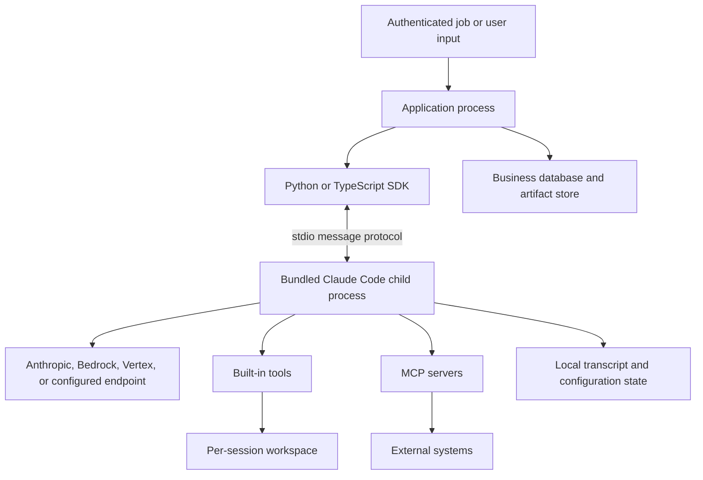
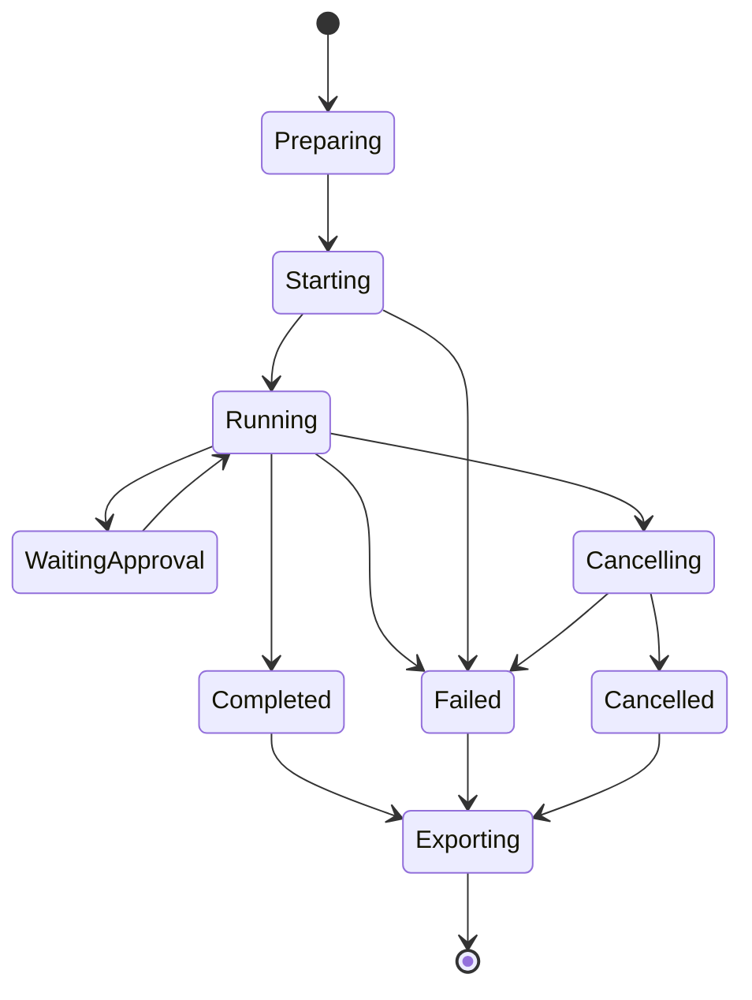

# Runtime, Process, and Workspace Architecture

Research date: **2026-08-31**  
Maturity: **core process model is documented; resource characteristics require workload measurement**

## Runtime topology

An Agent SDK query is a local distributed system in miniature. Application code talks to an SDK wrapper; the wrapper starts a bundled Claude Code executable; that process calls a model endpoint and executes or brokers tools against a workspace.



The SDK reference exposes options such as `cwd`, environment variables, a custom CLI path, hooks, and MCP servers, but the child process remains the live harness. One concurrent session normally means one child process or process tree. Subagents can add additional activity inside that tree.

## What is bundled and versioned

Both official packages bundle a native Claude Code executable for supported platforms. A separate Claude Code or Node installation is normally unnecessary. Updating the wrapper package updates the bundled runtime. This is operationally important:

- a wrapper API that does not change can still acquire different tool, permission, hook, compaction, or subagent behavior;
- the same application commit can behave differently if dependency resolution floats;
- a custom `cli_path` splits the wrapper and runtime versions and creates a compatibility matrix the application must test.

Pin the SDK version exactly. Record the package version, bundled CLI version from the initialization message, model ID, provider, permission mode, settings sources, and feature flags with every run.

## Workspace is part of the agent’s state

The current working directory affects:

- where built-in file and shell tools operate;
- project instruction discovery;
- session identity and local transcript lookup;
- prompt content in the Claude Code preset;
- relative MCP and hook paths;
- git repository detection;
- permission rules scoped to paths or commands.

Set `cwd` explicitly for every session. Do not rely on a long-running worker’s process directory. Give concurrent sessions separate workspaces unless collaboration through the same files is a deliberate, synchronized design.

Additional directories widen the reachable filesystem. They should be treated as mounts in a security design, not convenience search paths.

## Settings and instruction discovery

Agent SDK behavior can come from more places than the options object. With default settings-source behavior, user, project, and local settings may load. Project instructions, skills, agents, commands, plugins, and hooks can be discovered from the workspace and parent directories.

Passing an empty settings-source list suppresses the ordinary user/project/local sources, but it is not a hermeticity switch:

- managed policy settings and `~/.claude.json` are still read;
- automatic memory under the Claude configuration directory can still load unless disabled;
- user-authenticated Claude connectors can still be visible unless connector/MCP behavior is restricted;
- sandbox deny and masking rules from user settings remain restrictive.

For a multi-tenant service, use all of the following:

1. a per-tenant or per-job `cwd`;
2. a separate Claude configuration directory;
3. `settingSources: []` or `setting_sources=[]` unless project files are intentionally trusted;
4. automatic memory disabled;
5. strict MCP configuration or connector disabling;
6. filesystem and network isolation outside the SDK.

TypeScript’s `env` option replaces the child environment, while Python’s environment option merges onto the inherited environment. Construct the TypeScript environment deliberately and sanitize inherited Python variables.

## State placement

| State | Default location/owner | Production recommendation |
|---|---|---|
| Live agent loop | Child process memory | Treat worker/process loss as possible at any point |
| Conversation transcript | Local Claude configuration storage | Use a tested SessionStore or external transcript if cross-host resume is required |
| Working files | Session `cwd` and added directories | Use an isolated workspace and export explicit artifacts |
| File checkpoints | Local session metadata and backups | Use only for supported file tools; do not call it a full rollback |
| Business workflow state | Not owned by the SDK | Persist in the application database |
| External side effects | Target systems | Use idempotency keys and commit-time authorization |
| Credentials | Process environment, config, MCP headers, or application | Prefer short-lived credentials injected outside model context |
| Telemetry | Child CLI exporters | Route through a collector; do not use console export on the protocol stream |

Conversation state and filesystem state are related but independent. Resuming a transcript on a fresh host does not reconstruct an arbitrary repository checkout, packages, generated artifacts, or Bash-created files. Hydrate those separately and verify their expected revision before resume.

## Process lifecycle

A robust supervisor should model at least these states:



Preparation should authenticate the caller, allocate a workspace, hydrate the expected source revision, and inject bounded credentials. Export should capture the final result, logs, relevant transcript identifiers, diffs, artifacts, and cleanup outcome even when the run fails.

Do not equate a model result with complete process cleanup. Consume the stream until it ends and await the SDK’s cleanup. The Python reference explicitly warns that breaking out of message iteration early can interfere with cleanup.

## Resource model

Anthropic’s hosting guidance offers approximately 1 GiB RAM, 5 GiB disk, and one CPU as a starting point for a fresh session, not a capacity guarantee. Memory grows with conversation length and tool output. Shell commands, language servers, browsers, MCP servers, and subagents can dominate the base process.

Measure:

- peak resident memory by session age and task type;
- child and grandchild process count;
- workspace and transcript disk growth;
- API concurrency and token rate;
- MCP connection count;
- time from cancellation request to process-tree termination;
- cleanup failures and leaked processes.

A useful first approximation is:

```text
safe_concurrency =
  floor((host_memory - operating_overhead - safety_margin)
        / measured_p95_memory_per_session)
```

Then cap lower for CPU, provider rate limits, file descriptors, and tool-specific constraints.

## Isolation boundary

Agent SDK permissions are policy decisions inside the harness. They do not isolate a permitted tool or contain an exploited dependency. Production containment should separately restrict:

- filesystem mounts and writable paths;
- network egress and DNS;
- process capabilities and syscalls;
- CPU, memory, process count, and disk;
- cloud identity and metadata endpoints;
- secret lifetime and scope.

Containers share a kernel. Stronger tenant or hostile-code isolation may require gVisor, microVMs, or VMs. Read-only mounts can still expose secrets to the model, so “not writable” is not “safe to reveal.”

## Workspace lifecycle patterns

### Ephemeral job

Create a fresh workspace, run one bounded session, export artifacts, and destroy the workspace. This is the simplest reliable pattern for CI-like jobs.

### Affined interactive session

Keep the process and workspace on one worker while the user is active. Route later messages to the same worker. Persist enough external state to recover or clearly fail if the worker disappears.

### Hybrid resume

Persist the transcript through SessionStore and checkpoint or reconstruct the workspace separately. On another worker, hydrate the exact expected working state before resuming. Reject a resume if the workspace identity does not match.

### Shared multi-agent workspace

Permit multiple agents to share a workspace only when file coordination is part of the design. Use worktrees, file ownership, or higher-level task partitioning to prevent agents from silently overwriting one another.

## Operational checklist

- [ ] SDK and bundled runtime versions are pinned and logged.
- [ ] Every session receives an explicit isolated `cwd`.
- [ ] Settings, memory, connectors, and environment inheritance are controlled.
- [ ] Process trees are supervised and killed on deadline.
- [ ] Workspace and transcript durability are designed independently.
- [ ] Artifact export runs on success, failure, and cancellation.
- [ ] External effects are not recovered from transcript inference.
- [ ] Concurrency is based on measured p95/p99 resources.
- [ ] Network and credential containment exist outside SDK permissions.

## Sources

- [Hosting the Agent SDK](https://code.claude.com/docs/en/agent-sdk/hosting)
- [Agent SDK overview](https://code.claude.com/docs/en/agent-sdk/overview)
- [Claude Code features in the SDK](https://code.claude.com/docs/en/agent-sdk/claude-code-features)
- [Session management](https://code.claude.com/docs/en/agent-sdk/sessions)
- [External session storage](https://code.claude.com/docs/en/agent-sdk/session-storage)
- [Secure deployment](https://code.claude.com/docs/en/agent-sdk/secure-deployment)
- [Python SDK reference](https://code.claude.com/docs/en/agent-sdk/python)
- [TypeScript SDK reference](https://code.claude.com/docs/en/agent-sdk/typescript)
