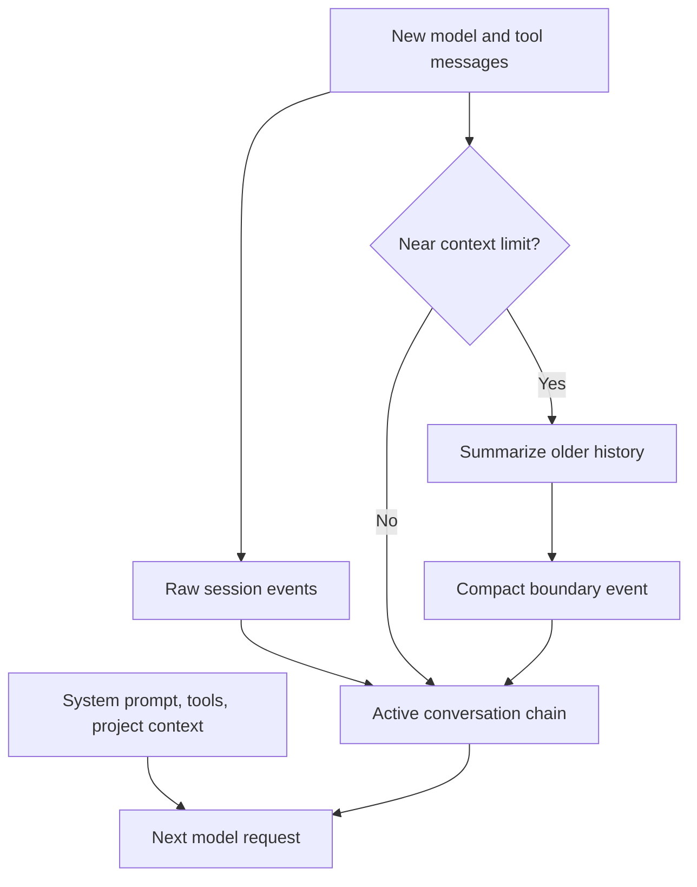

# Sessions, Context, Compaction, and State

Research date: **2026-08-31**  
Maturity: **local sessions are established; external SessionStore semantics are newer and require conformance testing**

## A session is a conversation

An Agent SDK session records prompts, assistant messages, tool calls, tool results, compaction boundaries, and other harness events. It is not a durable snapshot of:

- the repository or working directory;
- environment variables and credentials;
- packages installed by Bash;
- external system state;
- application authorization;
- an in-flight process or callback.

This distinction is the foundation of correct resume behavior.

## Continue, resume, and fork

| Operation | Conversation | Session ID | Workspace expectation | Use |
|---|---|---|---|---|
| Continue | Most recent session for current working directory | Existing | Same logical workspace | Convenient local continuity |
| Resume | Named session | Existing | Reconstruct compatible workspace | Durable conversation continuation |
| Fork | Copies history into a new session | New | Deliberately chosen | Explore a branch without mutating original conversation |

Capture the session ID from every terminal result subtype, including errors. Do not infer the ID from a directory scan in a multi-tenant service.

TypeScript can disable session persistence with `persistSession: false`. Python exposes an environment-based prompt-history suppression mechanism. These modes reduce local traces but also remove resume capabilities and may conflict with features that need persisted history.

## Context is reconstructed on every model request

The model itself has no hidden cross-request memory. The harness sends the active prompt prefix, tools, project context, and conversation chain again. Prompt caching reduces repeated billing/latency for stable prefixes but does not change this semantic model.

Compaction changes the active chain. It does not prove that every earlier fact survived.

## Designing for compaction

Classify information by durability:

| Information | Correct home |
|---|---|
| Stable behavioral rules | System prompt or reviewed `CLAUDE.md` |
| Repository conventions | Version-controlled project instructions |
| Business workflow state | Application database |
| Exact external IDs and effect receipts | Application database/event log |
| Large evidence and artifacts | Artifact/object store with references |
| Temporary reasoning context | Conversation transcript |
| Procedure used only for a task | Skill or subagent prompt |

Use `PreCompact` to archive evidence or create a checkpoint, not to assume control over the summarizer’s exact result. Exercise real long-context tests because compaction bugs appear only after many turns and large tool results.

## Local transcript storage

By default, Claude Code session data is stored locally under the Claude configuration directory, with project-keyed JSONL data. That is convenient for one-machine development and affinity-based workers. It is not sufficient for:

- stateless replicas;
- pod loss during an approval;
- cross-region resume;
- independent retention enforcement;
- transactional coordination with business workflow state.

Treat the local transcript format as runtime-owned. Consume public SDK message types or SessionStore entries as opaque data rather than building business logic on undocumented JSONL fields.

## External SessionStore

The SessionStore interface moves transcript persistence into an adapter supplied by the application. The required operations append ordered entries and load them; listing, summaries, deletion, and subkey enumeration are optional.

Keys include a project key, session ID, and optional subpath. Entries must be returned in order and deeply equal to what the runtime supplied. Do not normalize, compact, encrypt individual fields selectively, or reinterpret undocumented entries in the adapter. Envelope encryption around opaque serialized entries is safer.

Anthropic provides reference adapters for S3, Redis, and PostgreSQL in repository examples, but they are not shipped production libraries. Copying an example transfers operational ownership to you.

### Conformance is mandatory

Run the official SessionStore conformance suite against the real backend. It checks behavioral expectations that a simple “append/load works” test misses. Add fault tests for:

- duplicate append after uncertain timeout;
- partial batch failure;
- out-of-order writes;
- concurrent resume;
- missing subagent subpaths;
- expired or deleted sessions;
- encryption/key rotation;
- large transcript growth.

## Mirroring and ambiguous durability

The child runtime writes local transcript state first and mirrors entries to SessionStore. Current documented behavior retries mirror failures up to three total attempts, except timeout handling avoids a retry because the write may have landed. After final failure it emits a `mirror_error`, drops that batch, and allows the query to continue.

This creates a critical failure mode:

1. a session is resumed from external storage into a temporary local configuration;
2. new events are produced;
3. the mirror batch fails and is dropped;
4. the temporary local copy is deleted at process end;
5. the external store is missing part of the conversation.

Monitor `mirror_error` as a durability incident. Do not report a session as durably resumable until the store has acknowledged the required checkpoint.

Adapters should deduplicate by the entry UUID. An operation timeout is an ambiguous commit, not proof of failure.

## Cross-host resume

A safe resume record should contain:

- session ID and project key;
- expected workspace/repository identity and revision;
- SDK and bundled runtime version;
- model/provider configuration;
- system prompt and settings-source fingerprint;
- enabled tools, MCP servers, skills, agents, and hooks;
- permission mode and policy version;
- artifact/checkpoint references;
- application workflow state and last confirmed effect receipt.

On the new worker:

1. authenticate and authorize the resume request;
2. allocate a tenant-isolated configuration and workspace;
3. hydrate or verify the expected source state;
4. configure the same store and extensions;
5. reapply current permission policy;
6. resume by explicit session ID;
7. reconcile any effect whose outcome was ambiguous.

The SessionStore documentation notes language differences in which local configuration files are copied during resume. Python may not copy user settings used by an API-key helper, while TypeScript copies more configuration with filtering. Prefer explicit service credentials and test both language paths.

## Fork semantics

Forking is not a byte copy. The runtime rewrites session identifiers and entry UUIDs so the new branch can be appended independently. Any application index must learn the fork’s new session ID from emitted messages rather than predict it.

A forked conversation still needs an independently chosen workspace strategy. If both branches mutate the same directory, conversation isolation does not prevent filesystem conflicts.

## Subagent transcripts

Subagent transcript data can use SessionStore subpaths. Without `listSubkeys`/`list_subkeys`, a restored session can recover the main conversation while omitting subagent histories. Implement and test the optional method if subagent resume or full audit is required.

Public helpers may return the post-compaction message chain rather than the raw historic transcript. Use store load for raw audit data and public session-message helpers for the active conversational view.

## File checkpointing is not session rollback

File checkpointing tracks edits made through supported file tools such as Write, Edit, and NotebookEdit. It does not capture arbitrary Bash changes, directory creation/removal, or most subagent changes. Rewinding files does not rewind conversation history.

Checkpointing and external SessionStore are currently documented as incompatible. Choose the capability needed by the workflow and verify the exact pinned version.

Security note: versions before the documented linked-file hardening could write or delete through symlinks during rewind. Require a runtime version with that fix before enabling checkpointing in an untrusted workspace.

## Retention and deletion

The Agent SDK does not delete external SessionStore data for you. The adapter must enforce:

- tenant-scoped access;
- expiration and legal hold;
- encryption and key rotation;
- deletion;
- backup behavior;
- capacity limits;
- audit access.

Deletion of a transcript does not delete exported artifacts, remote tool effects, model-provider records, or workspace snapshots. Maintain a data inventory with independent deletion paths.

## State checklist

- [ ] Conversation, workspace, business, and effect state are modeled separately.
- [ ] Session IDs are captured from all outcomes.
- [ ] Resume verifies the expected workspace identity.
- [ ] SessionStore passes conformance and fault-injection tests.
- [ ] Mirror errors page an operator or fail durability guarantees.
- [ ] Subagent subkeys are stored when required.
- [ ] Compaction boundaries are observable and tested.
- [ ] File checkpointing limitations are explicit.
- [ ] Retention and deletion are implemented by the storage owner.

## Sources

- [Session management](https://code.claude.com/docs/en/agent-sdk/sessions)
- [External session storage](https://code.claude.com/docs/en/agent-sdk/session-storage)
- [How the agent loop works](https://code.claude.com/docs/en/agent-sdk/agent-loop)
- [File checkpointing](https://code.claude.com/docs/en/agent-sdk/file-checkpointing)
- [How Claude Code uses prompt caching](https://code.claude.com/docs/en/prompt-caching)
- [Claude Code features in the SDK](https://code.claude.com/docs/en/agent-sdk/claude-code-features)
