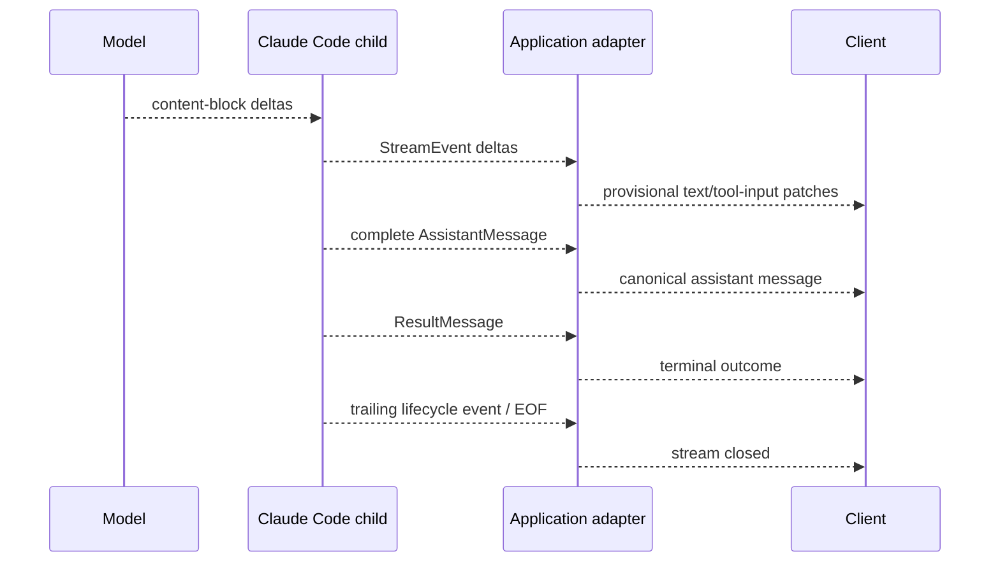

# Streaming, Events, and Structured Output

Research date: **2026-08-31**  
Maturity: **complete-message streaming is established; partial event and application protocol handling require defensive design**

## Two independent streaming decisions

“Streaming” in the Agent SDK can mean:

1. streaming input: a long-lived session receives messages over time;
2. streaming output: the consumer receives SDK messages, optionally including raw partial API events.

Use streaming input for production interactive work. It supports persistent context, queued messages, interruption, and direct image input. Single-message mode is simpler for one-shot batch work but lacks the same long-lived control surface.

## Input modes

| Capability | Streaming input | Single-message input |
|---|---|---|
| Natural multi-turn session | Yes | New query/resume calls |
| Queue messages while active | Yes | No equivalent live queue |
| Real-time interrupt | Yes | Cancel the whole query/process |
| Direct image content | Yes | Not supported in the same form |
| Process lifetime | Long-lived | Query-scoped |
| Failure surface | Producer and consumer can fail independently | Simpler but less controllable |

The input generator is part of the live protocol. An exception in it can be especially confusing: current TypeScript behavior may surface a generic process-aborted error, while Python has documented failure modes where a producer exception is debug-logged and the session stalls. Wrap the producer, expose its exception to the supervising task, and cancel the query on failure.

## Output levels

By default, the consumer receives complete SDK messages. Enabling partial messages adds raw API stream events while complete assistant and result messages still arrive.



Partial text and tool-input JSON are provisional. The complete assistant message is the canonical model message. Structured output is available only in the final Result.

## Build an application event protocol

Do not expose raw SDK unions directly as a long-lived public API. Define a versioned internal envelope such as:

```json
{
  "protocol_version": 1,
  "run_id": "run_...",
  "sequence": 42,
  "session_id": "session_...",
  "kind": "assistant.delta",
  "timestamp": "2026-08-31T12:34:56Z",
  "provisional": true,
  "payload": {}
}
```

Useful normalized kinds include:

- `run.started`;
- `assistant.delta`;
- `assistant.completed`;
- `tool.proposed`;
- `tool.started`;
- `tool.completed`;
- `approval.required`;
- `context.compacted`;
- `run.result`;
- `run.failed`;
- `run.stream_closed`.

Preserve the raw SDK event separately. This lets the adapter absorb renamed message types without breaking clients.

## Ordering, identity, and deduplication

Assign a monotonic sequence at the application boundary. Do not use timestamps as an ordering guarantee. A reconnecting client should resume from the last acknowledged application sequence, not from a character count in a text delta.

Tool-use events need stable correlation fields:

- run and session ID;
- agent/subagent identity;
- model message ID;
- tool-use ID;
- application sequence;
- attempt or replay marker.

Parallel tool calls can share a model message ID. Cost accounting documentation warns that repeated message-level usage in parallel streams must be deduplicated by message identity. Tool-call IDs, not message IDs alone, distinguish the individual calls.

## Backpressure

The child process continues producing messages while consumers render, log, or relay them. An unbounded queue can turn a slow browser or telemetry sink into a memory leak.

Use:

- a bounded in-memory queue;
- separate critical and lossy channels;
- coalescing for text deltas;
- durable append for tool, approval, compaction, and terminal events;
- an explicit policy when the client disconnects;
- cancellation if no consumer and no durable job owner remains.

Never drop a terminal result, effect receipt, approval request, or durability error. It is usually acceptable to coalesce hundreds of character deltas into a complete message.

## Interrupt and drain semantics

In a streaming session, interruption stops active generation/tool execution as supported by the runtime. It does not erase already emitted events or guarantee that an external side effect did not happen.

The Python reference requires draining the interrupted response buffer before asking for another response; otherwise the consumer can receive the prior Result unexpectedly. Generalize that rule:

1. request interrupt;
2. continue reading until the terminal event and stream boundary for that turn;
3. reconcile any in-flight tool;
4. only then send the next user message.

Breaking early from the async iterator can interfere with cleanup. Use a consumer task that owns the iterator for the full session lifetime.

## Structured output

Structured output requests a JSON schema and returns validated data in the terminal Result. It is useful for classification, planning records, or machine-readable summaries. It is not a transaction envelope for tool effects.

Current result semantics include `error_max_structured_output_retries` when the harness cannot produce valid output after its repair attempts. Handle that as a distinct terminal failure.

Design schemas to be:

- small and explicit;
- free of unnecessary deeply nested unions;
- versioned by the application;
- validated again at the application boundary;
- compatible with partial failure fields where needed.

Do not parse partial assistant text as final JSON. Render provisional output separately and wait for the Result’s structured-output field.

## Usage and cost events

The terminal cost value is a client-side estimate based on the bundled runtime’s pricing table. It is useful for near-real-time controls, not authoritative billing.

`usage` on the main result covers the primary loop, while `modelUsage`/`model_usage` aggregates the session tree, including subagents. A crash may leave final cost fields zero. Preserve per-message usage and reconcile against the Usage/Cost API or console for billing.

## Failure handling

| Failure | Correct response |
|---|---|
| Input producer exception | Surface producer error, cancel session, drain/cleanup |
| Client disconnect | Continue durably, pause, or cancel according to product policy |
| Malformed/unknown SDK event | Store raw event, alert, avoid killing effect reconciliation |
| Slow consumer | Coalesce lossy deltas; protect critical events |
| Stream ends without Result | Mark ambiguous failure and inspect process/last effects |
| Result arrives but stream does not close | Continue draining until deadline, then terminate and diagnose |
| Partial JSON tool input never completes | Discard provisional parse; rely on canonical complete message/result |

## Streaming checklist

- [ ] Input producer and output consumer failures are supervised.
- [ ] Raw SDK events are adapted to a versioned protocol.
- [ ] Complete messages are canonical over deltas.
- [ ] Queues are bounded and critical events are durable.
- [ ] Interrupt is followed by drain and effect reconciliation.
- [ ] Unknown variants do not crash the consumer.
- [ ] Structured output is read only from the terminal Result.
- [ ] Usage is deduplicated and billing is reconciled externally.

## Sources

- [Streaming input](https://code.claude.com/docs/en/agent-sdk/streaming-vs-single-mode)
- [Streaming output](https://code.claude.com/docs/en/agent-sdk/streaming-output)
- [How the agent loop works](https://code.claude.com/docs/en/agent-sdk/agent-loop)
- [Python SDK reference](https://code.claude.com/docs/en/agent-sdk/python)
- [Cost tracking](https://code.claude.com/docs/en/agent-sdk/cost-tracking)
- [Structured output](https://code.claude.com/docs/en/agent-sdk/structured-outputs)

