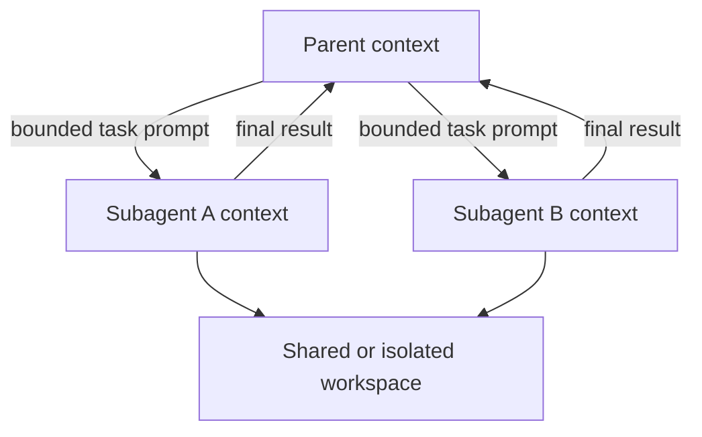

# Subagents, Delegation, and Multi-Agent Work

Research date: **2026-08-31**  
Maturity: **supported and useful; limits and delegation behavior remain version-sensitive**

## Default to one agent

Delegation is justified when it creates a real boundary:

- independent work can run in parallel;
- a large exploration would pollute the main context;
- a specialist needs a different prompt, model, tools, or permission mode;
- a task needs an isolated conversation branch;
- the parent only needs a compact result.

Do not add agents for role-play, architectural symmetry, or tasks that share a tight sequence of decisions. Every child adds model calls, context, scheduling, failure modes, and cost.

## Context boundary

A subagent starts a separate conversation. It does not receive the parent’s full message history or system prompt. It receives its own system prompt, project context such as `CLAUDE.md`, selected tools/skills/MCP servers, and the parent’s delegation prompt. Only its final result is returned to the parent by default.



This boundary reduces context pressure but can lose rationale and evidence. Ask children to return structured findings, source locations, assumptions, and unresolved risks rather than a vague summary.

## Defining subagents

Programmatic definitions are the most predictable service integration. Filesystem agent definitions are useful for repository-owned workflows but widen the instruction-discovery surface.

Useful fields include:

- description: when the parent should delegate;
- prompt: the child’s system instructions;
- tools and disallowed tools;
- model and effort;
- preloaded skills;
- memory source;
- MCP servers;
- maximum turns;
- background mode;
- permission mode.

Python’s top-level options use snake case, but current `AgentDefinition` fields use camel case because they map to the shared wire format. Passing snake-case fields to the dataclass can fail. Compile/test the exact definitions rather than translating field names by intuition.

The runtime includes a general-purpose subagent unless disabled. Explicit definitions are preferable when permissions, budgets, or expected outputs matter.

## The Agent/Task naming transition

Current documentation names the orchestration tool `Agent`, while older releases and examples used `Task`. Hook matchers or telemetry intended to span versions may need to recognize both during a migration window. Do not permanently broaden a permission rule without verifying which name the pinned runtime emits.

## Parallelism

Parallel subagents help only when work is actually independent and the environment can sustain the fan-out.

```text
useful_parallelism =
  min(independent_tasks,
      configured_agent_concurrency,
      provider_capacity,
      workspace_safe_concurrency,
      host_resource_capacity)
```

Children sharing one workspace can race on files, package managers, git state, caches, and test databases. Prefer:

- read-only research in parallel;
- one worktree per mutating child;
- file/component ownership;
- parent-controlled merge and validation;
- a single writer for shared external resources.

## Hard bounds

Current documentation requires recent runtimes for explicit subagent depth and concurrency limits. At the research date, the documented minimums are TypeScript `0.3.219` and Python `0.2.127`, bundling Claude Code `2.1.219`.

Important controls:

- maximum depth, with a documented default of 3;
- maximum concurrent agents, with a documented default of 20;
- per-agent `maxTurns`;
- session-wide `maxBudgetUsd`, which includes the agent tree;
- background subagent stall watchdog.

Twenty concurrent agents is a high default for many services. Set a smaller explicit limit based on rate limits, memory, workload, and cost. A depth of three can still create exponential fan-out if every child delegates.

No documented per-subagent wall-clock deadline exists. `maxTurns` is not time. The background stall timeout resets on stream activity and detects silence, not total duration. Enforce a whole-job deadline at the application/process supervisor.

## Resuming subagents

Custom and general-purpose agents can return an agent ID and be resumed within the same parent session. Exploration/plan-style built-ins can be one-shot and not resumable.

Resumption needs:

- the parent session still available;
- the child definition/tools still compatible;
- the workspace still valid;
- application authorization rechecked;
- SessionStore subpaths restored when cross-host persistence is used.

The child transcript is not a durable job record. Persist delegated task status and external effects in application state.

## Background agents

Background mode lets the parent continue while a child works. It introduces asynchronous lifecycle questions:

- Who owns cancellation?
- Can the parent finish while a child still mutates files?
- How are partial results represented after a stall?
- Which tool calls can overlap safely?
- How are child failures surfaced and retried?

Treat background tasks as supervised child jobs. The current stall watchdog aborts after a period without stream events and surfaces partial results, but a chatty stuck process can outlive the watchdog indefinitely. Keep the application deadline.

## Delegation prompt design

A good task packet states:

1. the exact objective;
2. owned files/resources;
3. prohibited changes;
4. available evidence and starting state;
5. expected output schema;
6. verification to run;
7. deadline/turn limits;
8. what uncertainty must be returned.

Avoid asking a subagent to “handle everything about X.” The parent should decompose work around real ownership and merge boundaries.

## Failure and recovery

| Failure | Response |
|---|---|
| Child exhausts turns | Return partial evidence; parent decides whether to narrow, retry, or stop |
| Child stalls | Abort through watchdog/application deadline; preserve partial result |
| Child mutates shared workspace unexpectedly | Quarantine workspace, inspect diff, do not blindly rerun |
| Parent process dies | Recover application task state; resume transcript only after workspace/effect reconciliation |
| Child result is unsupported | Parent verifies sources/tests before acting |
| Fan-out reaches budget | Stop delegation and return bounded partial outcome |

Retrying a child with the same mutation request can duplicate external effects. Retry only after effect reconciliation or through an idempotent tool.

## Managed Agents is different

Managed Agents multiagent orchestration uses server-side threads in one session. Threads have separate context/event history but share the session sandbox and vault credentials. Current documentation allows up to 25 concurrent child threads, with the advisor exception, and applies one shared session budget.

Do not transfer Agent SDK limits or transcript semantics to Managed Agents. The concepts are similar; the API and ownership boundaries are not.

## Delegation checklist

- [ ] A single agent was considered first.
- [ ] Each child has an independent, bounded objective.
- [ ] Tools, model, effort, permissions, turns, depth, concurrency, and budget are explicit.
- [ ] Mutating children have isolated workspaces or ownership rules.
- [ ] Parent verifies child evidence and outputs.
- [ ] Application deadline covers the whole tree.
- [ ] Background children are supervised after parent progress.
- [ ] Subagent transcript subpaths are stored when audit/resume requires them.
- [ ] External effects are idempotent across child retry.

## Sources

- [Subagents in the Agent SDK](https://code.claude.com/docs/en/agent-sdk/subagents)
- [How the agent loop works](https://code.claude.com/docs/en/agent-sdk/agent-loop)
- [Hosting the Agent SDK](https://code.claude.com/docs/en/agent-sdk/hosting)
- [External session storage](https://code.claude.com/docs/en/agent-sdk/session-storage)
- [Python SDK reference](https://code.claude.com/docs/en/agent-sdk/python)
- [Dynamic workflows in Claude Code](https://claude.com/blog/a-harness-for-every-task-dynamic-workflows-in-claude-code)
- [Managed Agents multiagent orchestration](https://platform.claude.com/docs/en/managed-agents/multiagent-orchestration)
