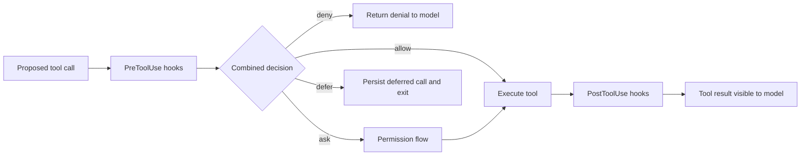

# Tools, MCP, Hooks, Skills, and Plugins

Research date: **2026-08-31**  
Maturity: **built-in tools and MCP are established; hook and plugin surfaces evolve quickly**

## Extension-point selection

These mechanisms overlap in what they can influence, but they have different contracts.

| Mechanism | Best for | Runs where | Security role |
|---|---|---|---|
| Built-in tool | Files, shell, search, subagents, skills | Claude Code child/workspace | Permission-gated capability |
| Custom in-process MCP tool | Typed application capability close to SDK code | Application process | Narrow, typed adapter; application must authorize |
| External MCP server | Reusable remote/local tool service | Separate process or network service | Separate trust and credential boundary |
| Hook | Observe, validate, rewrite, deny, defer, or audit lifecycle events | SDK callback or filesystem hook command | Policy enforcement and telemetry, not containment |
| Skill | On-demand procedural instructions and supporting files | Discovered from filesystem | Prompt content; treat as untrusted instructions |
| Plugin | Packaged Claude Code extension bundle | Filesystem/configuration | Supply-chain and configuration surface |

Use a tool when Claude needs to perform an action. Use a hook when the application must observe or govern an action. Use a skill when Claude needs task instructions. Do not hide authorization logic in a skill.

## Built-in tools

The exact tool set is version-dependent, but current documented categories include:

- file operations: Read, Edit, Write, NotebookEdit;
- discovery: Glob and Grep;
- process execution: Bash;
- web: WebSearch and WebFetch;
- orchestration: Agent and task-management tools;
- knowledge: Skill;
- user interaction: AskUserQuestion;
- large-schema discovery: ToolSearch.

If an explicit allowed-tool list is supplied, include the `Skill` or `Agent` tool when those capabilities are intended. Tool availability and tool approval are separate: exposing a tool to the model does not necessarily approve it, and `allowedTools` can auto-approve without being a strict allowlist in every permission mode.

## Custom tools through in-process MCP

The official SDK pattern for custom tools is an in-process MCP server. A tool should have:

- a stable name and narrow purpose;
- a precise JSON schema;
- concise descriptions that state preconditions;
- validated and normalized input;
- a typed result that distinguishes success, domain failure, and retryable infrastructure failure;
- truthful annotations such as read-only behavior;
- cancellation propagation;
- idempotency or an explicit commit protocol for mutations.

Do not return entire database records or verbose logs by default. Tool output becomes model context and can increase cost, trigger compaction, and expose sensitive data.

## MCP transport choices

| Transport | Strength | Main risk |
|---|---|---|
| In-process SDK server | Lowest latency, typed code, no extra service | Shares application failure and trust boundary |
| Stdio server | Simple local process separation | Process lifecycle, inherited environment, local credential leakage |
| Remote HTTP/SSE | Reusable service and central operations | Network auth, availability, latency, tenant routing |

MCP tool names use the `mcp__server__tool` convention. They require permission unless rules approve them. Use scoped wildcard rules for a known server rather than `bypassPermissions`.

Remote OAuth is an application responsibility. The Agent SDK can report a server that needs authentication, but it does not own the browser authorization flow. Store tokens outside prompts and provide the minimum necessary header or environment value.

### Startup and readiness

Configured servers may still be starting when the system initialization message is emitted. Remote tool definitions can also be cached and connected lazily. An initialization status is a snapshot, not a complete readiness proof.

Design a readiness check for critical servers, set a bounded MCP timeout, and decide whether the session should:

- fail fast;
- run with a reduced tool set;
- wait and retry outside the agent;
- route to another worker.

Tool Search is enabled by default in current Agent SDK behavior and can keep large MCP schemas out of the initial context. Provider configuration can change whether schemas are deferred, so inspect effective behavior when using custom base URLs or cloud providers.

## Hooks as a control plane

Programmatic hooks receive lifecycle events around tools, prompts, compaction, sessions, subagents, and notifications. TypeScript currently exposes more callback events than Python; some lifecycle events available as filesystem hooks are not Python callback types.

For `PreToolUse` decisions, current documented priority is deny, then defer, then ask, then allow. A hook allow does not bypass an applicable permission deny or ask rule. Use hooks for context-sensitive policy, but keep coarse least-privilege rules in the permission system too.

### Mutation boundaries

A pre-tool hook can reject or rewrite input before execution. A post-tool hook can change what the model sees, but it cannot undo the external effect. If a tool may send, charge, deploy, delete, or publish, its implementation must perform authorization and idempotency at the effect boundary.

### Timeouts and concurrency

Hook callbacks have timeouts; values vary by event. Current SDK behavior blocks a `PreToolUse` tool when its programmatic callback times out. Filesystem command/HTTP/MCP hook timeout behavior is not identical and can allow the normal permission flow to continue. Do not use “hook timeout” as a universal deny guarantee.

Hooks for parallel tool calls may run concurrently. Synchronize shared state, make audit writes idempotent, and prefer an append-only event sink.

Asynchronous hooks are for side effects. They cannot block or modify the event after the decision path has proceeded.

## Deferred tools

`defer` supports a durable-ish noninteractive handoff: the tool does not execute, the process exits with a deferred-tool result, and a later resume can present the pending call again. This is useful for approvals longer than an in-process callback wait.

Important limits:

- it applies to noninteractive `-p` execution;
- a turn must contain a single tool call; defer is ignored for a batch;
- there is no built-in business timeout or retry limit;
- the tool must still exist on resume;
- the permission mode may need to be supplied again;
- implementation details have changed across versions.

An open Python SDK issue as of the research date reports that a resumed deferred tool may execute without rerunning the Python programmatic `PreToolUse` callback. Until that behavior is closed and verified in a pinned release, reauthorize inside the tool implementation and treat transcript-level defer as coordination, not the only security gate.

For short interactive waits, `canUseTool` is simpler but holds the live process indefinitely and is cancelled only by query cancellation. An open Python issue documents the lack of recovery when a pod dies during that wait. Prefer application-owned approval records plus defer or a two-phase tool for durable workflows.

## Skills

Skills are filesystem artifacts. At session start the harness loads short descriptions; the full skill content is loaded when invoked. This improves context efficiency compared with inserting every procedure into the system prompt.

Use skills for:

- repeatable procedures;
- domain checklists;
- repository-specific workflows;
- supporting reference files.

Do not use skills for secrets, trusted authorization rules, or data that must be exact after compaction. Anyone able to alter a loaded skill can influence the model. Pin and review skill content like code.

The SDK does not provide an arbitrary in-memory skill registration API. Place skills in the supported filesystem locations and enable the corresponding settings source.

## Plugins

Plugins package skills, agents, commands, hooks, and MCP configuration. They are useful when an extension should be installed and versioned as one unit. They also widen the supply-chain surface.

For hosted services:

- install only pinned, reviewed plugins;
- inventory every hook, command, agent, and server a plugin contributes;
- prevent user-level plugin discovery in tenant workers;
- include plugin version in the execution fingerprint;
- test removal and upgrade behavior.

If one in-process tool is sufficient, a plugin is unnecessary complexity.

## Extension design checklist

- [ ] The mechanism matches action, policy, or instruction semantics.
- [ ] Tool inputs and outputs are bounded and validated.
- [ ] Mutating tools are idempotent or two-phase.
- [ ] Tool annotations are truthful.
- [ ] MCP authentication and readiness are application-owned.
- [ ] Hook timeout and concurrency behavior is tested.
- [ ] Durable approval does not depend on a live callback.
- [ ] Skills/plugins are reviewed as prompt-bearing supply chain.
- [ ] Every extension has a version and observable failure mode.

## Sources

- [MCP in the Agent SDK](https://code.claude.com/docs/en/agent-sdk/mcp)
- [Custom tools](https://code.claude.com/docs/en/agent-sdk/custom-tools)
- [Tool Search](https://code.claude.com/docs/en/agent-sdk/tool-search)
- [Hooks in the Agent SDK](https://code.claude.com/docs/en/agent-sdk/hooks)
- [Hooks reference](https://code.claude.com/docs/en/hooks)
- [Skills in the Agent SDK](https://code.claude.com/docs/en/agent-sdk/skills)
- [Plugins in the Agent SDK](https://code.claude.com/docs/en/agent-sdk/plugins)
- [User input and approvals](https://code.claude.com/docs/en/agent-sdk/user-input)
- [Python issue 871: approval wait recovery](https://github.com/anthropics/claude-agent-sdk-python/issues/871)
- [Python issue 993: deferred resume hook behavior](https://github.com/anthropics/claude-agent-sdk-python/issues/993)

