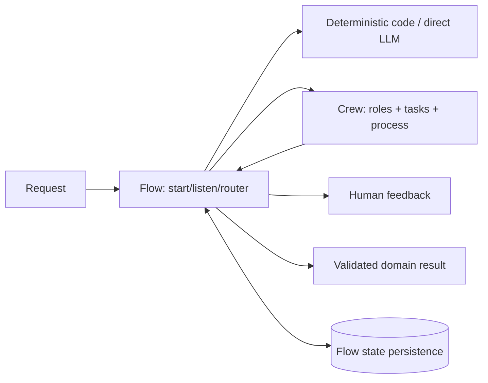
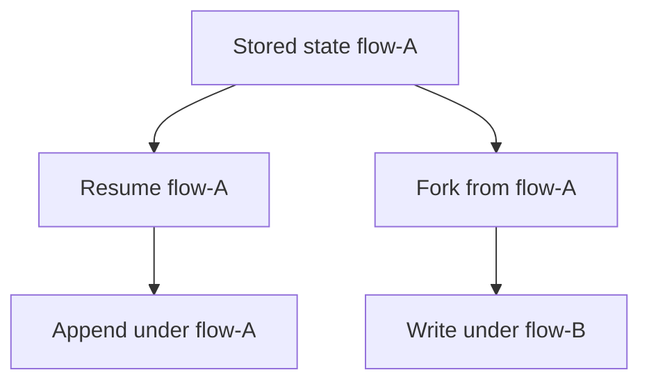

# CrewAI in Production

**Research date:** 2026-08-31  
**Status:** Research-backed technology guide  
**Scope:** Current Python Crews and Flows; experimental conversational surfaces and CrewAI AMP are treated separately

## Bottom line

Choose CrewAI when role/task-oriented autonomous collaboration is a natural fit and you want to embed those **Crews** inside explicit event-driven **Flows**. Start production architecture with a Flow, typed state, and deterministic routes; add a Crew only where evaluation shows that open-ended delegation improves the outcome.

Flow persistence aids resume and fork, but it is not exactly-once effect execution. CrewAI AMP adds managed deployment and operations and must be evaluated separately from the open-source runtime.

## Two abstractions, one production pattern

| Concern | Flow | Crew |
|---|---|---|
| Control | Explicit events, routes, conditions, loops | Model/role/task collaboration within a process |
| State | Structured or dictionary state with UUID | Agent/task/context and optional memory |
| Best use | Auditable workflow and lifecycle | Bounded open-ended research, synthesis, critique |
| Failure owner | Application/Flow step | Agent/task/process plus outer Flow |
| Recommended boundary | Top-level business process | A bounded step with typed input/output |

A Flow is “deterministic” only where its own code is deterministic. A router using an LLM, a Crew step, or a nondeterministic tool remains stochastic.

## Persistence: resume and fork are different

`@persist` can save after every decorated method or selected methods. Current documentation distinguishes:

- same-ID kickoff: load the latest state under a flow UUID and extend its history;
- `restore_from_state_id`: load a source snapshot but continue under a fresh state ID, preserving the source history.

Define the checkpoint contract. Class-level persistence saves after each method, which may make the latest state a mid-turn boundary. For conversational state, current guidance recommends persisting a terminal step when only completed turns should be authoritative.

Prefer Pydantic state. Unstructured dictionary state complicates schema evolution: a current issue shows restoration clearing newly introduced default fields when loading an older snapshot. Add `state_schema_version`, explicit migrations, immutable raw snapshot backup, and replay fixtures. Never assume a new default appears in old state.

## Human feedback and approval

The Flow `@human_feedback` mechanism can collect comments and optionally map free text to one of several emitted outcomes using an LLM. That mapping is useful routing, not authorization.

For a risky action:

1. construct a canonical effect proposal with stable operation ID;
2. display exact arguments, target, actor, and impact;
3. record decision, policy version, expiry, and approver;
4. on resume, revalidate proposal hash, resource version, and authorization;
5. commit through an idempotent tool/effect ledger.

Use an asynchronous provider or external approval service for web backends. Do not keep a request worker blocked while awaiting a person, and do not use a process-local callback as the only pending-request record.

## Failures that need outer controls

Issue evidence has exposed three classes worth permanent regression tests:

| Failure | Risk | Control |
|---|---|---|
| Provider exception disappears from async task | Flow waits indefinitely | Outer wall deadline, task-state watchdog, exception propagation test |
| Persisted dict loses new fields | Silent state corruption after upgrade | Versioned typed schema and old-snapshot migration test |
| Replay/conversational records cleared or omitted | Resume/UI history diverges | Reduce persisted events in a fresh instance and compare authoritative transcript |

Keep a run ledger independent from trace callbacks: admitted, running, waiting, succeeded, failed, cancelled, timed out, unknown. A watchdog must be able to find and repair stuck runs without reconstructing them from logs.

## Bound Crews explicitly

Role metaphors do not bound work. Configure and enforce:

- task dependency graph and one final completion contract;
- maximum agent iterations, delegation depth, and rework rounds;
- total model/tool calls, tokens, cost, wall time, and concurrent tasks;
- per-provider rate limits and retry ownership;
- structured task outputs and deterministic guardrails;
- memory scope, retention, retrieval budget, and tenant isolation.

Do not interpret a task guardrail retry as permission to repeat an external write. Validate and reserve an effect before execution; return the receipt on retry/resume.

## Conversational Flow maturity

The current conversational Flow surface lives under an experimental namespace. It supplies a built-in turn graph, message state, intent routing, and trace batching. Pin its version and treat each browser request as a fresh runtime instance during tests—the normal production pattern that often reveals missing persisted assistant messages.

Maintain an application-owned message/event contract so the experimental reducer can be replaced. Test reconnect, duplicate delivery, partial stream, custom route response, retry invalidation, same-session concurrency, and deployment migration.

## Open source versus AMP

CrewAI AMP adds managed deployment, API access, monitoring, tool repository, webhooks, collaboration, and RBAC. Ask separately:

- What queue, lease, retry, cancellation, and duplicate-delivery semantics apply?
- Which state, prompt, trace, artifact, and credential data is retained and where?
- How are tenant identities propagated into tools and resources?
- Can in-flight versions be pinned, migrated, drained, exported, and repaired?
- What are concurrency, timeout, webhook replay, quota, and regional guarantees?

Managed hosting can remove operations without changing effect semantics.

## Operational acceptance tests

- [ ] Crash after every Flow method and before/after every external effect.
- [ ] Resume and fork from the oldest supported persisted state.
- [ ] Run typed-state migrations with fields added, removed, renamed, and narrowed.
- [ ] Inject provider 429, timeout, malformed output, and connection failure into async tasks.
- [ ] Cancel while a Crew delegates, while parallel tasks run, and after a write commits.
- [ ] Resume human feedback in a new process and reauthorize the exact proposal.
- [ ] Run concurrent same-ID kickoff and prove serialize/reject/fork behavior.
- [ ] Recreate conversational Flow per request and verify full alternating history.
- [ ] Bound loops, delegation, tokens, cost, tools, result bytes, and wall time.
- [ ] Verify memory and traces do not cross tenants or expose secrets.

## Choose it when

- Python role/task Crews map cleanly to a real collaborative subproblem;
- Flows can own the deterministic process and state lifecycle;
- the team values the integrated agent/task/process authoring model;
- persistence, effects, identity, and total budgets can remain application-owned.

## Prefer another shape when

- a single agent or fixed workflow performs as well;
- explicit checkpoint/replay graph semantics dominate: compare LangGraph or a durable engine;
- typed Python validation without role metaphors dominates: compare Pydantic AI;
- TypeScript/full-stack streaming dominates: compare AI SDK or Mastra;
- the experimental conversational surface is a hard dependency under a strict stability policy.

## Primary sources and failure-test leads

- [CrewAI concepts](https://docs.crewai.com/core-concepts/Agents), [Flows and persistence](https://github.com/crewAIInc/crewAI/blob/main/docs/v1.15.5/en/concepts/flows.mdx), and [production architecture](https://github.com/crewAIInc/crewAI/blob/main/docs/v1.12.2/en/concepts/production-architecture.mdx)
- [Conversational Flows](https://github.com/crewAIInc/crewAI/blob/main/docs/v1.15.2/en/guides/flows/conversational-flows.mdx) and [CrewAI AMP](https://docs.crewai.com/enterprise/introduction)
- Adoption tests from [state restore #6706](https://github.com/crewAIInc/crewAI/issues/6706), [async failure #6380](https://github.com/crewAIInc/crewAI/issues/6380), [replay records #6650](https://github.com/crewAIInc/crewAI/issues/6650), and [conversational persistence #6766](https://github.com/crewAIInc/crewAI/issues/6766)

See [evolving ecosystem selection](../comparisons/evolving-agent-framework-ecosystems.md) and the [research packet](../research/packets/framework-lifecycle-and-second-wave.md).
